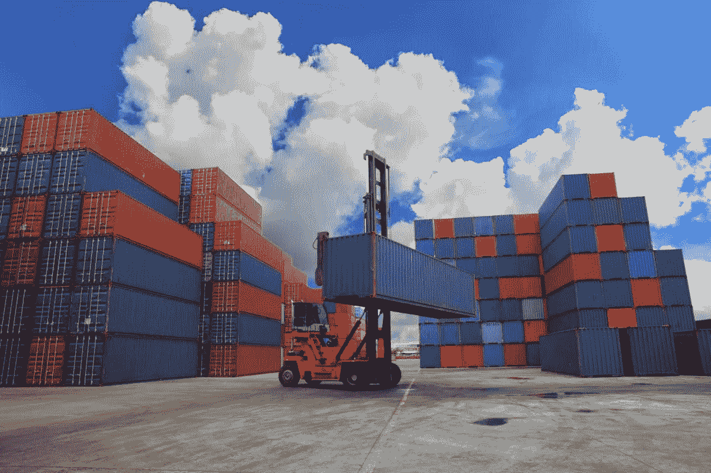
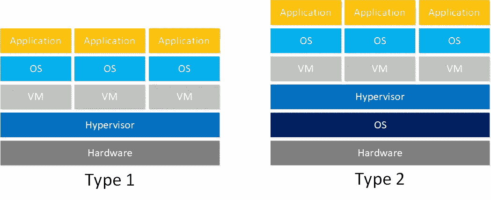
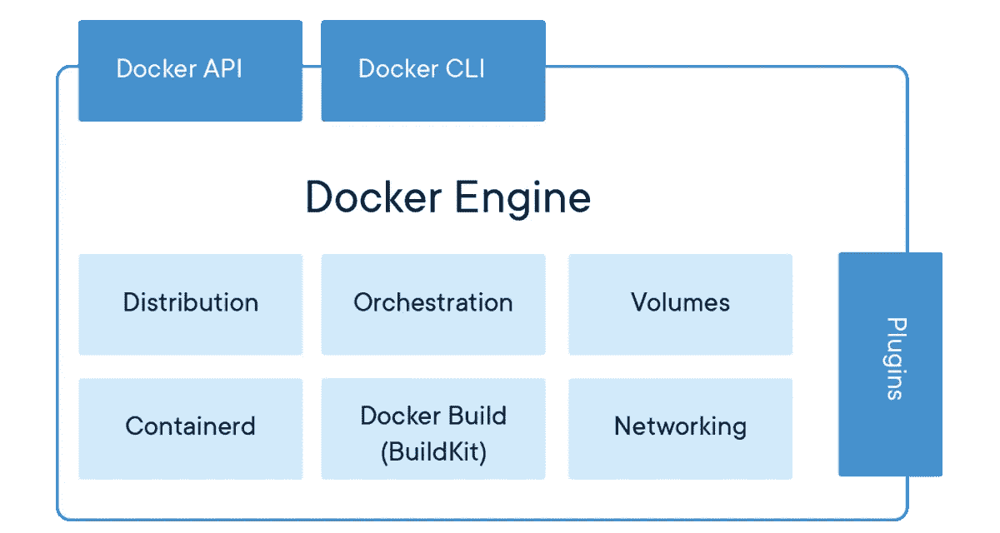

# Docker 和基于容器的应用程序简介

> 原文：<https://medium.com/nerd-for-tech/introduction-to-docker-and-container-based-application-5b5ae0cf0883?source=collection_archive---------10----------------------->

如果你是一名 IT 本科生或软件工程师，你可能在职业生涯中的某个时候听说过 containers 或 docker。如果你听说过这些，但如果你对此一无所知，那么你就来对地方了，因为这篇文章是为你写的。本文将向您介绍基于容器的应用程序。在此之前，我们将回顾一下历史。

# 第一代

过去，应用程序部署在物理服务器中。但是你认为现在一天不部署在物理服务器。是的，现在也部署在物理服务器中，但是过去我们有应用服务器、数据库服务器和 web 服务器，所以那时人们使用三种不同的物理硬件设备。人们面临许多问题。那些是，

1.  需要维护
2.  需要大量的空间
3.  需要单独的网络
4.  成本很高

不仅仅是以上，还有浪费，因为你的应用服务器或网络服务器可能没有使用 100%的处理能力和内存。

# 第 2 代(虚拟机管理程序)

如果你在这个软件开发行业工作了一段时间，你会遇到这样的场景:你的应用程序可以在你的开发机器上运行，但是不能在其他机器上运行。(可能是某个测试团队的机器或者运营团队的机器)应用没有问题。为什么会这样。这是可能发生的，

1.  一个或多个文件丢失。
2.  目标计算机和开发计算机之间的软件版本不匹配。
3.  不同的配置设置

这就是虚拟机管理程序发挥作用的地方。在第二代中，人们使用虚拟机管理程序来解决这些问题。所以现在当你递交申请时，不要只是递交申请。您可以将虚拟机操作系统(OS)的整个映像(虚拟映像)交给其他人。因此，一旦他们获得了虚拟映像，就可以从中创建一个实例。现在，他们不需要担心软件的文件、依赖项和版本，因为您已经给出了包含所有这些内容的操作系统映像。

有两种类型的虚拟机管理程序。那些是

1.  类型 1(裸机架构)
2.  类型 2(托管架构)

第 1 类虚拟机管理程序直接在主机的物理硬件上运行，它被称为裸机虚拟机管理程序。因此在类型 1 中，hypervisor 使用了高处理硬件盒。除此之外，人们还安装了虚拟机管理程序。然后，他们在虚拟机管理程序之上创建了多个虚拟机(VM)。接下来，我们可以在虚拟机上安装不同种类的操作系统。最后，我们可以安装应用程序。

通常，第 2 类虚拟机管理程序安装在现有操作系统之上。由于它依赖于主机预先存在的操作系统来管理对 CPU、内存、存储和网络资源的调用，因此它通常被称为托管虚拟机管理程序。

虚拟机管理程序是一个很棒的概念，它解决了我们在第一代产品中遇到的一些问题，但仍然有一些缺点。我们来看看这一代人有哪些优点和缺点。

**优势**

1.  假设虚拟机 1 使用了 20%的处理能力，虚拟机 2 使用了 10%，虚拟机 3 使用了 20%。因此总共 50%的处理能力被使用，剩余的 50%的处理能力可以用于任何其他任务。所以不像上一代那样存在浪费。

**劣势**

1.  每个应用程序都需要一个独立的操作系统(OS)。然后，由于我们有多个操作系统，我们有操作系统许可成本。
2.  最近必须维护操作系统和更新。
3.  起步慢。花点时间，因为启动虚拟机不是一两秒钟的事。
4.  共享资源需要大量的配置

# 第三代(集装箱)

第三代是关于容器的。容器是一种轻量级的、更敏捷的处理虚拟化的方式。容器是一个轻量级的、独立的、可执行的软件包，包含了运行它所需的一切。**所以这是一个标准的软件单元，它打包了代码及其所有依赖关系，这样应用程序就可以快速可靠地从一个计算环境运行到另一个计算环境。**

所以在第 3 代中，正如你在上面的图片中看到的，我们有硬件，在此之上我们有操作系统。然后我们在操作系统之上有容器化引擎。接下来，我们可以在引擎顶部放置多个容器。最后，我们可以申请。因此每个容器都可以运行自己的应用程序。您可以享受更快的资源供应和新应用的更快可用性。**单台机器中的所有容器都使用主机操作系统，因此我们只需许可、修补和维护更新一个操作系统。**容器已经存在了将近十年，但当前的容器时代始于 2013 年 Docker 的发布。我将在这篇文章的下面解释 docker。有些人认为容器是虚拟机的替代品。这是完全错误的，因为容器比虚拟机有一些好处，但这并不是说容器是虚拟机的替代品。

**优点**

1.  与虚拟机相比，重量非常轻。
2.  当我们使用容器或 docker 时，我们不需要单独的操作系统。所以我们不需要单独的虚拟机。现在，我们节省了大量空间，可以用这些空间存放越来越多的集装箱。
3.  因为我们没有多个操作系统，所以不需要多个操作系统许可和更新。
4.  因为所有的容器都在操作系统和容器化引擎之上，所以启动应用程序非常快，因为操作系统已经启动了。
5.  资源共享速度非常快。
6.  独立于平台

# 欢迎来到 Docker

成为市场上的第一个，或者是主动的，或者是市场的领导者，有些人用这个名字来理解这些技术。docker 差不多就是这样。有些开发者可能知道 docker 而不是 containers。Docker 是一个流行的开源项目，用 go 编写，由 Dotcloud 开发。Docker 是一个以一致的方式构建、运行和发布应用程序的平台。**使用 docker，我们可以轻松地将我们的应用打包成您需要的任何东西，并在任何其他机器上运行。**

## 码头引擎

Docker 引擎不是 docker 项目的一部分。Docker 引擎是 Docker 的核心产品。Docker 引擎是 Docker 运行的层。它安装在主机上。它是一个轻量级的运行时和工具，管理容器、图像、构建等等。

## Docker 图像

Docker 图像是用于创建 Docker 容器的只读模板。图像包含我们的应用程序运行所需的一切。它包含所有的安装、运行时环境、应用程序文件、依赖项和第三方库。

## 码头集装箱

**在 simply Docker 容器中是一个图像的可运行实例**。您可以使用 Docker API 或 CLI 创建、启动、停止、移动或删除容器。

## Docker 注册表

Docker 注册表是命名 Docker 映像的存储和分发系统。**如此简单的一个地方，你可以存储你的 docker 图片。**可能存在同一图像的多个副本，每个副本都有自己的标签集。Docker 注册表被组织成 Docker 存储库，其中存储库保存特定映像的所有版本。

## 容器编排

**容器编排是基于多个集群内的微服务管理或调度单个应用容器工作的自动过程**。有许多容器编排工具可用于容器生命周期管理。一些流行的选项是 Kubernetes、Docker Swarm 和 Apache Mesos。

## 库伯内特斯

Kubernetes，也称为 K8s，是一个流行的开源容器编排系统，用于自动化计算机应用程序的部署、伸缩和管理。它最初是由谷歌设计的，现在由云原生计算基金会维护。

您已到达这篇文章的结尾。我希望您了解容器化应用程序以及 docker 的历史。所以继续学习，让我们从另一篇文章中相遇。保持联系。

# 参考

 [## 容器与虚拟机(VM):有什么区别？| NetApp 博客

### 虚拟机和容器在几个方面有所不同，但主要的区别是容器提供了一种方法来…

blog.netapp.com](https://blog.netapp.com/blogs/containers-vs-vms/)  [## 什么是 Kubernetes？

### Kubernetes(也称为 k8s 或“kube”)是一个开源的容器编排平台，它自动化了许多…

www.redhat.com](https://www.redhat.com/en/topics/containers/what-is-kubernetes)  [## 什么是容器编排？定义和相关常见问题| Avi 网络

### 容器编排是为…管理或调度单个容器工作的自动过程

avinetworks.com](https://avinetworks.com/glossary/container-orchestration/)