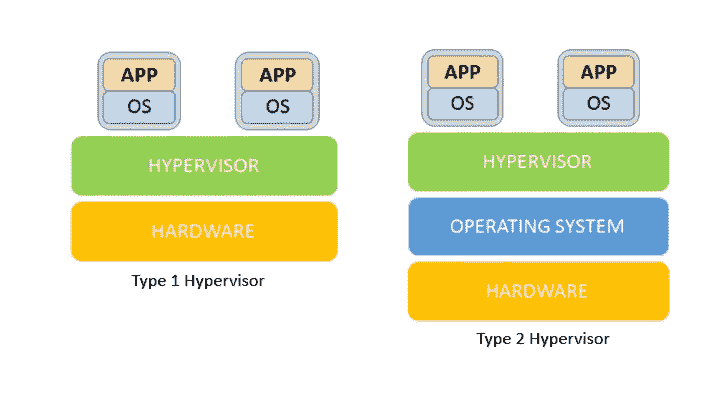
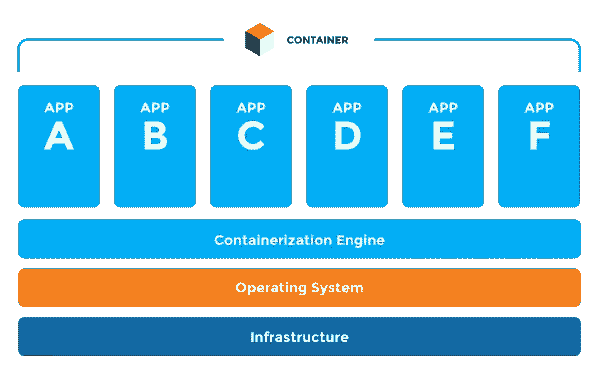

# Docker 和基于容器的开发简介

> 原文：<https://medium.com/nerd-for-tech/introduction-to-docker-and-container-based-development-7fe45c463cc3?source=collection_archive---------13----------------------->

[安迪李](https://unsplash.com/@andasta?utm_source=medium&utm_medium=referral)在 [Unsplash](https://unsplash.com?utm_source=medium&utm_medium=referral) 上拍照

如果你是一个软件工程行业的新人，如果你正在从事一个项目，你可能在某些时候听到过一些花哨的词，如 Docker、Container 和 Kubernetes。对你们中的一些人来说，这可能听起来很熟悉，但是既然你在这里，我将在本文中介绍 Docker 和基于容器的开发。但是，在开始之前，您应该对以前部署应用程序的方式有基本的了解。

# 虚拟机管理程序

甚至在进入虚拟机管理程序时代之前，我们曾经在物理服务器上部署我们的应用程序。然而，我们仍然使用那种技术，但是很少感谢新技术。与虚拟机管理程序相比，它在几个方面有很多缺点。因为在部署应用程序时，应用服务器、数据库和 web 服务器需要各自独立的物理设备。因此，它需要大量的成本来维护，最重要的是它浪费了如此多的资源。

引入管理程序主要是为了克服上述缺点。简而言之，虚拟机管理程序是一个软件层，它在单个硬件上创建并运行许多独立的虚拟机。在虚拟化中，虚拟机管理程序是一个关键要素，它使组织能够在提高部署速度的同时实现更高的成本节约。有两种类型的虚拟机管理程序，命名为:**01 型**和**02 型虚拟机管理程序**。

图片:01 型和 02 型虚拟机管理程序(www.tophack.io)

让我们用 Type-01 hypervisor 来解释一下。正如您在图中看到的，虚拟机管理程序安装在单个高处理硬件设备(物理服务器)上。然后，我们在该虚拟机管理程序之上创建多个虚拟机。这些虚拟机中的每一个都安装有操作系统，例如 Linux 或 Windows。毕竟，我们可以在这些操作系统上安装我们的应用程序。现在，我们可以称之为适当的虚拟化环境。

这样，我们可以解决资源浪费问题，并合理地降低成本。但是，这仍然不够，即使在这种虚拟机管理程序方法中也仍然存在一些缺点。比如，

*   我们需要有多个操作系统并维护它们。
*   虚拟机运行缓慢，需要很长时间才能启动。

# 容器

为了克服管理程序的缺点，我们可以使用容器化的应用程序。简而言之，当软件从一个计算环境转移到另一个计算环境时，容器解决了如何让软件正确运行和执行的问题。容器化应用程序是一种操作系统级虚拟化方法，用于部署和运行分配的应用程序，而无需为每个应用程序启动整个虚拟机。

图片:集装箱化应用概述(www.plutora.com)

如图所示，它有一个高处理硬件箱(物理服务器)。然后我们在这个硬件上安装一个操作系统。如果您还记得，在虚拟机管理程序中，我们必须在硬件设备上创建多个虚拟机，然后在每个虚拟机中安装操作系统。因此，在容器化的应用中，我们可以很容易地解决这个问题，这使得这种方法非常具有成本效益。

安装操作系统后，我们在操作系统上创建容器引擎。因此，我们可以在引擎中创建容器。最后，我们可以在每个容器上创建我们的应用程序。

> **注意:**与 Hypervisor 的虚拟机相比，这些容器太小了。

# 码头工人

Docker 是一个基于容器构建应用程序的软件平台。这个容器化平台负责以 docker 容器的形式将您的应用程序及其依赖项打包在一起，以确保您的应用程序在任何环境下都能完美工作。尽管容器技术已经存在了一段时间，但 Docker 是推广该技术的原因。然而，我们可以在不使用 Docker 的情况下创建容器，但是如果没有 Docker，这个过程会困难得多。

让我们看看创建 Docker 容器化应用程序应该知道的一些组件。

## 码头引擎

Docker 引擎只是安装在您的主机上的应用程序。作为 Docker 系统的核心，它将平台的所有组件连接在一起，包括容器、注册表、图像和服务。

## Docker 图像

Docker 图像是用于创建 Docker 容器的只读模板。Docker 允许公司通过这些 Docker 映像创建和共享软件。它包含创建一个完全可操作的容器环境所需的所有安装、依赖、库和应用程序代码。

## 码头集装箱

简单地说，Docker 容器是 Docker 映像的运行实例。它包含运行应用程序所需的整个包。

## Docker 注册表

这是您可以存储 Docker 图像的地方。注册中心可以是用户的本地存储库，也可以是公共存储库，如**“Docker Hub”**，允许多个用户协作构建应用程序。例如，一个组织内的多个团队可以通过将容器上传到 Docker Hub 来交换或共享容器。

> **注:**其他公共存储库:红帽码头、亚马逊 ECR、谷歌容器注册

## 容器编排

假设您的应用程序有多个不同服务的容器，比如身份验证、授权和 HTTP 服务。一旦您准备好将应用程序部署到 Docker，您将需要一种方法来配置、伸缩和监控应用程序架构中的所有容器。有几个开源编排系统，如 Kubernetes、Docker Swarm 和 Mesos，可以在这个过程中帮助您。

## 什么是 Kubernetes？

Kubernetes 是一个流行的容器编排开源平台，允许您自动部署、扩展和操作容器化的应用程序。尽管 Kubernetes 最常与 Docker 一起使用，但它也可以与任何其他容器一起使用。Kubernetes 提供了许多特性，可以帮助您部署容器化的应用程序，例如，

*   容器部署和首次展示控制
*   内置服务发现和自动扩展
*   资源箱包装
*   持久存储

在结束我的文章之前，我想解释一下 Docker 有一点令人困惑的地方，那就是“不坚持”这意味着一些人认为，如果我们关闭 Docker，所有东西都会从 Docker 中删除。然而，这是完全错误的，因为码头工人天生就是持之以恒的。所以，无论你做什么，它都会停留在你停留的地方。

所以，这是我的文章的结尾，我希望你喜欢它。快乐编码👨‍💻。

# 参考

 [## 什么是虚拟机管理程序，它如何转变云和虚拟机？

### 虚拟机管理程序是一种流程或功能，可帮助管理员将操作系统和应用程序与底层隔离开来…

www.tek-tools.com](https://www.tek-tools.com/apm/what-is-a-hypervisor)  [## 什么是容器，为什么需要容器？

### Docker 于 2013 年出现，此后一直在 it 界引起轰动。应用程序…

www.cio.com](https://www.cio.com/article/2924995/what-are-containers-and-why-do-you-need-them.html)  [## 什么是 Docker & Docker 容器|深入了解 Docker | Edureka

### 在我们的培训专家撰写的上一篇博客中，我们让您熟悉了 Docker 及其实用程序。以防你…

www.edureka.co](https://www.edureka.co/blog/what-is-docker-container)  [## 什么是 Kubernetes？您的下一个应用平台

### Kubernetes 是一个流行的用于容器编排的开源平台——也就是说，用于管理应用程序…

www.infoworld.com](https://www.infoworld.com/article/3268073/what-is-kubernetes-your-next-application-platform.html)