# 探索性数据分析(EDA)简介

> 原文：<https://medium.com/nerd-for-tech/introduction-to-exploratory-data-analysis-eda-7d91b094b371?source=collection_archive---------5----------------------->


探索性数据分析(EDA)是可视化和分析数据以从中提取洞察力的过程。有时候我们肉眼看到的并不能给我们所有的真相。需要时间去了解，分析，找出真正的真相。换句话说，EDA 是为了更好地理解数据集而总结数据的重要特征的过程。

EDA 的整体目标是很好地理解数据，而一旦我们开始探索数据，理解数据可能会变得更加困难。执行 EDA 是为了确保数据是干净的，没有任何冗余、缺失值或空值。我们还应该确定数据集中最重要的变量，并删除所有不必要的噪音，这些噪音可能会在建立模型时实际上妨碍准确性。

# **EDA 涉及的步骤**

**第一步-** 了解数据

**第二步**-清理数据

**第三步** -分析变量之间的关系

**第 4 步** -数据建模

# EDA 使用样本数据集进行了解释:

让我告诉你 EDA 是如何在数据集上工作的。在这里，我从 Kaggle 获取葡萄酒质量数据。首先，我将导入几个重要的库并加载数据集。

```
import pandas as pd 
import seaborn as sns 
import matplotlib.pyplot as plt 
from subprocess import check_output winequality=pd.read_csv(“../input/red-wine-quality-cortez-et-al-2009/winequality-red.csv”) 
winequality
```

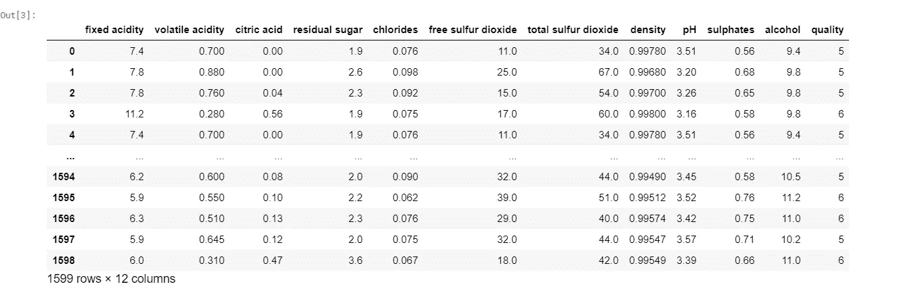

***现在我们来了解一下*** 的数据

```
winequality.head()
```

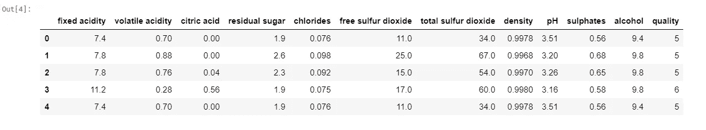

的”。head()"默认情况下，pandas 库的函数为您提供了前五行和类似的"。tail()"函数将给出最后五行。

```
winequality.shape
```

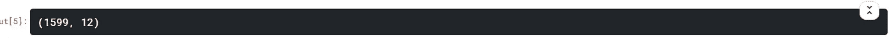

".shape "命令给出了数据中的列和行的总数。

```
winequality.info()
```

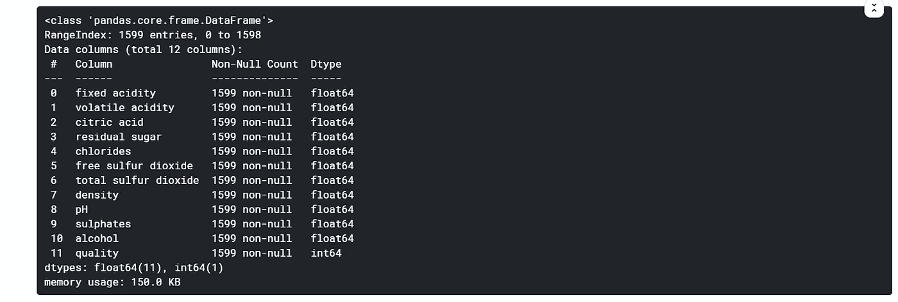

".info()"为您提供有关数据的信息。以上数据只有浮点和整数值，没有缺失值。

```
winequality.describe()
```

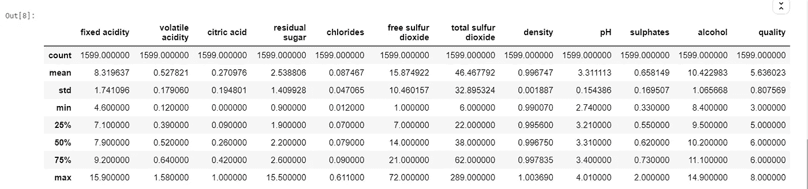

该函数返回数据的计数、平均值、标准差、最小值和最大值以及分位数。在上述数据中，平均值小于每列的中值。在少数预测因子中，75%和最大值之间也有显著差异。

```
winequality.columns
```

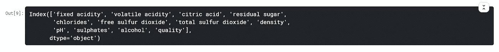

它给出了数据中各列的名称。

```
winequality.nunique()
```

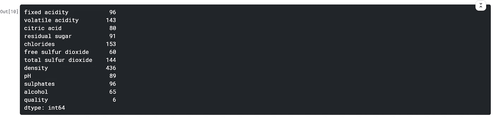

计算数据集中的唯一值。

***现在您对数据有了一点了解，让我们进入下一步，即清理数据。***

```
winequality.isnull().sum()
```

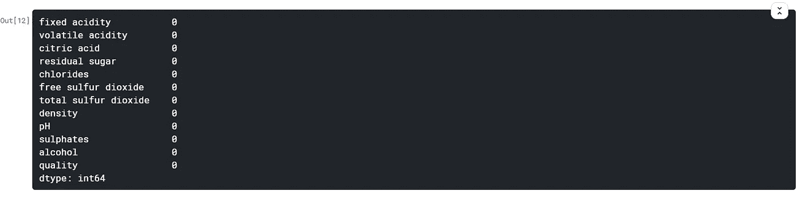

这个函数主要检查数据集中的空值。此数据中没有空值。

***现在让我们进入下一步，即数据的可视化和找出变量之间的关系。***

Python 有一个可视化库 Seaborn，它构建在 matplotlib 之上。它提供了非常有吸引力的统计图，以便执行单变量和多变量分析。

为了将线性回归用于建模，有必要移除相关变量以改进模型。我们可以用熊猫来做到这一点”。corr()"还可以使用热图可视化关联矩阵。

```
sns.heatmap(correlation, xticklabels=correlation.columns, yticklabels=correlation.columns, annot=True)
```

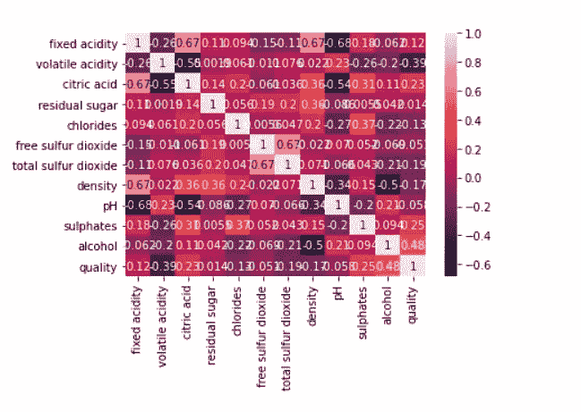

深色代表正相关，浅色代表负相关。在特征选择中去除相关变量是有益的。

这里我们可以看到“品质”与“酒精”有很强的正相关性，而与“挥发性酸度”有很强的负相关性。

另一种分析数字数据的方法是使用**箱线图**。箱形图向我们展示了数据的中位数，它代表了中间数据点的位置。上下四分位数分别代表数据的 75%和 25%。上限和下限向我们展示了数据分布的极端情况。

```
plt.boxplot(winequality) 
plt.show()
```

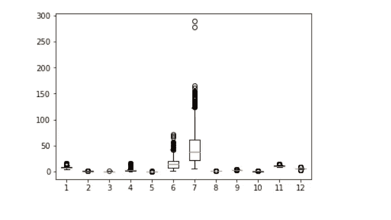

***用散点图*** 看数据

可视化这种关系的一个好方法是使用散点图。散点图将两个连续变量之间的每种关系表示为 2D 图中的单个数据点。

```
plt.scatter(winequality[‘quality’],winequality[‘volatile acidity’]) plt.xlabel(‘quality’)
plt.ylabel(‘volatile acidity’) 
plt.show()
```

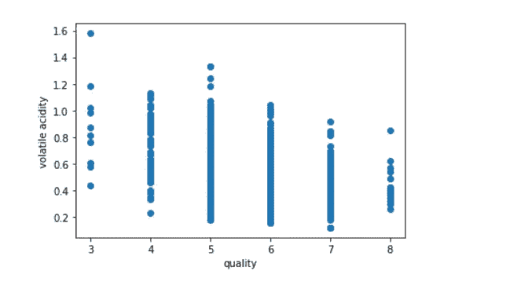

这里我只取了一个变量，检查图表。我们可以对每个变量都这样做，并检查它们之间的线性关系。

**直方图——表示图形的另一种方式**

直方图向我们展示了变量的频率分布。

```
winequality.hist(figsize=(15,15)) plt.tight_layout() plt.show()
```

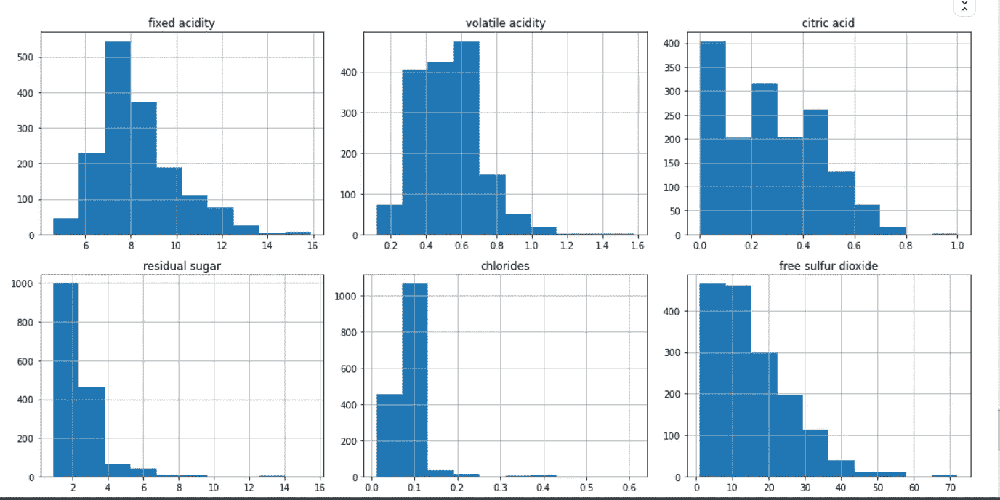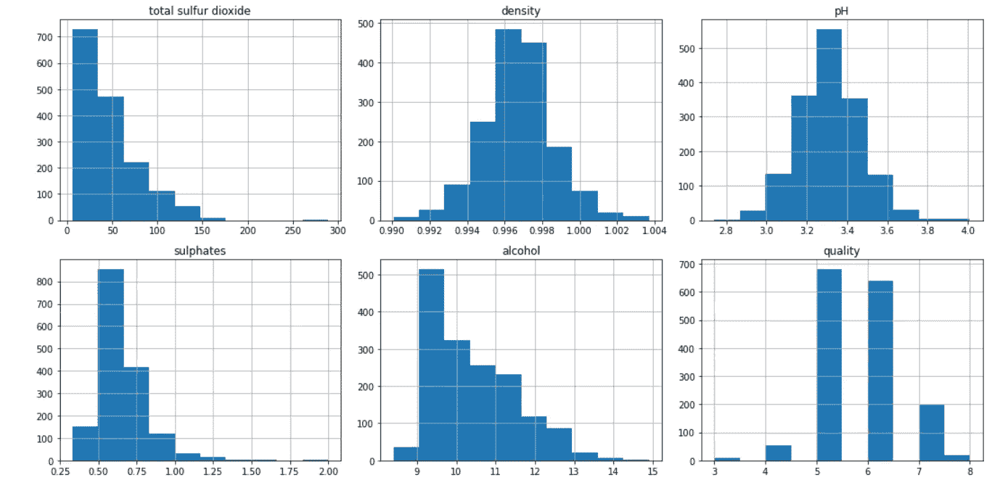

***现在让我们建立模型……***

```
# x= winequality.drop([‘quality’], axis=1) choose this columns based on correlations 
x= winequality.loc[:,[‘fixed acidity’, ‘volatile acidity’,’residual sugar’, ‘chlorides’, ‘total sulfur dioxide’, ‘pH’, ‘sulphates’, ‘alcohol’, ‘quality’]] 
y= winequality.loc[:,’quality’]
 from sklearn.model_selection import train_test_split xtrain,xtest,ytrain,ytest= train_test_split(x,y,test_size=0.3, random_state=0)
```

**从各种模型中找出精度**

```
from sklearn.linear_model import LinearRegression 
lr= LinearRegression() 
lr.fit(xtrain,ytrain)
lr.score(xtest,ytest)
```


```
from sklearn.tree import DecisionTreeRegressor 
dt= DecisionTreeRegressor(max_depth=5,min_samples_leaf= 20) dt.fit(xtrain,ytrain)
dt.score(xtest,ytest)
```

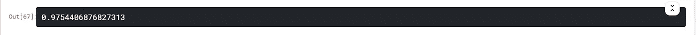

```
from sklearn.linear_model import LogisticRegression 
l= LogisticRegression()
l.fit(xtrain,ytrain) 
l.score(xtest,ytest)
```

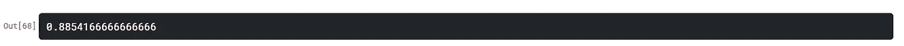

```
from sklearn.svm import SVC 
svc=SVC() 
svc.fit(xtrain,ytrain)
svc.score(xtrain,ytrain)
```

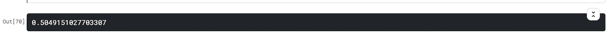

```
from sklearn.model_selection import cross_val_score 
cvs= cross_val_score(svc,xtest,ytest,cv=10, scoring=’accuracy’) 
cvs.mean()
```

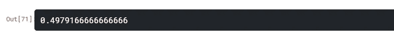

```
cvs.std()
```


```
cvs= cross_val_score(rf,xtest,ytest,cv=10, scoring=’accuracy’)
cvs.mean()
```

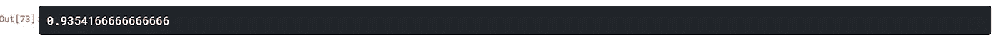

希望我能给你一些关于 EDA 的信息。

***感谢您阅读*** 😊

*原载于 2021 年 3 月 19 日 https://www.numpyninja.com**的* [*。*](https://www.numpyninja.com/post/introduction-to-exploratory-data-analysis-eda)