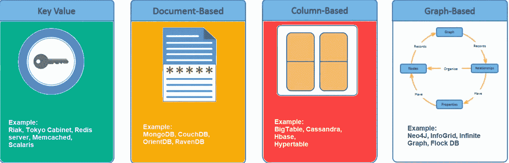
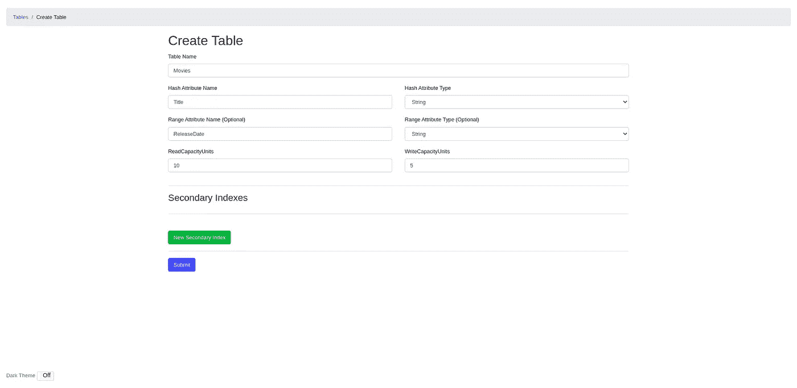
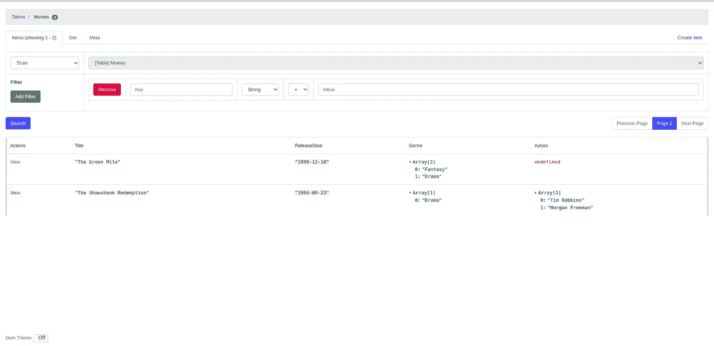
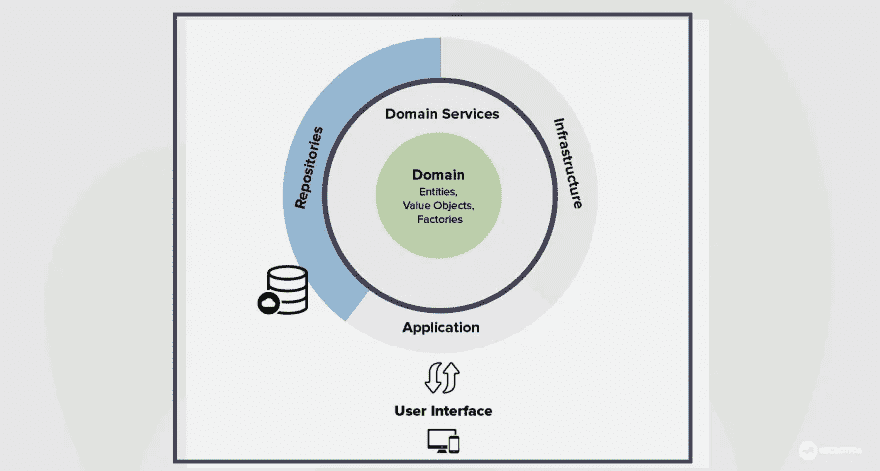

# FastAPI 和本地 DynamoDB 简介

> 原文：<https://medium.com/nerd-for-tech/introduction-to-fastapi-and-local-dynamodb-595c990ed0f8?source=collection_archive---------0----------------------->

迈出第一步，使用 Python FastAPI 和 AWS DynamoDB 开发应用程序


迈克尔在 [Unsplash](https://unsplash.com?utm_source=medium&utm_medium=referral) 上的照片

如今，基于 SQL 的数据库并不是我们在数据库方面唯一的主要选择。有了这样一个灵活的特性，当一个普通的基于 SQL 的数据库被认为不合适时，NoSQL 现在被广泛使用。

有几种类型的 NoSQL 数据库:

*   基于键值对
*   面向列的图
*   基于图表
*   面向文档



【https://www.guru99.com/nosql-tutorial.html 

这次我们将看看基于键值对的 NoSQL 数据库，特别是 AWS DynamoDB。但是在直接跳到云版本之前，我们先来看看本地的。

注意:你可以在这里获得这篇文章的完整代码[https://github.com/agusrichard/fastapi-workbook](https://github.com/agusrichard/aws-workbook/tree/master/fastapi-dynamo)

# 设置本地 DynamoDB

在这一节中，我们将从如何设置本地 DynamoDB 开始。本地安装 DynamoDB 有三种方式，你可以下载，使用 Docker 或者把 DynamoDB 作为 Apache Maven 库。我们将讨论第二种方法，因为这种方法被认为是最简单的入门方法。

首先，确保您的本地机器上安装了 Docker。如果你还没有，你可以看看如何在这里做[https://docs.docker.com/engine/install/](https://docs.docker.com/engine/install/)。

要在本地运行 DynamoDB，只需运行以下命令:

```
docker run -p 8000:8000 -d amazon/dynamodb-local
```

通过运行上面的命令，您将拥有一个分离的容器，它将在端口 8000 上运行。

好了，我们的数据库开始运行了。但是如何以非编程方式与之交互呢？如果我们可以使用 SQL 客户端软件应用程序(如 dbeaver 或 pgadmin)连接到基于 SQL 的数据库，那么本地 DynamoDB 呢？让我们看看如何设置 DynamoDB 管理 UI。

# 设置 DynamoDB 管理员

正如我在上一节中提到的，我们还没有与数据库交互的接口(除了以编程方式)。如果你以前在本地使用过 MongoDB，很可能你对 mongo-express 相当熟悉。DynamoDB Admin 非常相似，我们将在这一节中研究如何设置它。

使用 npm 安装 DynamoDB Admin:

```
npm install -g dynamodb-admin
```

通过运行这个命令，您将全局安装 DynamoDB Admin。稍后我们将看到如何利用 Docker 来容器化我们拥有的所有服务。

安装后，您可以运行以下命令:

```
# For Windows:
set DYNAMO_ENDPOINT=http://localhost:8000
dynamodb-admin

# For Mac/Linux:
DYNAMO_ENDPOINT=http://localhost:8000 dynamodb-admin
```

现在，您可以打开一个新的选项卡，并转到 [http://localhost:8001](http://localhost:8001) (默认端口)。如果您使用不同的端口来运行 DynamoDB，您应该在上面的命令中将端口 8000 更改为您选择的端口。

这是管理应用程序的外观:


作者形象

非常简单的设计，对吗？让我们创建第一个表。



作者形象

在上图中，我想创建一个名为`Movies`的表。带有分区键(哈希属性)`Title`和排序键(范围属性)`ReleaseDate`。这些属性组成了我们通常所说的主键。

关于这两个属性的一点解释。分区键被定义为数据点将被存储在哪个分区中的地址。它涉及一个散列函数，将原始值转换为散列值。

请注意，分区键可以重复。如果与排序关键字结合使用，它不一定是唯一的。如果两个或两个以上的数据点具有相同的分区键，它们都将被放入相同的分区中，并按排序键排序。

你可以玩管理应用程序，如创建一个项目，更新，删除，扫描和查询。



作者形象

# 初始化 FastAPI 应用程序

在开始一个 python 项目时，首先要做的是建立一个虚拟环境。您可以通过运行以下命令来实现。

```
python3 -m venv venv
```

安装与 FastAPI 和 DynamoDB 相关的依赖项:

```
pip install fastapi uvicorn boto3
```

作为入门者，我们先在`main.py`文件中写一个模板代码。

您可以通过运行以下命令来运行服务器:

```
python main.py
```

这就是我们的应用程序的三个基本构件。但是管理三个独立的实体非常繁琐，因此让我们通过使用 docker-compose 来简化它。

# 使用 Docker Compose 简化开发过程

在项目的根目录下，创建一个名为`admin.Dockerfile`的 docker 文件:

它充当我们的管理应用程序的 docker 文件。现在，为 FastAPI 应用程序创建一个 Dockerfile。

接下来，创建`docker-compose.yaml`

要运行所有这些服务，请运行以下命令。

```
docker-compose up
```

# 编写主要的应用程序代码

在这一部分，我将使用领域驱动设计(在简化模式下)。



[https://laptrinhx . com/the-concept-of-domain-driven-design-explained-2519627739/](https://laptrinhx.com/the-concept-of-domain-driven-design-explained-2519627739/)

简单解释一下，基本上我们有组件层。业务逻辑和领域规范在核心中定义。外部组件是可连接和可更换的。假设今天您使用 PostgreSQL 作为数据库，但是后来，您认为 DynamoDB 更适合您当前的用例。使用这种设计模式，您不需要改变核心组件内部的任何东西。您可以轻松地更改或扩展您的基础架构，而不会干扰您已经指定的业务逻辑。

因为本文主要关注如何使用 DynamoDB。您可以忽略除存储库之外的其他组件(域和路由器)。

让我们从使用 Python 脚本生成表和使用`boto3`设置数据库资源开始。创建一个名为`generate_table.py`的 Python 文件。

生成 _ 表格. py

使用以下命令运行 Python 脚本:

```
python generate_table.py
```

用名为`db.py`的文件创建一个名为 internal 的文件夹:

现在，它是仓库。用名为`recipes.py`的文件创建一个名为`repository`的文件夹

接下来，对于`domain`、`routers`和`main.py`

路径:域/食谱. py

路径:路由器/recipes.py

路径:main.py

至此，我们已经有了一个数据库和主应用程序。让我们尝试一下，测试一下它的一些特性。运行所有服务，进入 [http://localhost:5000/docs。](http://localhost:5000/docs.)通过自动生成的 OpenAPI 文档，可以创建、更新、删除、获取全部和获取单个数据。实现基本的 CRUD 操作。

# 结论

像 DynamoDB 这样的 NoSQL 数据库可以给我们带来普通的基于 SQL 的数据库所不能提供的灵活性。有了它的无模式设计，我们就不必担心以后会需要什么样的列。

在本文中，我们着重于使用 local DynamoDB 开发一个应用程序。尽管这是合适的第一步，但出于明显的原因，您应该使用像 AWS DynamoDB cloud version 这样的托管服务。在下一篇文章中，我们将看看如何将本地数据库迁移到云版本。

将我们的本地数据库迁移到云版本，如下所示:

[https://medium . com/nerd-for-tech/python-fastapi-with-AWS-dynamo db-931073 a87a 52](/nerd-for-tech/python-fastapi-with-aws-dynamodb-931073a87a52)

感谢您的阅读。编码快乐！

# 资源

 [## Python 和 DynamoDB 开发入门

### 在本教程中，您将使用 AWS SDK for Python (Boto3)编写简单的程序来执行以下 Amazon…

docs.aws.amazon.com](https://docs.aws.amazon.com/amazondynamodb/latest/developerguide/GettingStarted.Python.html)