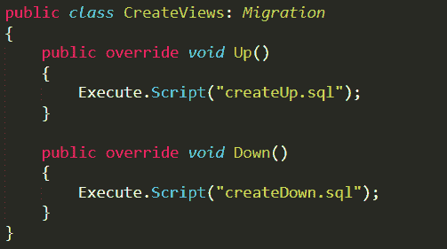
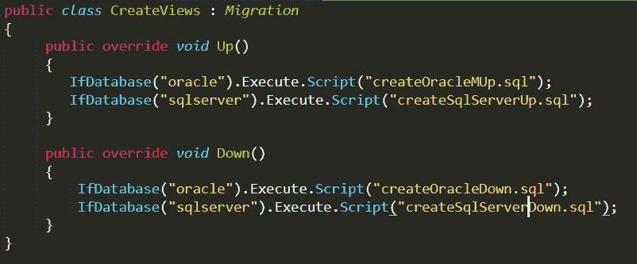

# 流畅迁移器简介

> 原文：<https://medium.com/nerd-for-tech/introduction-to-fluent-migrator-21b5f7831c6?source=collection_archive---------29----------------------->

任何项目的一个关键方面是管理数据库迁移。在开发应用程序时，团队成员的协同工作至关重要，尤其是在处理数据库时。

开发应用程序时，数据库是手动管理的。例如，开发人员经常创建用于更新表和存储过程的 SQL 脚本。然后，他们必须按照一定的顺序管理它们，以便它们能够在上层环境中顺利执行。

简而言之，管理数据库一点也不容易。这就是 Fluent Migrator 派上用场的地方。这是一个工具，有助于解决上述所有问题和更多。让我们从了解什么是 Fluent Migrator 及其工作原理开始这篇文章。

**目录**

*   什么是流利的迁移者？
*   一个流利的迁移者是如何工作的？
*   Fluent Migrator 中的有用功能和技术
*   结论

# 什么是流利的迁移者？

Fluent Migrator 是一个用于. NET 中数据库迁移的框架。它涉及到编写一系列可以创建和修改数据库和数据的类。Fluent Migrator 中的每个类都描述了一次迁移，即从空数据库迁移到填充了一些信息的数据库。

为了使用 Fluent 迁移器，模式更改是在具有两种方法的类中编写的

顾名思义，Up()方法用于升级数据库，而 Down()方法用于降级数据库。

使用 Fluent Migrator 时，您还可以调出要迁移到的版本。当您这样做时，所有必要的迁移将以这样一种方式运行，即您的数据库更新到您希望它迁移到的版本。

# Fluent Migrator 是如何工作的？

从“Migration”基类继承的简单 C#类称为迁移类。迁移的版本号作为唯一标识符放在每个类的迁移属性中。当多个开发人员创建迁移时，可以使用 YYYYMMDDHHMM 格式来避免不同开发人员之间的迁移冲突。或者，也可以用一个增量整数来代替。

在每个类的迁移属性中分配一个惟一的标识符后，实现 Up()和 Down()方法。例如，可以使用 Up()方法在数据库中创建一个新表，而使用 Down()方法可以从数据库中删除一个表。

Migrate.exe 是 Fluent 迁移器附带的迁移运行器工具。它用于以正确的顺序执行像 Up()和 Down()这样的迁移类的方法。为了自动化迁移过程，可以在任何持续集成(CI)工具中完成 Migrate.exe 的集成，如 Team-City、Azure DevOps Server、Jenkins 等。“版本”表由 Fluent 迁移器维护，以跟踪在数据库中执行的迁移版本。

# FluentMigrator 中的有用功能和技术

## 处理多种数据库类型

在同一个迁移项目中，您可以将多个数据库类型作为 Fluent 迁移器的目标。请记住这一点，FluentMigrator 中的每个项目都是与数据库无关的。然而，总有这样的情况，在一个项目中，您只需要针对一个数据库执行少量的迁移。在这种情况下，可以在 FluentMigrator 中使用 IfDatabase 表达式。

假设您有一个运行脚本文件来创建视图的迁移。这是它看起来的样子-

现在设想一个场景，您希望在 SQLServer 数据库中创建几个视图，在 Oracle 数据库中创建几个视图。您还希望在同一个迁移中执行这两个任务，并让它们在两个数据库中共享相同的迁移号。这很容易处理，首先为两个数据库创建脚本，然后指定需要执行哪个数据库:

## 过滤器迁移基于标记运行

曾经有一段时间，多个数据库有相同的模式。但是这些年来这已经改变了，因为你可以看到它们之间的差异。因此，单个程序集中的绝大多数迁移都可以针对所有数据库执行。但是，您还必须筛选特定于国家和环境的数据库中运行的迁移。

为了在 Fluent Migrator 中实现这一点，您可以标记迁移，然后通过将标记传递到 runner 中来过滤它们。一旦迁移被过滤，只有那些没有标签或者所有标签都被传递到运行器中的迁移才会被执行。

# 结论

使用 Fluent Migrator，您可以轻松升级和降级数据库，还可以通过将其与任何配置项集成来自动化数据库迁移过程。这是一个非常方便的工具，因为数据库管理不仅是任何开发项目的关键部分，也是一个具有挑战性的部分。

*原载于*[*https://www . partech . nl*](https://www.partech.nl/nl/publicaties/2021/05/introduction-to-fluent-migrator)*。*