# 针对初学者的 GIT 和 GitHub 介绍

> 原文：<https://medium.com/nerd-for-tech/introduction-to-git-and-github-for-beginners-cb52d3ac7d6f?source=collection_archive---------12----------------------->


(图片:blog.knoldus.com)

如果你对 Git 完全陌生，本指南将带你开始使用 Git，了解它的用途，以及一些你需要知道的基本原则。

## 什么是版本控制？

存储和控制软件代码变更的方法称为版本控制，有时也称为源代码控制。版本控制系统是帮助软件开发团队管理源代码随时间变化的软件工具。

## GIT 是什么？

Git 是一个快速、可伸缩的分布式修订控制系统，具有异常丰富的命令集，提供高级操作和对内部的完全访问。Git 的目标是在项目和文件发展并被许多用户操作时保持对它们的跟踪。Git 使用一个存储库来跟踪项目的进展。存储库包含项目提交或头部，它们是对提交的引用的集合。所有这些信息都保存在与项目相同的位置，即名为`.git`的子文件夹中

Git 跟踪从事单个项目的人所做的修改，然后将项目不同部分的代码组合成一个。因此，如果有人制造了冲突，您可以遍历提交并找到导致冲突的代码。大多数情况下，我们可以使用 GUI 或命令行来与 GIT 交互。

## Git 工作流

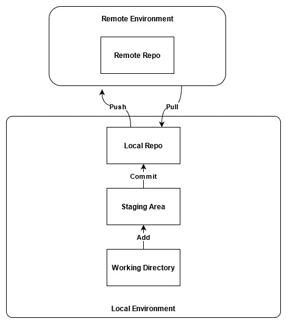

git 的工作流程

## 工作目录

Git 存储库的工作目录可以是本地系统上的任何目录或目录树。在一个工作目录中可以找到任意数量的子目录，形成一个整体工作空间。

## 部队从一个战场转往另一个战场的集结地

许多新用户难以理解的 Git 思想之一是 staging area。乍一看，它似乎是一个不需要的中间层，阻碍了将资料从工作目录提升到本地存储库的尝试。它对 Git 操作的关键方面至关重要。

## 本地知识库

本地存储库是可以在用户计算机(本地环境)上找到的最后一个 Git 层。在材料被生产、更改和登台之后，是时候将材料提交给本地存储库了。如前所述，这个存储库物理上存储在工作目录根目录下的一个不同的(通常是隐藏的)子目录中。它可以通过两种方式之一生成:克隆(复制)一个远程存储库，或者请求 Git 在本地建立一个新环境。

## 远程存储库

远程存储库是 Git 级别，为更多的受众托管和提供资料。它是众多 Git 用户从他们的本地存储库中同步更新的地方。在其他源代码管理系统中，它与您可能认为的服务器相关。

欲了解更多信息，请访问—[https://kelvinleong.github.io/git/2017/01/20/Use-Git.html](https://kelvinleong.github.io/git/2017/01/20/Use-Git.html)

## 入门指南

要使用 GIT，您必须在您的机器上安装它。只需去 https://git-scm.com/downloads 的官方网站[下载 GIT。在那里，根据您的操作系统选择版本。GitHub 是一个基于云的托管服务，可以让你管理 Git 仓库，我们也将使用 GitHub 进行演示。所以你需要在 GitHub 有一个账号或者简单的创建一个。](https://git-scm.com/downloads)

一旦安装了 GIT，就可以在命令行中使用下面的代码来检查 GIT 的版本

```
git --version
```

## 创建本地存储库

在创建本地存储库之前，我们需要初始化存储库。因此，选择一个您想要初始化的目录，并在特定的文件夹位置打开 CMD，然后键入以下代码。

```
git init
```

所以我创建了一个名为“ **Test** 的文件夹，并初始化了文件夹中的 git，如下图所示

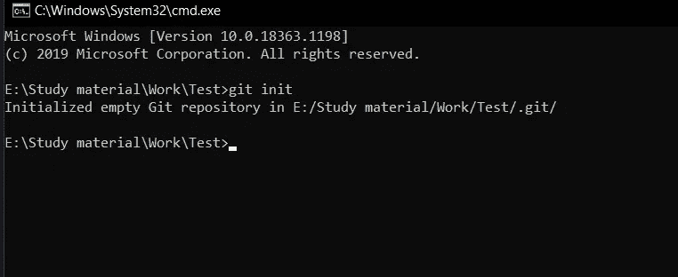

所以一旦我初始化。git 文件夹将在**测试**文件夹中创建，如下所示

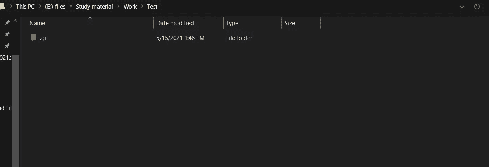

## 向临时区域添加新文件

对于演示，让我们添加一个名为“demo.txt”的文本文件，并在其中放入“Hello World！”。因此，一旦您创建了文件，我们就可以通过在 CMD 中输入以下命令来检查回购的状态

```
git status
```

因此将显示如下:

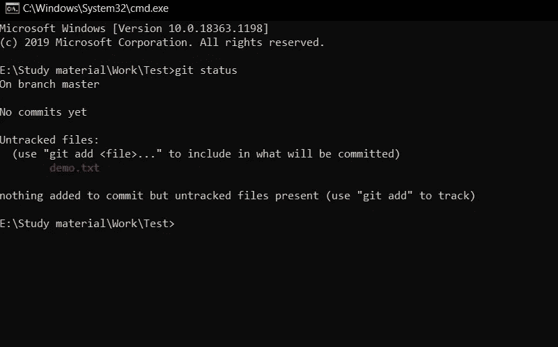

正如你从上面的图片中看到的，这是我们的文本文件，颜色是红色的。这意味着它仍然在工作目录中。要将它添加到临时区域，我们需要使用以下命令

```
git add .
```

我们也可以通过文件名来指定，如果我们想要添加整个文件，我们需要加上句号(`.`)，现在让我们用`git status`命令来检查它

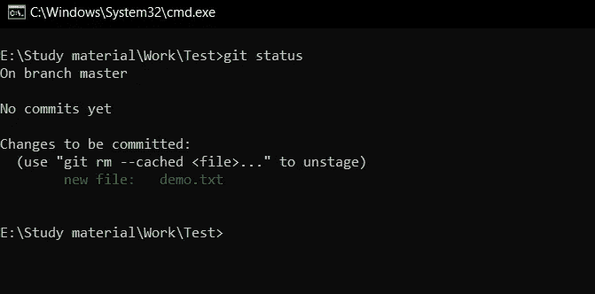

正如你所看到的，它是绿色的。

## 向本地存储库添加新文件

Git commit 收集临时区域中的所有更改，将它们打包，并保存到您的本地存储库中。提交本质上是一个检查点，它指示 git 通过与我们之前的提交进行比较来记录到目前为止发生的所有更改。当你提交时，你的准备区域将是空的。让我们看看，

```
git commit -m "First Commit"
```

在这里我使用了`git commit`来保存从暂存区到本地回购。在使用 commit 时，我们必须给出消息，并且该消息应该清楚地指定对该特定提交所做的更改。所以一旦我这么做了，我得到了如下的回应，

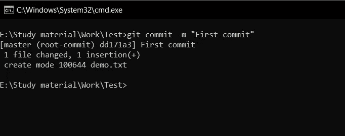

## 树枝


(图片:[https://www.nobledesktop.com/learn/git/git-branches](https://www.nobledesktop.com/learn/git/git-branches))

分支允许您在项目的“状态”之间来回移动。假设您想要为项目添加一个新的特性，那么如果您创建了一个新的分支，您可以在不干扰主分支的情况下处理该分支，并且一旦您完成了任务，它就可以与主分支合并。因为大多数开发人员在这一点上都犯了错误。在 GitHub 中，主分支名是`main`。最近，GitHub 决定在创建一个新的 Repo 时将默认分支改为`main`。通常它带有`master`的名字

```
git branch -M main
```

看看上面的代码，我用`-M`将主分支从`master`重命名为`main`

```
git branch
```

但是输入上面的代码，它会显示整个分支。这个类似于`git branch --list`。为了**创建**一个新的分支，我们必须在上面代码的**末端**指定分支的**名称**。一旦我们给出了如下所有分支的列表，

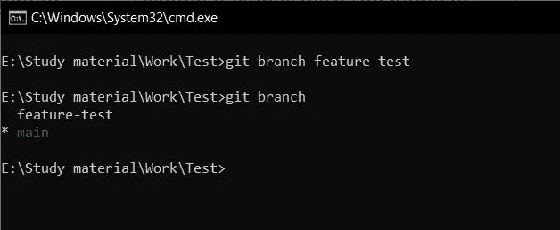

我创建的分支是"**特征测试**"如上图所示。当前分支将显示为绿色。那么，如果我想切换分支，我们必须通过指定我想切换的**分支名称**来使用`checkout`。让我们看看如何，

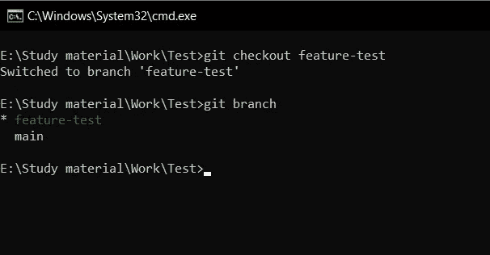

正如你从上面的图片中看到的，我已经输入了`git checkout feature-test`，现在我在**功能测试**，当我发出命令`git branch`时，它显示为绿色

## 将文件保存在远程存储库中

在保存之前，我们已经在 GitHub 中创建了一个新 repo，

转到你的 GitHub 页面，点击页面右上角的加号图标(+)，然后选择 New repository，如下图所示

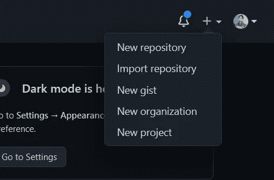

导航至创建新的回购

之后，您必须为回购指定一个名称。在我的例子中，我将命名为“ **TestRepo** ”。您可以公开或秘密回购。私有意味着只有你和与回购合作的人可以查看它们。

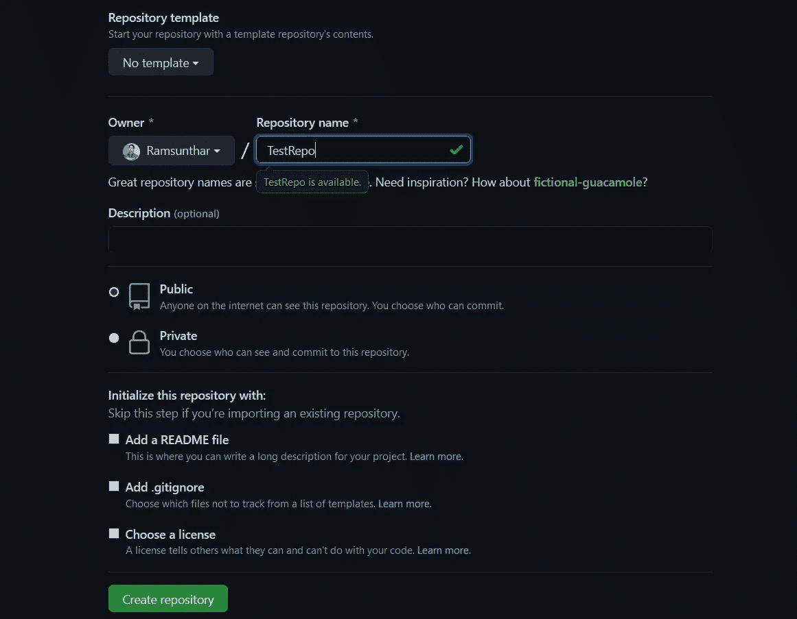

创建回购

完成后，点击创建存储库，您将看到如下屏幕

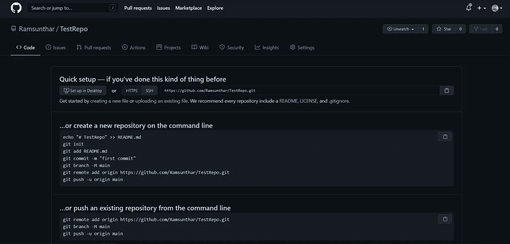

回购已创建

因此，现在我们已经成功地在 GitHub 中创建了新的回购协议。让我们看看如何将我们的文件保存到这个 repo 中。在此之前，我们需要在本地存储库中指定远程 repo 的地址。

```
git remote add origin https://github.com/Ramsunthar/TestRepo.git
```

您的资源库链接将位于您的 github 上，如下所示


回购链接

因此，正如我上面提到的，我们通过发出`git remote add`命令将远程回购链接添加到原点。要确认这一点，你可以去你的。git 文件夹，在您的本地目录中，有一个名为 config 的文件，

```
[core]
 repositoryformatversion = 0
 filemode = false
 bare = false
 logallrefupdates = true
 symlinks = false
 ignorecase = true
[remote "origin"]
 url = [https://github.com/Ramsunthar/TestRepo.git](https://github.com/Ramsunthar/TestRepo.git)
 fetch = +refs/heads/*:refs/remotes/origin/*
```

您给出的远程 URL 将存储在配置文件中。所以现在我们可以走了。

要将文件存储到远程 repo，您必须使用`git push`,指定分支名称如下:

```
git push -u origin main
```

一旦您给出了上面的代码，您将得到如下输出:

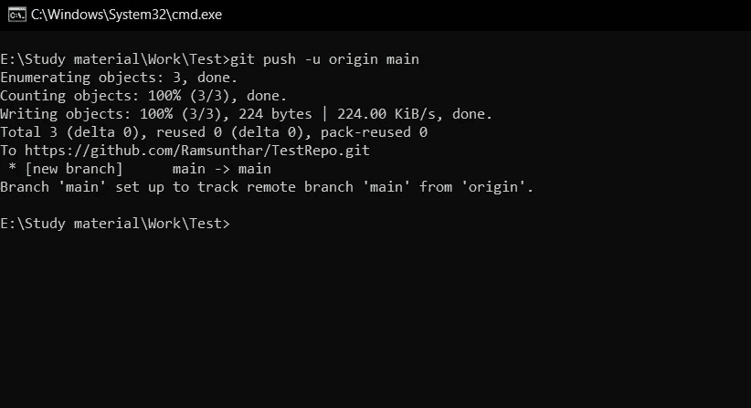

现在去检查 github，你会看到你的文件如下:

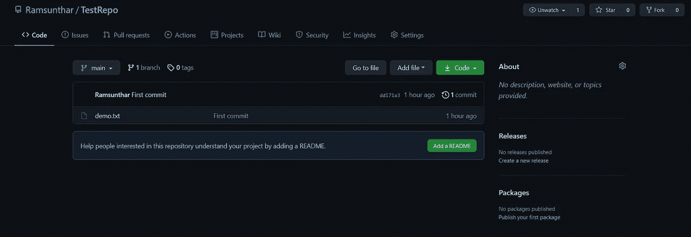

## 从远程存储库中检索文件

假设你和一个团队一起做一个项目，他们也把他们的代码推送到远程 repo。现在你想在主分支中得到这些代码。为此你需要使用`git pull`

```
git pull origin main
```

在这里，我们从主分支提取代码，一旦我们这样做了，您将在 CMD 中获得如下输出:

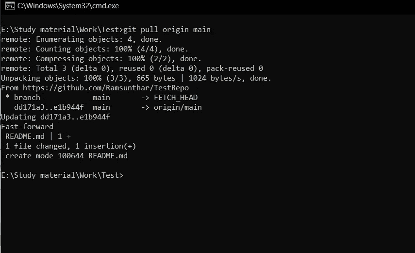

和文件将在您的本地存储库中更新，

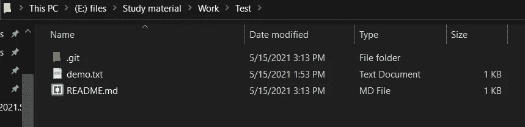

哒哒！！！！！！！！。这是非常基础的 git 和 github。但是关于这些还有很多需要学习。要了解更多关于 git 命令的信息，请访问[https://www.atlassian.com/git/glossary](https://www.atlassian.com/git/glossary)。

# 参考

 [## 基本 Git 命令| Atlassian Git 教程

### 这些是您开始使用 Git 所需的基本命令。学习最常用的命令，然后开始使用…

www.atlassian.com](https://www.atlassian.com/git/glossary) [](https://git-scm.com/doc) [## 证明文件

### 斯科特·沙孔和本·施特劳布写的整本 Pro Git 书可以免费在线阅读。死树版本…

git-scm.com](https://git-scm.com/doc)