# Google AutoML Vision 简介

> 原文：<https://medium.com/nerd-for-tech/introduction-to-google-automl-vision-7be9657d7b3d?source=collection_archive---------7----------------------->

随着技术的快速发展，数据科学家可以更快地完成他们的工作，如训练 ML 模型。“AutoML”(也称为自动机器学习)这个词出现了，现在在学习 ML 中起着至关重要的作用。与传统的创建 ML 模型的方式相比，他们的工作被提升到了一个新的水平。现在三大云平台(GCP、Azure、AWS)为机器学习提供了各种资源，尤其是 AutoML。这篇博客将从介绍到创建一个 AutoML 应用程序。

> **自动化机器学习** ( **AutoML** )是将[机器学习](https://en.wikipedia.org/wiki/Machine_learning)应用于现实世界问题的任务[自动化](https://en.wikipedia.org/wiki/Automation)的过程。

AutoML 涵盖了从原始数据集到可部署的机器学习模型的完整管道。

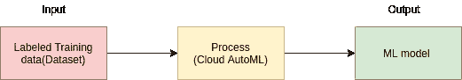

图 1: AutoML 管道

*   AutoML 的高度自动化允许非专家利用机器学习模型和技术，而不需要他们成为机器学习专家。
*   通常，科学家必须应用合适的管道:**数据预处理**、**特征工程**、**特征提取**和**特征选择方法**来创建模型。现在，他们可以真正简化数据科学家从头开始的工作中需要更多时间的每一个步骤，并将剩余的时间专注于提高业务知识、分析数据、提取特征和准备要训练的数据。

AutoML 中的这两个重要阶段是特征提取和超参数优化。

*   特征提取:在实际工作中，机器学习模型需要大量的数据来训练。这些数据将会非常庞大，难以理解。特征提取是降维过程的一部分，简单来说，就是将原始数据划分并缩减为更易管理的组。这些大型数据集有大量的变量，需要大量的计算资源来处理。当您拥有一个大型数据集，并且需要在不丢失任何重要或相关信息的情况下减少资源数量时，提取特征的技术非常有用。特征提取有助于减少数据集中的冗余数据量。
*   超参数优化:所有的机器学习模型都有参数，这是有意义的，直接影响 ML 模型的质量。超参数可以很容易地手动设置，并通过反复试验来优化，也可以自动设置这些参数来优化性能，或者可以说是解决机器学习问题。如果没有像 AI 平台训练超参数调整(应用 AutoML)这样的自动化技术，您需要在许多训练运行过程中对超参数进行手动调整，以达到最佳值。超参数调整使确定最佳超参数设置的过程变得更加容易和简单。
*   AutoML 管道与传统管道的比较:

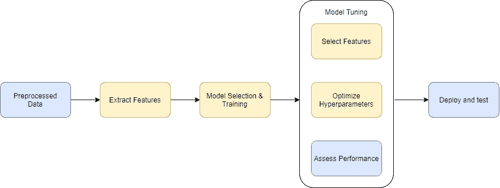

图 2:机器学习管道

*   黄色框中的这些步骤将由 AutoML 自动处理。程序员不需要担心如何配置、优化这些步骤。

**利弊:**
AutoML 帮助科学家自动完成他们的工作，而无需重复数据科学家需要编码技能的枯燥任务。如果没有 AutoML，他们必须从头开始创建自己的 ML 管道。每个 ML 模型都有自己的属性，因此需要大量时间来完成创建模型的管道。另一方面，AutoML 只是一个软件，因此它总是需要一个 ML
工程师来使用它。事实上，在使用 AutoML 训练的模型之前，它的结果必须经过专家数据科学家的多次验证，以确保它们是正确的。

**自动回声系统:**

Google 开发了几个 AutoML 产品，例如:

*   自动自然语言
*   AutoML 表格
*   自动翻译
*   自动视频智能
*   自动视觉

这些最先进的 AutoML 功能可以帮助您快速自动构建和部署机器学习模型，而无需担心您的 ML 技能，根据您的业务需求处理问题。

出于学习目的，我们将深入研究 AutoML Vision 并创建一个演示应用程序。

**基础知识自动视觉:**

*   Google AutoML Vision 是一个用于图像识别的机器学习模型生成器，作为 Google Cloud 的一项服务提供。
*   AutoML Vision 允许您从标记的图像中以有效的方式训练您的自定义模型。将对结果进行评估，以获得最高性能。
*   AutoML Vision 提供了一个名为 Cloud hosted 的服务，用于在云上注册经过训练的模型，以便通过 AutoML API 提供服务。

**工作流程**:

*   要开始创建 AutoML vision，我们必须经历 5 个步骤:收集数据集、验证数据集、标记数据集、训练模型和部署，然后才能使用它。

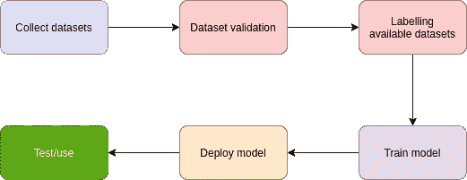

图 AutoML Vision 的工作流程

**编码:**

在本教程中，我们将从最开始的介绍开始，使用 AutoML 视觉为猫和狗创建一个真正的人工智能应用程序，并逐步部署到云运行。

**先决条件:**

您必须至少有使用这些编程语言的经验:

使用的技术:

*   **FastAPI** :用于构建后端应用的现代快速 Python web 框架。
*   **VueJS** :开源的模型-视图-视图模型前端 JavaScript 框架，用于构建用户界面和单页面应用。
*   **Docker:** 一组平台即服务产品，使用操作系统级虚拟化来交付称为容器的软件包中的软件。
*   **云运行**:在完全托管的无服务器平台上开发和部署高度可扩展的容器化应用。

**设置向上:**

*   首先要做的是收集数据集(图像)。我们将从 kaggle.com[下载一个数据集。下载后，我们提取下载的文件，并准备训练。](https://www.kaggle.com/c/dogs-vs-cats/data)
*   其次，你必须首先为你的谷歌云账户设置计费，并启用 Vision AI 功能。你将获得 300 美元的免费试用。
*   请参考此[链接](https://cloud.google.com/vision/docs/setup)设置视觉 API。

**列车型号:**

*   导航到自动视觉。
*   使用选项**单标签分类**创建新数据集。

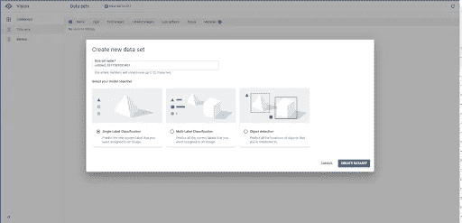

图 4:创建新的数据集

*   通过从计算机上传或选择云存储上的 CSV 文件来导入图像。

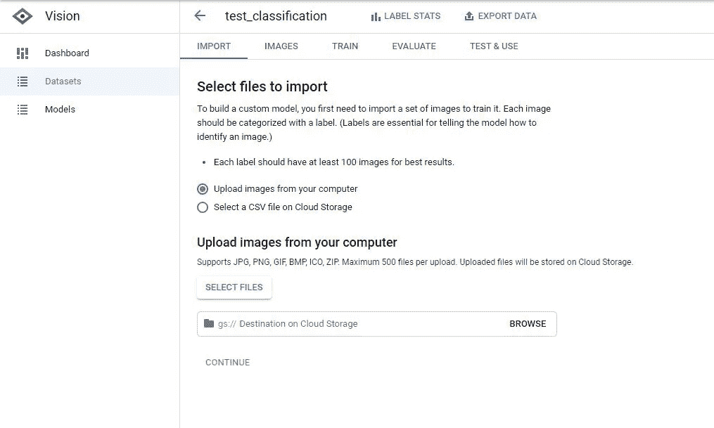

图 5:导入数据

*   创建两个标签，名称分别为:狗和猫。
*   用合适的狗或猫来标记这些未标记的图像
*   接下来，我们将通过单击 train 来训练我们的模型

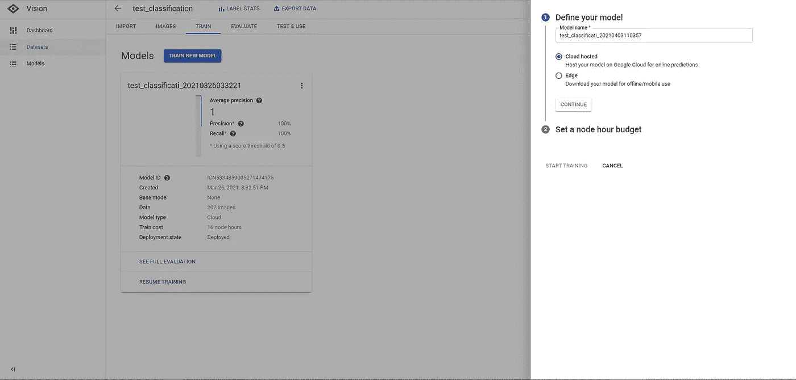

图 6:火车模型选项

*   有两个选项:
*   云托管(选择此项):创建在线模型和预测
*   Edge:下载模型供离线使用
*   选择节点工时预算:

**重要！！**

在做这个动作之前，你必须仔细阅读这个关于[定价](https://cloud.google.com/vision/automl/pricing)的链接。简而言之，用(200 幅图像)训练一个模型的成本将是 8 个节点小时。如果有免费试用，可以试试这个。如果没有，您将被收取**8 *****$ 3.15 = $ 25.2+$ 1.25(用于部署)= $26.45。**

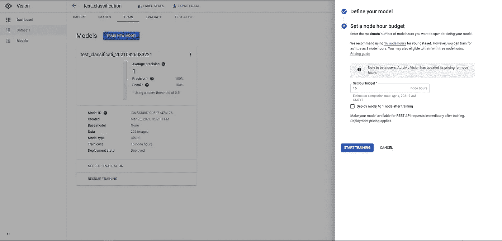

图 7:选择节点小时预算

*   点击开始训练。培训时间为 2~3 小时。
*   完成培训后，您可以通过导航到评估选项卡来查看您的模型评估。

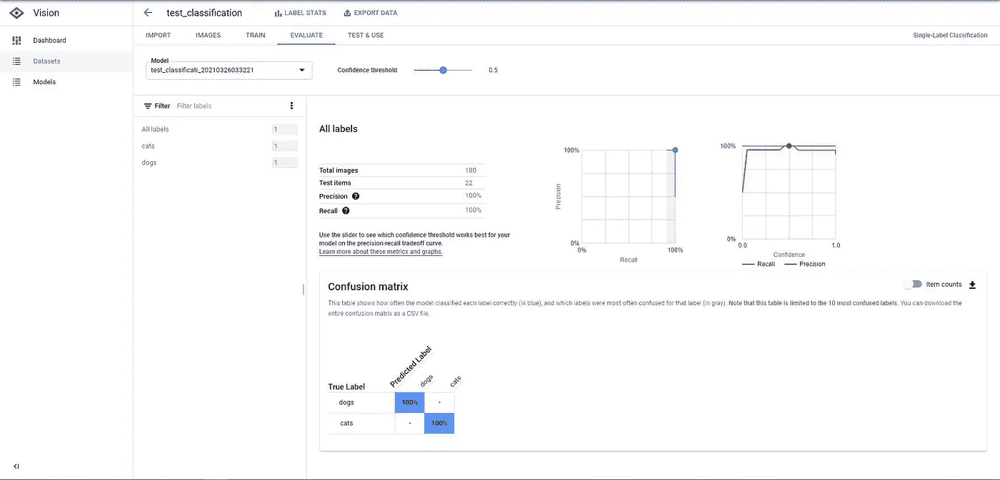

图 8:评估模型

*   让我们测试我们的模型。输入任何图片，看看结果。

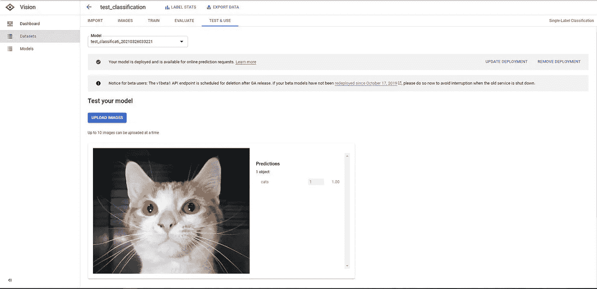

图 9:测试模型

*   酷，我们的模型相当准确。下一步，我们将构建一个 Web 应用程序，这样任何人都可以执行在线预测。

**开发后端**

*   我已经为库定义了需求[文件](https://github.com/tkppro/python-google-automlvision/blob/c9d8a3345248cade2d8e759dd3d01345fd2a2125/requirements.txt)来安装我们将在项目中使用的所有依赖项。下载它，放入我们的项目文件夹，并运行以下命令:

```
$ pip install poetry
$ poetry install
```

*   我们的项目结构将组织如下:

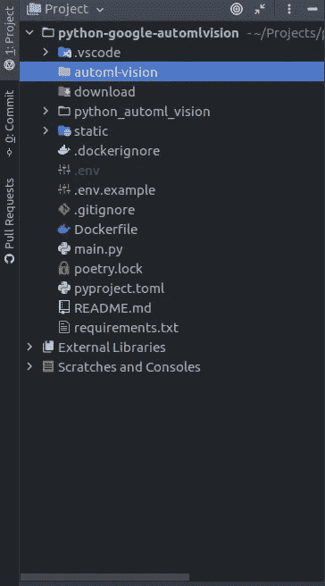

图 10:项目结构

*   接下来，打开 main.py。我们的代码将类似于:

```
from fastapi import FastAPI, File, APIRouter, HTTPException, Body
from starlette.middleware import Middleware
from starlette.middleware.cors import CORSMiddleware
from starlette.staticfiles import StaticFiles

from python_automl_vision.services.services import (
predict, get_sample_online_predict)

app = FastAPI(middleware=[Middleware(
            CORSMiddleware,
            allow_origins=[*],
            allow_methods=[*],
            allow_headers=[*],
        )
    ]
)

api = APIRouter()

app.include_router(api, prefix="/api") |
```

*   添加用于预测的 api:

```
@api.post("/predict")
async def predict_image_file(
file: bytes = File(None),
is_uploaded: bool = Body(True),
blob: str = Body(None),
predict_type: str = Body("ONLINE_PREDICT"),
):
    if not file and is_uploaded:
        raise HTTPException(status_code=400, detail="File must not be empty!")
    results = predict(file, is_uploaded, blob, predict_type)
    return results
```

*   predict()函数:

```
def predict(content, is_uploaded=True, blob="", predict_type="ONLINE_PREDICTION"):
    PROJECT_ID = "your project id"
    MODEL_ID = "your model id"
    if predict_type == "BATCH_PREDICTION":
        return batch_predict()

    file_download = "";
    # Get the full path of the model.
    model_full_id = automl.AutoMlClient.model_path(PROJECT_ID, "us-central1", MODEL_ID)
    if not is_uploaded:
        file_download = download_file(blob)
    with io.open(file_download, "rb") as image_file:
        content = image_file.read()
    # Read the file.
    image = automl.Image(image_bytes=content)
    payload = automl.ExamplePayload(image=image)

    params = {"score_threshold": "0.8"}

    request = automl.PredictRequest(name=model_full_id, payload=payload, params=params)
    response = prediction_client.predict(request=request)
    results = {}
    for result in response.payload:
        results = dict(name=result.display_name, 
            score=result.classification.score)

    # remove downloaded file_
    if os.path.exists(file_download) and file_download != "":
        os.remove(file_download)
    return results
```

*   让我们检查我们的 api，看看结果。运行命令打开本地主机上的服务器。

```
$ uvicorn main:app --host 0.0.0.0 --port 8000
```

*   打开浏览器并导航至 [http://0.0.0.0:8000/docs](http://0.0.0.0:8000/docs) 。我们的 API 列表如下。


*   输入任意图片，测试这个 API。

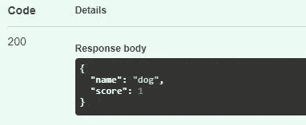

*   不错！！是时候建立我们的前端了。

**开发前端**

*   让我们在静态文件夹中创建一个新的前端应用程序。

```
$ cd static
$ npm i -g @vue/cli
$ vue create frontend
```

*   我将使用[虚拟化](https://vuetifyjs.com/en/)来构建我们的视图。运行安装 Vuetify 的命令:

```
$ vue add vuetify 
#or 
$ npm i vuetify
```

*   对于 api 获取，我使用 [Axios](https://github.com/axios/axios) 来调用 API 并获得结果。

```
$ vue add axios 
#or 
$ npm i axios
```

*   现在，这一次您可以编写自己的前端代码。我将跳过这一部分，让你知道这个页面是什么样子的。您也可以从我的 [GitHub](https://github.com/tkppro/python-google-automlvision) 中找到我的源代码:


*   从 **/static** 文件夹中，我们刚刚构建了我们的前端。运行下面的命令以生成产品。打开[http://0 . 0 . 0:8000/](http://0.0.0.0:8000/docs)查看我们的前端。

```
$ cd static
$ npm run build
```

**部署我们的应用:**

*   该部分将为**可选**。这样做的目的是向大家宣传我们的预测 API。你自己用的话可以跳过这个。
*   接下来，我将构建一个 docker 映像，并将其推送到 **Google 容器注册中心**。检查下面的**文档**:

```
FROM node:lts-alpine as fe-build
WORKDIR /app
COPY static/package*.json ./
RUN npm install
COPY static ./
RUN npm run build

FROM python:3.8 as be-build
WORKDIR /app
COPY requirements.txt .
RUN pip install -r requirements.txt
COPY . .
COPY --from=fe-build /app/dist static/dist
EXPOSE 8000
ENV PORT 8000
CMD ["uvicorn", "main:app", "--host", "0.0.0.0"]
```

*   首先，我们将从静态文件夹中构建我们的前端。接下来，后端将按照我们在 **Dockerfile** 中定义的那样逐步构建。然后，我们将从生产构建中复制文件夹 dist，让我们的后端可以接触静态文件。在 **main.py** 的末尾添加下面几个代码来服务它。

```
#serving static files
app.mount("/", StaticFiles(directory="static/dist", html=True), 
    name="static")
```

*   通过创建 docker 映像和容器来测试我们的 docker 文件。

```
$ docker build . -t automl-vision
$ docker run -dp 8000:8000 automl-vision
```

*   提交我们的 docker 图像到 Google 容器注册表

```
$ gcloud builds submit --tag gcr.io/${YOUR-PROJECT-ID}/automl-vision
```

*   毕竟，检查这个[链接](https://cloud.google.com/run/docs/deploying)来设置你的应用在云上运行。完整的场景将是:

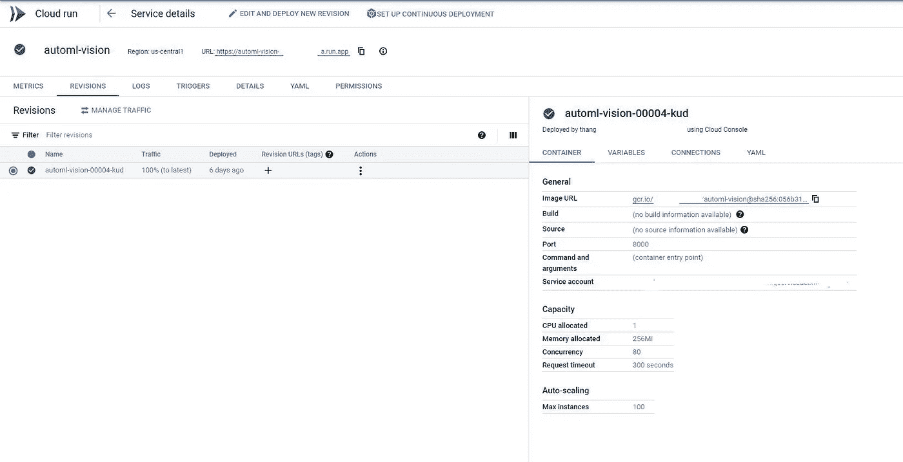

*   最终结果:


**结论:**

AutoML 为人工智能行业提供了许多解决方案，并提供了一种有趣的方法，在许多情况下将降低人工智能的准入门槛。AutoML 为非专业程序员带来了更多的机会，他们希望将其应用于自己的业务领域或学习目的。因此，自动化机器学习将在不久的将来对 AI 解决方案和技术产生积极影响。

如果您有任何问题，请随时通过电子邮件 thangdangdev@gmail.com 联系我或留下您的评论:

如果你看到这篇文章是有帮助的，不要犹豫，给一个掌声。

感谢你阅读❤

*最初发表于*[T5【https://github.com】](https://github.com/tkppro/python-google-automlvision/blob/main/README.md)*。*