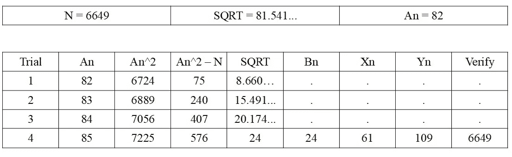
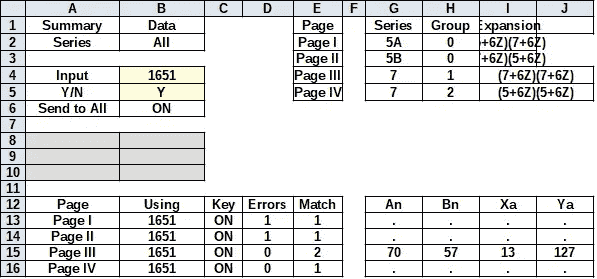
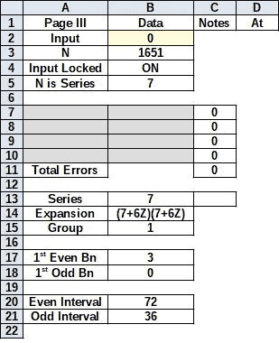
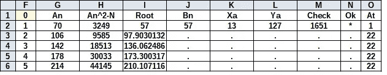
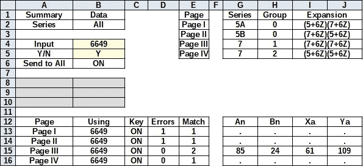
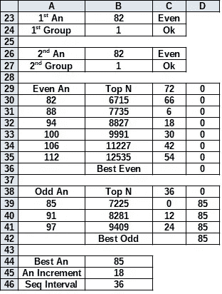
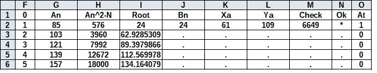

# 整数因子分解族简介

> 原文：<https://medium.com/nerd-for-tech/introduction-to-integer-factoring-families-dce2152fba81?source=collection_archive---------14----------------------->

**第二部分:整数因式分解的基础知识**

```
***A person with everything can find none of it, and
A person with nothing can find all of it.***
```

# **前言**

学习整数因式分解的时候，我一直以为质数是孤儿。原来，他们每个人都有一个家谱。可悲的是，数学的恶魔们确保了 ***每一个*** 奇数也有一个家谱，所以对质数微分没有新的见解。尽管如此，这些家庭本身仍然是迷人的，我将试图在这篇文章中提供一个介绍。

本文是“整数分解基础”系列文章的一部分。如果您查看我的[关于](https://jbjo1956.medium.com/about)的数据，可以看到所有其他文章的列表。

# **第 1 章—背景**

迭代整数分解的主要引擎是**费马因式分解方法**。这种方法不使用筛子，并根据以下公式计算:*N = An Bn*=*(An+Bn)(An Bn)，*其中 *(N)* 是被调查的数字。 *(An)* 的初始值为 *√N* 四舍五入。因此对于*N = 6649*；*安=**81.5414；*四舍五入到 *82* 。反向计算:*Bn = √[ An N]= 8.66*；由于 *(Bn)* 不是整数，需要进行下一次迭代。每次迭代将通过将 *(An)* 加 1 来执行: *An + 1=* *83* 。这一直持续到找到一个整数或者*(An Bn)*的值降到 3 以下，即最小的可能奇素数。(我们将假设负素数不存在。)如表 1 所示，这将需要总共 4 次迭代。



表 1-费马因式分解法示例

这张电子表格是相当自明的。[ **An *-* N** 列的平方根中的[ **SQRT** 列。[ **Bn** ]列只有在 *SQRT* 为整数时才有值，即[IF(SQRT = ROUND(SQRT)，SQRT，" ")].[ **Xn** ]和[ **Yn** ]列使用公式*Xn*=*An-Bn*； *Yn = An + Bn，*即【IF(Bn = SQRT，An *-* Bn，" ")]和[IF(Bn = SQRT，An+Bn，" ")].[ **验证** ]列允许用户验证[ **Xn** ]和[ **Yn** ]相乘后是否等于初始目标[ **N** ]，即[IF(Bn = SQRT，IF(Xn*Yn = N，Xn*Yn，" Error ")，.")]

这种方法的最大问题是，它从最小可能的因素差异一直到最大因素差异。这意味着，如果因子像 *85×83* 一样，你将会得到一个几乎瞬间命中的结果，而 *85×5* 可能会花费长得多的时间，并且需要更多的迭代。减少计算时间和迭代次数的对基本方法的任何修改都被认为是有益的。必须注意，简单地减少迭代可能会无意中增加计算时间。这是使用筛子的方法的典型问题。因此，必须保持一种平衡。

# **第二章——家庭**

整数因子分解族的概念围绕着为有限范围的数字创建一个包含所有值 *(An)* 和 *(Bn)* 的表。没有必要把我的介绍延长到睡觉时间之后，我向你们介绍从 *0* 到 *26* 之间的整数家庭的家谱。

```
**Families of Factors*****An/Bn: N=Xn×Yn=An^2–Bn^2*: Factor Series: Drop from top
------------------------------------------------------------
0/0: 0=0×0=0-0: Factor by 3: Factor by 2****1/0: 1=1×1=1-0: 7+6×(-1)=(7+6×(-1))(7+6×(-1)): Drop=0
1/1: 0=0×2=1-1: Factor by 3: Factor by 2****2/0: 4=2×2=4-0: Factor by 2
2/1: 3=1×3=4-1: Factor by 3
2/2: 0=0×4=4-4: Factor by 3: Factor by 2****3/0: 9=3×3=9-0: Factor by 3
3/1: 8=2×4=9-1: Factor by 2
3/2: 5=1×5=9-4: 5+6×0=(7+6×(-1))(5+6×0): Drop=0
3/3: 0=0×6=9-9: Factor by 3: Factor by 2****4/0: 16=4×4=16-0: Factor by 2
4/1: 15=3×5=16-1: Factor by 3
4/2: 12=2×6=16-4: Factor by 3: Factor by 2
4/3: 7=1×7=16-9: 7+6×0=(7+6×(-1))(7+6×0): Drop=0
4/4: 0=0×8=16-16: Factor by 3: Factor by 2****5/0: 25=5×5=25-0: 7+6×3=(5+6×0)(5+6×0): Drop=0
5/1: 24=4×6=25-1: Factor by 3: Factor by 2
5/2: 21=3×7=25-4: Factor by 3
5/3: 16=2×8=25-9: Factor by 2
5/4: 9=1×9=25-16: Factor by 3
5/5: 0=0×10=25-25: Factor by 3: Factor by 2****6/0: 36=6×6=36-0: Factor by 3: Factor by 2
6/1: 35=5×7=36-1: 5+6×5=(5+6×0)(7+6×0): Drop=0
6/2: 32=4×8=36-4: Factor by 2
6/3: 27=3×9=36-9: Factor by 3
6/4: 20=2×10=36-16: Factor by 2
6/5: 11=1×11=36-25: 5+6×1=(7+6×(-1))(5+6×1): Drop=24
6/6: 0=0×12=36-36: Factor by 3: Factor by 2****7/0: 49=7×7=49-0: 7+6×7=(7+6×0)(7+6×0): Drop=0
7/1: 48=6×8=49-1: Factor by 3: Factor by 2
7/2: 45=5×9=49-4: Factor by 3
7/3: 40=4×10=49-9: Factor by 2
7/4: 33=3×11=49-16: Factor by 3
7/5: 24=2×12=49-25: Factor by 3: Factor by 2
7/6: 13=1×13=49-36: 7+6×1=(7+6×(-1))(7+6×1): Drop=36
7/7: 0=0×14=49-49: Factor by 3: Factor by 2****8/0: 64=8×8=64-0: Factor by 2
8/1: 63=7×9=64-1: Factor by 3
8/2: 60=6×10=64-4: Factor by 3: Factor by 2
8/3: 55=5×11=64-9: 7+6×8=(5+6×0)(5+6×1): Drop=0
8/4: 48=4×12=64-16: Factor by 3: Factor by 2
8/5: 39=3×13=64-25: Factor by 3
8/6: 28=2×14=64-36: Factor by 2
8/7: 15=1×15=64-49: Factor by 3
8/8: 0=0×16=64-64: Factor by 3: Factor by 2****{From this point the division by 2 and 3 has been turned off.}****9/2: 77=7×11=81-4: 5+6×12=(7+6×0)(5+6×1): Drop=0
9/4: 65=5×13=81-16: 5+6×10=(5+6×0)(7+6×1): Drop=0
9/8: 17=1×17=81-64: 5+6×2=(7+6×(-1))(5+6×2): Drop=60****10/3: 91=7×13=100-9: 7+6×14=(7+6×0)(7+6×1): Drop=0
10/9: 19=1×19=100-81: 7+6×2=(7+6×(-1))(7+6×2): Drop=72****11/0: 121=11×11=121-0: 7+6×19=(5+6×1)(5+6×1): Drop=0
11/6: 85=5×17=121-36: 7+6×13=(5+6×0)(5+6×2): Drop=36****12/1: 143=11×13=144-1: 5+6×23=(5+6×1)(7+6×1): Drop=0
12/5: 119=7×17=144-25: 5+6×19=(7+6×0)(5+6×2): Drop=0
12/7: 95=5×19=144-49: 5+6×15=(5+6×0)(7+6×2): Drop=48
12/11: 23=1×23=144-121: 5+6×3=(7+6×(-1))(5+6×3): Drop=96****13/0: 169=13×13=169-0: 7+6×27=(7+6×1)(7+6×1): Drop=0
13/6: 133=7×19=169-36: 7+6×21=(7+6×0)(7+6×2): Drop=36
13/12: 25=1×25=169-144: 7+6×3=(7+6×(-1))(7+6×3): Drop=144****14/3: 187=11×17=196-9: 7+6×30=(5+6×1)(5+6×2): Drop=0
14/9: 115=5×23=196-81: 7+6×18=(5+6×0)(5+6×3): Drop=72****15/2: 221=13×17=225-4: 5+6×36=(7+6×1)(5+6×2): Drop=0
15/4: 209=11×19=225-16: 5+6×34=(5+6×1)(7+6×2): Drop=0
15/8: 161=7×23=225-64: 5+6×26=(7+6×0)(5+6×3): Drop=60
15/10: 125=5×25=225-100: 5+6×20=(5+6×0)(7+6×3): Drop=84
15/14: 29=1×29=225-196: 5+6×4=(7+6×(-1))(5+6×4): Drop=192****16/3: 247=13×19=256-9: 7+6×40=(7+6×1)(7+6×2): Drop=0
16/9: 175=7×25=256-81: 7+6×28=(7+6×0)(7+6×3): Drop=72
16/15: 31=1×31=256-225: 7+6×4=(7+6×(-1))(7+6×4): Drop=216****17/0: 289=17×17=289-0: 7+6×47=(5+6×2)(5+6×2): Drop=0
17/6: 253=11×23=289-36: 7+6×41=(5+6×1)(5+6×3): Drop=36
17/12: 145=5×29=289-144: 7+6×23=(5+6×0)(5+6×4): Drop=144****18/1: 323=17×19=324-1: 5+6×53=(5+6×2)(7+6×2): Drop=0
18/5: 299=13×23=324-25: 5+6×49=(7+6×1)(5+6×3): Drop=0
18/7: 275=11×25=324-49: 5+6×45=(5+6×1)(7+6×3): Drop=48
18/11: 203=7×29=324-121: 5+6×33=(7+6×0)(5+6×4): Drop=96
18/13: 155=5×31=324-169: 5+6×25=(5+6×0)(7+6×4): Drop=168
18/17: 35=1×35=324-289: 5+6×5=(7+6×(-1))(5+6×5): Drop=264****19/0: 361=19×19=361-0: 7+6×59=(7+6×2)(7+6×2): Drop=0
19/6: 325=13×25=361-36: 7+6×53=(7+6×1)(7+6×3): Drop=36
19/12: 217=7×31=361-144: 7+6×35=(7+6×0)(7+6×4): Drop=144
19/18: 37=1×37=361-324: 7+6×5=(7+6×(-1))(7+6×5): Drop=324****20/3: 391=17×23=400-9: 7+6×64=(5+6×2)(5+6×3): Drop=0
20/9: 319=11×29=400-81: 7+6×52=(5+6×1)(5+6×4): Drop=72
20/15: 175=5×35=400-225: 7+6×28=(5+6×0)(5+6×5): Drop=216****21/2: 437=19×23=441-4: 5+6×72=(7+6×2)(5+6×3): Drop=0
21/4: 425=17×25=441-16: 5+6×70=(5+6×2)(7+6×3): Drop=0
21/8: 377=13×29=441-64: 5+6×62=(7+6×1)(5+6×4): Drop=60
21/10: 341=11×31=441-100: 5+6×56=(5+6×1)(7+6×4): Drop=84
21/14: 245=7×35=441-196: 5+6×40=(7+6×0)(5+6×5): Drop=192
21/16: 185=5×37=441-256: 5+6×30=(5+6×0)(7+6×5): Drop=240
21/20: 41=1×41=441-400: 5+6×6=(7+6×(-1))(5+6×6): Drop=396****22/3: 475=19×25=484-9: 7+6×78=(7+6×2)(7+6×3): Drop=0
22/9: 403=13×31=484-81: 7+6×66=(7+6×1)(7+6×4): Drop=72
22/15: 259=7×37=484-225: 7+6×42=(7+6×0)(7+6×5): Drop=216
22/21: 43=1×43=484-441: 7+6×6=(7+6×(-1))(7+6×6): Drop=432****23/0: 529=23×23=529-0: 7+6×87=(5+6×3)(5+6×3): Drop=0
23/6: 493=17×29=529-36: 7+6×81=(5+6×2)(5+6×4): Drop=36
23/12: 385=11×35=529-144: 7+6×63=(5+6×1)(5+6×5): Drop=144
23/18: 205=5×41=529-324: 7+6×33=(5+6×0)(5+6×6): Drop=324****24/1: 575=23×25=576-1: 5+6×95=(5+6×3)(7+6×3): Drop=0
24/5: 551=19×29=576-25: 5+6×91=(7+6×2)(5+6×4): Drop=24
24/7: 527=17×31=576-49: 5+6×87=(5+6×2)(7+6×4): Drop=48
24/11: 455=13×35=576-121: 5+6×75=(7+6×1)(5+6×5): Drop=120
24/13: 407=11×37=576-169: 5+6×67=(5+6×1)(7+6×5): Drop=168
24/17: 287=7×41=576-289: 5+6×47=(7+6×0)(5+6×6): Drop=288
24/19: 215=5×43=576-361: 5+6×35=(5+6×0)(7+6×6): Drop=360
24/23: 47=1×47=576-529: 5+6×7=(7+6×(-1))(5+6×7): Drop=528****25/0: 625=25×25=625-0: 7+6×103=(7+6×3)(7+6×3): Drop=0
25/6: 589=19×31=625-36: 7+6×97=(7+6×2)(7+6×4): Drop=36
25/12: 481=13×37=625-144: 7+6×79=(7+6×1)(7+6×5): Drop=144
25/18: 301=7×43=625-324: 7+6×49=(7+6×0)(7+6×6): Drop=324
25/24: 49=1×49=625-576: 7+6×7=(7+6×(-1))(7+6×7): Drop=576****26/3: 667=23×29=676-9: 7+6×110=(5+6×3)(5+6×4): Drop=0
26/9: 595=17×35=676-81: 7+6×98=(5+6×2)(5+6×5): Drop=72
26/15: 451=11×41=676-225: 7+6×74=(5+6×1)(5+6×6): Drop=216
26/21: 235=5×47=676-441: 7+6×38=(5+6×0)(5+6×7): Drop=432**
```

# **第 3 章—表格说明**

表格布局是对给定范围内可能用于计算费马因子的所有值的逐行反向分析。第一列是[ ***An/Bn:*** ]，包含用于计算大平方 *An* 的基值和用于计算小平方 *Bn* 的增量值。根据需要选取 *(An)* 的初始值，分析给定的范围。 *(Bn)* 的初始值设置为 0，并递增，直到达到 *(An)的值。)*此时 *(An)* 递增，并且 *(Bn)* 重置为 0 以探索新的家族。

下一列[***N = Xn×Yn = An-Bn*:**]执行计算，以显示与该因式分解相关联的值。值 *(N)* 通常是因子分解的目标值。该值是使用第一列中的值从公式 *N= An - Bn* 得出的。 *Xn* = *An - Bn* 的值；*Yn = An+Bn；安；*和 *Bn* 同样来自第一列*。*形式方程可以概括为*N = Xn×Yn =(An-Bn)(An+Bn)= An-Bn*。

第三列[ **因子系列:** ]提供了更多信息，这些信息将在观察部分讨论。因子级数变换公式为 *N = Sa + 6 × Sb* 其中 *Sa* 通常为 5 或 7*Sb =(N-Sa)/6*。注意 *Sb* 必须是整数值。一般来说，当 *N* 能被 2 或 3 整除时，将不会有有效的 *Sb* 。

最后一列[ **从顶部**下降]也是增强信息，将在后面讨论。每个系列中的第一个因子系列值被指定为基线 *(N)* ，其下降值为 *0* 。此后的每个因素系列将显示当前 *(N)* 与基线 *(N)的分离值。*

# **第 4 章—观察结果**

首先映入眼帘的是表格中的偶数。虽然费马因式分解法可以支持偶数，但这只发生在 *N mod 4 = 0 的情况下。*如果输入选择没有控制，那么建议对 *(N)* 进行预筛选，确保 *N mod 2 = 1。*(或者将输入乘以二，将其中一个结果除以二。)这导致数字集合:{ *2，6，10，14，18，* …}不被表示。这些是真正的孤儿。

这篇文章最有趣的方面可能是自然界中发现合成整数的拼图方式。对于使用整数因子的人(或者说是我)来说，因为没有线性结构，所以无法插值结果一直是一个令人沮丧的事情。如果这篇文章有什么好处的话，它确实生动地展示了这种非线性现象是如何运作的。

当一个值只能用一个给定值的一倍来表示时，如 *23=1×23* ，就识别出了质数，这种情况是该值唯一一次出现在表中。请注意，合数也会以这种格式出现，但它们也会出现在表中更高的位置，例如*11/10:21 = 1×21 = 121–100*也会出现在*5/2:21 = 3×7 = 25–4 的更高位置。据我所知，质数从不重复，合数总是至少重复一次。一个家族中的数字通常会与其他家族中的数字混杂在一起，如果它们有两个以上的因子，偶尔会出现重复。例如*23/12:385 = 11×35 = 529–144*和*31/24:385 = 7×55 = 961–576*和*41/36:385 = 5×77 = 1681–1296。质数生活在家庭的最底层，是家庭中最小的数字。那也是 ***每一个*** 奇数最终居住的地方。最下面的家族编号总是*N =**an×2–1。*一个数字一旦到了一个家庭的底部，就再也不会出现在表格里了。**

因子序列的起源是在观察中发现的，除了素数 2 和 3 之外，所有其他的素数都与能被 6 整除的数相邻，例如素数 5 和 7 与数 6 相邻。 *(N)* 可以属于两个系列。在*级数= 5，Sa = 5，N = 5+6×Sb* 和 *Sb =* { *0，1，2，3，…* } 中*级数= 5* 的例子有 *N = 5，11，*和 *17* 。在*系列= 7，Sa = 7，N = 7+6×Sb* 和 *Sb =* { *-1，0，1，2，3，…* } 中*系列= 7* 的例子有 *N = 1，* *7，13，*和 *19* 。

这两个系列可能会产生三种产品。

*   首先，*系列= 5* 乘以*系列= 7* 得出*系列= 5。*有两个子集:
*   *级数= 5* 乘以 a *级数= 7* 产量*级数= 5A，*例: *35 = 5×7* 或*级数= 7* 乘以 a *级数= 5* 产量*级数= 5B，*例:77 *= 7×11。*
*   第二，一个*系列= 7* 乘以一个*系列= 7* 得出一个*系列= 7，*例子: *4* 9 *= 7×7。*
*   最后一个*系列= 5* 乘以一个*系列= 5* 得出一个*系列= 7，*例子: *25 = 5×5。*

如果你注意到 *25* 被归类为*系列= 7* 并认为它应该是*系列= 5，*下面是正在发生的事情: *25 = 7 + 6×3。*(我不制定规则。与恶魔对话。)严重的是， *20* 不能被 *6* 整除，所以不能产生 *25 = 5+6×Sb 的必要因子。*我想我应该提到过，如果 *N mod 6 = 5* ，那么 *(N)* 就是*系列= 5* ，如果 *N mod 6 = 1* ，那么 *(N)* 就是*系列= 7。*所以， *25 mod 6 = 1* 因而必定是*系列= 7。*

我们有*系列= 5A* 和*系列= 5B* 的原因是因为在管理*系列= 5* 的表中嵌入了两个独立的谱系。*系列= 5A* 遵循最高值为*(5+6×Sx)*×*(7+6×Sy)**系列= 5B* 遵循最高值为 *(7+6×Sx)* × *(5+6×Sy)的谱系。*

```
**12/1: 143=11×13=144-1: 5+6×23=(5+6×1)(7+6×1): Drop=0 – A Series
12/5: 119=7×17=144-25: 5+6×19=(7+6×0)(5+6×2): Drop=24 – B Series
12/7: 95=5×19=144-49: 5+6×15=(5+6×0)(7+6×2): Drop=48 – A Series
12/11: 23=1×23=144-121: 5+6×3=(7+6×(-1))(5+6×3): Drop=120 – B Series****15/2: 221=13×17=225-4: 5+6×36=(7+6×1)(5+6×2): Drop=0 – B Series
15/4: 209=11×19=225-16: 5+6×34=(5+6×1)(7+6×2): Drop= 0 – A Series
15/8: 161=7×23=225-64: 5+6×26=(7+6×0)(5+6×3): Drop=60 – B Series
15/10: 125=5×25=225-100: 5+6×20=(5+6×0)(7+6×3): Drop=84 – A Series
15/14: 29=1×29=225-196: 5+6×4=(7+6×(-1))(5+6×4): Drop=192 – B Series**
```

如果 *N mod 6 = 3，*那么这个数可以被 3 整除，没有必要继续下去。这篇文章将集中于分解大于 3 的奇数候选因子。偶数总是能被 2 整除，容易筛选。有两种方法来筛选 3。首先你可以检查确认 *N mod 3 = 0。*或 *s* 秒，将数字中的位数相加，然后除以 3。如果结果是一个整数，那么这个数可以被 3 整除，即 *123 的数字总和= 1+2+3 = 6* 和 *6/3 = 2。(它也适用于数字 9，但此时没有必要讨论这个问题。不服气？试试*63*→*(6+3)mod 9 = 0*或者试试*2763*→*(2+7+6+3)mod 9 = 0。好吧，你们这些怀疑者，查一下这个。)**

 [## 被 9 整除

### 用十进制记数法表示的数能被$9$整除当且仅当它的数位之和能被$9$整除。

proofwiki.org](https://proofwiki.org/wiki/Divisibility_by_9) 

有人会认为有多个因子的合成数字可能会产生模糊的结果。数字 *2275* 是*系列= 7* 因为 *2275 mod 6 = 1* 并且因为*T7(*2275–7)/6 = 378*是一个整数*，*但是也很容易被 *5* 整除。但是，它是**不是** *Series = 5* 因为(*2275–5)/6 = 378.333……*不是整数。它实际上遵循了因子 35×65 和 5×455 的规则，即*系列= 5* 因子，产生*系列=7* 产品和*25×91；**13×175；**7×325；*和 *1×2275* 作为*系列= 7* 生产*系列= 7* 产品的因素。是的，数字 1 在技术上是一个*系列= 7* 其中 *1 mod 6 = 1，*这就是为什么质数和非质数几乎无法区分的原因。*

因子系列变换公式还提供嵌入在 *(Sb)* 元素中的信息，即变换 *25 = 7 + 6×3* 具有 *Sb = 3。**(Xn)**(Yn)*条款的 *(Sb)* 元素之和对所有家庭成员都是一样的。本质上是家族 DNA。

```
**25/0: 625=25×25=625-0: 7+6×103=(7+6×3)(7+6×3): *Sum Sb=3+3=6* 25/6: 589=19×31=625-36: 7+6×97=(7+6×2)(7+6×4): *Sum Sb=2+4= 6* 25/12: 481=13×37=625-144: 7+6×79=(7+6×1)(7+6×5): *Sum Sb=1+5=6* 25/18: 301=7×43=625-324: 7+6×49=(7+6×0)(7+6×6): *Sum Sb =0+6=6* 25/24: 49=1×49=625-576: 7+6×7=(7+6×(-1))(7+6×7): *Sum Sb =-1+7=6***
```

给定系列的顶部从 *(N)* 上的最大值开始，向下工作到底部的较小值。

*   *(An)* 的偶数编号为*N = An 9*对于*系列= 7* 和*N = An**1*对于*系列= 5A* 和*N = An**25*对于*系列= 5B* 。
*   *(An)* 的奇数值最高数为 *N = An* 对于*系列=* 7，*N = An**16*对于*系列= 5A* ，*N = An**4*对于*系列= 5B* 。
*   最下面的家族编号总是*N =**an×2–1。*

忽略*N = An 1*是值被 3 整除的结果的情况。例如:*4/1:15 = 3×5 = 16–1。这些是*系列= 3* ，不适合在此讨论。*

如果您正在运行一个迭代过程来寻找一个费马因子，那么您将会注意到您不再需要递增每个值。 *(An)* 的部分值可以跳过！根据 *(An)* 的值有三组族，其中*组= An mod 3。*他们是*组=* *0，1，*和 *2。*

*   如果*组=* *0 (An mod 3 = 0)，*那么整个家族就是*系列= 5* 乘以*系列= 7* 或者*系列= 7* 乘以*系列= 5 的乘积*系列= 5。**
*   如果 *Group =* *1 (An mod 3 = 1)，*那么整个家族就是*系列= 7* 乘以*系列= 7 的乘积*系列= 7* 。*
*   如果*组=* *2 (An mod 3 = 2)，*那么整个家族就是*系列= 5* 乘以*系列= 5 的乘积*系列= 7* 。*

*(An)* 的初估可能不是正确的组。在我们上面的*试验 1* 、 *N = 6649* 和 *An = 82 的例子中。*所以， *6649 mod 6 = 1* 因此*系列= 7* 和 *82 mod 3 = 1* 因此*组= 1，*所以这是一场比赛，一切正常。如果它不正确，那么 *(An)* 将需要递增，直到它支持*系列= 7。*另外，**(N)*开始的组和系列必须是 *(N)* 结束的同一系列和支持组。记住， *Group = 1* 和 *2* 都支持*系列= 7、*但是 *Group = 0* 只支持*系列= 5* 。在*试验 2、* *83 mod 3 = 2、*的示例中，它可用于*系列= 7、*，但在*试验 3 中，84 mod 3 = 0、*因此应跳过。最后在第 4 次试验中，85 mod 3 = 1 起作用并产生最终答案。*

*落差是数字 *(N)* 离顶部有多远。水滴总是能被 *12、*整除，但在某些情况下可以更多。如果我们找到最高值，我们可以检查下降。再次从例子中测试， *An = 82，*所以 *(An =偶数)**系列= 7* 的顶部在*an9 = 6715*和*(6715–6649)mod 12 = 6，*因此 *(An)* 不可能是 *82* 。在 *An = 83，*top 在 *An = 6889* 和*(6889–6649)mod 12 = 0，*这样 *(An)* 在 *83* 就可以了。在 *An = 85，*顶部在 *An = 7225* ，*(7225–6649)mod 12 = 0，*这样 *(An)* 在 *85* 就可以了。实际上，我们可以跳过在 *82* 和 *84* 的两次试验。*

*在这一点上，你们中的一些人可能走在了我的前面。有落款签名吗？有，有！如果绝对下降具有某个值，那么 *(An)* 的值将是一个家庭成员，并且下降的量可以被解码以揭示 *(Bn)的值。*例如:*10/3:91 = 7×13 = 100–9:7+6×14 =(7+6×0)(7+6×1):Drop = 0；*是*家族的最高数字= 10。*第一滴测量在:*10/9:19 = 1×19 = 100–81:7+6×2 =(7+6×(-1))(7+6×2):Drop = 72。*第一次下降对所有 *(An 是偶数/组= 1/系列= 7)* 值都是一样的，并且总是导致 *Bn = 9* 。*

```
***16/3: 247=13×19=256-9: 7+6×40=(7+6×1)(7+6×2): Drop=0
16/9: 175=7×25=256-81: 7+6×28=(7+6×0)(7+6×3): Drop=72****22/3: 475=19×25=484-9: 7+6×78=(7+6×2)(7+6×3): Drop=0
22/9: 403=13×31=484-81: 7+6×66=(7+6×1)(7+6×4): Drop=72
22/15: 259=7×37=484-225: 7+6×42=(7+6×0)(7+6×5): Drop=216****28/3: 775=25×31=784-9: 7+6×128=(7+6×3)(7+6×4): Drop=0
28/9: 703=19×37=784-81: 7+6×116=(7+6×2)(7+6×5): Drop=72
28/15: 559=13×43=784-225: 7+6×92=(7+6×1)(7+6×6): Drop=216
28/21: 343=7×49=784-441: 7+6×56=(7+6×0)(7+6×7): Drop=432***
```

*当然，第二次下降是 216，Bn = 15，第三次下降是 432，Bn = 21。级数的公式为*新降=前降+(序号× 72)，*即*0+(1×72)= 72；72+(2×72) = 216;*和 *216+(3×72) = 432。**(Bn)*级数就简单多了: *New Bn = Bn+6。**

*遗憾的是，每个新的 *(An)* 将需要不同的级数，这取决于它是奇数还是偶数；群体是什么；以及正在评估哪个系列。这意味着要对下落签名进行完整的分类需要 8 个步骤。等等，你说，只有 6 个？不是真的。检查*12/5:119 = 7×17 = 144–25:5+6×19 =(7+6×0)(5+6×2):Drop = 24*和*12/7:95 = 5×19 = 144–49:5+6×15 =(5+6×0)(7+6×2):Drop = 48*。 *Xn* 和 *Yn* 因子系列的分离有细微差别。记住，第一个因素总是较小的因素。如果你看一下*5×7**Xn*和 *Yn* 的间距是 2。如果你看一下*7×11**Xn*和 *Yn* 的间距是 4。出于某种原因，这一点很重要。(与恶魔对话…)实际上，我们得到了一个突破，两个*系列= 7 个*有相同的轮廓，所以总共只有 6 个级数。为了区分，我们现在有*系列= 5A (5×7)* 和*系列= 5B (7×11)。**

*   *如果 *Group =* *1 或 2 (An mod 3 = 1 或 2)* 和 *(An =偶数)，*那么 *Drop Progression = {72，216，432，720，1080，… } = 72 × {1，3，6，10，15，… }* 其中 *New Drop = Previous Drop +(新序号× 72)，**
*   *如果 *Group =* *1 或 2 (An mod 3 = 1 或 2)**(An =奇数，)*那么 *Drop Progression = {36，144，324，576，900，1296，… } = 36 × {1，4，9，16，25，… }* 其中 *New Drop = 36 ×序号，*例如*
*   *如果 *Group = 0 (An mod 3 = 0)* 和 *(An =偶数)*和 *Series = 5A，*那么 *Drop Progression = {48，168，360，624，960，… } = 24 × {2，5，8，11，14，… }* 其中 *New Drop = Previous Drop + (3 ×序列号 1) × 24，【T23**
*   *如果*Group =**0(An mod 3 = 0)**(An =奇数)**系列= 5A，*那么*下降级数= {84，240，468，768，1140，… } = 12 × {7，20，39，64，95，… }* 其中*新下降=前一次下降+ (6 ×序列**
*   *如果 *Group = 0 (An mod 3 = 0)* 和 *(An =偶数)*和 *Series = 5B，*那么 *Drop Progression = {96，264，504，816，1200，… } = 24 × {4，7，10，13，16，… }* 其中*New Drop = Previous Drop+(3×Sequence Number+1)×24，**
*   *如果 *Group = 0 (An mod 3 = 0)* 和 *(An =奇数)*和 *Series = 5B，*那么 *Drop Progression = {60，192，396，672，1020，… } = 12 × {5，16，33，56，85，… }* 其中*新的 Drop =前一次 Drop + (6 × Sequence**

*请记住，我没有说这很容易。好的一面是，我们可以跳过更多的审判！这是为什么呢？因为我们无法找到 *(An)的每个可接受值的匹配结果，所以*例如*70/57:1651 = 13×127 = 4900–3249:*理论上可以使用 *An = 46，52，58，*或*64；*然而*族= 46* 的顶是 *2107* 和*(2107–1651)mod 72 = 24。**(An)*的其他值分别产生 *36、48、60* 。最后，在 *Family = 70* 处，找到值 0，并且该过程被同步。参见**附录 2——同步**,获取显示所有这些如何组合在一起的样本数据表。*

*同步工作就像时钟一样。例如，值 6 就像时钟快了或慢了 6 个小时，永远不会同步；然而，值 12 就像时钟快或慢 12 小时，并且总是同步的。两者的时间都不正确，但是当时间相差 12 小时时，您可能不会注意到，直到您查看 AM/PM 指示器。(好诡异的巧合这个因式分解算法也是间隔 12 同步的。)*

*经过初步筛选后，没有必要继续查看 *(An)的增量值。*检查将继续重复顺序 *{12、24、36、48、60 和 0。}* 此时刚好增量 *An = An + 36。是的，你可以跳过 36 个增量！(请注意，这是最佳结果。目标会让你很快回到地球。)**

***增量值为 *(An)* 汇总***

*   *如果*Group = 0(An mod 3 = 0)；(An =偶数)；Series = 5A* 或 *5B (5×7 或 7×5)，* Next *An = An + 12。**
*   *如果*Group =**0(An mod 3 = 0)；(An =奇数)；级数= 5A* 或 *5B (5×13 或 7×11)，*下一个 *An = An + 6。**
*   *如果 *Group =* *1 或 2 (An mod 3 = 1 或 2)；(An =偶数)；级数= 7 (5×11 或 7×13)，*下一个 *An = An + 36。**
*   *如果 *Group =* *1 或 2 (An mod 3 = 1 或 2)；(An =奇数)；级数= 7 (5×5 或 7×7)，*下一个 *An = An + 18。**

# ***第 5 章— JavaScript 代码***

*创建*整数因子分解族*表的 JavaScript 源代码可以在这里找到:*

*[https://jbjo 1956 . medium . com/JavaScript-prime-number-lists-using-integer-factoring-families-ba 5300 c4fb 15？source = friends _ link&sk = 8 b 940 ed 4b 9707 C4 a80 e 41 b 5 e 7c 59880 f](https://jbjo1956.medium.com/javascript-prime-number-lists-using-integer-factoring-families-ba5300c4fb15?source=friends_link&sk=8b940ed4b9707c4a80e41b5e7c59880f)*

# ***第 6 章—总结***

*当这个增强的费马因子分解例程被放入一个电子表格中时，它会创建一个巨大的文件，这是因为级数需要表格。它所能处理的最大数量也有严格的上限，但它将在一个选定的值范围内工作。顺便说一下，在花了几十行同步 *(An)* 的初始值之后，它在一行活动代码中解析了 6649。参见**附录 3 —价值评估:6649** 。*

*假设试验的最佳减少量可以减少 36 倍，而不会显著降低例行程序的速度，那么将需要 3600 万年的计算时间减少到 100 万年真的很重要吗？*

*我希望我有一个好主意可以分享，但我怀疑这篇文章真的会打动任何人。毕竟，它基本上只是对整数族分类系统的介绍。我确实有一些关于寻找其他家庭成员的想法，这可能会允许一些新的迭代例程。整数家族 DNA 分解听起来如何？*

# ***更新***

*实际上，DNA 的事没有结果。这是可行的，但在减少计算或提高速度方面并没有真正的好处。我发现了一些更有趣的东西。*

*[](/nerd-for-tech/integer-number-families-the-next-generation-3f298d347b5c) [## 整数家族的下一代

### 第四部分:整数因子分解的基础

medium.com](/nerd-for-tech/integer-number-families-the-next-generation-3f298d347b5c) [](https://jbjo1956.medium.com/javascript-code-for-fast-fermat-integer-family-factoring-74b738b1db7d) [## 快速费马整数族分解的 JAVASCRIPT 代码

### 第六部分:整数因子分解的基础

jbjo1956.medium.com](https://jbjo1956.medium.com/javascript-code-for-fast-fermat-integer-family-factoring-74b738b1db7d) 

事实证明，通过使用一组重复序列中出现的非直观比较，可以消除许多步骤。是的，我可以称之为一种魔法，但在这种情况下，这更是一个问题，我不完全明白为什么它会工作，但你可以自己检查数学。警告，开销明显比你在这里看到的更复杂，但我认为它有可能真正加速保理过程。引用我最喜欢的一个电视节目，“所有的魔法都是有代价的！”

关于**快速费马整数族因式分解**的讨论，请访问:

[https://jbjo 1956 . medium . com/fast-Fermat-integer-family-factoring-e2c 277943727？source = friends _ link&sk = a 685 a 442 c 14 a5 fc 7d 8715 a 4d 449 a 94 cf](https://jbjo1956.medium.com/fast-fermat-integer-family-factoring-e2c277943727?source=friends_link&sk=a685a442c14a5fc7d8715a4d449a94cf)

# **附录 1 —标准定义和等式**

```
**…*^…*  - Raise to the Power of
√*[…]* - Square Root Function
*An*   - Factor of Base Value:        *An = (Yn + Xn)/2* where *An ≥ √[N]
Bn*   - Factor of Separation Value:  *Bn = (Yn −  Xn)/2
N'*   - Integer Prime Number:        *N' = N'×1 ≠ N
N*    - Composite Integer & Factors: *N = Xn×Yn ≠ N'
N    -* Expanded Integer Format: *N = Sa +* 6*×Sb
N*    - Fermat's Factorization:      *N = An^2 − Bn^2
                                      = (An − Bn)(An + Bn)
Sa* - Series Identifier:           *Sa = 5 or 7*; same for *Sa* and *Sb
Sb* - Series Expansion:            *Sb = (N - Sa)/6
Sx* - Series Expansion for *Xn:     Sx = (Xn — Sa)/6
Sy* - Series Expansion for *Yn:     Sy = (Yn — Sb)/6
Xn*   - Smaller Integer Factor of N: *Xn = An − Bn* where *1 < Xn ≤ Yn
Yn*  -  Larger Integer Factor of N:  *Yn = An + Bn* where *Yn ≥ Xn > 1***
```

# **附录 2 —同步**

**假想的电子表格**



**汇总页面**

```
**B4:  (Value to be Evaluated – If Broadcasting to All Pages)
B5:  (Enter Y or N to Toggle Broadcast to Calculation Sheets)
A8: =IF(B8="","","ERROR")
B8: =IF(MOD(B4,2)=0,"Factor of 2","")
A9: =IF(B9="","","ERROR")
B9: =IF(MOD(B4,3)=0,"Factor of 3","")
A10: =IF(B10="","","ERROR")
B10: =IF(B4<5,"TOO LOW","")
B13:  =$'Page I'.B$3
C13:  =$'Page I'.B$4
D13: =$'Page I'.C$11
E13: =$'Page I'.O$2+1-$'Page I'.F1+IF($'Page I'.F1>0,1,0)
G13: =IF($E13<2,".",INDEX($'Page I'.G:$'Page I'.G,$E13))
H13: =IF($E13<2,".",INDEX($'Page I'.J:$'Page I'.J,$E13))
I13: =IF($E13<2,".",INDEX($'Page I'.K:$'Page I'.K,$E13))
J13: =IF($E13<2,".",INDEX($'Page I'.L:$'Page I'.L,$E13))** – **Copy Cells B13–J13; Paste in Cells B14–J14; 
  and Change ‘Page I’ to ‘Page II’** – **Copy Cells B13–J13; Paste in Cells B15–J15;
  and Change ‘Page I’ to ‘Page III’** – **Copy Cells B13–J13; Paste in Cells B16–J16;
  and Change ‘Page I’ to ‘Page IV’**
```



**页面设置块**

```
***–* *Note there are 4 Page Sheets: I, II, III, and IV
– Each Sheet has 3 Blocks: Setup, Synchronization,
  and Fermat Iteration*****A1:   *(The Page Number)*
B2:   *(Value to be Evaluated – If only using this page)*
B3:  =IF($Summary.B6="ON",$Summary.B4,B2) *(Check for Broadcast)*
B4:  =$Summary.B6                         *(Broadcast Status)*
B5:  =IF(MOD(B3,6)=1,7,MOD(B3,6))
A7:  =IF(B7="","","ERROR")
B7:  =IF(MOD(B3,2)=0,"Factor of 2","")
C7:  =IF(A7="ERROR",1,0)
A8:  =IF(B8="","","ERROR")
B8:  =IF(MOD(B3,3)=0,"Factor of 3","")
C8:  =IF(A8="ERROR",1,0)
A9:  =IF(B9="","","ERROR")
B9:  =IF(B3<5,"TOO LOW","")
C9:  =IF(A9="ERROR",1,0)
A10: =IF(B10="","","ERROR")
B10: =IF(B5=B13,"","Wrong Series")
C10: =IF(A10="ERROR",1,0)
C11: =SUM(C7:C10)*****Each Page is the same except for elements between B13 – B21
Note:  @1 refers to Page 1, @2 Page 2, etc.*****B13: *@1:* 5    *@2:* 5   *@3:* 7  * @4:* 7
B14: *@1:* (5+6Z)(7+6Z) *@2:* (7+6Z)(5+6Z)
     *@3:* (7+6Z)(7+6Z) *@4:* (5+6Z)(5+6Z)
B15: *@1:* 0    *@2:* 0   *@3:* 1   *@4:* 2
B17: *@1:* 1    *@2:* 5   *@3:* 3   *@4:* 3  *(First Bn found on Even An)*
B18: *@1:* 4    @2: 2   *@3:* 0   *@4:* 0  *(First Bn found on Odd An)*
B20: *@1:* 24   *@2:* 24  *@3:* 72  *@4:* 72 *(Interval for Even An)*
B21: *@1:* 12   *@2:* 12  *@3:* 36  *@4:* 36 *(Interval for Odd An)******Everything else is the same for all pages***
```


**页面页同步块**

```
**B23: =ROUNDUP(SQRT(B$3))                *(Initial An)*
C23: =IF(MOD(B23,2)=0,"Even","Odd")
B24: =MOD(INT(B$23),3)                  *(Find Group)*
C24: =IF(B24=B$15,"Ok","No")            *(Does Group support Series?)*
B26: =B$23+IF(B$24=B$15,0,IF(MOD(INT(B$23)+1,3)=B$15,1,2))
                           *(If needed, Increment An to change Group)*
C26: =IF(MOD(B26,2)=0,"Even","Odd")
B27: =MOD(INT(B$26),3)                 *(Find New Group)*
C27: =IF(B27=B$15,"Ok","No")           *(Group is correct now)*
C29: =B20                              *(Interval for Even An)*
D29: 0
A30: =B$26+IF(MOD(B$26,2)=0,0,3)       *(Next Even An Value)*
B30: =A30*A30-B$17*B$17                *(Top N for Family)*
C30: =MOD((B30-B$3),C$29)              *(Is Drop a multiple of C29?*)
D30: =IF(D29>0,D29,IF(C30=0,A30,D29))  *(Save Value when Good)*
A31: =A30+6                            *(Next An Value in Group B15)*
*– Copy Cells B30-D30 and Paste to Cells B31-D31
– Copy Cells A31-D31 and Paste to Cells A32-D32; A33-D33; A34-D34;
  and A35-D35*
D36: =D35                             *(Either 0 or Best Even An)
– Note that in this example no Even An values are synchronized*****C38: =B21                            * (Interval for Odd An)*
C38: 0
A39: =B$26+IF(MOD(B$26,2)=1,0,3)      *(Next Odd An Value)*
B39: =A39*A39-B$18*B$18               *(Top N for Family)*
C39: =MOD((B39-B$3),C$38)             *(Is Drop a multiple of C38?)*
D39: =IF(D38>0,D38,IF(C39=0,A39,D38)) *(Save Value when Good)*
A40: =A39+6                           *(Next An Value in Group B15)*
*– Copy Cells B39-D39 and Paste to Cells B40-D40
– Copy Cells A40-D40 and Paste to Cells A41-D41*
D42: =D41                             *(Either 0 or Best Odd An)
– Note that in this example the Odd An value of 85 synchronized*****B44: =MAX(D36,D42)                 *(Just a Cheesy way to Pick Best)
– This is the starting value of An for the Fermat Iteration*
B45: =IF(MOD(B44,2)=0,C29,C38)/2   *(Half of the Interval)*
B46: =IF(MOD(B44,2)=0,C29,C38)     *(The Interval … Repeated)***
```



**费马迭代块页面**

```
***– Be aware that the bulk in the following equations is there to make
  the output format pretty.  Feel free to remove the content, if you
  like looking at page full of* #VALUE! *remarks.*****F1: *(Normally 0, but can be set to any value to scroll the table)*
F2: =IF(F1>0,F1,1)                      *(Iteration Count)*
F3: =F2+1                               *(Next Iteration Count)* G2: =IF(B$44=0,".",B$44+(F2-1)*B$45)    *(Initial Value of An = B44)* G3: =IF(G2=".",".",IF(G2-I2<=1,".",IF(B$44=0,".",B$44+(F3-1)*B$45)))
                                        *(Next An = G2+B45)* H2: =IF(G2=".",".",G2*G2-$B$3)          *(An^2-N = G2*G2-$B$3)*
I2: =IF(G2=".",".",IF(H2>0,SQRT(H2)))   *(Root = SQRT(H2))*
J2: =IF(G2=".",".",IF(I2=INT(I2),I2,".")) *(When I2=INT(I2); Bn=I2)*
K2: =IF(J2=".",".",G2-J2)               *(Xn = G2-J2)*
L2: =IF(J2=".",".",G2+J2)               *(Yn = G2+J2)*
M2: =IF(J2=".",".",K2*L2)               *(Recalculate N)*
N2: =IF(J2=".",".",IF($B$3=M2,"*",".")) *(Does it match?)*
O2: =IF(N2=".",O3,IF(O3=0,F2,IF(F2<O3,F2,O3))) *(Mark the Iteration)*
*– Copy Cells H2-O2 and Paste to Cells H3-O3
– Copy Cells F3-O3 and Paste to Cells F4-O4
– Do this for the depth that you want to see.  I keep mine around
  100 lines.***
```

# **附录 3——价值评估:6649**

**电子表格数据**



**汇总页面**


**页面设置块**



**页面页同步块**



**页面费马迭代块**

```
1  What is Fermat's Factorization Method?*Fermat's factorization method, named after Pierre de Fermat, is based on the representation of an odd integer as the difference of two squares:**N = a^2 − b^2**That difference is algebraically factorable as (a + b)(a − b); if neither factor equals one, it is a proper factorization of N.*Source:  [https://en.wikipedia.org/wiki/Fermat's_factorization_method](https://en.wikipedia.org/wiki/Fermat%27s_factorization_method)
Author:  Unknown
Page Date Stamp:  7 June 2021, at 07:44 (UTC)
```