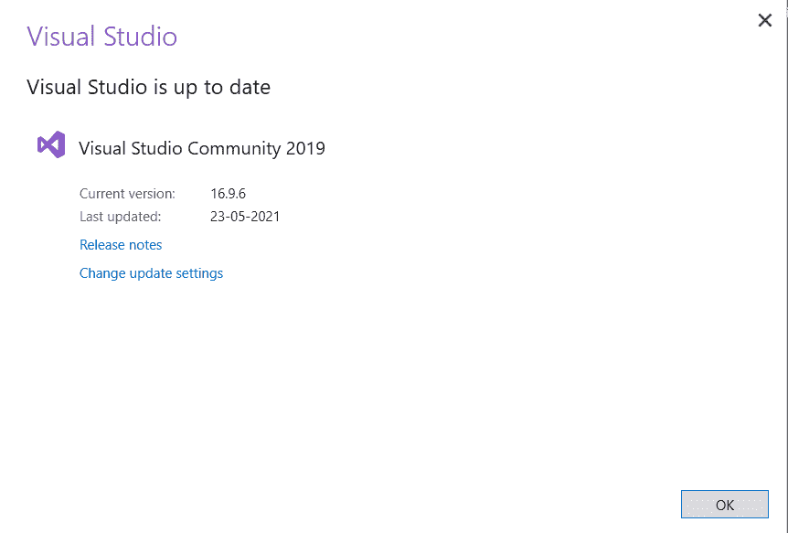
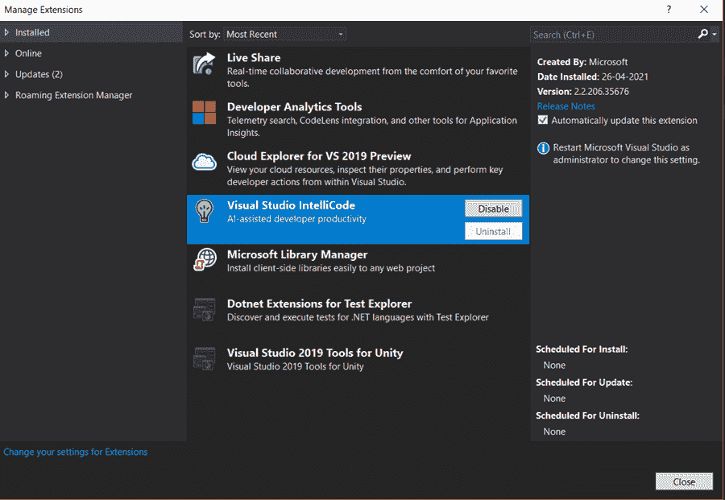
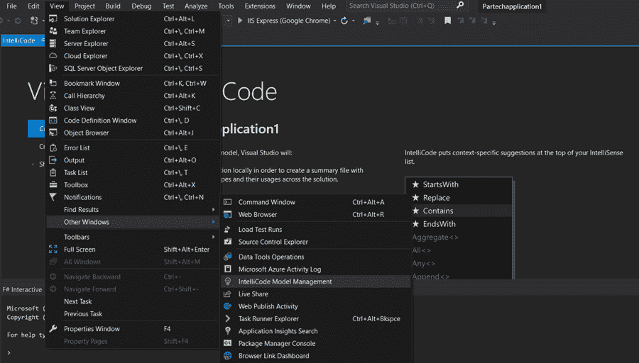
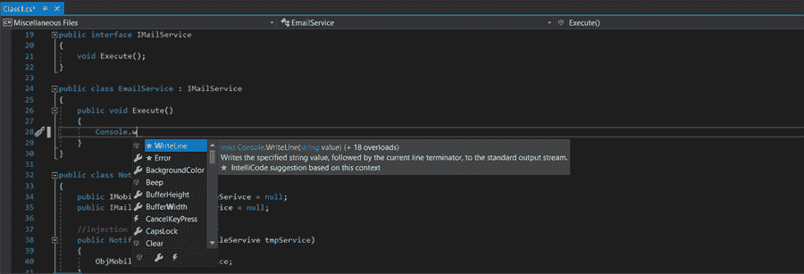
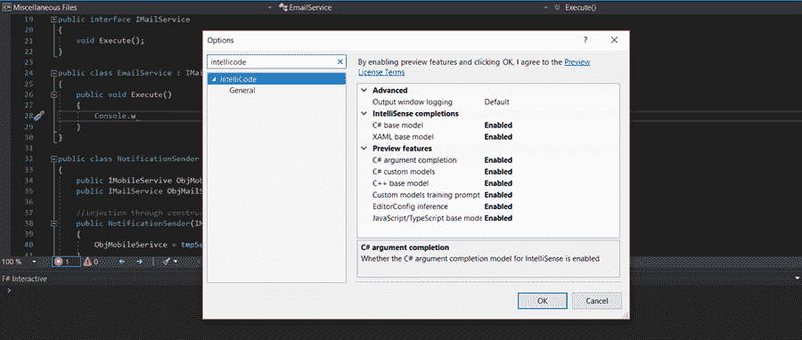

# Visual Studio 中的 Intellicode 简介

> 原文：<https://medium.com/nerd-for-tech/introduction-to-intellicode-in-visual-studio-117be625cc33?source=collection_archive---------16----------------------->

我们大多数人已经被人工智能领域最近取得的进展迷住了。它在医疗保健、运输、制造等各个领域的应用。改变了我们的生活方式。

编程世界也不例外。人工智能已经悄悄进入这个行业的各个领域，并开始产生重大影响。

一个这样独特的应用，一个肆虐的现象发生在 2017 年。微软宣布了一项新功能，可以预测完成代码的方式。

与人工智能相结合，这个特性能够通过智能地评估您的代码模式并建议要包含在代码中的文本来节省您的宝贵时间。

没错，我们说的是 Visual Studio 中的 Intellicode。让我们进一步探究这个特性，并理解它是如何工作的。

**目录**

1.  什么是 Intellicode？
2.  智能代码的优势
3.  如何设置 Intellicode
4.  包扎

# 什么是 Intellicode？

Intellicode 是由 Microsoft 引入的，用于增强现有的提供代码完成和自动完成提示的 Intellisense。它是作为 Visual Studio marketplace 扩展而来的。

Intellicode 支持的语言有

*   Visual Studio 2019 及以上版本中的 C#、C++、XAML、Javascript、Typescript 和 Visual Basic
*   Visual studio 代码中的 Java、Javascript、Typescript、SQL 和 Python。

Intellicode 是 2018 年微软收购 Github 的原因之一。通过访问 Github 中数以千计的高质量软件项目，微软能够训练其 Intellicode AI 提供智能上下文推荐。

事实上，已经获得 100 多颗星的 Github 项目用于训练 Intellicode AI。虽然这个机器学习模型是用成千上万的公共代码库训练的，但它也在通过你自己的本地代码不断学习。这确保了这些建议也依赖于您的代码模式。

# 智能代码的优势

1.  在您的 IDE 中集成 Intellicode 大大减少了击键次数，从而节省了您的时间。
2.  Intellicode 有助于代码重构，因为它会提出定制的编辑建议，并相应地重构您的代码。
3.  它有助于始终如一地遵循您的代码模式和风格。为了保持您的代码风格，Intellicode 从您的本地代码库和从中生成的模式中获得洞察力。
4.  它提供了无错误的代码建议，消除了代码中的任何差异。
5.  它不是简单地给出代码完成文本的字母顺序，而是下一代智能感知，根据当前的代码上下文推断出开发人员使用的正确 API。
6.  它捕捉困难和低可见性的代码问题。
7.  它通过将注意力吸引到最重要的领域来关注代码评审。
8.  它指导开发人员坚持他们团队的风格。这确保了代码可以被每个团队成员轻松地理解。

# 如何设置 Intellicode？

## 第一步

只有 Visual Studio 15.8 和更高版本支持 Intellicode。因此，请确保您的 Visual Studio 已更新。您可以通过在 Visual Studio 界面中单击“帮助”>“检查更新”来检查最新的更新。

## 第二步

更新到最新版本后，您现在必须安装 Intellicode 扩展。导航到扩展->管理扩展，并在扩展市场中搜索 Intellicode。找到后，单击安装并继续。安装后，必须重新启动 Visual Studio 才能体验新的更改。

您也可以直接从微软的官方网站下载 Intellicode。打开已经下载的 VSIX 下载器，单击 Install 按钮在 Visual Studio 中安装 Intellicode。

## 第三步

成功安装后，打开一个现有项目或创建一个新项目。导航到“视图”>“其他窗口”>“智能代码模型管理”,开始体验智能代码的强大功能。

Intellicode 帮助您训练现有的代码库。您的代码模式也可以合并到其他项目中。好处是可以和朋友同事分享你的模型。训练模型有助于您随时生成自动代码提示和自动完成功能。Intellicode 还为您提供了“重新训练”选项，通过识别新模式来再次训练您的共享模型。

完成模型训练的时间取决于代码库的复杂程度。成功完成后，Intellicode 将提供“星号”值，这些值是来自 Intellicode 的自动代码完成建议。

正如您在下图中看到的，标有星号的值是由 Intellicode 提供的，同时还有相同代码的语法和以前的使用模式。

遗憾的是，Visual Studio 不支持自己的训练模型。您必须创建自定义模型来训练您当前的代码库。然而，您可以创建团队模型，并与您的团队共享这些定制模型，以使他们跟踪存储库的变更。

您还可以为您正在使用的特定语言启用/禁用 Intellicode 自动完成功能。目前，Intellicode 只支持 C#、Javascript 和 Typescript。您可以通过导航到“工具”>“选项”>“智能代码”并自定义设置来启用/禁用智能代码功能，如下图所示。

# 包扎

微软开发人员正试图将代码完成的深度学习模型扩展到更多语言，同时也试图实现更长的代码完成。Intellicode 已被证明是开发人员中代码完成最有效的方法之一。除了节省时间之外，它还有助于识别复杂的错误和代码问题，允许开发人员在整个项目中遵循标准的代码模式。

*原载于*[*https://www . partech . nl*](https://www.partech.nl/nl/publicaties/2021/06/introduction-to-intellicode-in-visual-studio)*。*