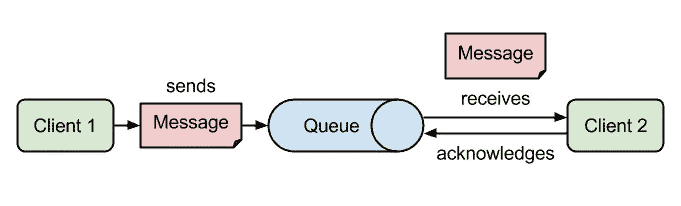
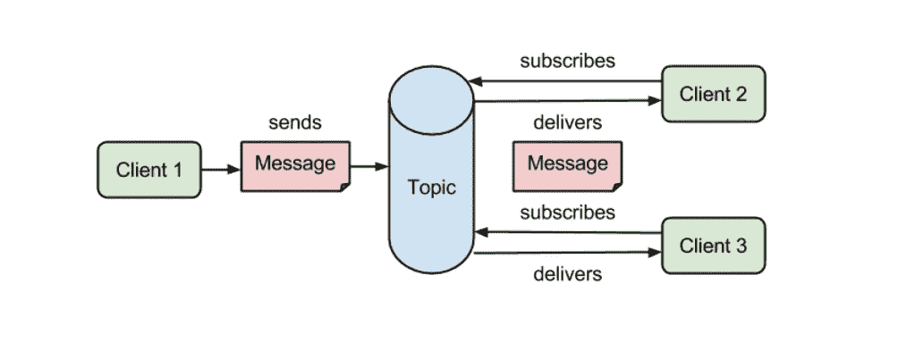

# 消息代理简介

> 原文：<https://medium.com/nerd-for-tech/introduction-to-message-brokers-bb5cacf9c70b?source=collection_archive---------6----------------------->

克里斯蒂娜·特里普科维奇在 [Unsplash](https://unsplash.com?utm_source=medium&utm_medium=referral) 上的照片

消息代理是使服务能够相互通信和交换信息的程序。如果你已经了解了 API，你可能会认为消息代理和 API 是一样的。但事实并非如此，消息代理通常通过实现不同服务可以读写的队列来做到这一点。因此，这将允许这些服务彼此异步通信，即使它们是用不同的语言编写的或在不同的平台上实现的。

因此，这些消息代理充当应用程序之间的桥梁，允许发送方发布消息，而不知道接收方在哪里或有多少接收方。

# 消息代理的用例

正如您已经猜到的，消息代理在软件开发中被广泛使用。每当需要可靠的多服务通信、安全消息传递或异步特性时，它们都很有用。现在，我将向您展示消息代理的几个用例。

*   如果你必须开发一个支付处理系统，支付只发送一次是很重要的。使用消息代理处理这些交易可以确保支付信息不会丢失或重复，并提供收据证明。
*   假设有一个任务，它向几个应用程序发送数据，必须避免直接使用它们 API。在这种情况下，消息经纪人可以拯救你的一天。
*   此外，当您想要控制数据馈送时，消息代理也很方便。例如，任何系统中的注册数量。

# 消息代理的基本组件

您需要了解消息代理中的 4 个组件。

*   **生产者** —这是发送任何类型数据的端点，这些数据存储在消息代理中以供分发。
*   **消费者** —这是向消息代理请求消息并消费消息的端点。
*   **队列** —这是消息代理用来存储内部消息的数据类型，逻辑为 FIFO(先进先出)。队列存储消息，直到消费服务处理它们。这些队列还允许异步类型的编程，因为队列是负责传递消息的队列，发送方可以继续执行不同的任务。
*   **交换器** —这是一种逻辑配置，甚至是队列顶部的实体，它告诉消息代理创建某种类型的组，消费者可以监听接收的消息，生产者可以编写发送的消息。

# 消息代理的类型

与消息代理的通信有两种基本形式:

*   点对点(队列)
*   发布和订阅(主题)

## 点对点(队列)

在这种模式中，通信只发生在一个生产者和一个消费者之间。所以基本上，这是消息的生产者和消费者之间的一对一关系。每条消息只发送和使用一次。这种类型的消息传递通常使用一个队列来存储由生产者发送的消息，直到消费者收到它们。例如，当某个动作只需要执行一次时，我们可以使用这种模式。

图片:点对点模式([https://codenotfound.com/](https://codenotfound.com/))

## 发布和订阅(主题)

发布和订阅模式与前面的略有不同。在这种模式中，生产者被称为发布者，消费者被称为订阅者。消息的发布者不知道任何关于订阅者的信息，消息将被发送到主题。因此，一个或多个发布者可以发布相同的主题，并且来自一个或多个发布者的消息可以被多个订阅者接收。我们可以使用这种模式来实现通知机制或分配独立的任务。

图片:发布订阅模式(【https://codenotfound.com/】T2)

# 消息代理的例子

今天有许多消息经纪人，但最受欢迎的是 **RabbitMQ、Apache Kafka 和 Redis** 。因此，让我们简单地浏览一下这些消息代理。

## 阿帕奇卡夫卡

这个消息代理最初是由 LinkedIn 开发的，用于处理高吞吐量和低延迟的处理。这些需要长时间的大量数据，而这正是卡夫卡擅长的。因为它与 Apache Storm 和 Spark 集成，所以在实时流数据分析应用程序中被大量使用。如果你把卡夫卡和其他消息代理人的表现进行比较，卡夫卡通常是第一位的。

Kafka 支持所有主要语言，包括 Python、Java、C/C++、。NET，PHP，Ruby，JavaScript，Go，Swift 等等。此外，它是大数据使用情形的完美选择，因为它可以用有限的资源实现高吞吐量。

> 如果你想知道 Kafka 有多受欢迎，包括网飞、易贝、优步、PayPal 和 Pinterest 在内的所有科技巨头都在使用 Kafka 作为他们的消息代理。

## 兔子 q

RabbitMQ 是部署最广泛、最流行的开源消息代理。它最初发布于 2007 年，是最早创建的通用消息代理之一。RabbitMQ 通过实现**高级消息队列协议(AMQP)** 通过点对点和发布-订阅方法传递消息。它旨在支持复杂的路由逻辑。

这个消息代理附带了一个名为**“管理插件”**的插件，它帮助用户通过图形用户界面使用它来操作 RabbitMQ，以及查看与消息传递相关的不同统计数据等功能。此外，它还可以对队列中发生的所有操作和数据进行概述。

RabbitMQ 还支持所有主流语言，包括 Python、Java、.NET、PHP、Ruby、JavaScript、Go、Swift 等等。

## 雷迪斯

与其他消息代理相比，Redis 有点不同，因为它是内存中的数据结构存储。因此，它既可以用作高性能的键值存储，也可以用作消息代理。但问题是，不能保证消息在那里是持久的。

Radis 还有另一个不同之处，它没有持久性，而是将内存放入磁盘或数据库中。但是，对于实时数据处理来说，这是一件好事。本来 Redis 就不是一对一，一对多。但是自从 Redis 5.0 引入以来，它支持一对多选项。

所以，这是文章的结尾，我希望你喜欢它。快乐编码👨‍💻。

## 参考

v .萨莫法尔，2019。*消息代理简介。第一部分:阿帕奇卡夫卡 vs rabbit MQ—DZone 大数据*。[在线]dzone.com。可从以下网址获取:<https://dzone . com/articles/introduction-to-message-brokers-part-1-Apache-kafk>【2021 年 5 月 14 日获取】。

于扎克，学士，2021 年。 *Message broker —完整的专业知识、使用案例和分步指南| TSH.io* 。[在线]软件公司。可在:<https://tsh.io/blog/message-broker/>【2021 年 5 月 15 日获取】。