# 微软 Power BI 简介

> 原文：<https://medium.com/nerd-for-tech/introduction-to-microsoft-power-bi-bd5426558979?source=collection_archive---------5----------------------->

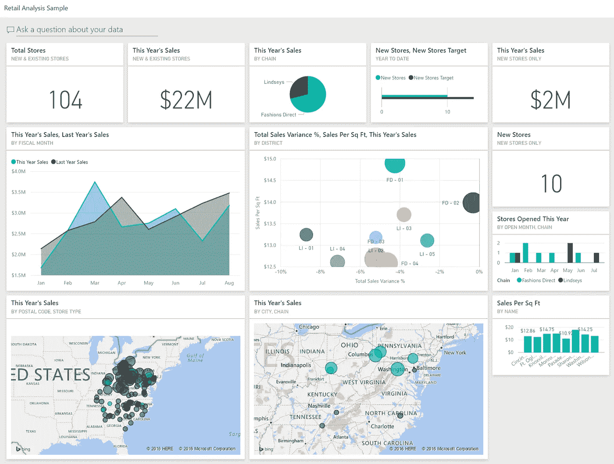

Microsoft Power BI 是一个数据可视化工具，允许其用户创建可视化、报告和仪表板。它是商业智能中最常用的数据可视化工具之一，在财富 500 强公司中占有很大的市场份额。为了迎接即将到来的工作机会，我完成了 Datacamp 的“Power BI 简介”课程，以更加熟悉它的工作原理。

# **简介:**

Power BI 有两种使用方式:桌面和服务。桌面是可以通过本地计算机访问的版本。它可以免费使用，并包括许多功能，如超级查询编辑器。服务是 Power BI 的云端版本。它主要用于共享和分发报告，因为它没有桌面版那么多功能。还有 Power BI Pro，这是一个付费版本，具有某些功能，例如与其他 Power BI 用户协作以及将工作发布到云平台的能力。课程中使用的版本是 Power BI Desktop。

打开 Power BI 后，您的数据集界面上有三个视图:报告、数据和模型。在报告视图中，您可以创建可视化效果和报告。在数据视图中，您可以看到用于报表的数据集。在 Model 视图上，您可以看到数据模型的不同表之间的关系。

PowerBI 中数据的每个不同视图

启动时，报告视图是默认视图。大块空白区域是画布，在这里你可以创建所有的可视化效果。在画布的右侧，我们有过滤器、可视化和字段的多个部分。过滤器允许您过滤可视化效果。可视化是您指定要制作的可视化类型的地方，例如条形图或圆环图。字段是可用于我们可视化的可用字段。我们可以使用表中的列或列中的计算字段。也可以将预先存在的报告与数据一起加载。

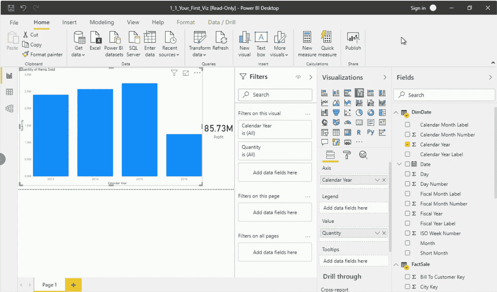

报告视图

Power BI 的一个关键特性是可视化的交互性。例如，假设我们想知道 2016 年的总利润。通过单击我们图表上的 2016 条，画布上的所有其他指标和数据都将根据此筛选器相应地发生变化。我们能够创建额外的切片器过滤器，例如特定的员工或位置，以根据我们的需要进一步过滤我们的数据。

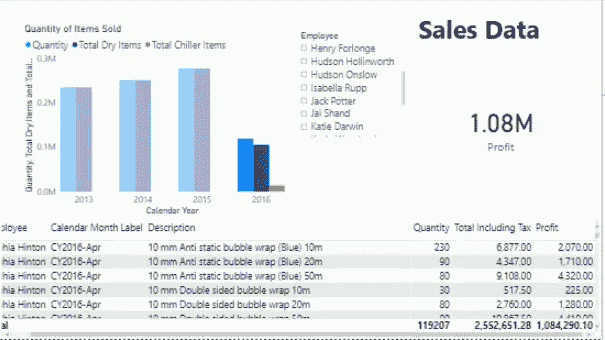

仅显示 Sophia Hinton in 2016 年销售数据的报表

Power BI 能够连接各种来源的数据，从 CSV 文件到网页，再到 SQL server 数据库。我们加载我们的数据，我们可以在数据视图中查看数据集。如果我们有相关的或者共享一个键的表，我们能够在模型视图中连接它们。

有时，我们试图导入的数据可能需要额外的关注。例如，我们可能不需要数据集中的每一列，或者多行中可能存在格式错误。为了清理我们的数据，我们将在使用 Power Query 编辑器加载之前转换我们的数据。

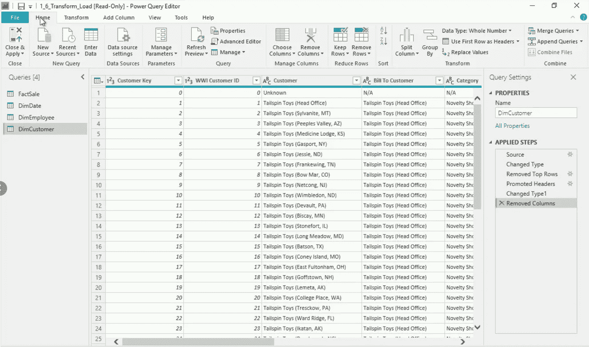

强大的查询编辑器允许我们正确地清理我们的数据。根据我们的情况，我们有许多数据清理操作可用。我们可以删除行或列，更改列的数据类型，以及替换值。任何熟悉 Excel 的人都可以立即认识到我们可以将数据转换为货币和日期等格式的方法。如果我们有像城市或国家这样的地理数据，我们可以指定它，允许我们创建地图可视化。此外，在 Applied Steps 窗格中有对跟踪的数据所做更改的历史记录，如果我们愿意，允许我们恢复到以前的步骤。为了完成我们的更改，我们选择“关闭并应用”。

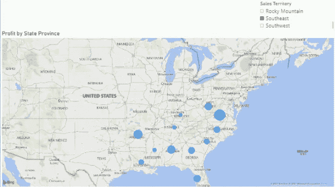

# **可视化:**

Power BI 提供了许多图表类型和可视化来满足您的需求。这些可视化效果是交互式的，允许您将鼠标悬停在上面查看更多细节。正如所料，您可以使用“标准”图表类型，如条形图、折线图和饼图。

还有一些非常适合显示绩效指标的视觉效果。卡片和多行卡片可用于一次显示一个或多个值。仪表和 KPI 图表最适合于显示与特定阈值或目标相关的绩效。我们还能够使用表格和矩阵来显示数据集的相关数据。

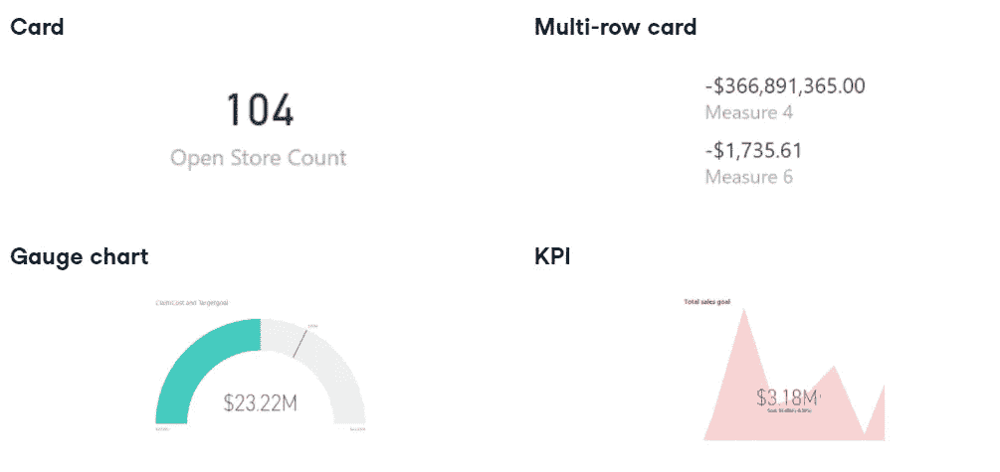

卡片、多行卡片、仪表图和 KPI 图的示例

当涉及到过滤或挖掘我们的数据以进行可视化时，Power BI 提供的工具使我们可以轻松做到这一点。“向下钻取”的意思是能够对数据有一个高层次的了解，并可以选择查看更具体的方面。这些被定义为层次结构。

本质上，你从金字塔的顶端开始，但是你有能力按照自己的意愿上下移动。常见的层次结构是日期的各个方面，从年到季度到月，或者位置，从地区到国家到城市。我们甚至可以创建自己的层次结构，并相应地重新排列字段，以匹配我们需要的层次结构。

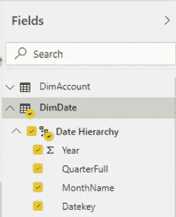

从年开始，到季度、月、日的层次结构

您可以选择一次钻取可视化中的所有字段，或者一次指定一个字段。假设我们有一个显示 2018 年至 2020 年销售额的条形图。通过一次钻取所有字段，我们将得到每个季度的四个条形。这四个条形代表每个季度的总销售额，例如第一季度 2018 年、2019 年和 2020 年的总销售额。如果我们只选择 2019 年，然后向下钻取，2019 年的每个季度将有四个条形。

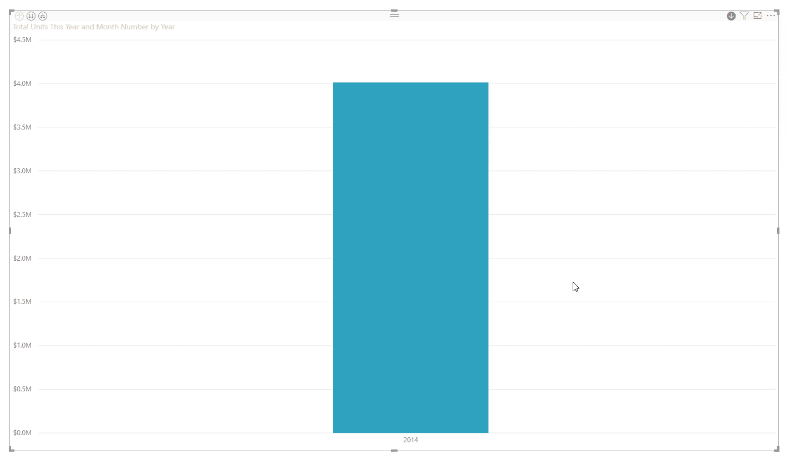

从年到季度到月的向下钻取示例。[来源](https://spreadsheeto.com/power-bi-hierarchy/)

Power BI 也给了我们过滤视觉化的能力。如果我们想只显示前 N 名，我们可以通过应用过滤器很容易地做到这一点。这可以通过可视化旁边的过滤器面板来实现。我们创建的任何过滤器都可以应用于所有页面或一个特定页面。

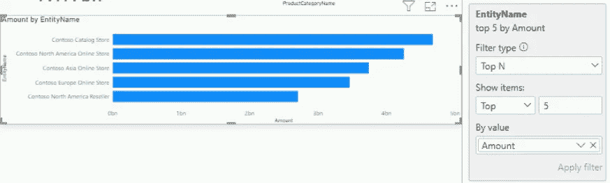

可视化过滤，仅显示销售额最高的 5 家商店

# **数据分析表达式(DAX):**

数据分析表达式或 DAX 用于对我们的数据执行计算和查询。我们将参数传入公式，以便生成计算列、度量或表格。例如，如果我们想找出一列中所有值的总和，我们调用 sum()函数并传入我们希望应用该函数的列。任何熟悉 Microsoft Excel 公式的人都会认出 DAX 使用的语法。

假设我们想在 DimCustomer 表中生成一个新列来表示临时密码。我们的临时密码将使用客户电话号码的最后四位数字和客户的出生年份来创建。为此，我们点击 New column 按钮，并为此编写适当的 DAX。我们首先声明新列的名称 TempPassword。使用 RIGHT()公式，我们可以从 Phone 和 BirthDate 列中提取最后的数字。

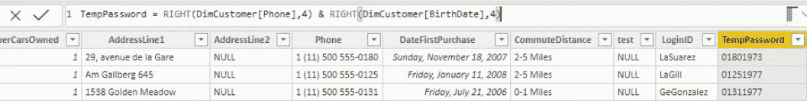

达克斯需要创建我们的临时密码

我们可以创建计算过的度量，用于我们的可视化。为此，我们点击 New measure 按钮，输入我们想要的 DAX 公式。该度量现在将出现在字段窗格中，我们现在可以将其用作可视化的一部分。使用其他测量来创建测量以防止冗余是很有用的。还有一个快速测量按钮，提供常用的测量，如年初至今的总数和每个类别的平均值。快速测量非常方便，因为它们提供了一种无需编写任何 DAX 就能进行复杂计算的方法。

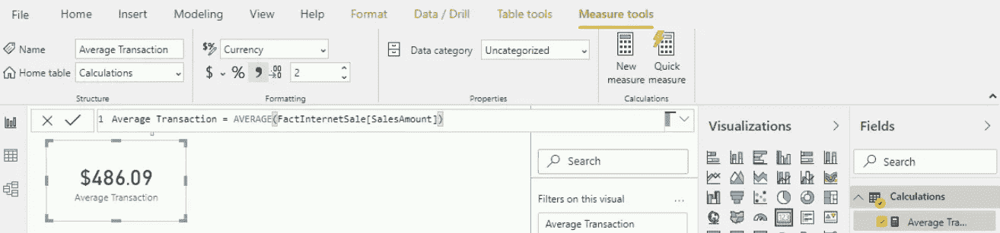

使用 Average 函数和 Sales Amount 列的名为 Average Transaction 的计算度量值

最常用的 DAX 函数之一是 CALCULATE()函数。它接受一个聚合函数和多个过滤器。这对于我们希望计算特定数据段的度量值的情况很方便，例如蓝色产品的总销售额。

使用 CALCULATE()比使用简单的切片器和过滤器更容易重写和重用。CALCULATE()在执行基于时间的计算和时间分析时也非常有用。如果我们想将今年的销售数字与去年的数字进行比较，我们可以使用 SAMEPERIODLASTYEAR 作为过滤器。

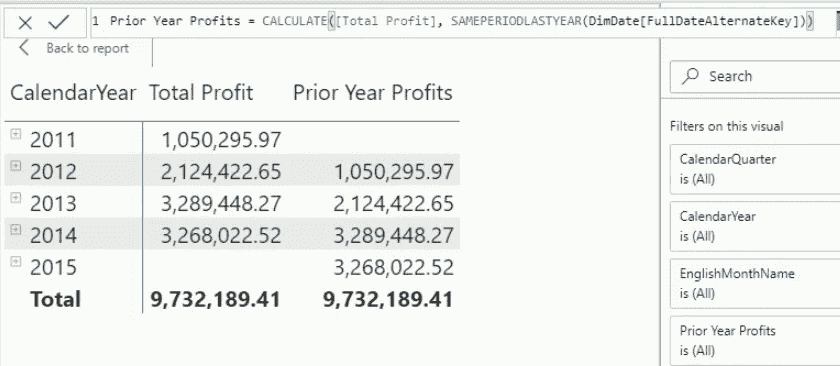

使用 CALCULATE()和 SAMEPERIODLASTYEAR 计算前一年的利润

课程结束时，我对 Power BI 的工作方式及其一些关键特性和功能充满信心。特别是 DAX，它是一个强大的特性，允许用户执行他们需要的任何计算。Power BI 给人的印象是一个可访问且功能强大的工具，这两个方面在开发商业智能工具时都很重要。我现在完全理解为什么它在商界如此普遍。希望我将来有机会使用 Power BI 并学到更多。感谢您的阅读！

**来源:**

https://learn.datacamp.com/courses/introduction-to-power-b 我

 [## Power BI 文档- Power BI

### Power BI 增强了您的洞察力和数据价值。借助 Power BI 文档，您可以获得专家信息…

docs.microsoft.com](https://docs.microsoft.com/en-us/power-bi/)