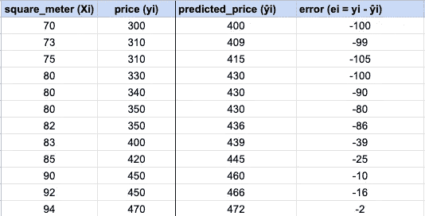
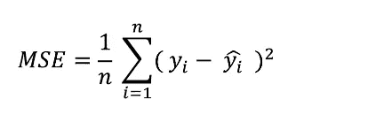
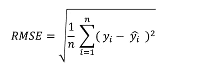
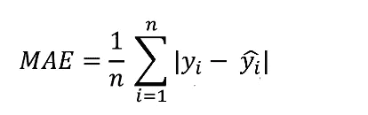
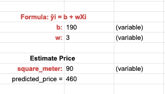
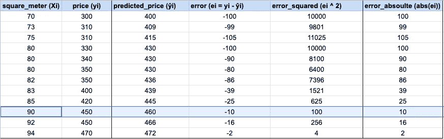

# 回归模型中模型评估方法介绍

> 原文：<https://medium.com/nerd-for-tech/introduction-to-model-evaluation-methods-in-regression-models-1b9c1c50f8a0?source=collection_archive---------5----------------------->

谷歌电子表格中的应用实例:线性回归和 MSE 介绍，缅因州 RMSE

在这个故事中，我们将指出什么是回归模型评估方法。我为这个话题准备了一个谷歌电子表格。您可以在下面访问它:

[](https://docs.google.com/spreadsheets/d/1lZkqnoci_uK0Yl_8y3KE7SiG1ecCks0lKNDMp2OwOl8/edit?usp=sharing) [## 回归模型中模型评估方法介绍

### Sheet1 平方米(ŷi),error)，价格(易)，预测价格(ei =易-2)

docs.google.com](https://docs.google.com/spreadsheets/d/1lZkqnoci_uK0Yl_8y3KE7SiG1ecCks0lKNDMp2OwOl8/edit?usp=sharing) 

评估方法是基于这个问题创建的:“我的预测有多成功？”


[斯科特·格雷厄姆](https://unsplash.com/@homajob?utm_source=unsplash&utm_medium=referral&utm_content=creditCopyText)在 [Unsplash](https://unsplash.com/s/photos/model-evaluation?utm_source=unsplash&utm_medium=referral&utm_content=creditCopyText) 上拍照

我们有 3 种评估回归模型的基本方法:

*   均方误差(mean square error)
*   均方根误差
*   平均绝对误差

# 回归模型介绍(线性回归)

如果因变量(目标变量)是连续的，我们需要使用回归模型。所以我们可以说，我们用回归模型来预测连续变量。大概你见过线性回归的公式:

```
y = b + w * Xi
```

我们的目标是最小化线性回归中的模型误差。我们需要找到最佳的`b`和`w`值，以获得最小的误差。但是我们如何计算误差或者误差是什么呢？

## 什么是错误？以及我们如何计算它

如上所述，使用`b`和`w`值进行线性回归估计。我们需要从实际值中减去预测值来计算误差。



作者图片

这样，我们就可以计算出前面提到的回归模型评价方法。

## 均方误差

我们需要合计所有的平方误差，来计算 MSE。然后，我们将它分成若干个观察值(y 的数量)。



图片由 [VBO](https://www.veribilimiokulu.com/)

## RMSE(均方根误差)

如果我们求 MSE 值的根，我们就得到了 RMSE。



图片由 [VBO](https://www.veribilimiokulu.com/)

## 平均绝对误差

它与 MSE 和 RMSE 有一点不同。我们从实际值计算负预测值的绝对值，而不是计算平方值。然后我们对绝对值求和，将和除以观测值的个数(值)。



图片由 [VBO](https://www.veribilimiokulu.com/)

这些评估值越低，我们的模型预测越成功。为了说明这一点，我为`b`设置了 190，为`w`设置了 3。模型会预测 90 平米 460。



作者图片

我们可以在 90 平米的原始数据上看到 450。



如前所述，在线性回归问题中，我们需要找到最佳的`b`和`w`值，使我们的 RMSE(或 MSE，或 MAE)最小。为此，我们可以使用梯度下降法，但这不是我们现在的主题。

# 最后

希望你喜欢。你可以在我为你准备的谷歌电子表格中玩评估方法。

[](https://docs.google.com/spreadsheets/d/1lZkqnoci_uK0Yl_8y3KE7SiG1ecCks0lKNDMp2OwOl8/edit?usp=sharing) [## 回归模型中模型评估方法介绍

### Sheet1 平方米(ŷi),error)，价格(易)，预测价格(ei =易-2)

docs.google.com](https://docs.google.com/spreadsheets/d/1lZkqnoci_uK0Yl_8y3KE7SiG1ecCks0lKNDMp2OwOl8/edit?usp=sharing) 

亲切的问候。