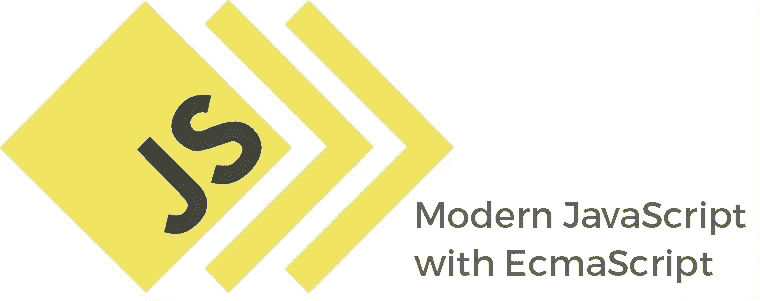
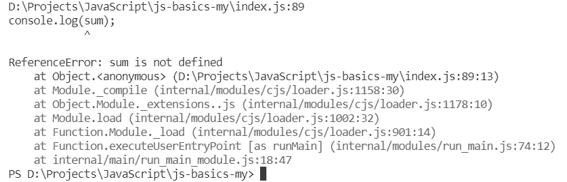
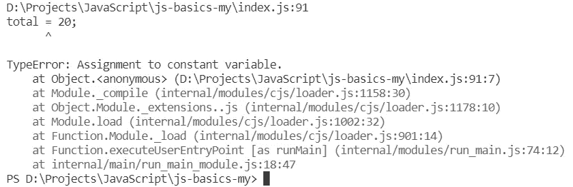
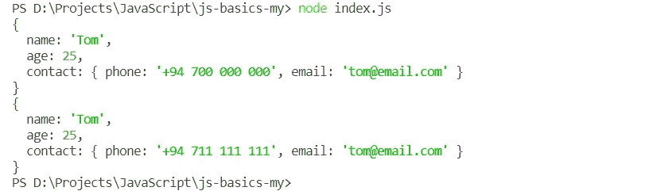
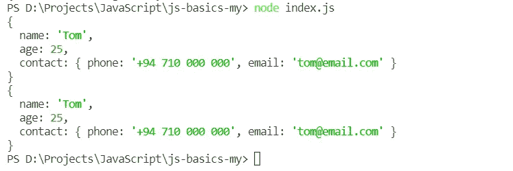
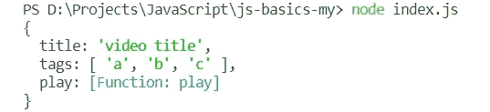
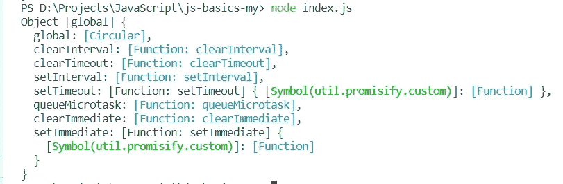
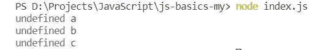
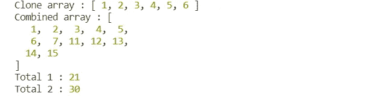

# 现代 JavaScript 简介

> 原文：<https://medium.com/nerd-for-tech/introduction-to-modern-javascript-7f50316a7e47?source=collection_archive---------21----------------------->



JavaScript 是世界上最流行的编程语言之一。它可以用于构建 web/移动应用程序、实时网络应用程序、命令行工具等。2015 年，ECMA 发布了名为 ECMAScript 6 (ES 6)的新版本。该规范为 JavaScript 定义了许多新特性。让我们看看这篇文章中的那些特性。

# 声明变量和常数

在 ES6 之前，`var`关键字用于声明任何种类的变量。但是这个关键词有很多问题。

*   不支持**块范围**变量。换句话说，用`var`关键字声明的变量在整个脚本中都是可见的。因此很难确保变量名不会与脚本重复。
*   它没有办法让一个**最终变量**或者**常量**。

相反，ES6 引入了两个名为 **let** 和 **const** 的独立关键字来管理这些困难。`let`关键字用于声明变量，它将在脚本中的特定范围/块内可见。

在这个例子中，我使用关键字`let`声明了两个变量。sum 变量仅在 calculateTotal 函数内部可见。元素变量仅在 for 循环中可见。这被称为块范围变量。如果有人试图从函数外部访问 sum 变量，它将抛出一个名为“ReferenceError”的错误。



引用错误的错误消息

ES6 引入的另一个关键词是`const`关键词。它用于声明在整个脚本中应该是不可变的常数。

因此我们得到了一个名为“TypeError”的错误。



TypeError 的错误消息

大多数开发人员在处理引用类型变量时会混淆`const`关键字。因为他们认为如果对象被声明为常量，它将是不可变的。实际上，这个变量保存的是内存地址而不是对象。所以，内存地址是不可变的。但这并不意味着您不能更改对象中的键值对。

这是一个完全正确的说法。


上述代码的输出

# 对象冻结()和密封()方法

在上面的例子中，你可以看到我们可以给对象添加其他属性，即使它被声明为常量。要克服它，可以使用 **freeze()** 和 **seal()** 方法。顾名思义，这两种方法都用于创建不可扩展的对象。

**冻结()方法—** 防止属性扩展和删除。如果是第一级值，它将冻结属性值。换句话说，它不能冻结内部物体。

在上面的例子中，我试图改变四个不同的属性。

1.  添加新属性—不可能
2.  移除属性—不可能
3.  更改属性—不可能
4.  更改内部对象属性—可能



上述代码的输出

**Seal()方法** —防止属性扩展和删除。但是它不能阻止属性值的变化。

输出，



上述代码的输出

# 箭头功能

数组函数是一种非常好的方法，可以更简洁地编写相同的函数。将回调函数作为方法参数传递非常有用。

您可以看到箭头函数去除了代码中的额外噪声。让我们看看普通函数到箭头函数的转换。

首先，我们可以把函数关键字的粗箭头替换掉(第一步:去掉函数关键字，在参数和代码块之间放一个粗箭头。).如果代码块只有一行，则不需要花括号。如果是 return 语句，return 关键字也被删除(步骤 2)。

如果函数只有一个参数，我们也可以去掉括号。

```
const printName = name => console.log('Hello, ' + name);
```

简单并不是这些箭头函数的唯一好处。让我们看看箭头函数的一些好处。

我们都知道常规函数中的`this`关键字引用的是**窗口对象**(浏览器中)或者**全局对象**(节点中)。但是如果我们在一个对象中使用`this`关键字，它引用当前对象。让我们用一个恰当的例子来解释它。

在对象的方法中调用此关键字。

输出，



你可以看到`this`关键字引用了当前对象。但在常规函数中是不同的。

输出，



你可以清楚地看到常规函数中的`this`关键字引用了全局对象。那么，会发生什么呢一个常规函数在一个对象的方法内部调用`this`关键字。

这里，我在第 10 行传递了一个常规函数作为回调函数。因此，`this.title`在这个常规函数中是未定义的。因为该函数将全局对象作为关键字`this`引用。



上述代码的输出

有几种方法可以克服这个问题。

```
let self = this;
```

首先，我们需要在 showTags 方法中定义 self 变量。那么我们可以用它来代替`this`关键字。很少有其他方式像`thisArg`论证、`bind(this)`方法等。但是这些都是解决这个问题的模式。在现代 JavaScript 中，箭头函数可以用来求解。因为箭头函数从包含函数继承了`this`。

输出，


上述代码的输出

所以，我想你通过使用箭头函数理解了程序的简单性。

# 现代 JavaScript 中的对象

在 ECMAScript 中，对象声明也有一些小的变化。但是简化代码真的很有用。让我们看看这些变化。

您可以看到 deliveryTime 变量在第 2 行被初始化。此外，我在第 8 行中为对象的一个键使用了相同的名称。所以，它没有通常的键值对。原因是如果我们使用相同的名字作为一个对象和另一个变量的键，它不需要显式地提到它。

如果对象有**动态属性**(键会随情况而变)，我们可以用方括号把变量名括起来。在本例中，第 9 行有一个名为 status 的属性。可以根据 prepareStatus、deliveryStatus 等情况进行更改。

# 模板文字

在 ES6 之前，**转义符**用于指定新行、单引号等。用这种方式创建自定义模板有点难看。模板文字用于克服这些困难。此外，它还在模板中引入了动态属性。

你可以看到第 1 行和第 7 到 13 行是一样的。但是第 7 到 13 行是文本的实际格式。所以，你可以很容易地理解模板的实际方式。我认为这将是非常好的功能，如果你用这样的模板工作。

# 班级

实际上，现代 JavaScript 更多地与面向对象的概念相关。如果你来自 Java。NET 背景，你已经熟悉了 OOP 的概念。尽管不尽相同，但仍有一些相似的行为。先看班级创建。

首先，您必须使用`class`关键字来定义类范围。然后在代码块中创建构造函数。如果你懂 Java，你就知道构造函数必须有类名。但是这里的构造函数是由关键字`constructor`创建的。

在这里，我创建了两个名为“Student”和“SemesterOneStudent”的类。此外，SemesterOneStudent 是从 Student 继承的。因此，studentDetails 方法在子类中被覆盖。如果您仔细阅读代码，您可以在第 38 到 40 行看到类似的代码，如方法覆盖。因此，您可以很容易地覆盖 JavaScript 中的方法。

输出，


上述代码的输出

# 扩散算子和剩余算子

spread 操作符是现代 JavaScript 中一个很酷的特性，可以从数组或对象中提取所有元素。这对于创建克隆、合并两个数组/对象等非常有用。如果一个函数有不同数量的参数，则使用 rest 运算符。让我们看一些例子来理解它。

输出，



正如你所看到的，这些操作符在处理数组和对象时非常有用。

# 承诺

众所周知，JavaScript 是一种异步编程语言。承诺用于处理这种异步行为。在现实世界中，承诺是一些可能以两种不同结果结束的陈述。时过境迁，承诺要么兑现，要么拒绝。但是完成其中一项需要时间。它将保持“挂起状态”,直到解决该问题。

*   **待定—** 之前的初始状态为“已履行”或“已拒绝”。
*   **完成—** 操作成功完成。
*   **拒绝—** 操作失败。

让我们通过一个恰当的例子来理解它。

HTTP 请求到达服务器并发回响应需要时间。所以，这个过程应该等到响应回来。因此，它被一个承诺所包裹(第 5 行到第 12 行)。接下来让我们看看如何使用**，catch，**和**最后是**方法。

如果任务成功解决，则调用`then`方法。如果没有，它调用`catch`方法。无论如何，这个过程要么完成，要么被拒绝。最后，这个`finally`方法被调用。这与 Java finally 关键字非常相似。

另一种方法是使用**异步函数**和 **await** 关键字。实际上，它是建立在承诺之上的，它只是语言中的语法糖，允许我们以同步模式编写异步代码。让我们看看它是如何发生的。

所以，我知道这不是对现代 JavaScript 特性的完整解释。希望这篇文章对开始学习这些很酷的功能有帮助。快乐学习！

# 参考

[](https://developer.mozilla.org/en-US/docs/Web/JavaScript) [## JavaScript | MDN

### JavaScript (JS)是一种轻量级、解释型或即时编译的编程语言，具有一流的…

developer.mozilla.org](https://developer.mozilla.org/en-US/docs/Web/JavaScript)