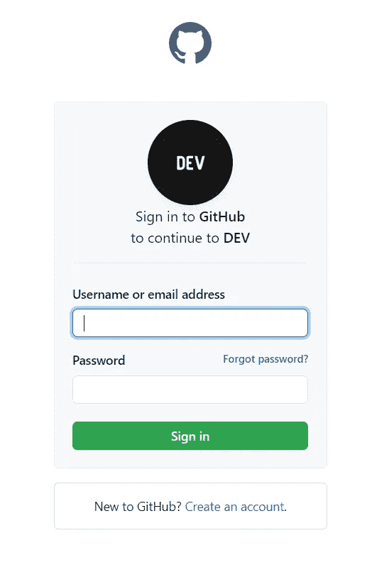
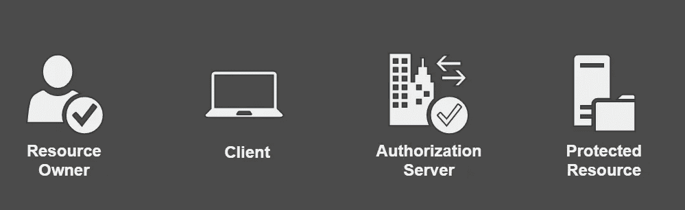
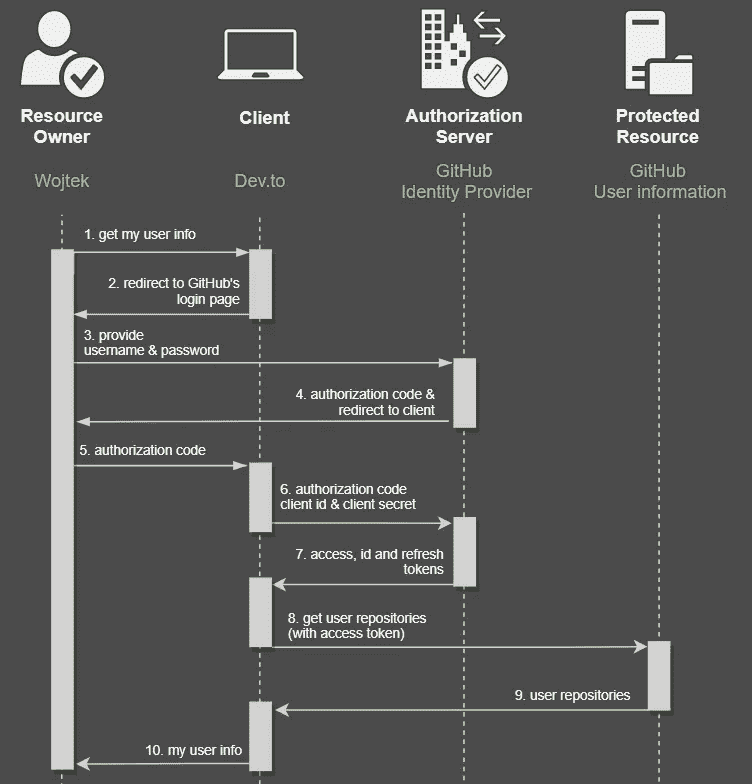
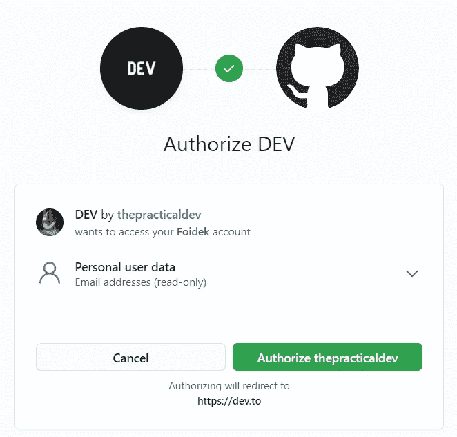
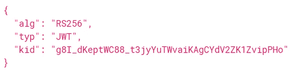
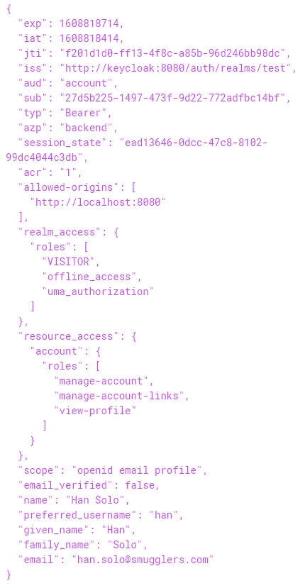
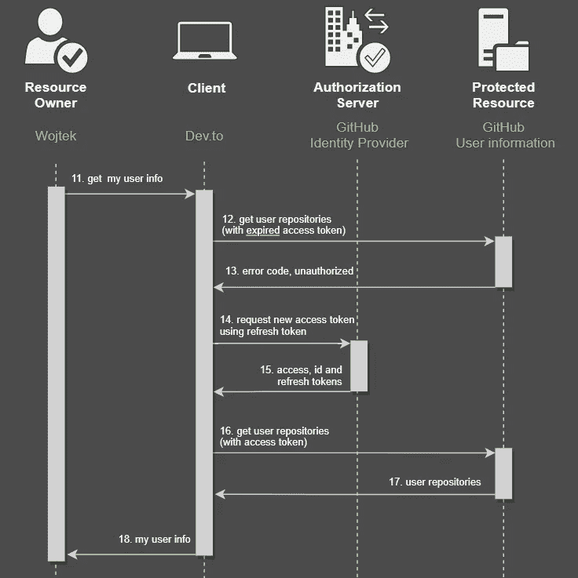
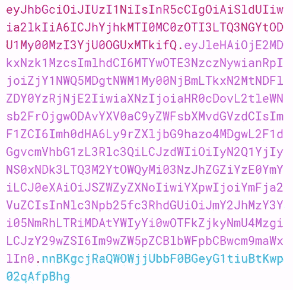
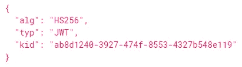
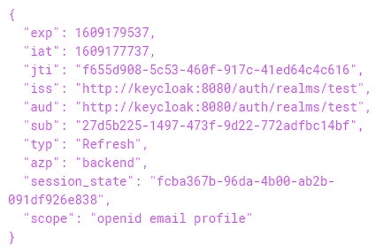

# OAuth 2.0 简介

> 原文：<https://medium.com/nerd-for-tech/introduction-to-oauth-2-0-7aa885a3db36?source=collection_archive---------1----------------------->

OAuth 2.0 是当今非常流行的授权框架。在这篇博文中，我试图解释它的工作原理和基本概念，因此在接下来的文章中，我将展示如何在全栈应用中实现它。


由[弗兰克](https://unsplash.com/@franckinjapan?utm_source=medium&utm_medium=referral)在 [Unsplash](https://unsplash.com?utm_source=medium&utm_medium=referral) 上拍摄

喜欢也好，讨厌也好。不管你对安全性有什么看法，它在任何应用程序中都扮演着重要的角色。作为开发人员，我们通常专注于带来用户想要的新特性，或者尝试新工具，而不是考虑安全性。但是不管我们的信念如何，将不安全的软件投入运营是非常不负责任的。

在软件工程中，安全有不同的方面，很明显，在一篇博客文章中，甚至在一个系列文章中，都不可能讲述关于它的一切。因此，我想特别关注一个话题——OAuth 2.0 协议(以及一点 OpenID Connect)。

本文开始了一个简短的实用系列，讲述如何使用 *OAuth 2.0* 授权协议在软件应用程序中实现安全性。首先，我将解释它是如何工作的(本文)。接下来，我将通过一个由三个部分组成的小项目来解释它(这将是接下来即将发布的博客文章的一部分):

*   [**Keycloak**](https://www.keycloak.org) ，开源身份和访问管理服务，在这里将定义用户和角色，
*   **后端应用** ( *Java，Spring Boot* )，将拥有受保护的资源(REST API 端点)，只有具有特定角色的用户才能使用这些资源，
*   **前端应用** ( *Angular* )，将消耗受保护的资源并负责授权用户。

# 将凭证传递给第三方应用程序

软件安全中的一个问题是如何确保*系统 A* 被允许连接到*系统 B* 。换句话说，如何确保软件应用程序被授权相互使用。在人机交流的情况下，这相当简单。用户进入一个网站/移动应用程序，在做任何事情之前，它会要求有效的凭据。

但是，如果我们希望在两个系统之间有类似的保护，会发生什么呢？为了说明这个问题，让我们假设我们想用 *GitHub* 帐户登录 [*Dev.to*](http://Dev.to) ？(现在这是可能的，但请记住，我不知道这种集成实际上是如何工作的，我只是用它来说明一种**可能的场景**)。

这个问题的一个解决方案是在 [*Dev.to*](http://Dev.to) 页面上提供您的 *GitHub* 凭证。然后 [*Dev.to*](http://Dev.to) 会将它们(可能被加密)传递给 *GitHub* 来检查它们是否有效。向其他系统显示它们安全吗？也许对于[*dev .*](http://Dev.to)来说情况并非如此，但是理论上一些不可信的方可以保存这些凭证，并在将来利用它们。

即使一个中间人应用程序是可信的，仍然有一些这样的软件需要存储用户凭证的用例。

例如，当一个 *GitHub* 用户会话到期时会发生什么？一种解决方案是再次要求用户提供凭证，但这不是很用户友好。另一种方法是将凭证存储在 [*Dev.to*](http://Dev.to) 站点上，并在需要时发送它们，这甚至更糟，这违反了安全性。

第二种情况是夜间工作。同样，这可能不是 [*开发到*](http://Dev.to) 的情况，但是有一些应用程序在没有用户交互的情况下在夜间执行一些批处理作业(例如处理大量数据)。如果该作业需要从其他系统获取一些受保护的数据，它将需要存储这些凭据，这同样不应该发生

如果我们现在看这些例子，我们会看到 [*Dev.to*](http://Dev.to) (客户端应用)在所有这些情况下都充当用户。它向 *GitHub* (资源所有者)请求一些数据，并提供真实的用户名和密码，所以从 *GitHub* 的角度来看 [*Dev.to*](http://Dev.to) 与人类没有什么不同。 [*Dev.to*](http://Dev.to) 是*冒充*她或他。

这是一种潜在的危险情况，特别是对于不受信任的客户端应用程序(当然，我现在不是在谈论 [*开发到*](http://Dev.to) )，因为他们可以通过您的凭证获得对资源做任何事情的权限。回到我们的例子，你可能不希望 [*Dev.to*](http://Dev.to) 能够删除你的库或者提交。您希望只授予他们有限的访问权限，希望只获得关于您的基本信息，并且可能有权访问您的存储库列表。

这也是创建 **OAuth** 协议的原因之一。

# OAuth 2.0 流程(从用户角度)

在跳到细节之前，让我们看看从用户的角度来看，OAuth 2.0 的流程通常是什么样子，因为我确信你会经历这个过程一两次。

回到一个关于 [*Dev.to*](http://Dev.to) 和 *GitHub* 的例子，假设我想在用户信息页面上查看我的存储库列表(目前 [*Dev.to*](http://Dev.to) 没有这个特性，但假设它有)。因此，我进入设置页面—[https://dev.to/settings](https://dev.to/settings)。结果是我没有登录，所以 [*Dev.to*](http://Dev.to) 将我重定向到登录页面。


在注册期间，我选择了一个 GitHub 选项，因此现在我也需要选择它。现在我被重定向到 *Github* 登录页面。



重要的是我现在在 GitHub 页面。当我在浏览器中查看一个网站的网址时，它不再是 [dev.to](http://dev.to) ，而是[github.com](http://github.com)。所以我可以确定我马上提供的凭证不会被[*dev .*](http://Dev.to)看到。

在提供我的用户名和密码后，我再次被重定向回 [*Dev.to*](http://Dev.to) 网站，在那里我可以做任何我想做的事情。

现在你可能会问:

> *这种魔法怎么可能？背景中还发生了什么。*

让我们深入研究一下，看看所描述的流动的全貌。

# OAuth 2.0 流程(授权许可，全图)

为了充分理解 OAuth 2.0 是如何工作的，我们首先需要介绍它的所有参与者(角色)。



*   **资源所有者** —通常是一个人，一个用户。她/他授予*客户端*对*受保护资源*的访问权。
*   **客户端** —这是一个代表资源所有者想要访问*受保护资源*的应用程序。这种客户端的一个示例可以是 web 浏览器、移动设备或其他第三方应用程序(在前面的示例中，它将是 [*开发到*](http://Dev.to) )。
*   **授权服务器** —负责验证用户的身份并授予访问令牌，即客户端访问*受保护资源*所需的凭证(稍后我会解释什么是令牌)。
*   **受保护的资源** —是一个客户端想要访问的应用程序(在前面的例子中是 *GitHub* )。它根据客户端提供的访问令牌对客户端进行授权。

我想，即使我简短地介绍了这些关键人物，你可能也没有完全理解他们的角色。不过没关系，我们继续解释它们是如何相互作用的，这样会更清楚。

让我们再次回到使用 [*Dev.to*](http://Dev.to) 和 *GitHub* 的例子。我想再次强调，我下面描述的并不是这两个应用程序之间的实际工作方式。这只是我的想象，希望能帮助你更好地理解一切是如何运作的。



让我们假设我是一个资源所有者，我想检查我的用户信息。因此，我进入设置页面—[https://dev.to/settings](https://dev.to/settings)(1)。因为我目前没有登录，它将我重定向到登录页面，我在那里选择了一个 *GitHub* 选项(2)。

我现在在 GitHub 页面。这里值得一提的是，在基本的 *GitHub* URL 中添加了新的参数:

*   `client_id` -这是一个客户端应用程序的标识，它告诉授权服务器(本例中为 *GitHub* )哪个应用程序将被授权访问，
*   `response_type` -表示授权类型(告诉授权我们希望如何获得访问令牌，更多信息将在整个流程中描述)，此处的值为`code`
*   `scope` -表示对受保护资源的一组权利(客户端将允许什么动作或资源做什么)，例如*读*、*写*等，在我们的示例中，它是`user,email,repo`，这意味着 [*开发者到*](http://Dev.to) 想要访问用户、电子邮件地址和存储库信息，
*   `state` -这是一个一次性凭证，通常是随机生成的纯文本，是将客户端的请求与授权服务器的响应相匹配所必需的
*   `redirect_uri` -成功登录后，授权服务器会将用户重定向到客户端应用程序提供的页面

这种 URL 的例子是:

```
[https://github.com/login?client_id=devto_id&response_type=code&scope=user,email,repo&state=sFf4sd&redirect_uri=https://dev.to](https://github.com/login?client_id=devto_id&response_type=code&scope=user,email,repo&state=sFf4sd&redirect_uri=https://dev.to)
```

提供我的用户名和密码(3)后，我再次被重定向回 [*开发到*](http://Dev.to) 网站(4 & 5)。但是这一次在我的浏览器对客户端服务器的请求中，有一个新的参数由 *GitHub* 添加到 URL，这是一个`code`。

`code`是客户端应用程序可以用来从授权服务器获取访问令牌的一次性凭证。

现在， [*Dev.to*](http://Dev.to) 具有来自资源所有者的`code`凭证，并且连同它自己的凭证(*client _ id*&*client _ secret*)一起，它可以向 *GitHub 的*授权服务器发出请求以获得访问令牌(6)。

结果，客户端应用程序获得了一个访问令牌(7)(有时还有身份和刷新令牌，我将在后面详细解释)，现在可以将它们添加到对 *GitHub* 的请求的`Authorization`头中，以获得我的电子邮件地址(8)。

最后 [*Dev.to*](http://Dev.to) 接收我的电子邮件地址(9)，结合他们数据库中的其他信息，向我发送完整的响应(10)。

就是这样！简而言之，这就是 OAuth 2.0 流在登录时的样子。

# 用户范围定义

在注册的情况下，所以当你想用 *GitHub* 凭证连接 [*Dev.to*](http://Dev.to) 时，这个过程中还有一个额外的步骤。

在 *GitHub* 页面提供用户凭证后，系统提示我确认 [*开发者授权*](http://Dev.to) 拥有我的用户信息。



在此屏幕上，我们可以定义在 *GitHub* 站点上，我们可以授予 [*Dev.to*](http://Dev.to) 对哪些资源的访问权限。上图清楚地表明，只有电子邮件地址(只读模式)将从那里，这是一个真实的情况。在我的例子中 [*Dev.to*](http://Dev.to) 也需要请求访问存储库列表。

在这一步中，我们可以定义我们希望授予客户端应用程序读取(或写入)什么`scope`，什么信息。这个决定完全取决于资源所有者，它让她/他控制她/他想要给客户端软件多少权力。

# 授权许可

上一节描述的叫做 [**授权代码流程(Grant)**](https://tools.ietf.org/html/rfc6749#section-4.1) ，是 *OAuth 2.0* 框架中定义的几个流程之一。它们中的每一个都描述了如何获得访问令牌(凭证),并且可能与上图中呈现的略有不同。除了上述流程外，还有:

*   [**资源所有者密码流**](https://tools.ietf.org/html/rfc6749#section-4.3) —不推荐，但可用于高度可信的客户端应用程序。其原因是，在这里，资源所有者凭证被提供给客户端，然后客户端将它们传递给授权服务器，这可能会导致安全桥，
*   [**隐式流**](https://tools.ietf.org/html/rfc6749#section-4.2) —最初它被设计用于在 web 浏览器(Angular、React、Vue 等)中运行的客户端。)在这种情况下，资源所有者的 web 浏览器接收到访问令牌，因此她/他需要将其存储在他们这边(例如，在浏览器的本地存储中)。目前不推荐这种方法，因为潜在的攻击者可以从用户的本地存储中窃取这种令牌。

所有这些都被视为不如*授权代码流*安全，但它在很大程度上取决于场景。以及如何挑选合适的？有几个地方描述过？例如在[auth0.com](https://auth0.com/docs/authorization/which-oauth-2-0-flow-should-i-use)上，通过回答简单的问题，你可以大致找到最合适的一个。在提到的页面上也有每个流程的描述，但是如果你还想知道更多，有一篇由川崎孝彦发表的关于媒体的文章

# 代币

# 访问令牌

另一件只提到但没有解释的事情是访问令牌本身。现在你知道它是某种明文形式的凭证。但是它看起来怎么样呢？

在 OAuth 2.0 规范中，没有关于这种令牌应该是什么样子指导，这使得这对于定制实现是开放的。

例如，它可能只是一个带有随机字符的简单字符串:

```
dsXf34x82Sgewr546sd24vac1
```

或者它可以更加结构化并受到密码保护。这种方法的主要优点是令牌可以保存一些有用的信息，而不仅仅是一个随机的文本。这种信息的一个例子是资源所有者的权限。其中最流行的，事实上也是一个标准，是 JWT 的 T7。

# JSON Web 令牌(JWT)

下面是一个 JWT 令牌的例子(来自一个项目，将在下一篇博文中描述):


尽管如此，它看起来像一个随机字符的文本。但是如果你靠近点看，你会发现它是由 3 部分组成的，由点分隔开。在上面的图片中，这些部分用不同的颜色标记——红色(标题)、紫色(有效载荷)和蓝色(签名)。

这些部分都是用 Base64 编码的 JSONs。这是因为令牌通常在 HTTP 报头中传输，在传输过程中可能会修改一些数据(例如不常用的字符)。这也使得 JSONs 更加紧凑，字符数量更少。但是要确定的是，这个令牌没有加密，所以任何人都可以用 Base64 解码器读取它！

现在，让我们继续解码 JWT 的每一部分，看看里面有什么。为此，我使用了一个网站 [https://jwt.io](https://jwt.io) 。

**表头**



它包含一些元数据，比如`alg`指定了使用了哪种类型的签名算法(我将在后面详细介绍)。

**有效载荷**



这是 JWT 的主菜。在解码一个有效载荷后，我们可以看到几个字段，其中包含关于用户的各种信息等等。他们被称为*索赔*。

一般来说，我们可以在这里放任何我们想要的东西(角色，组织限制等。)，但也有一些可以添加的推荐字段:

*   `iat`(发布时间)-告知何时生成令牌(Unix 纪元)，
*   `exp`(到期)-指定令牌到期的时间戳，
*   `iss`(发行者)——表示谁创建了令牌，通常是授权服务器的 URL，
*   `sub` (subject) -它告诉谁数据在有效载荷中，通常是资源所有者的标识，
*   `jti`(唯一标识符)-令牌的标识符。

**签名**

JWT 背后的基本概念是，任何人都应该能够读取令牌的内容，但只有*授权服务器*才能创建有效的令牌。因此，*受保护资源*应该以某种方式验证令牌是否正确。如果由于某种原因，它将被跳过，有可能是一个未经授权的客户端(或者更糟糕的是，一个恶意软件程序)创建一个虚拟令牌，并做一些奇怪的事情。

为了防止这种情况发生，第三部分被添加到 JWT，称为*签名*。只有用它我们才能确定一个令牌是正确的。

> 但是它是如何工作的呢？

有几种方法可以创建有效的签名，但是最常用的方法是将编码的 jwt 的头和负载与一个秘密和加密算法结合起来。基于这 4 个输入，可以创建唯一的签名。

```
Signature = Cryptography(Header + Payload + secret)
```

如果这个等式的任何部分被修改(例如有效载荷)，签名也将被改变。只有当你知道一个签名算法(信息在 JWT 的报头中提供)和一个秘密时，这才有可能。

取决于算法，这些秘密可以以不同的方式使用。

首先，生成签名的流行方法是使用对称密钥加密技术— ***HS256*** 。其中我们有一个在*授权服务器*(创建令牌)和*受保护资源*(验证签名)之间共享的秘密。它的主要缺点是，它的双方*授权服务器*和*受保护资源*需要具有相同的非公开秘密。如果它们是同一个应用程序或共享同一个数据库，这不是什么大问题，但是当我们将它们作为独立的实体并需要安全地从一个实体复制粘贴到另一个实体时，这可能会变得棘手。

另一种方法是使用非对称签名 ***RS256*** ，其中有一对公钥和私钥。*授权服务器*可以访问用于生成签名的私钥。另外*授权服务器*正在提供公钥，该公钥不能用于签署 JWT，但是可以被*受保护资源*用来验证签署的 JWT 是否正确。可以通过几种方式提供公钥，但通常是通过 HTTP 端点，因此各种应用程序都可以使用它。

# 刷新令牌

到目前为止，我已经介绍了 OAuth 2.0 的基本流程，即获取访问令牌。在关于 JWT 的部分，提到了代币有一个截止日期，这意味着在一定时间后，他们将不再有效。通常是在一小段时间后，比如几分钟。

为了防止客户端再次向资源所有者请求凭证，引入了一种新的令牌— ***刷新令牌*** 。

刷新令牌可被视为可用于获取访问令牌的凭证，但这一次它们不被分配给*资源所有者*，而是被分配给*客户端*，客户端可使用它来获取新的访问令牌。

重要的是，*刷新令牌*不是有效的*访问令牌*，不能从*客户端*发送到*受保护资源*。技术上可以，但是*受保护资源*应该拒绝它。

两种令牌之间另一个关键区别是它们的寿命。访问令牌通常在几分钟内有效，但是刷新令牌可以使用几个小时甚至几天。

下面是 OAuth 2.0 actors 之间如何使用刷新令牌的流程:



回到我们的例子，假设几分钟后我想再次在 [*Dev.to*](http://Dev.to) 上加载我的用户信息页面。因此，我加载了一个页面(11)，而 [*Dev.to*](http://Dev.to) 需要获取我的存储库信息，因此它使用了一个访问令牌，该令牌已经从前面的示例中获得，它再次向*受保护的资源* (12)发出请求。

*受保护的资源*然后检查令牌，发现它已经过期，因此它向客户端返回一个错误代码(13)。幸运的是，客户端已经存储了一个刷新令牌，它正在向*授权服务器* (14)发出一个新请求，在请求头中包含一个令牌。

结果，*授权服务器*返回新的访问和刷新令牌(15)(加上可能的身份令牌，这将在下一节中描述)，因此客户端能够向*受保护资源* (16)发出请求，并将最终结果返回给我(17，18)。

> *和*刷新令牌*是什么样子的？*

当然，这要视情况而定，但使用 JWT 格式是很常见的:



其可以被解码为报头:



和带有声明的有效载荷:



这里没有什么新的东西，是 access token 中没有的。唯一的区别在于算法，这里是 *HS256* ，这就足够了，因为这个令牌是由*授权服务器*发布和验证的，因此不需要在*受保护资源*之间共享私钥。

# 身份令牌

如果我们更仔细地研究 OAuth 2.0 规范，我们会发现它被设计为处理对受保护资源的授权访问，它*描述了用户/客户端可以做什么以及有权访问*(例如，读、写、删除)。它是非个人的，因为没有关于谁是用户的信息。只有什么动作可以做。而这叫做*授权*。

另一方面，有一个*认证*的概念，即*验证用户是否是她/他所声称的*。跟他们有什么权限没有关系。

回到我们之前使用 [*Dev.to*](http://Dev.to) 和 *GitHub* 的例子，假设我们的客户端 [*Dev.to*](http://Dev.to) 想要了解一些关于已经登录的用户的信息。假设有一个电子邮件地址和一个用户所在的位置。

我们可以像以前一样使用类似的方法，使用访问令牌并再次调用 *GitHub* 来获得我们想要的东西，但是还有另一种方法，即向令牌添加必要的信息。

但这是另一种没有在 *OAuth 2.0* 框架中描述的方式，由于前面提到的原因，它是一种授权框架，访问令牌的内容不应由客户端分析(在我们的情况下 [*Dev.to*](http://Dev.to) )。客户端的访问令牌只是一种胡言乱语，按照设计，它应该只由*受保护的资源*来分析。

为了克服这个限制，引入了一个新的框架——[OpenID Connect](https://openid.net/connect/)(OIDC)——它构建在 *OAuth 2.0* 之上。换句话说，OIDC 使用与 OAuth 2.0 相同的流程，并添加了一些新特性。

最重要的一点是，如果客户端请求获取访问令牌，它还会收到一个新令牌— *身份令牌* (ID 令牌)，其中包含用户信息。为了确保信息正确，身份令牌以 JWT 格式表示，其中有效负载与访问令牌非常相似。

值得一提的是，身份令牌被设计为仅供客户端应用程序使用，而不应该用于从*受保护资源*获取资源。

# 结论

我希望通过这篇文章，你能对 *OAuth 2.0* 有所了解。开始的时候，可能需要消化很多东西，但是绝对值得，因为它已经在很多项目中使用，并且被认为是一个好的实践。

如果你想看一个更实际的方法，一切是如何工作的，去看看我关于这个主题的其他博客帖子，我在其中展示了:

*   如何设置 Keycloak 实例(授权服务器)(快了)，
*   在 Spring Boot 应用程序中建立令牌验证(受保护资源)(即将推出)，
*   结合角度应用中的一切(很快)。

# 参考

 [## RFC 6749-OAuth 2.0 授权框架

### 互联网工程任务组。征求意见:6749 微软过时:5849 2012 年 10 月…

tools.ietf.org](https://tools.ietf.org/html/rfc6749)  [## RFC 7519 - JSON Web 令牌(JWT)

### 互联网工程任务组(IETF) M. Jones 请求评论:7519 微软类别:标准跟踪 J…

tools.ietf.org](https://tools.ietf.org/html/rfc7519)  [## RFC 7515 - JSON 网络签名(JWS)

### 互联网工程任务组(IETF) M. Jones 请求评论:7515 微软类别:标准跟踪 J…

tools.ietf.org](https://tools.ietf.org/html/rfc7515) [](https://www.manning.com/books/oauth-2-in-action) [## OAuth 2 在运行

### OAuth 2 in Action 从一个角度教你实际使用和部署这个基于 HTTP 的协议

www.manning.com](https://www.manning.com/books/oauth-2-in-action) [](https://arielweinberger.medium.com/json-web-token-jwt-the-only-explanation-youll-ever-need-cf53f0822f50) [## JSON Web Token (JWT) —您需要的唯一解释

### JSON Web 令牌正在改变世界。一劳永逸，

arielweinberger.medium.com](https://arielweinberger.medium.com/json-web-token-jwt-the-only-explanation-youll-ever-need-cf53f0822f50)