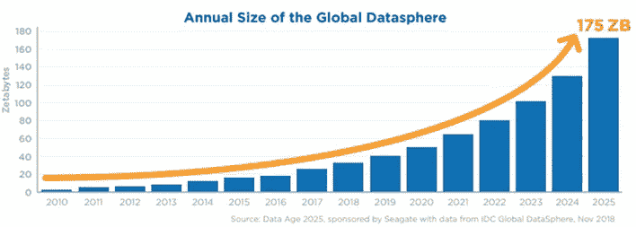
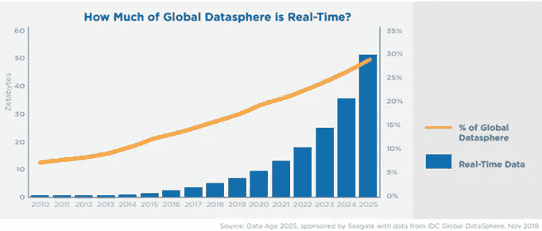
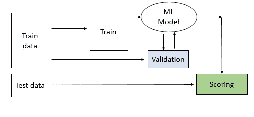
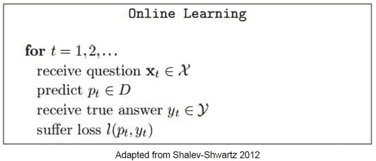

# 在线学习简介

> 原文：<https://medium.com/nerd-for-tech/introduction-to-online-learning-19c8d8a270d0?source=collection_archive---------15----------------------->

# 为什么要在线学习？

在我真正开始在线学习之前，我想谈谈数据。

近年来，D-A-T-A 这个四个字母的单词一直在推动着许多行业，事实上也推动着整个世界。数据生成量呈指数级增长。

根据 IDC ( [国际数据公司在其发布的白皮书](https://www.seagate.com/files/www-content/our-story/trends/files/idc-seagate-dataage-whitepaper.pdf)中的预测，到 2025 年，全球数据量预计将达到 175ZB。

那是 HUUUUUUGGGGEEEEEE！！！！！

该白皮书还提到，全球 30%的数据领域将是实时的。考虑到有限的存储设施，对我们来说即时分析所有数据将是一个巨大的挑战。

利用可用的传统批量学习技术，其中存储明确定义的训练数据，并且从中学习的模型是不够的。模型再训练需要很高的存储和计算能力。此外，特征、标签是静态的，因为我们不能在此过程中修改它们。

所以，向你展示**在线学习**范例，它可以接受数据流，一次学习一个观察结果。这对于将来的任何特征、标签修改也是灵活的。数据概率分布的任何变化都可以被处理。在线算法也非常适合生产阶段以外的学习，这使得设备能够适应个体客户的习惯和环境[ [1](/analytics-vidhya/incremental-online-learning-9868861db880) ]。

# 在线学习有什么不同？

离线(批量)学习模式的运作

在线学习模式的运作

在线学习算法

最初，假设模型(任何基本模型)进行观察并提供预测。那么实际的标签是已知的，并且损失被计算。这种损失有助于更新模型并从中学习。这比看起来的要简单…

嗯，为了进行初始预测，可以使用多种方法。下面提到的方法非常类似于 boosting 技术，其中弱学习者被顺序训练以获得更好的预测。

**方法:**

(a) [*使用随机加权多数算法从专家建议中学习*](https://cs.gmu.edu/~lifei/teaching/cs695_fall10/zhi_learning.pdf)*——这可以用一个简单的现实生活中的例子来很好地解释。假设我想投资股票，显然我想获得最大回报。由于我是这方面的新手，在选择正确的投资组合时，我更愿意听取一些专家的意见。*

*步骤 1:初始化权重 w1，.。。所有专家的比例为 1。*

*步骤 2:给定一组预测{x1，.。。，xn}通过专家，以概率 wi /W 输出 xi，其中 W = P i wi。*

*第三步:当收到正确答案时，通过将权重乘以β来惩罚每个出错的专家。转到步骤 2。*

*(b) [*使用 Winnow 算法从示例中学习*](https://cs.gmu.edu/~lifei/teaching/cs695_fall10/zhi_learning.pdf)——我们可以从各种示例中学习，而不是寻找一定数量的专家。*

*步骤 1:初始化权重 w1，.。。，wn 的变量设为 1。*

*步骤 2:给定一个例子 x = {x1，.。。，xn}，如果 w1x1 + w2x2 +，则输出 1。。。+ wnxn ≥ n，否则输出 0。*

*第三步:如果算法出错:*

1.  *如果算法在正例上预测为负，那么对于每个等于 1 的 xi，将 wi 的值加倍。*
2.  *如果算法在一个负样本上预测为正，那么对于每个等于 1 的 xi，将 wi 的值减半。转到步骤 2。*

*其他优化技术，如最著名的随机梯度下降，也可以用来学习时间。*

## ***优点:***

*(I)模型不需要从零开始训练*

*㈡内存需求没有增加*

*(iii)模型可适应“[概念漂移](https://en.wikipedia.org/wiki/Concept_drift#:~:text=In%20predictive%20analytics%20and%20machine,less%20accurate%20as%20time%20passes.)”并可扩展*

*(iv)如前所述，对特征和标签的修改是灵活的*

*㈤多模式和多任务学习*

*有了所有这些优势，这种**在线学习/增量学习**的技术可以用在许多场景中。*

## ***用例:***

*(I)时间序列预测:高频股票交易通常部署在线学习，因为交易不能等待传统的预定再培训。*

*(ii)垃圾邮件过滤:随着垃圾邮件发送者从基本的“中奖”发展到严重的工作和药物诈骗，我们需要一个与时俱进的模型来限制这些垃圾邮件。*

*推荐系统:这是在线学习最有效的应用之一。由于用户偏好随时间变化，该模型总是准备好提供用户特定的推荐。*

*(iv)广告投放:对于任何查询，我们都需要最相关和最新的广告。在这种情况下，模型从 CTR ( [点击率](https://support.google.com/google-ads/answer/2615875?hl=en))中学习，以提供最佳输出。得知谷歌使用类似的技术令人兴奋。*

*(v)物联网:我们不希望存储所有传感器数据，然后进行输出处理，相反，我们希望基于传感器数据做出即时响应，这就是我们使用在线学习的地方。*

## ***限制***

*众所周知，每枚硬币都有两面，在线学习也有一些限制。*

***- >稳定-塑性困境:***

**

*稳定性——可塑性难题*

*稳定性是从以前的学习中记忆的能力，可塑性是学习新概念的灵活性。在稳定性和可塑性之间取得正确的平衡是困难的。我们可以使用 PSI ( [群体稳定性指数](https://mwburke.github.io/data%20science/2018/04/29/population-stability-index.html))和 CSI ( [特征稳定性指数](https://towardsdatascience.com/psi-and-csi-top-2-model-monitoring-metrics-924a2540bed8))来监控模型漂移，以确定正确的平衡。*

***- >灾难性遗忘:***

**

*这种现象就像我们的在线学习模式得了老年痴呆症。在学习新信息时，该模型倾向于忘记先前学习的信息。这可以通过存储一些旧数据并用以前的数据随机训练模型来克服。整改是以牺牲记忆为代价的。*

***- >标签数据不可撤销:***

**

*在线学习模型在经历观察后进行初步预测，但只有在真实标签可用后才能学习。模型在此时间间隔内等待真标签，使其成为"*伪实时学习**

***- >少数库:***

**

*随着在线/增量学习领域研究的增长，目前只有少数几个图书馆可用。*

*一个这样的库使得增量学习变得容易，它就是 Creme。我应该为麦克斯·哈尔福德及其团队的贡献大声欢呼。*

*最后，我想引用 IDC 在其[出版物](https://www.seagate.com/files/www-content/our-story/trends/files/idc-seagate-dataage-whitepaper.pdf)中的一句话来结束我的发言。*

> *数据驱动的世界将永远是上的**，永远是**跟踪**，永远是**监控**，永远是**监听**，永远是**观察** - **，因为它将永远是学习**。***

*我要感谢所有的贡献者和作者，感谢他们为我提供了许多论文和博客来理解这些概念。请提供反馈，并帮助我改善内容。*

**参考文献:**

*[https://www . Seagate . com/files/www-content/our-story/trends/files/IDC-Seagate-data age-white paper . pdf](https://www.seagate.com/files/www-content/our-story/trends/files/idc-seagate-dataage-whitepaper.pdf)*

* [## 在线机器学习的简单介绍

### 在今天的应用中，人工智能经常被用作机器学习的同义词，通俗地说就是…

www.iunera.com](https://www.iunera.com/kraken/fabric/simple-introduction-to-online-learning-in-machine-learning/) 

[https://cs . gmu . edu/~李飞/teaching/cs 695 _ fall 10/zhi _ learning . pdf](https://cs.gmu.edu/~lifei/teaching/cs695_fall10/zhi_learning.pdf)

 [## 什么是在线机器学习？

### 让机器实时学习

medium.com](/value-stream-design/online-machine-learning-515556ff72c5)  [## 在线机器学习导论

### 在线机器学习中的基本概念和术语

medium.com](/analytics-vidhya/https-medium-com-dannybutvinik-online-machine-learning-842b1e999880)  [## 为什么持续学习是机器智能的关键

### 过去十年标志着我们如何看待和谈论人工智能的深刻变化。的概念

medium.com](/continual-ai/why-continuous-learning-is-the-key-towards-machine-intelligence-1851cb57c308)  [## 基于 creme 的流数据机器学习

### 在线机器学习可以改变你对生产中的数据科学的看法

towardsdatascience.com](https://towardsdatascience.com/machine-learning-for-streaming-data-with-creme-dacf5fb469df)*