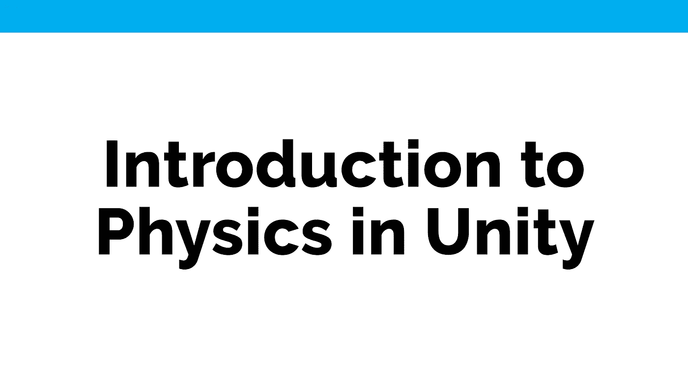
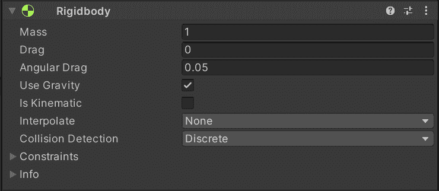
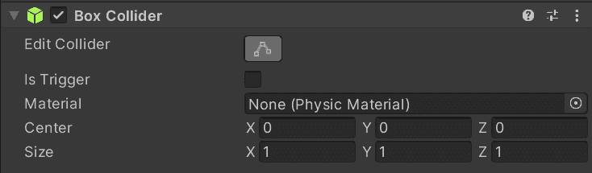
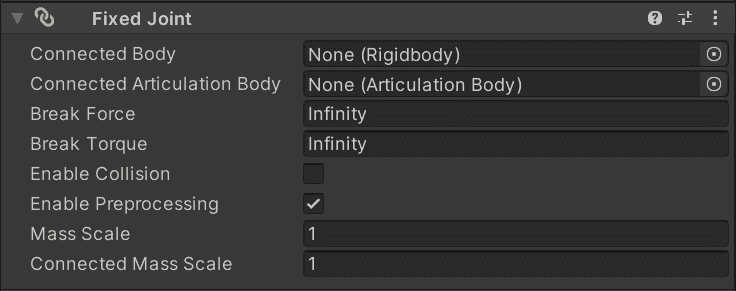
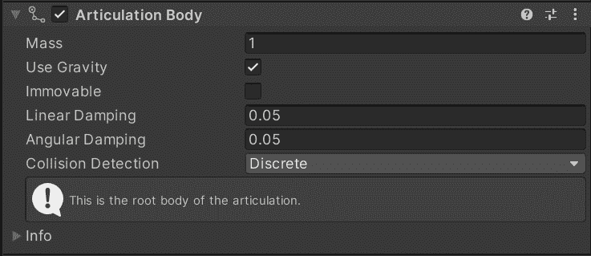
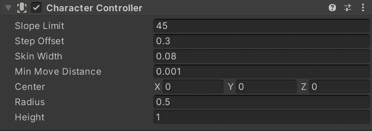
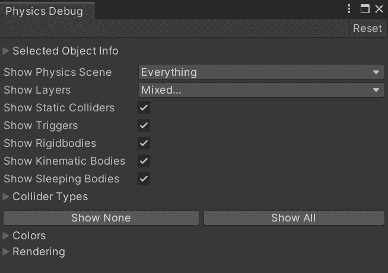
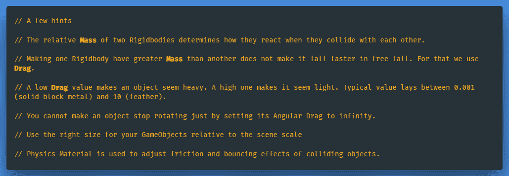

# Unity 中的物理学导论

> 原文：<https://medium.com/nerd-for-tech/introduction-to-physics-in-unity-8b3f9f467167?source=collection_archive---------10----------------------->

统一的物理学确保物体加速并对碰撞、重力和其他各种力做出反应。Unity 为我们提供了不同的**物理引擎**实现，我们可以根据我们的项目需求来使用它们。

Unity 将其物理引擎分为两类。

**-面向对象项目的内置物理引擎(2D/3D)。**

**-面向数据项目的物理引擎包(DOTS)。**

目前，我们只使用内置的 3D 物理，专用的 DOTS 物理包的用法将在以后的文章中介绍。

**内置 3D 物理引擎的几个重要概念，简单解释一下。**

**刚体**

启用游戏对象的物理行为。如果附加了碰撞器，它会用碰撞器与其他游戏对象进行交互。刚体也有一个脚本 API，可以让你对物体施加力，并以一种物理上真实的方式控制它。

因此，我们希望避免移动其变换属性，如位置和旋转。相反，你应该施加压力来推动游戏对象，让物理引擎来计算结果。不移动的刚体(可以在脚本中修改)会进入睡眠模式以提高性能。

然而，有时你不想让游戏对象的运动被物理引擎控制，然而我们需要使用刚体让游戏对象被某些触发器检测到。脚本产生的非物理运动称为 ***运动学*** 运动。

通过脚本施加力时，建议使用 *FixedUpdate()* 方法，而不是 *Update()* 方法。原因是物理更新是在测量的时间步骤中进行的，与帧更新不一致。 *FixedUpdate()* 在每次物理更新之前立即调用。

更多关于刚体的信息，点击[这里](https://docs.unity3d.com/Manual/RigidbodiesOverview.html)。

[刚体脚本 API](https://docs.unity3d.com/ScriptReference/Rigidbody.html) 。

**对撞机**

为物理碰撞定义游戏物体的形状。尽管它是不可见的，并且不需要与游戏对象的网格形状完全相同。使用碰撞器原语以获得最佳性能。

更多关于碰撞器的信息，点击[这里](https://docs.unity3d.com/Manual/CollidersOverview.html)。

[碰撞器脚本 API](https://docs.unity3d.com/ScriptReference/Collider.html) 。

**关节**

将一个刚体连接到另一个刚体或空间中的固定点。关节施加移动刚体的力，而关节限制限制该移动。

更多关节信息，点击[此处](https://docs.unity3d.com/Manual/Joints.html)。

[关节脚本 API](https://docs.unity3d.com/ScriptReference/Joint.html)

**物理发音**

关节体被组织在一个逻辑树中，其中每个父子关系反映了相互约束的相对运动。主要用于工业应用。一个例子是在游戏之外设置机器人手臂的功能。

更多关于物理发音的信息，点击[这里](https://docs.unity3d.com/Manual/physics-articulations.html)。

[物理发音脚本 API](https://docs.unity3d.com/ScriptReference/ArticulationBody.html)

**角色控制器**

通常用于控制游戏对象的运动，不受动量影响，但适用于基于碰撞的物理(第一或第三人称游戏)。通过使用角色控制器，您不会受到角色真实行为的限制。

有关角色控制器的更多信息，请单击此处的。

[角色控制器脚本 API](https://docs.unity3d.com/ScriptReference/CharacterController.html) 。

**连续碰撞检测(CCD)**

提供了一种基于**扫描的**和**推测的**方法来计算快速移动物体之间的碰撞。

有关连续碰撞检测的更多信息，请点击[此处](https://docs.unity3d.com/Manual/ContinuousCollisionDetection.html)。

[连续碰撞检测脚本 API](https://docs.unity3d.com/ScriptReference/CollisionDetectionMode.Continuous.html) 。

**多场景物理**

用于管理或处理复杂的物理环境。场景可以在运行时加载不同的物理属性，独立于主场景及其自身的物理属性。

更多信息，请点击[此处](https://docs.unity3d.com/Manual/physics-multi-scene.html)。

[多场景物理脚本 API](https://docs.unity3d.com/ScriptReference/PhysicsScene.html) 。

**物理调试**

为了帮助我们描绘常见的基于物理的场景，并快速检查场景中的对撞机几何图形，Unity 为我们提供了一个物理调试可视化工具。你可以自定义视觉设置，并指定你想看到或隐藏的游戏对象的类型。(**窗口** > **分析** > **物理** **调试器**)

如需了解更多信息，请点击此处的。

[通过物理剖析器](https://docs.unity3d.com/Manual/ProfilerPhysics.html)进行高级剖析。

关于 Unity 中的物理知识还有很多需要学习，这篇文章将为您提供对其核心概念的基本理解。随着时间的推移，我们将进一步仔细检查每个组件，因为我们的项目需要它们。

[***物理入门***](https://docs.unity3d.com/Manual/PhysicsHowTos.html)

[***3D 物理参考***](https://docs.unity3d.com/Manual/Physics3DReference.html)

← [上一张](https://gert-coppens.medium.com/instantiating-and-destroying-gameobjects-in-unity-faa544e37e2e) | [下一张](/nerd-for-tech/oncollisionenter-vs-ontriggerenter-when-to-use-them-37b08f3249a5) →