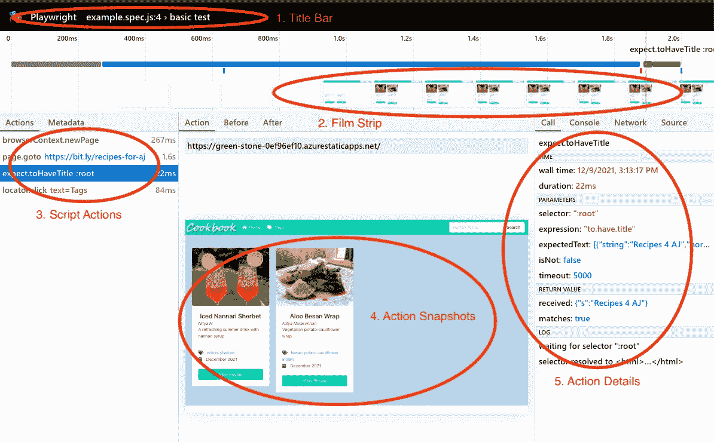
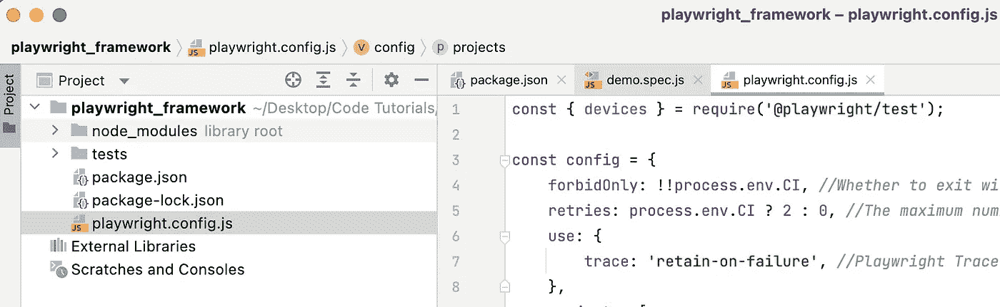
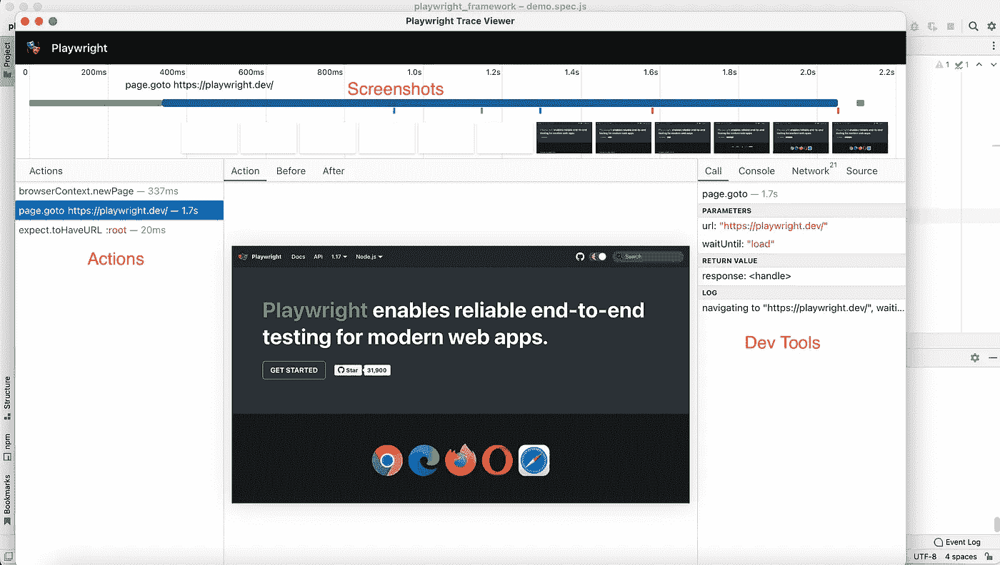
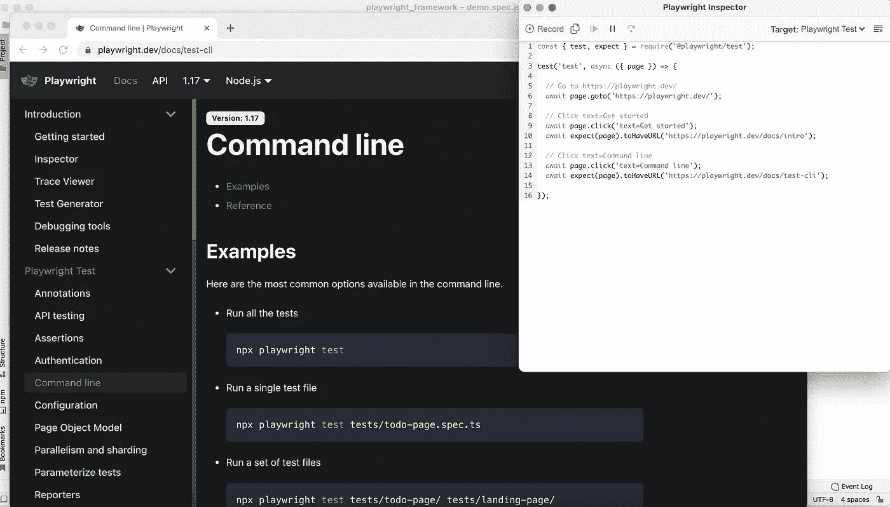

# 剧作家跟踪查看器和测试生成器简介

> 原文：<https://medium.com/nerd-for-tech/introduction-to-playwright-trace-viewer-test-generator-c08dcb83a752?source=collection_archive---------0----------------------->

# 什么是跟踪查看器

这是一个图形用户界面(GUI)工具，用于在脚本运行后分析捕获的剧作家痕迹。



# 记录痕迹[](https://playwright.dev/docs/trace-viewer#recording-a-trace)

在测试配置文件中，启用 trace:“on-first-retry”选项。这将为每个重试的测试生成一个 trace.zip 文件。



选择

*   `'off'` -不记录任何痕迹。
*   `'on'` -记录每次测试的轨迹。
*   `'retain-on-failure'`——为每个测试记录一个跟踪，但是从成功的测试运行中删除它。
*   `'on-first-retry'` -仅在第一次重试测试时记录轨迹。

# 查看痕迹[](https://playwright.dev/docs/trace-viewer#viewing-the-trace)

您可以使用剧作家 CLI 访问存储的跟踪:

```
// npx playwright show-trace <<path of trace.zip>>
npx playwright show-trace test-results/tests-demo-demo-feature-demo-test-chromium/trace.zip
```

您可以通过输入远程跟踪的 URL 来查看它们。它们可能是作为 CI 运行的一部分创建的，使得检查远程跟踪变得简单，而无需显式下载文件。

```
npx playwright show-trace https://example.com/trace.zip
```

# 行动

当您打开 trace 时，您会在左侧看到由剧作家执行的活动列表:

选择每个动作会显示:

*   动作快照，
*   动作日志，
*   源代码位置，
*   此操作的网络日志

在属性窗格中。您还将看到与每个动作相关联的渲染 DOM 快照。



# 截屏

在跟踪过程中启用屏幕截图选项时，每个跟踪记录一个屏幕截图，并以电影胶片的形式呈现。将光标悬停在电影胶片上可获得放大的图片。

# 快照

当使用快照选项进行跟踪时，剧作家为每个操作拍摄一系列完整的 DOM 快照。根据活动的种类，它将捕获:

之前:调用动作时的快照。

动作:输入执行时的快照。这种图像有助于确定剧作家点击了哪里。

After:动作后的快照。

# 什么是测试生成器

剧作家有能力直接构建开箱即用的测试。

# 创建测试

运行 codegen 并与浏览器交互。剧作家将为用户交互生成代码。codegen 将尝试构建持久的基于文本的选择。

```
npx playwright codegen [https://playwright.dev/](https://playwright.dev/)
```



您可以通过单击 record 按钮旁边的按钮来复制生成的代码。

# 模拟设备

当模仿一个设备时，你可以记录脚本和测试。

```
# Emulate iPhone 11.
npx playwright codegen --device="iPhone 11" [https://playwright.dev/](https://playwright.dev/)
```

# 模拟颜色方案和视口大小

脚本和测试也可以在模仿各种浏览器功能时被记录。

```
# Emulate screen size and color scheme.
npx playwright codegen --viewport-size=800,600 --color-scheme=dark [https://playwright.dev/](https://playwright.dev/)
```

# 模拟地理位置、语言和时区

```
# Emulate timezone, language & location
# Once page opens, click the "my location" button to see geolocation in action
npx playwright codegen --timezone="Europe/Rome" --geolocation="41.890221,12.492348" --lang="it-IT" maps.google.com
```