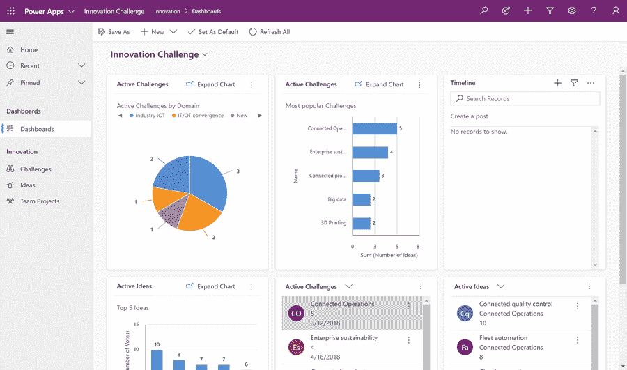

# 电源应用简介

> 原文：<https://medium.com/nerd-for-tech/introduction-to-power-apps-a96d4b2fa2ec?source=collection_archive---------28----------------------->

Power Apps 是微软在云计算领域的优质产品之一。这个概念允许专业人员开发高功能的应用程序，而不需要键入一行代码。

在这篇博文中，我们将看看什么是 Power Apps，以及如何使用它来构建大规模的应用。

**目录**

1.  什么是 Power Apps？
2.  为什么应该使用高级应用程序？
3.  电力应用的三个主要组成部分
4.  Power Apps 有哪些不同的使用方式？
5.  裁决

# 什么是 Power Apps？

Power Apps 是微软的解决方案，可以在不涉及大量编码的情况下构建业务密集型应用程序。这是一个特性，允许专业人员创建真正的和非常强大的应用程序，而不需要编写一行代码。

当所有其他应用程序停止执行时，Power 应用程序会继续前进。它允许非开发人员使用 Azure 函数创建和定制应用程序。借助可视化工具的强大功能，Power Apps 允许用户创建能够解决大大小小问题的应用程序。

总之，Power Apps 是一个平台和服务，允许你创建无代码或低代码的应用。

来源:微软

# 为什么应该使用高级应用程序？

因为它允许你不用任何代码就能创建应用程序，Power Apps 可以帮助你变得更快。您可以使用公共数据服务，以便组织中的每个人都可以共享相同的定义。您还会看到数以千计的业务实体，您可以将它们添加到您的应用程序中，使您的生活更加轻松。

我们生活在一个速度是所有企业的主要优势的时代。当企业使用强大的应用程序时，他们不再浪费时间在应用程序开发上。他们需要雇佣开发人员，创建定制的应用程序，这也会吞噬你的资源。大多数企业没有时间或资源来完成这项任务。

这正是像 Power Apps 这样的概念将帮助这些企业的地方。Power Apps 使专业人员无需任何代码即可创建高功能的应用程序。

想想企业可以通过 Power 应用程序节省的时间和金钱。

# 电力应用的三个主要组成部分

## 应用程序

Powerapps 允许您创建一个满足您所有专业需求的应用程序。这些应用程序不仅仅适用于一个平台。您可以在智能手机、台式机、笔记本电脑甚至平板电脑上创建应用程序。

你可以选择一个你需要的应用程序做什么的通用模板。该模板将包括应用的基本工作条件和公式。但是，您可以对其进行自定义，向其中添加您自己的函数和公式。

Power App Studio 是您根据个人需求打造应用的大本营。您可以选择更改数据的计算方式甚至显示方式。Power Apps Studio 中的拖放选项使每个人都能创建真正定制的应用程序。

如果你觉得有创造力或自信，你也可以从头开始创建一个应用程序。你可以对它的工作流程进行建模，并设计应用程序的界面如何呈现给用户。你可以设计一个功能完整的应用程序，而不需要输入一行代码。

## 数据连接器

创建应用程序时，需要一个或多个数据源。您的应用程序将从这些地方获取所需的数据进行处理。这些数据可能包括电话号码、电子邮件 ID、姓名、财务详细信息或属于客户的任何其他详细信息。

当您开始对应用程序建模时，您需要找到一个数据源来支持您的应用程序。该数据源可以是从 excel 表到您的 salesforce 帐户的任何内容。

假设您需要一个显示所有客户的姓名、电子邮件地址和联系电话的应用程序。所以您选择 excel 表作为您的主要数据源。使用连接器将该数据源连接到应用程序后，您需要重新排列客户数据。你必须将正确的字段指向正确的输入，这样你的应用程序才不会出现故障。

您还需要将 excel 表中的字段映射到应用程序中它们各自的字段。这允许专业人员使用相同的数据点创建多个应用程序。

## 微软流程

Microsoft Flow 是您的 Power 应用程序的基础。它是运行在屏幕后面的引擎，确保你的应用程序执行你创建的功能。应用程序为您提供了一种查看和编辑数据的方式，而 Flow 则告诉您的应用程序它需要做什么。

流允许您设置规则，当某个数据添加到应用程序时会发生什么，例如-

*   它应该在日历上添加一些东西吗？
*   它应该在一个松弛组中发送消息吗？
*   it 部门是否应该安排与新客户的会面？

您可以使用 Flow 设置类似这样的条件自动化。

但是你需要为每一台设备下载电力应用程序才能工作。您的所有应用程序将只从 Power Apps 应用程序运行。

# Power Apps 有哪些不同的使用方式？

专业人士使用 Power Apps 有三种不同的方式。让我们来详细了解一下它们。

## 网络和移动应用

当需要视觉效果来完成所需任务时，这些应用程序非常有用。您需要选择一个设计界面，并将其与数据源连接。完成后，您就可以直观地查看所有数据了。

## 模型/数据驱动的应用程序

当您不需要可视化界面时，可以使用这种类型的应用程序。你只需要一个应用程序来查看数据并为你提供信息。这种类型的应用程序都是关于创建一个简单的工作流，为您提供可消费的信息。

## 业务流程自动化应用

这个应用程序使用一系列条件将业务决策推到不同的地方。它定义了如何基于多个预定义的条件来处理业务决策。同样，这个应用程序不需要你有一个可视化的界面。它需要做的只是根据预定义的条件处理数据。

# 裁决

Power Apps 使商务专业人员能够使用无代码应用程序跟上世界的步伐。一旦他们创建了一个应用程序，就可以与所有团队成员甚至整个组织共享。

Microsoft Power Apps 旨在帮助企业在没有时间压力或大量资源的情况下创建应用。像您这样的专业人士现在可以设计重要的应用程序，而不需要寻找开发人员。

*原载于*[*https://www . partech . nl*](https://www.partech.nl/nl/publicaties/2021/04/introduction-to-power-apps)*。*