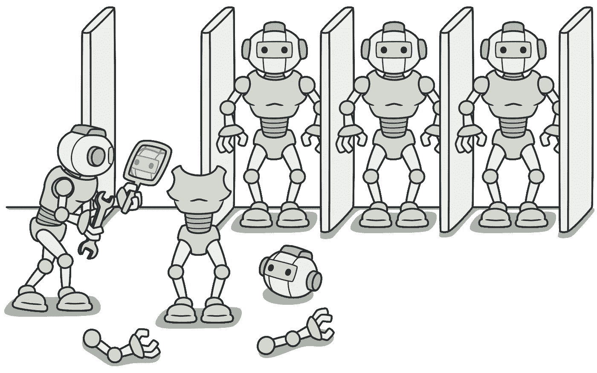
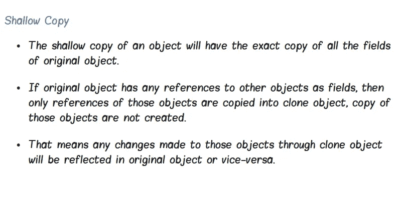
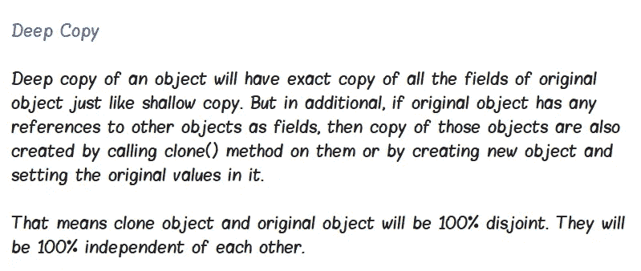
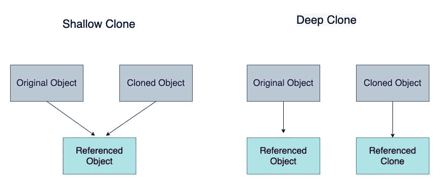
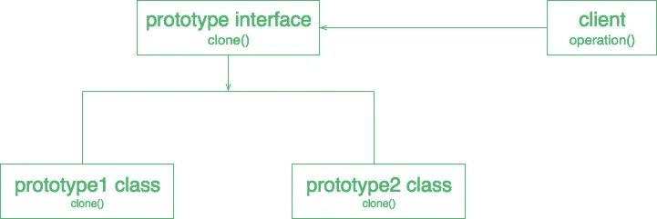
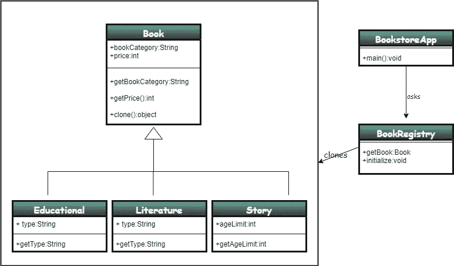
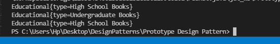
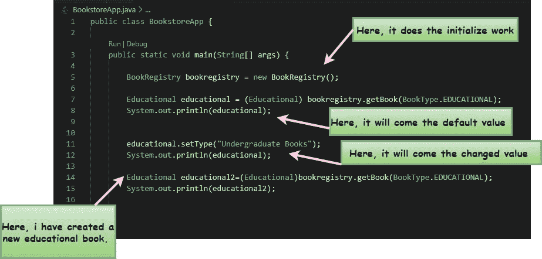

# 原型设计模式✨简介😎

> 原文：<https://medium.com/nerd-for-tech/introduction-to-prototype-design-pattern-39407a57550f?source=collection_archive---------10----------------------->

📍这个原型设计模式的整个定义可以表述为“避免创建”。

📍在某些情况下，创建一个对象会变得非常昂贵。所以这个**原型设计模式**鼓励克隆现有对象而不创建任何新对象。

📍原型设计模式属于创新设计模式。

例如，考虑下面的场景，

> **比方说你设计了一个系统租赁车辆申请系统。因此，在这个应用程序中，您可能需要在系统中显示许多车辆(近数百或数千辆)。这意味着你每次都需要创建车辆的实例。所以它不是很贵吗*🧐***
> 
> **没错，就是它！*😥***
> 
> 因此，这个原型模式鼓励的是，创建第一个实例并注册该实例。下一步，您只需从原始实例进行克隆，无需再次创建新实例。

作为另一个例子，考虑下面的用例，

> 考虑为一个购物系统创建一个购物车，你需要根据搜索结果显示商品。因此，通过使用这种原型设计模式，您可以克隆对象并构建购物车。

# ♨️重要提示

◼️:所以我们可以说原型设计模式避免了使用 **new** 关键字。

◼️:如果创建一个对象的过程非常昂贵，如果你有很多东西要做，那么这是最适合使用的设计模式。(因为使用这种设计模式可以避免对象创建过程中的许多性能问题)

◼️:通常，当我们需要克隆对象时，我们可以实现 cloneable 接口。(但是这个接口的一个主要缺点是它总是返回对象类型，并且不知道泛型)。

◼️:所以我们可以说，这种模式提供了一个过程，将原始对象复制到一个新对象，然后根据我们的要求改变它。为此，原型设计模式使用 java 克隆来复制对象。

## 📍最重要的是，由于下面提到的原因，你必须小心使用这个原型方法，⬇️

> *当你克隆的时候，你需要确保，你需要* ***浅层拷贝*** *或者* ***深层拷贝*** *在你的软件架构中。*

# 什么是浅层拷贝和深层拷贝🙄

✨浅抄。

当你进行浅层复制时，实际发生的是你只是在第一层对象中进行复制。(对对象的引用)

✨深层拷贝

*在这里，你进入并克隆每一个对象和新对象的值。*

## ❗️肤浅的模仿可能是危险的🥵为什么是❓

> 浅层拷贝有时会很危险，因为你得到了对象，这意味着你拷贝了一些对新对象的引用。因此，如果您对这些引用做了任何修改，可能会影响原始对象。

# 原型设计模式的结构

参赛:https://www.geeksforgeeks.org/prototype-design-pattern/

**🎲原型接口** —这是一个用于克隆自身的接口。通常，它是一个单一的克隆方法，但是如果我们需要，有时也可以声明一些其他的方法。

**🎲客户端**—这表示通过调用原型来克隆自身，从而创建一个新对象。

# 何时使用原型设计模式？

⚡️当创建一个对象的开销很大，而复制一个对象会更有效率的时候。

⚡️创建一个对象时非常耗时。

⚡️当您想对客户端隐藏创建新实例的复杂性时。

⚡️什么时候需要保持系统中的类数最小。

## 让我们把下面的场景作为一个现实世界的问题，同时借助这个原型设计模式来解决。

# 💥方案

> **假设您所在的城镇有一家书店，店主要求您构建一个系统来保存书店的详细信息。所以这里你需要把众多书籍的详细资料保存到系统中。那么这是否意味着你需要在每次** *🧐* 的时候创建书籍的实例
> 
> ***不！*** *🥳我们可以为这个场景使用原型设计模式。*

书籍类型:教育、故事、文学

书籍详细信息:书籍类别、类型、价格

所以在下图中，它显示了这个场景的 UML 表示:

现在让我们看看它的实现:

> ***✨Book 类***

下面是“Book”类的代码片段，它是一个抽象类。这里我们需要克隆这个类。因此这个类实现了一个可克隆的接口。

第 25 行- **super.clone()** 表示它转到超类克隆方法。

> ***✨Educational 类***

下面是“教育”类，这个类扩展了“书籍”类。(如下图)(“文学”类和“故事”类也将扩展“书”类，与此相同)

> ***✨BookRegistry 类***

下面是“BookRegistry”类。这是您创建对象的地方。(初始对象)。

如下所示，通常，我们只在创建初始对象时使用“new”关键字。

相应地，在上面代码的 initialize()方法中，我创建了教育、故事和文学作品。然后将它们分配到这个“BookRegistry”中。

> ***✨BookStoreApp 类***

下面是“BookStoreApp”类。它包含了 main 方法。

**输出:**

下图解释了在 main 方法中发生的事情。

点击下面的 GitHub 链接，查看书店场景的完整源代码

 [## irushinie/Krish-LP-培训

### 在 GitHub 上创建一个帐户，为 Irushinie/Krish-LP-Training 的发展做出贡献。

github.com](https://github.com/Irushinie/Krish-LP-Training/tree/main/PrototypeDesignPattern) 

# 原型设计模式的优势

⚡️它最大限度地减少了子类化的需要，降低了对象创建的成本。

⚡️它允许你在运行时删除或添加对象。(可以修改对象)

⚡️ It 通过减少昂贵的外部 API 调用来节省总运营成本。

⚡️提高了系统的性能。

⚡️对象创建可以在更短的时间内完成。

# 原型设计模式的缺点

⚡️:在深层拷贝和浅层拷贝之间很难做出选择。

⚡️管理克隆对象有时会很困难。

# 参考

原型设计模式— GeeksforGeeks”， *GeeksforGeeks* 。可用:[https://www . geeks forgeeks . org/prototype-design-pattern/#:~:text = The % 20 prototype % 20 pattern % 20 is % 20a，objects % 20 are % 20 clone()% 20 method。](https://www.geeksforgeeks.org/prototype-design-pattern/#:~:text=The%20prototype%20pattern%20is%20a,objects%20are%20clone()%20method.)

 [## 原型设计模式-Java point

### 原型模式说，克隆一个现有的对象，而不是创建一个新的，也可以根据需要定制…

www.javatpoint.com](https://www.javatpoint.com/prototype-design-pattern)