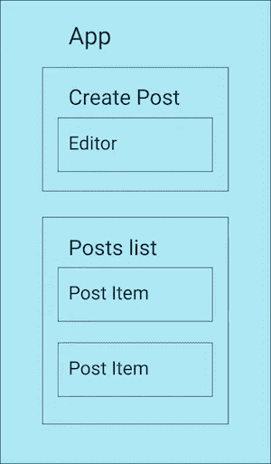
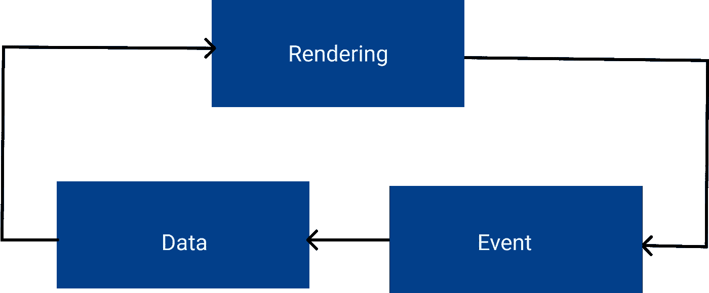
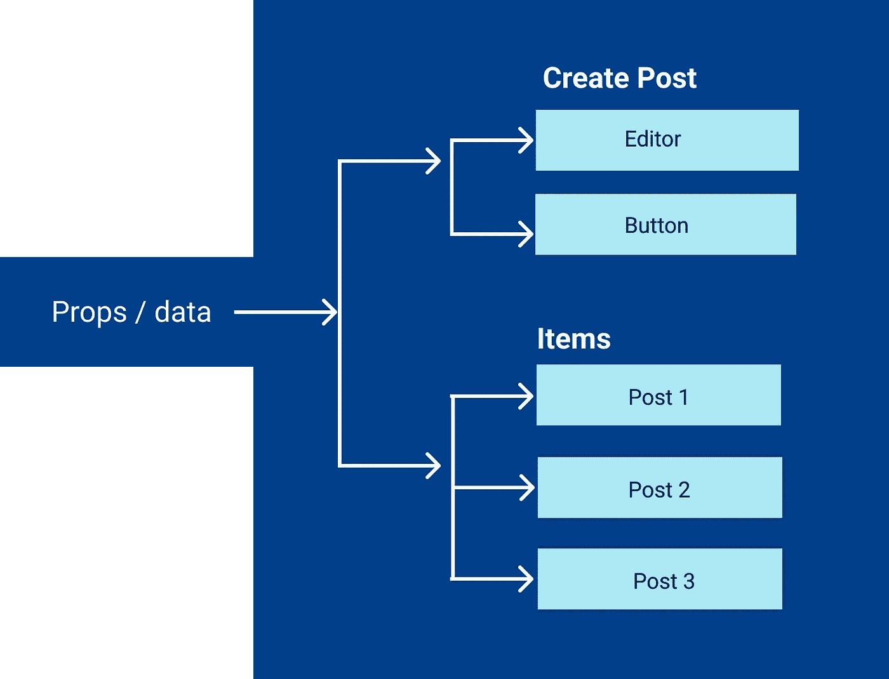
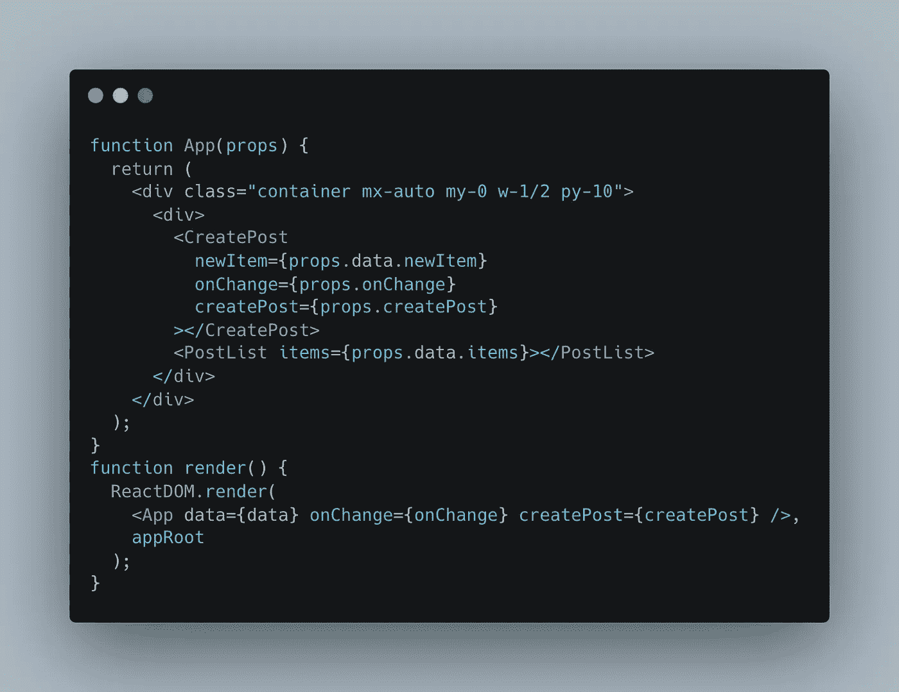
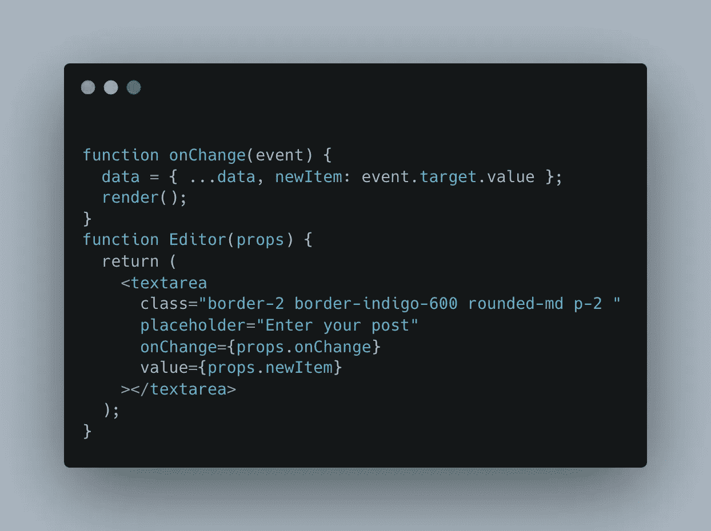
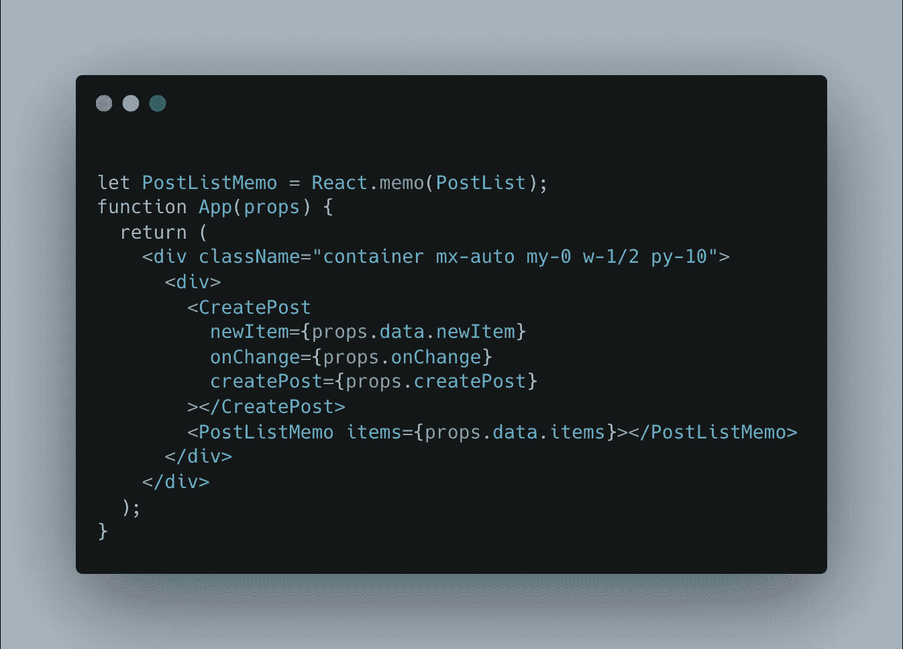
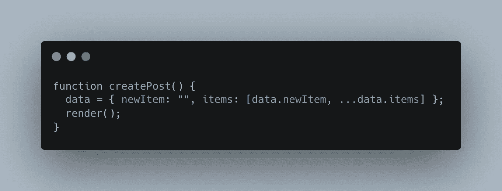

# 使用 React 库构建简单的组件

> 原文：<https://medium.com/nerd-for-tech/introduction-to-react-d8a871927ac?source=collection_archive---------6----------------------->

一个库是相关程序的集合，这些程序对于解决一个特定的目的是有用的。React 库的目的是以高效的方式呈现视图。

# 反应组分

React 组件是 react 应用程序的构建模块。下面的例子是关于创建文章，创建的文章显示在一个列表中。该功能被划分为 React 组件的构建块。React 组件可以包含其他 React 组件来形成树。

## 小道具

React 组件渲染依赖于道具(数据)。反应组件必须以一种能对道具作出反应的方式编码。下面一行是用 JSX 格式写的表达式。

> { props.showBlock？<block>:空</block>

Block 是一个反应组件。UI 中的块组件是基于 props.showBlock 值呈现的。props.showBlock true 表示组件，false 表示组件消失。

## 反应堆

ReactDOM 是 React 的一个包，用于在 DOM 中呈现 React 组件。

## React 中的单向工作流

视图是基于道具呈现的，当事件发生时，可以重新计算道具或数据。这有助于单向工作流。此工作流导致 react 中的可预测渲染。由于渲染是基于数据的，因此可以通过更改数据来更改视图。

单向反应流

# 帖子列表示例

> 创建文章会将新文章添加到项目列表中。项目列表按从最新到最早的顺序显示。

该示例具有以下 React 组件

# 应用程序组件

## 创建帖子

1.  编者ˌ编辑
2.  纽扣

## 发布项目

1.  项目

所有这些项目都组织在一个树状结构中，如下所示。数据是以道具的形式从父节点传递过来的。分离道具和组件并从根组件传递道具是很好的，这样我们可以使用道具控制应用程序中的所有渲染。

应用程序组件

## 事件

为了从父函数中捕获子函数中的事件，最好将函数引用作为道具传递给子函数。子组件在事件上调用这个函数。所以 *onChange* 和 *CreatePost* 是从根组件传递过来的。最好将所有数据保存在 React 树之外的一个地方。这个道具通过 ReactDOM.render 传递给 React Tree 进行渲染。

在应用程序中渲染

## 捕获输入事件

输入更改时，数据必须保存在我们在外部维护的数据中。我们将 onChange 函数作为应用程序的一部分传递并捕获它。捕获的输入被传递给编辑器，因为它需要用新数据重新呈现。

这里需要注意的一点是，当我们再次渲染时，所有的组件都会随着数据的改变而重新渲染。

输入变化

## React .备忘录

我们可以使用 *React.memo* 来避免不必要的渲染。这将有助于重新渲染一个组件，如果通过做浅层比较改变了属性。只有在遇到性能问题时才明智地使用 React.memo，以避免比较开销。

使用反应备忘录

## 点击添加项目

在 click 事件中，通过丢弃旧数据并用新项目重新创建数据，并再次进行渲染。

点击按钮时创建帖子

源代码

# 注意事项

1.  React 是一个库，通过将渲染抽象成 React 组件，将渲染解耦到 DOM 中。它只在需要时才呈现实际的 DOM。
2.  一个组件渲染在大多数时候应该依赖于道具
3.  通过 props 将函数引用从父节点传递到子节点以检测事件
4.  除非我们使用 React.memo 或类似的工作流，否则在根级别更改属性将会渲染所有组件
5.  除非有明显的性能问题，否则不要担心道具变化时的多次渲染