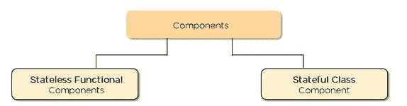

# react js 简介

> 原文：<https://medium.com/nerd-for-tech/introduction-to-react-js-116dd228b4a7?source=collection_archive---------18----------------------->

**什么是 react？**

React 是一个声明式的、高效的、灵活的 JavaScript 库，用于构建用户界面。它可以让你用称为“组件”的小而孤立的代码片段组成复杂的 ui。

它最初是由脸书创建并开源的。

# **React 是库，不是框架**

另一个需要理解的重要方面是，React 是
而不是一个框架
它是一个只专注于 UI 合成的 JavaScript 库
你将与其他 JavaScript 库
一起使用，例如 Node.js
这允许你自由地以你喜欢的任何方式构建
你的应用的其他部分，而不必承诺
一个完整的框架

## 为什么要反应？

React 今天的受欢迎程度已经超过了所有其他前端开发框架。原因如下:

*   **轻松创建动态应用程序:** React 使创建动态 web 应用程序变得更加容易，因为它需要更少的编码并提供更多的功能，这与 JavaScript 相反，JavaScript 的编码通常会很快变得复杂。
*   **性能提升:** React 使用虚拟 DOM，从而更快地创建 web 应用程序。虚拟 DOM 比较组件以前的状态，并只更新真实 DOM 中发生变化的项目，而不是像传统 web 应用程序那样再次更新所有组件。
*   **可重用组件:**组件是任何 React 应用的构建块，单个 app 通常由多个组件组成。这些组件有它们自己的逻辑和控件，它们可以在整个应用程序中重用，这反过来大大减少了应用程序的开发时间。
*   **单向数据流:** React 遵循单向数据流。这意味着在设计 React 应用程序时，开发人员通常会将子组件嵌套在父组件中。由于数据是单向流动的，因此调试错误和了解应用程序中问题发生的位置变得更加容易。
*   **学习曲线小:** React 很容易学习，因为它主要结合了基本的 HTML 和 JavaScript 概念以及一些有益的补充。尽管如此，与其他工具和框架一样，您必须花一些时间来正确理解 React 的库。
*   **它既可以用于 web 应用的开发，也可以用于移动应用的开发:**我们已经知道 React 用于 web 应用的开发，但它能做的还不止这些。有一个名为 React Native 的框架，源自 React 本身，非常受欢迎，用于创建漂亮的移动应用程序。因此，实际上，React 既可以用于制作 web 应用程序，也可以用于制作移动应用程序。
*   易于调试的专用工具:脸书发布了一个 Chrome 扩展，可以用来调试 React 应用。这使得调试 React web 应用程序的过程更快更容易。

# React 的缺点是什么？

# JSX

虽然 JSX 语法扩展使一些开发人员的工作变得更容易，但也有一些开发人员发现 JSX 是 React 的一个缺点。一些网站开发者和设计者发现 JSX 代码太复杂，难以掌握。

许多新开发人员发现 JSX 是掌握 ReactJS 的一个障碍。虽然这对一些开发人员来说可能是一个骗局，**重要的是注意到 JSX 也有它的好处，并且有助于保护代码免受注入**。

对 JSX 的主要抱怨是它的困难。 **JSX 不会对 ReactJS** 的性能或用户界面能力产生负面影响。这个骗局更像是一种偏好。

# 发展速度

ReactJS 是不断发展变化的。React 发展的速度可以被视为优势或劣势，这取决于你是谁。将这种开发爆炸视为一种优势的开发人员会说，React 正在不断改进，使他们的工作变得更容易。将开发速度视为劣势的开发人员会说，他们必须不断地重新学习如何使用 ReactJS，并且很难跟上。

ReactJS 的开发速度是一个常见的缺点，但应该注意的是**近年来 React 的核心 API 已经稳定了很多。今天的大多数更新影响了库和新特性**。一些开发人员不满意变化的速度，也不愿意尝试跟上新的发展。虽然您可能经常听说 React 开发得太快，但重要的是要注意新的开发改进了框架，并有助于使它在更高的水平上运行。

# 证明文件

这个缺点与人们对 React 开发速度的问题有关。**由于快速发展，教育文档和资源在涵盖最新更新和变化方面可能会很少**。

由于 ReactJS 是一个开源框架，开发人员能够创建他们自己的支持文档，但是由于任何人都可以创建这些资源，您可能会遇到几乎没有帮助的劣质资源。

同样，React 的缺点取决于你的环境和你如何看待创新和发展。**React 的发展如此之快，以至于有时适当的文档跟不上吗？是的。**然而，进步是一件积极的事情，尤其是在创建动态 web 和用户界面体验方面。对于您在使用 React 时可能遇到的许多问题，您可以找到用户创建的支持资源。

# ReactJS 的主要特点是什么？

# 虚拟 DOM

DOM(文档对象模型)操作对于现代的交互式 web 活动是必不可少的。Web 应用程序将它们的元素组织在 DOM 树中，组织这些树是为了帮助脚本访问网页的各种元素。传统的 DOM 操作需要在每次操作时重新呈现整个元素和 DOM 组件。**一个虚拟的 DOM 只是重新渲染被操作的实际组件**。ReactJS 使用虚拟 DOM 来提高内存和效率。

# **JSX**

JSX 是 ECMAScript 的类似 XML 的语法扩展。JSX 和 HTML 的语法相似，但在某些方面有所不同。例如，HTML `class`属性在 JSX 被称为`className`。要了解更多的差异和更深层次的知识，请查看脸书的 HTML 标签与 React 组件指南。

# 可重用组件

ReactJS 代码由多个组件组成。**每个 ReactJS 组件都有自己的控制和逻辑，这些控制和逻辑是组件**特有的。组件可以在代码的其他部分重用，甚至重新调整用途，以满足特定的需求并帮助维护代码的顺序，特别是在需要大量脚本的大型项目中。

# **在 React 中创建元素**

React.createElement()

React 库包含一个在 DOM 中绘制 HTML 元素的方法
但是，你可能永远都不需要调用它
JSX 让你能够用伪 HTML 语法编写元素

# **引导你的用户界面**

ReactDOM.render()

React 将把这些多个 React.createElement()
调用组装成一个组件树
，然后，在每次状态改变时，React 执行“树
协调”,检查每个
组件的状态，并查看是否有任何改变
。如果有任何改变，React 更新虚拟 DOM 的那部分
,并重新呈现元素

特殊函数 render()将期望接收作为用户界面的设计元素的
输入，一个 HTML 中的锚元素，其中应该绘制
对象是它的第二个参数
只能传递一个元素(或一个带有子元素的父元素)
，因为 Babel 会将这些
元素转换成函数

**例子**

```
ReactDOM.render(
<div>
<Button1 /><Button2 />
</div>,
document.getElementById(‘root’),
);
```

# 组件、状态和属性

# 成分

组件是任何 React 应用程序的构建块，一个应用程序通常由多个组件组成。组件本质上是用户界面的一部分。React 将 UI 分割成独立的、可重用的、可以单独处理的部分。

React 中有两种类型的组件:



反应组分

**功能组件:**这些组件没有自己的状态，只包含一个 render 方法，所以也被称为**无状态组件**。它们可以从其他组件获取数据作为道具(属性)。

```
class Greeting extends React.Component {render() {return <h1>Welcome to {this.props.name}</h1>;}}
```

# 状态

状态是一个内置的 React 对象，用于包含关于组件的数据或信息。组件的状态会随着时间而改变；无论何时改变，组件都会重新呈现。状态的变化可以作为对用户操作或系统生成事件的响应而发生，这些变化决定了组件的行为及其呈现方式。

```
class Greetings extends React.Component {state = {name: "World"};updateName() {this.setState({ name: "Simplilearn" });}render() {return(<div>{this.state.name}</div>)}}
```

# 小道具

道具是属性的简称。它是一个 React 内置对象，存储标签属性的值，工作方式类似于 HTML 属性。它提供了一种将数据从一个组件传递到其他组件的方式，就像在函数中传递参数一样。

# **提示**

**React** 基于 **Javascript** ，显然是面向对象的(但不完全类似于 Java、C++等语言，以及许多其他传统的面向对象语言)。

React 本身不强制任何面向对象的技术，但是 React 组件是完全可重用的。您可以创建通用组件，从非常简单的输入文本框和标签到可以多次重用的复杂组件。