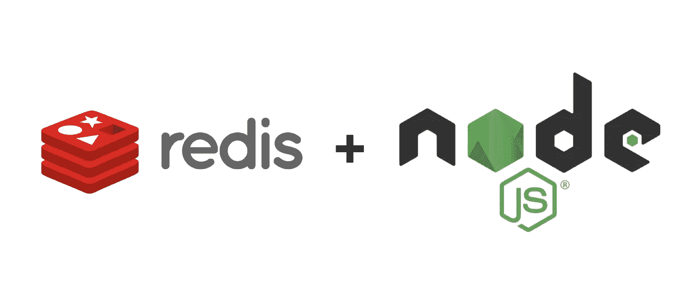
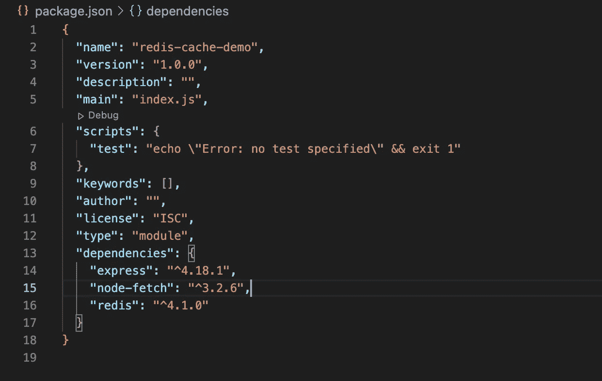
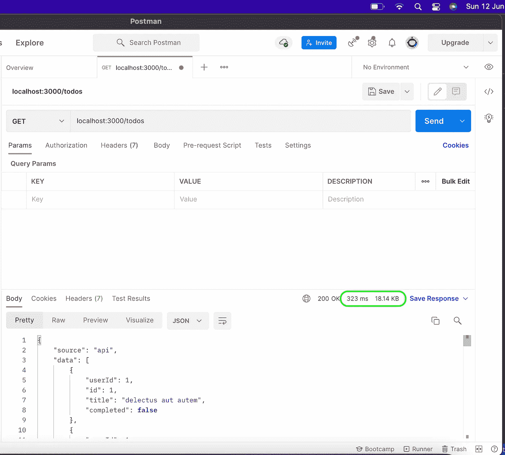
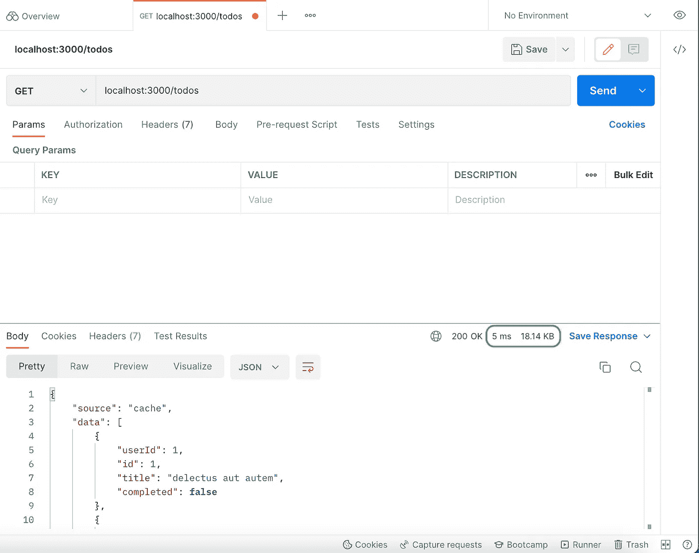

# 使用 NodeJS 的 Redis 缓存简介

> 原文：<https://medium.com/nerd-for-tech/introduction-to-redis-cache-using-nodejs-af9db495dbfd?source=collection_archive---------2----------------------->



大家好，今天我想向大家介绍缓存的基础知识，以及它如何帮助您提高应用程序的性能。

正如你从标题中可以猜到的，我们将使用 Redis 缓存作为 NodeJS 的缓存服务。

让我们先从缓存的基础开始，但在此之前，让我们先试着了解一下，什么是**缓存？**

在计算领域，缓存是一个**高速**数据存储层(硬件或软件),它存储数据的子集，通常是**瞬态**,以便将来对该数据的请求能够比访问数据的主存储位置更快地得到满足。*存储在高速缓存中的数据可能来自早期的计算或存储在其他地方的数据的副本。*

> 当请求的数据可以在缓存中找到时，发生缓存命中，而当不能找到时，发生缓存未命中。缓存可以处理的请求越多，系统执行的速度就越快**。**

既然您已经理解了高速缓存的概念，那么您将更容易理解什么是高速缓存——答案很简单**高速缓存** **是将数据存储到高速缓存**中的过程。

**现在我们来谈谈 Redis:-**

从官方文档来看( [redis.io](http://redis.io) )，redis 是一个开源的、**内存数据存储**。

它可以用作数据库、缓存、流引擎和消息代理。

**现在您已经了解了什么是缓存和 Redis，让我们构建一个使用 Redis 实现缓存的非常基本的项目。**

如果你在 MAC 上安装 user Homebrew 来安装并开始在 Redis 上使用

首先，确保你已经安装了自制软件。从终端运行:

```
% brew --version
```

如果该命令失败，您需要[按照自制软件安装说明](https://brew.sh/)进行操作。

**安装**

从终端运行:

```
% brew install redis
```

这将在您的系统上安装 Redis。

在前台启动和停止 Redis

要测试 Redis 安装，可以从命令行运行`redis-server`可执行文件:

```
% redis-server
```

如果成功，您将看到 Redis 的启动日志，Redis 将在前台运行。

要停止 Redis，请输入 Ctrl-C。

如果你遇到任何问题或者想在不同的操作系统上安装它，请点击此链接 [Redis 入门](https://redis.io/docs/getting-started/)

现在，让我们开始与 Redis 合作

*   创建新目录

```
% mkdir redis-cache-demo
```

*   导航到新目录

```
% cd redis-cache-demo
```

*   生成 package.json 文件

```
% npm init — force
```

**— force** 告诉 npm 在生成 package.json 时使用默认选项，这样就不会向您提出任何问题。

运行上面的命令后，您应该在 *redis-cache-demo* 目录中有一个 package.json 文件。

在目录中创建一个文件 server.js。

使用以下命令安装 Express、Redis 和节点获取 npm 模块

```
npm install — save node-fetch express redis
```

我们将按照较新的 es 规范导入模块，所以在 package.json 中添加下面一行代码(如果它还没有的话)。

```
“type”: “module”,
```

您的 package.json 现在应该是这样的



现在已经安装了 Redis，将下面的代码添加到 server.js 文件中。

现在，您可以从终端使用`node server.js`命令启动节点服务器了。

现在为了测试我们的基本实现，open postman 向 todos 端点发出一个请求。

第一个请求:-



第二次请求:-



记下上图中的时间。

第一个请求花了 323 毫秒，而第二个只花了 5 毫秒。

**结论:-**

> Redis 是一个非常强大的内存数据存储，我们可以在应用程序中使用它来提高性能。保存和获取数据非常简单，不需要太多开销。

附注:这篇文章是与 Redis 合作的。