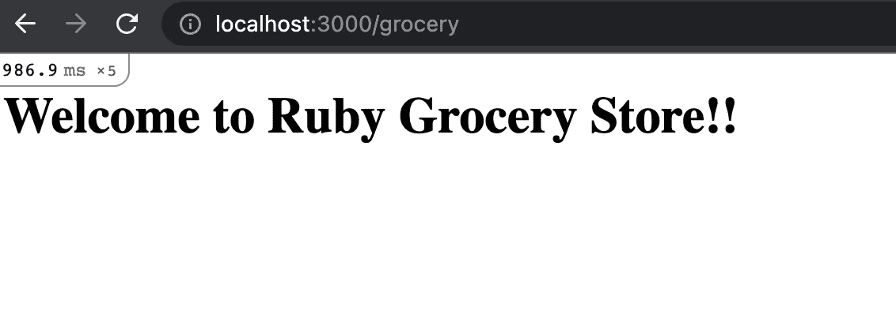
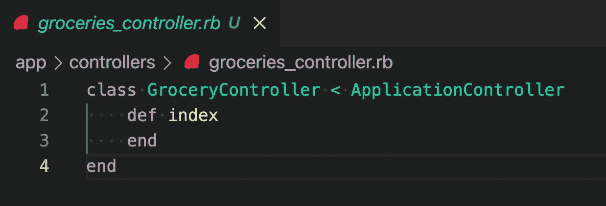
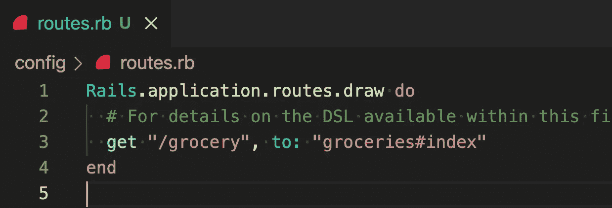
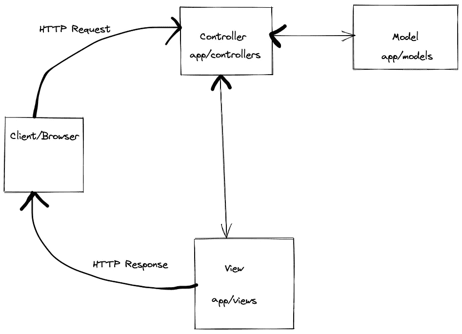

# 介绍 Ruby on Rails 以及 MVC 是如何工作的！！

> 原文：<https://medium.com/nerd-for-tech/introduction-to-ruby-on-rails-and-how-mvc-works-c56dff61dce5?source=collection_archive---------3----------------------->

[图像来源](https://www.pngaaa.com/detail/4122223)

作为一名开发人员，我经常从以前的项目中复制粘贴一些代码。我是一个懒惰的人，毫无疑问，但是复制粘贴是完全可以避免的。因为，它占用了我关注代码功能的时间。相反，我不得不花时间建立文件结构和一些项目语义。

感谢上帝，大卫·海涅迈尔·汉森 ，他在 2004 年创造了 Ruby on Rails。

是的，我知道我们可以模块化，这样我们就可以重复使用。但是，仍然有一部分仍然需要 ctrl+c ctrl+v。他们说细节决定成败。那些文件中有如此多的细节，这是魔鬼的真实表现。甚至不要让我从源于配置文件的问题开始。

无论如何，本文的目的是详细介绍 MVC 框架，使用 ruby on rails，以及它如何使我们的生活变得更容易。

> **行话预警:**
> 
> 当我提到客户端时，它是一个应用程序或浏览器，或者是你访问特定网页的任何地方。

## 现在，Ruby on Rails 到底是什么

Ruby on Rails 是一个**框架**，它处理应用程序之间常见的重复代码，并允许您专注于应用程序的其他功能。它为开发人员提供了构建 web 应用程序的工具。一些组件在所有的 ruby 应用中几乎是通用的。像路由、资产管理、数据库连接一样，可重用组件的列表还有很多！！

这个框架是一组 **Ruby 代码**库。因为整个代码库都是开源的，所以你可以回顾和贡献于这个框架，并理解它是如何工作的。但是它如此流行的主要原因是它是一个 **MVC 框架。**

## **什么是 MVC**

MVC 代表模型-视图-控制器。这个架构通过分离数据、业务逻辑和用户界面来帮助构建应用程序。你猜对了，它有三个组成部分:

**模型**:这个组件是我们进行所有数据管理、解析、获取，基本上是所有数据的地方。

**控制器**:它处理业务逻辑、从模型到视图的数据流，以及输入的用户请求。

**视图**:顾名思义，这个组件负责用户如何查看以及查看什么。

Ruby on Rails 使得实现这种架构更加容易。它通过加强应用程序的结构来提高开发人员的工作效率。即 Rails 将文件夹结构组织成文件和变量命名，设计者必须遵循。它是 MVC 框架的 iPhone。它让你毫不费力地做事情，但只能用它喜欢的方式。

它有几个好处:标准化的结构和程序约定，决策过程更容易，并允许代码中强大的抽象！！！

## MVC 架构

在前一节中，我们了解到 Ruby on Rails 遵循 MVC 架构。但是 MVC 架构到底是什么？MVC 代表模型-视图-控制器。

提高开发人员工作效率的一种方法是加强应用程序的结构。这意味着 Rails 将文件夹结构组织成文件和变量命名。
它有几个好处:由于其标准化的结构和程序约定，决策过程变得容易得多，并且允许代码中强大的抽象！！！

## MVC 架构

在前一节中，我们了解到 Ruby on Rails 遵循 MVC 架构。但是 MVC 架构到底是什么？ **MVC 代表模型-视图-控制器。**

Rails 遵循约定胜于配置的原则。为了设计一个基于 MVC 的应用程序，人们必须遵循这些惯例。这些约定有助于将开发人员的时间从文件夹结构、文件和变量命名、路由等决策中解放出来。作为一名设计师，你必须遵守规则，只能以某种方式做事。

但这为您赢得了时间，您可以用这些时间来构建更好的应用程序、添加更多功能或任何您喜欢的东西，因为您不再需要为设计做准备。你在设计。Rails 是按照配置之上的约定创建的，这也适用于 MVC 结构的建立。

杂货店示例

在这个例子中，

一个**app/models/杂货. rb** 是模型文件，它将包含:验证、数据库和任何定制逻辑。

一个**应用程序/控制器/杂货 _ 控制器. rb** 将包含 CRUD 方法来管理杂货行为的数据流。

一个**应用程序/视图/杂货**将包含用户将要访问的每个页面的相应视图。在我们的示例中，它是**index.html。**

这里需要记住的重要一点是，每一层都是独立的。

## 模型

模型文件是一个 Ruby 类。它有一个相应的数据库表，并将从 ActiveRecod::Base 继承。这意味着它可以访问 Ruby 库中的几个方法，这些方法将有助于处理数据库。例如创建出于安全原因控制器或视图不应该知道的方法和数据属性。

## 控制器

在示例中，资源是**/杂货。**routes 文件中定义的每条路由必须在控制器中有相应的方法/功能。

当请求到来时，Rails 使用路由文件来决定运行哪个控制器方法。一旦它解释了请求，指定的路由控制器方法将运行。

控制器

**控制器动作** : ` *杂货#索引`*指示器告诉轨道路由系统控制通过“GroceryController”索引动作。

此外，大多数业务逻辑是控制器的一部分。这意味着任何超出范围的数据验证、定制逻辑和扩展类都要写入控制器文件。当控制器方法运行时，它从模型中访问数据属性，并将其转发到正确的视图。

## 视角

视图层应该包含 MVC 架构中最少的逻辑。视图的作用是呈现从控制器接收的数据。控制器还可以传递关于如何呈现数据的信息。例如，您将获得给定杂货店的单位价格。但是我们可以根据用户的全局度量偏好显示每克或每磅的成本。控制器还可以请求禁用或强制/可选某些字段。此外，所有的创造性工作都发生在这里，无论输入应该是下拉菜单还是单选按钮。哪种格式可以增强用户体验。这些是视图组件工作的一些例子。

现在我们已经了解了 MVC 架构中的每一层。让我们把这些点连起来！！！

## MVC 中的请求/响应流

手动音量调节

*   客户端向 web 服务器发送请求。
*   web 服务器接受来自控制器组件的请求。
*   然后对请求进行评估，并适当地转发到它的路由(`/杂货店`)。路由解释请求并使用控制器方法进行映射。
*   然后，控制器使用该模型从数据库中访问数据。然后，它根据任何业务逻辑需求操纵数据。
*   在验证之后，它安排数据供视图理解。
*   现在它被发送到视图进行渲染(index.html)。
*   一旦接收到数据，视图就创建一个相应的响应并发送回 web 服务器。
*   这个 HTTP 响应和 JSON 数据一起返回到客户机。

## 结论

MVC 架构是一个需要理解的重要概念，因为大多数 web 应用程序都是基于这个架构构建的。在这种架构中，每一层都是相互独立的。因此，很容易修改一部分而不影响另一部分。总的来说，开发过程更快，因为每一层可以并行和独立地工作。这种架构也有助于开发人员更快地调试！
你也可以参考 [Rails 文档](https://guides.rubyonrails.org/getting_started.html)了解更多详细信息。

*快乐编码！！！*