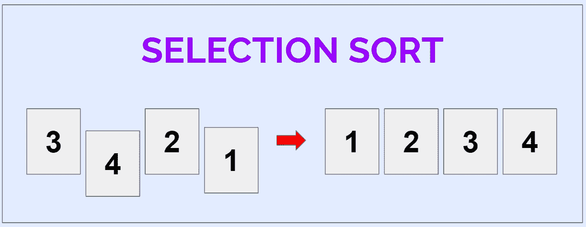

# 选择排序简介

> 原文：<https://medium.com/nerd-for-tech/introduction-to-selection-sort-19de8e72c89f?source=collection_archive---------30----------------------->

## 排序算法 01

作者图片

选择排序是最基本的排序算法之一，易于理解和实现。想法很简单:给定一个要排序的元素数组，

*   将数组分成两个子数组:*已排序和未排序的子数组*
*   在每次迭代中，找到未排序子数组中的最大/最小元素，并将其与…