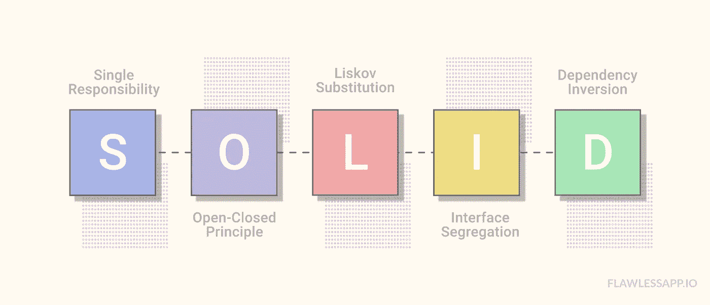
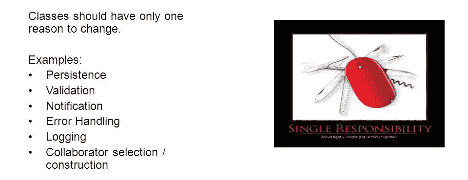
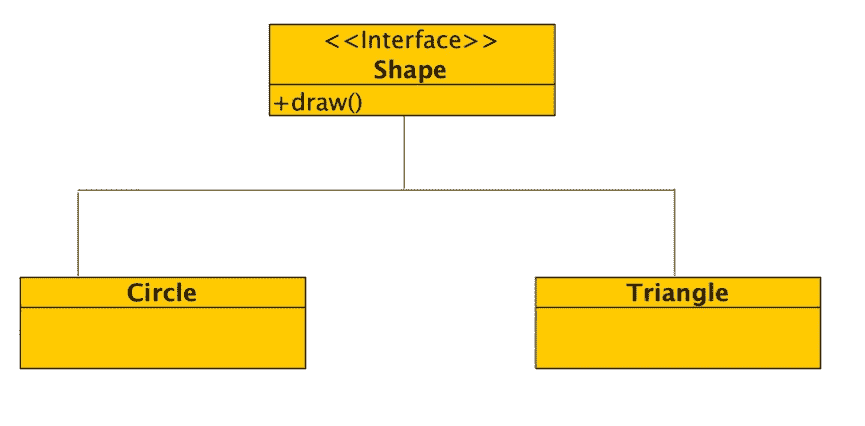
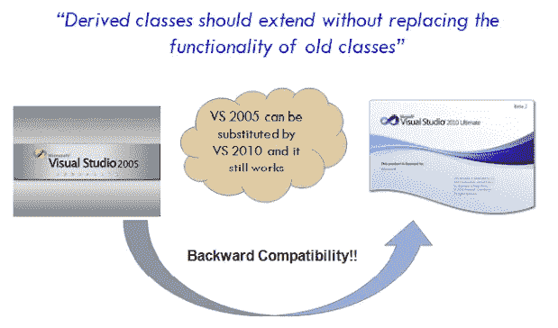
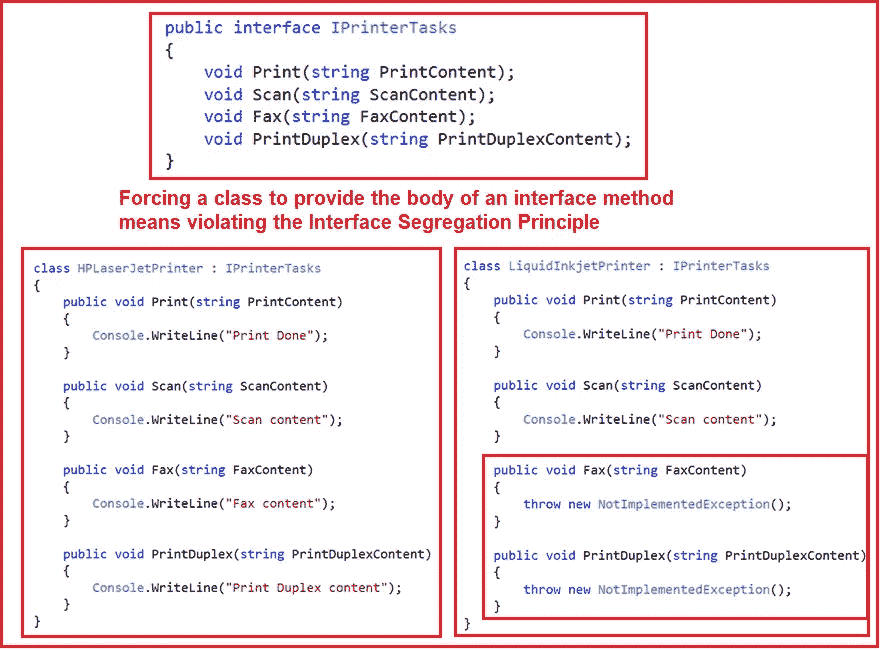

# 固体设计原理介绍

> 原文：<https://medium.com/nerd-for-tech/introduction-to-solid-design-principles-94a9394eb84e?source=collection_archive---------1----------------------->

# 介绍

1.  坚实的原则是这样的设计原则，它使用户能够管理大部分的软件设计问题，无论是大规模的还是小规模的。
2.  术语 SOLID 是五个设计原则的首字母缩写，旨在使软件设计更易于理解、灵活和维护。

# **坚实的标准是为了什么？**

# **单一责任原则**

每个模块或类应该只负责软件提供的功能的一个部分。一个类可以有许多属性和方法，所有这些属性和方法都指向一个责任。

这个原则被 Robert C. Martin 表述为**“类应该有且只有一个改变的理由”**。这意味着一个类应该只有一个作业。

这个原则的好处是更小的类更容易阅读、维护和单元测试，更低的耦合和微服务组织。

# **打开/关闭原理**

原则规定**“软件实体*(类、模块、功能等。)*应该对扩展开放，但对修改关闭"**。

这意味着代码的设计和编写应该以这样一种方式完成，即编码新功能(对扩展开放)应该能够在不改变现有代码(对修改关闭)的情况下集成。

将类实现为抽象类，将方法实现为抽象方法，它促进了接口的使用，使您能够在不更改现有代码的情况下调整应用程序的功能。这使得松散耦合成为可能。

# **利斯科夫替代原理**

这个原则是 OCP 的扩展，是 Barbara Liskov 于 1987 年在她关于数据抽象和层次的会议演讲中提出的。她说超类的对象应该可以被它的子类替换，这意味着派生类型必须完全可以替换它们的基本类型。

> 例如:如果 S 是 T 的子类型，那么 T 类型的对象可以用 S 类型的对象替换。

由于面向对象编程中的继承概念，它要求子类(子类)的对象与其超类(父类)的对象行为相同。

# **界面分离原理**

“许多特定于客户端的接口比一个通用接口要好”。我们不应该强迫客户在他们不使用的接口上实现。

更容易违背这个概念，尤其是当软件最终增长时，当新的需求出现并且必须添加越来越多的特性时。我们可以把它分解成更小的接口，而不是创建一个更大的接口，以确保实现类只需要关心方法，每个方法为一个子模块服务。

# **依存倒置原则**

这个原则表示“高级模块不应该依赖于低级模块。两者都应该依赖于抽象”。该原则还指出，抽象不应该依赖于细节。细节应该依赖于抽象。

该原理的主要目的是减少耦合，这可以通过遵循开闭原理和利斯科夫替代原理来实现。

# 优势坚实的原则帮助我们

1.  实现代码复杂度的降低。
2.  增加可读性、可扩展性和可维护性。
3.  减少错误并实现可重用性。
4.  实现更好的可测试性
5.  减少紧耦合。