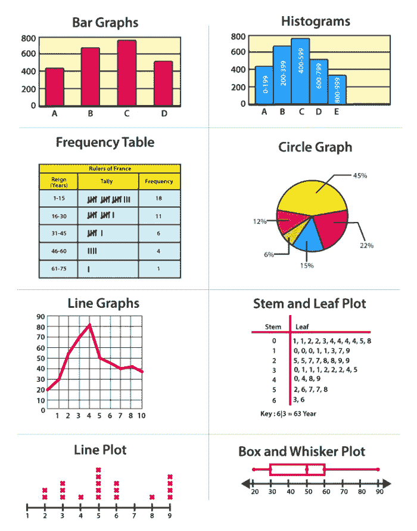
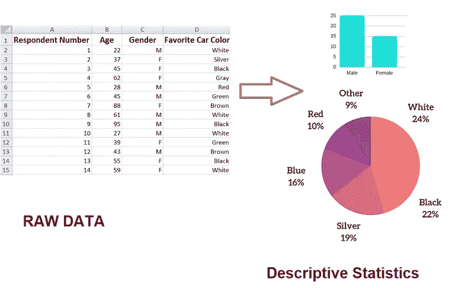
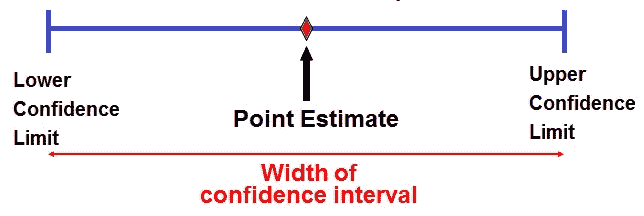
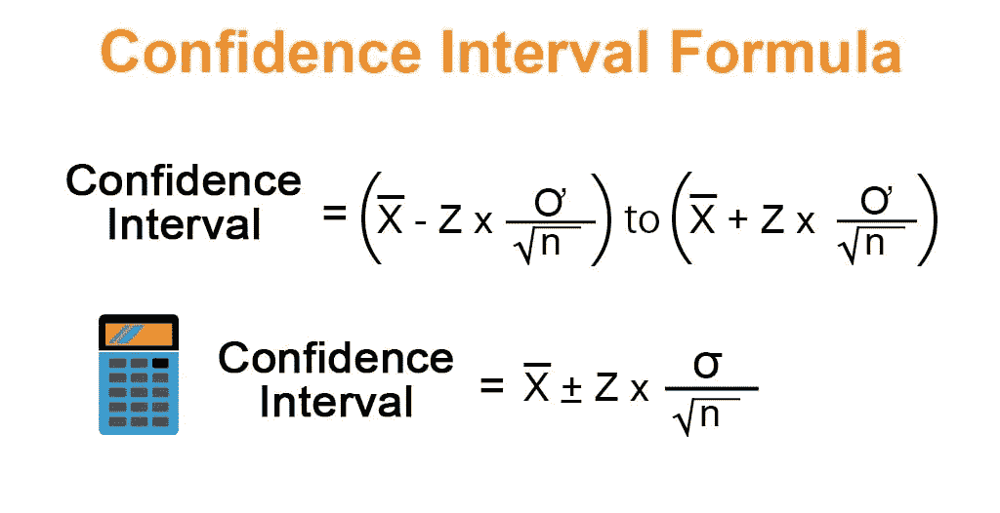
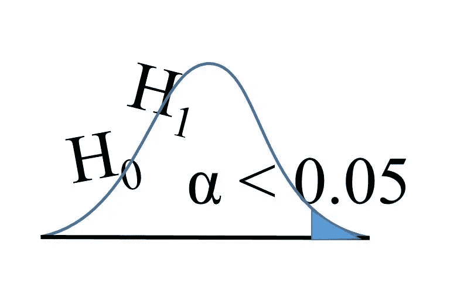
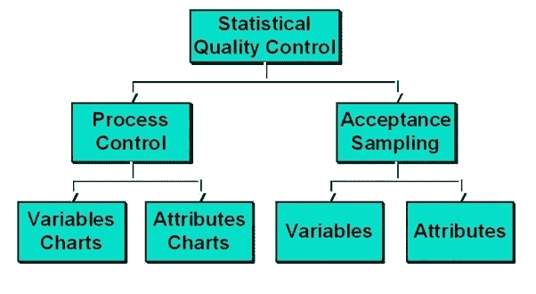

# 统计学导论

> 原文：<https://medium.com/nerd-for-tech/introduction-to-statistic-cb3bdc4dd109?source=collection_archive---------18----------------------->

统计的

**简介**

统计学是数据的科学。统计一词源于新拉丁语 statisticum collegium(“国家委员会”)和意大利语 statista(“政治家”)。在统计调查中，众所周知，由于时间或成本的原因，人们可能无法研究(人口的)每个个体元素。

统计学处理数据的收集、分类、分析和解释。统计为我们提供了一个客观的方法来做到这一点。有几种统计技术可用于从数据中学习。需要注意的是，统计方法的范围远不止统计推断问题。这种技术经常应用于科学、工程、医学和管理的不同分支。其中之一就是众所周知的实验设计。

而研究的目标是证明因果关系，实验是令人信服的数据的唯一来源。

**统计方法**

统计方法是在原始数据的统计推断中使用的数学公式、模型和技术。统计推断的主要形式是对总体的某些参数进行点估计或区间估计，以及检验关于总体参数的各种说法，称为假设检验问题。

统计推断的主要方法可以分为参数法、非参数法和贝叶斯法。而概率是统计推断不可或缺的工具。

**数据表示**

挑战在于理解数据的特征并提取有用的信息。经验或描述性统计在这方面帮助我们。它包括图形可视化方法和数据的数字摘要。

**图形表示**

图示

多年来，人们发现表格和图表是呈现数据的特别有用的方式。这种图形技术包括散点图、直方图、概率图、意大利面图、残差图、箱线图、方块图和双图。

**描述性统计**

描述统计学

描述性统计被分解为集中趋势的度量和可变性(分布)的度量，这些度量提供了对相应人口特征的有价值的洞察。此外，在描述统计学中，特征识别和参数估计是在没有或很少假设基础群体的情况下获得的。

**对数据进行分布拟合**

有必要了解如何使一个特定的分布模型系列适合数据；即识别最符合数据的参数族成员。

将模型拟合到数据的三种方法是:

1.矩法，因其识别与选定矩的非参数
估计相对应(在某种意义上)的模型参数而得名。

2.最大似然法，以及

3.最常用于拟合回归模型的最小二乘法。

**参数估计**

这种方法首先假设感兴趣总体的分布属于分布模型的特定参数族。许多这样的模型依赖于少量的参数。

**点估计**

点估计

在统计学中，点估计是从总体的随机样本中找到总体的某个参数的近似值的过程。该方法主要是找出一个参数的估计公式，称为参数的估计量。在样本的基础上从公式中得到的数值称为估计值。

**置信区间估计**

置信区间估计

与点估计相反，人们可能对构建
一个区间感兴趣，该区间包含具有指定高概率的参数值的真实值(未知)。这个区间称为置信区间，获得这个区间的技术称为区间估计。

**假设**

假设

除了点估计和区间估计之外，人们可能对确定一组值中哪个值对于给定的分布是真实的感兴趣。例如，分布的函数形式是未知的。人们可能对总体的某些性质感兴趣，而不必对分布作任何假设。对参数值(参数)或分布性质(非参数)做出决定的过程称为假设检验。

非参数检验有一些明显的优点。非参数检验可能是唯一可能的替代方案，当结果被分级、有序、测量不精确或受到异常值的影响时，如果不对总体分布进行严格假设，参数方法就无法实施。

另一个重要的假设检验是方差分析(ANOVA)。它基于因子水平之间的可变性与一个因子水平内的平均可变性的比较，并用于评估因子水平的差异。讨论了方差分析在实验设计中的应用。

**相关和回归**

相关性指的是统计学中包含依赖性的一大类关系。在统计学中，相关性是指两个或多个随机变量或数据集之间的关系，例如，二手车的车龄与汽车零售账面价值之间的相关性，产品价格与需求之间的相关性。

相关性是有用的，因为它们可以表明在实践中可以利用的预测关系。

**实验设计**

必要性，有几种方法可以进行实验。我们包括最佳猜测法(试错法)、一次一个因素法和实验设计法。

实验在设计实验之后进行，数据用于拟合高阶模型。如果发现模型不合适，那么实验者返回用新的因子水平组合进行实验。但是如果发现该模型是适当的，则分析二阶模型以找出过程因素的最佳水平。上面讨论的整个方法被称为序贯实验策略。这与实验设计和响应面分析方法学配合得非常好。

**应用**

统计设计的实验在几乎所有行业都有应用。人们常说，哪里有产品和工艺，哪里就可以应用设计好的实验。农业、化学、生物化学、制药、半导体、机械、纺织和汽车等行业经常使用它。不用说，有许多研究文章证明了统计设计实验在许多过程、产品和管理相关活动中的广泛应用，包括过程表征、过程优化、产品设计、产品开发和成本降低。

**统计质量控制**

统计质量控制

统计质量控制(SQC)是统计技术在制造业中的重要应用之一。通常，制造业从供应商那里获得原材料。在决定是否接受它们之前，有必要检查原材料。

**结论**

统计学涉及仔细的研究设计，以收集良好的数据来回答重点研究问题，分析数据中的详细模式，并得出超出观察数据的结论，并为决策提供合理的见解。

**参考**

统计方法介绍、实验设计和统计质量控制