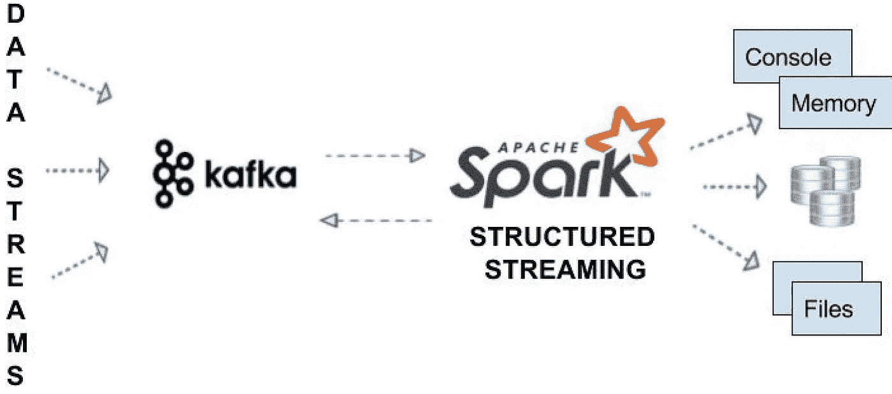
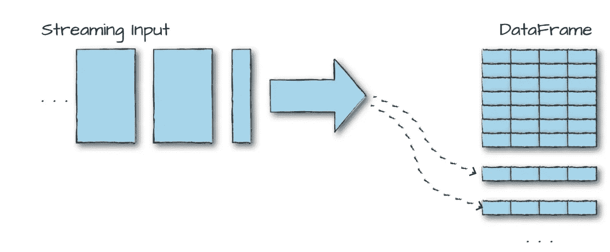

# apache-spark 结构化流简介

> 原文：<https://medium.com/nerd-for-tech/introduction-to-structured-streaming-with-apache-spark-7079a25b0d1a?source=collection_archive---------0----------------------->

**什么是结构化流**

结构化流是一个建立在 Apache sparkSQL 引擎之上的**流处理框架，因为它使用 spark 中现有的 dataframe APIs，几乎所有熟悉的操作都支持流。结构化流是通过检查点和预写日志实现的容错流机制。**



火花结构化流

> 结构化流背后的主要思想是数据被连续地附加到一个表中，用最简单的方式来说，结构化流就是你的数据帧“但是流”。

流式处理使我们能够构建连续的应用程序，这些应用程序与数据实时交互。



作为流数据帧的结构化流

**结构化流的核心概念**

**转换**

除了少数例外，spark dataframe API 中几乎所有可用的转换(聚合、连接)在结构化流中也是可用的。只有一个可用的动作是流的开始。

```
/*Prepare the schema for the data by reading the corresponding json file
* */
**val** static **=** spark.read.json("/data/activity-data/")
**val** dataSchema **=** static.schema
/*maxFilesPerTrigger is given a low value to specify how quickly spark is trying
to read the data in the file.
* */
**val** streaming **=** spark.readStream.schema(dataSchema)
  .option("maxFilesPerTrigger", **1**).json("/data/activity-data")
```

在上面的例子中，我们试图从一个带有给定模式的 JSON 文件进行流式传输。 **maFilePerTrigger** 表示您希望每个触发器传输多少条记录。

```
/*Just like batch data all the operation in spark streaming are lazy only evaluated at the time of action
* */
 **val** activityCounts**=**streaming.groupBy("gt").count()

/*Write result to memory
  queryName: activity_counts
  outputMode: complete(All the rows will be written to the output sink)

* */
**val** activityQuery **=** activityCounts.writeStream.queryName("activity_counts")
  .format("memory").outputMode("complete")
  .start() 
```

在从 JSON 文件流式传输之后，一个 **groupBy** 操作被应用于流式数据，并且该查询被写入内存，我们将在本文后面查看用于写入的各种输出位置(接收器)和模式。

```
/*wait for the termination of the query
  * */
  activityQuery.awaitTermination()

  **for**( i **<-** **1** to **5** ) {
    spark.sql("SELECT * FROM activity_counts").show()
    **Thread**.sleep(**1000**)
  }
```

查询将继续流入内存，直到调用终止， **awaitTermination** ()将等待查询终止。在调用 awaitTermination 函数之前，流过程不会真正开始，但为了简单起见，我们将跳过中的 **awaitTermination()** 其余代码片段。

**聚合和连接**

Spark 结构化流支持聚合和连接操作，类似于 spark dataframe API，让我们看一个例子。

```
/*Aggregations
  Cube:
      Create a multidimensional cube for the current Dataset using       the specified columns,
      so we can run aggregation on them.
  * */
**val** deviceModelStats **=** streaming.cube("sample1").avg()
.writeStream.queryName("device_counts").format("memory").outputMode("complete")
  .start()
```

**多维数据集**函数创建一个具有给定列名的多维数据集，因此我们可以在其上运行聚合。

```
/*Joins

  * */
  **val** historicalAgg **=** static.groupBy("sample1").avg()
  **val** deviceModelStatsJoins **=** streaming
    .cube("sample1").avg()
    .join(historicalAgg, **Seq**("sample1")   .writeStream.queryName("device_counts").format("memory").outputMode("complete")
    .start(
```

**数据来源**

在结构化流中，数据源是从中读取数据的源。下面是一些数据源的示例。

*   阿帕奇卡夫卡
*   分布式文件系统 HDFS 或 s3 spark 中的文件将不断读取新文件。
*   测试用插座

**数据接收器**

接收器是结构化流的目的地，以下是接收器的示例。

*   阿帕奇卡夫卡
*   几乎任何格式的文件(csv、parquet、json)
*   记忆汇

**输出模式**

如何将数据写入输出接收器。支持的模式有。

**Append** :将传入的数据追加到现有的表中。追加模式类似于向现有表追加新行。

**完成**:在完成模式下，全部输出将被重写。

**更新**:类似于完成模式，但是在更新模式下只有那些有变化的行会受到影响。

**触发**

触发器指定何时寻找新的记录集，默认情况下，spark 会在完成新的数据集后寻找新的记录集。Spark 还支持基于时间的触发器(基于事件的触发器)。

**基于事件时间的处理**

Spark 支持基于事件时间的处理，即根据记录中的事件时间戳处理数据。

**水印**

watermark 指定 spark 流预期在事件时间内多晚看到数据。

> 水印长度表示他们需要多长时间记住数据的长度。

**阅读和写作卡夫卡的作品**

Apache kafka 是一个针对数据流的分布式发布和订阅系统，它允许您以容错方式发布和订阅像消息队列一样的记录。kafka 将记录存储在被称为主题的类别中，主题中的每个记录由键、值和时间戳组成。记录存储的位置称为**偏移**。

**从卡夫卡主题中读取数据**

要从 kafka 主题中读取数据，必须选择以下模式之一，**分配，**订阅，**订阅模式**。

*   分配:这是一种细粒度的阅读 kafka 主题的方式，不仅指定了主题，还指定了主题分区。这可以以 json 字符串的形式给出。

```
{"topicA": [0,1],"topicB":[2,4]}
```

*   另外两种方法是通过指定主题列表来读取卡夫卡的主题

**开始和结束偏移**

查询开始的起始点，可以使用 json 字符串来指定。

```
{"topicA": {"0":23,"1":-1},"topicB":{"0":-2}}
```

在上面的 json 字符串中-2 指定最早的，而-1 指定最新的偏移量。这仅适用于新的流式查询开始时，rest 将从查询停止的地方继续。

**失败数据丢失**

当数据丢失时是否使查询失败。由于主题丢失或偏移量超出范围，查询可能会失败。默认值将为真。

**maxOffsetperTrigger**

每个触发器要读取的偏移量。

```
**val** df1 **=** spark.readStream.format("kafka").
    option("kafka.bootstrap.servers", "host1:port1,host2:port2")
    .option("subscribe", "topic1")
    .load()
```

输出将由以下格式组成

*   关键字:二进制
*   值:二进制
*   主题:字符串
*   分区:int
*   偏移:长型
*   时间戳:长

> kafka 的输出将以某种方式序列化，使用 spark dataframe API 或用户定义的函数将其转换为所需的格式。

```
**val** df2**=**df1.selectExpr("CAST(key AS STRING)", "CAST(value AS STRING)")
```

**将数据写入卡夫卡主题**

将数据写入 kafka 主题也称为发布。

```
df2.writeStream
.format("kafka")
.option("kafka.bootstrap.servers", "host1:port1,host2:port2")
.option("checkpointLocation", "/to/HDFS-compatible/dir")
.start()
```

**何时输出数据**

触发器可用于提供向接收器输出数据的时间间隔。

```
**import** **org.apache.spark.sql.streaming.Trigger**
activityCounts.writeStream.trigger(**Trigger**.**ProcessingTime**("100 seconds"))
.format("console").outputMode("complete").start()
```

**触发一次**只能用来输出一次数据。

```
*activityCounts*.writeStream.trigger(Trigger.*Once*())
 .format("console").outputMode("complete").start()
```