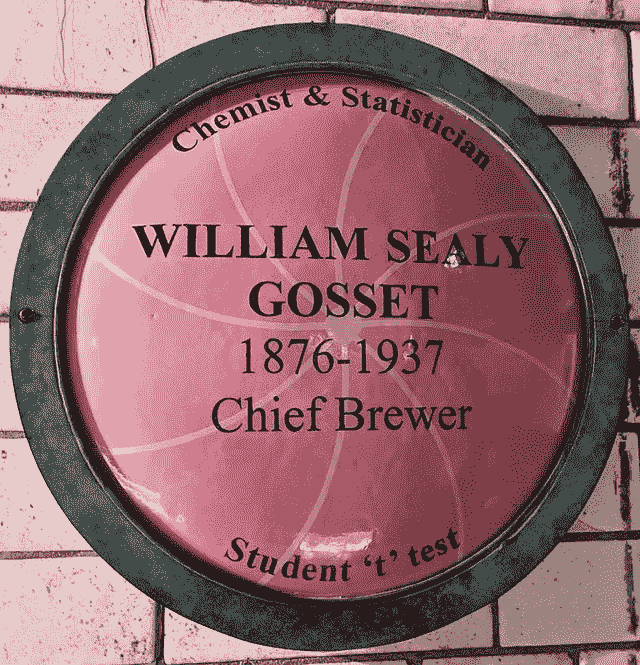
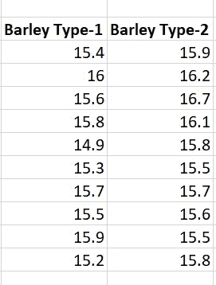
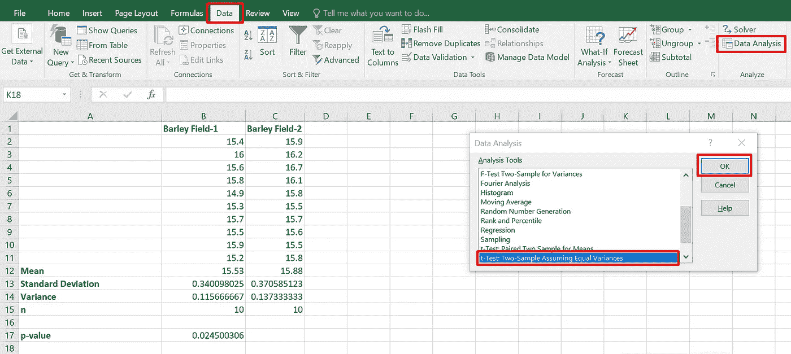
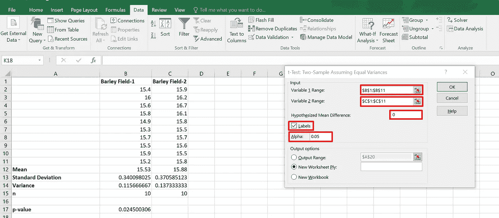
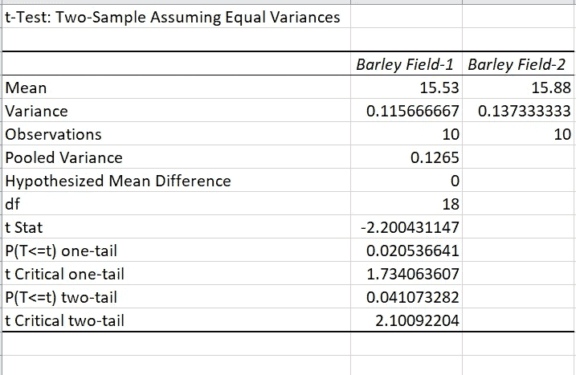

# 学生 t 检验介绍

> 原文：<https://medium.com/nerd-for-tech/introduction-to-students-t-test-7e27098a8fcb?source=collection_archive---------9----------------------->

现代统计学的先驱威廉·戈塞特

测试新想法和找出更好的做事方法是每天的过程。但是我们如何知道我们实现的改变是否明显优于以前的方法呢？这时 t-test 来拯救我们了。t 检验用于区分两个样本均值，以确定它们之间的差异是真实存在的，还是只是偶然发生的。任何想法都被称为假设，检验这些想法的过程被称为假设检验。

t 检验是最重要的统计工具之一，用于检验两个不同独立组的均值之间的差异。

**进行 t 检验的假设:**

1.  两个样本数据集都遵循正态分布
2.  收集的样本是相互独立的
3.  所比较的两个组是相互独立的

【test 检验的类型:

1.  单一样本 t 检验
2.  独立双样本 t 检验
3.  配对样本 t 检验

让我们看看可以实施上述 3 个测试的实际场景:

**1。一个样本 t 检验:**

在单样本 t 检验中，将样本的平均值与已知的阈值进行比较。该阈值可以是法律要求或现有的行业标准。例如，假设每个大麦豆荚的平均粒数是 24。因此，可以用一个样本 t 检验来检验大麦产量是否与上述已知值有显著差异。

**2。独立两样本 t 检验:**

让我们假设，我们有两种不同类型的大麦，我们想比较两种类型的产量。我们可以做一个独立的双样本 t 检验，以了解一种类型的产量是否明显优于另一种类型。

**3。配对样本 t 检验:**

假设在同一种作物上使用氮肥，我们想测试添加氮肥是否对作物产量有显著影响。成对样本 t 检验可用于测试添加肥料是否对作物产量产生任何显著影响。

让我们来看看本文中的独立双样本 t 检验:

考虑一下吉尼斯啤酒厂在试图扩大产量时面临的同样问题，弄清楚一种类型的大麦是否比另一种产量更高。为了测试这种情况，可以使用双样本 t 检验来比较大麦类型 1 和大麦类型 2 的平均产量。请记住，从两块地里收集的大麦豆荚样本数量应该相等，以便进行比较。

来自两种大麦变种的样品

因此，本例中的 ***无效假设*** 是:两个大麦变种的产量没有差异

与此相对应的 ***交替假设*** 是:两个大麦变异体的产量存在差异

**对 excel 进行 t 检验:**

可以在 excel 中进行各种统计分析。下面是在 excel 上执行 t 检验的一步一步的过程。

检查您的 Excel 上是否安装了数据分析工具 Pak

你可以这样检查它:

转到菜单栏= >数据，并在分析部分检查数据分析。

否则，安装数据分析工具 Pak 仍然很容易(如果已经安装在 Excel 上，请跳过这一部分)

***安装数据分析工具 Pak:***

点击文件= >选项

导航到侧边菜单中的加载项= >管理 Excel 加载项= >转到

选中弹出窗口中的分析工具包，然后单击确定。数据分析必须出现在菜单栏中的数据下。

要执行双样本 t-检验，请从菜单中单击 Data Analysis = > t-test:Two-Sample 假设方差相等，然后单击 OK

由于两个样本数据集之间观察到的方差不显著，因此本例选择了假设方差相等的双样本。

给出相应的变量 1 和变量 2 范围值。假设的平均差异表示零假设的值，通常为 0，alpha(显著性水平)的最佳默认值为 0.05，单击确定查看测试结果。

p 值是最重要的检验统计量，它决定了结果是否具有统计学意义。t 表中 p=0.05 可以解释为，如果我们进行 100 次实验，结果偶然发生 5 次。p 值小于阈值显著性水平(0.05)表明测试结果具有统计学显著性。

输出表明场 1 的平均值为 15.53，场 2 的平均值为 15.88。虽然方差不完全相同，但它们足够接近，可以假设它们相等。单尾检验仅确定一个方向上两个收益率平均值之间的差异，即它只能确定一个收益率是否大于另一个收益率。另一方面，双尾检验确定两边的方向(大于/小于)。

在我们的例子中，p 值为 0.0410，低于 0.05 的标准显著性水平，因此我们拒绝零假设。

因此，收集的样本数据支持我们的检验假设，即两块大麦地的群体产量不同。特别是大麦-1 的产量高于大麦 2。