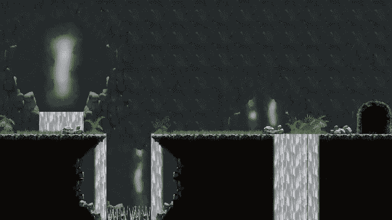
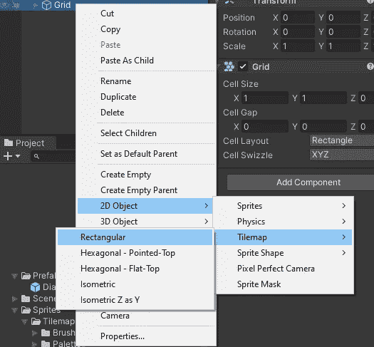
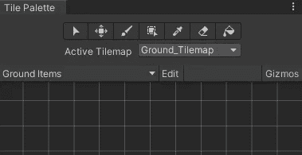
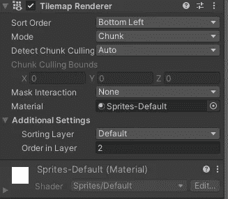
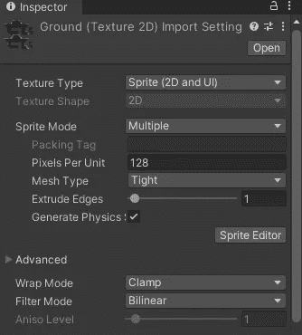
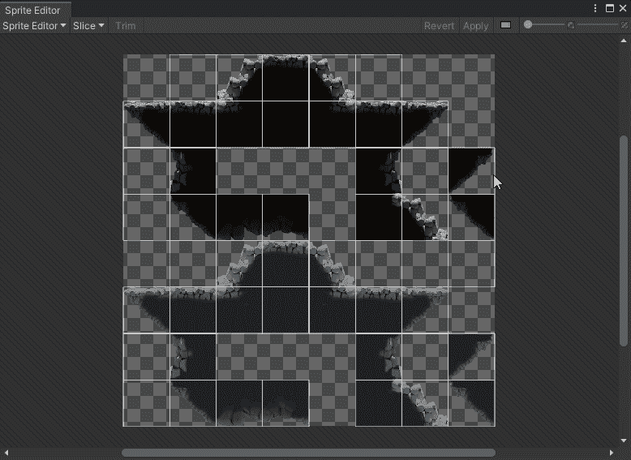
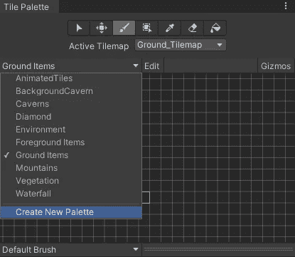
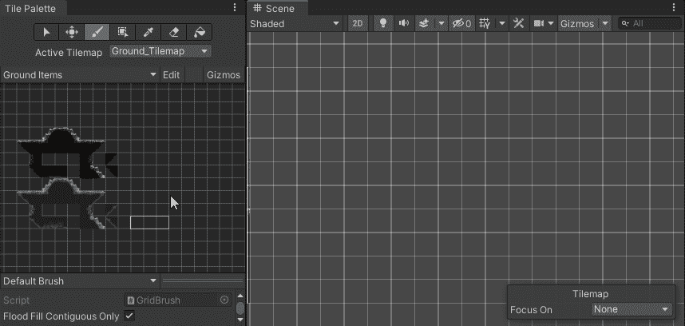

# Unity 中 Tilemap 的介绍

> 原文：<https://medium.com/nerd-for-tech/introduction-to-tilemap-in-unity-d1b2b5171f81?source=collection_archive---------11----------------------->

2D 手机游戏

**目标:**学习使用 tilemap 创建关卡

右键点击层级中的空白区域，转到 **2D 对象>平铺地图>矩形**

这将在您的场景视图上创建一个矩形网格，您可以在其中绘制瓷砖。你可以根据自己的需要给它命名，这里我将把它重命名为 Ground_Tilemap。

然后在图块调色板中，选择 Ground_Tilemap(如果尚未选择)。这是需要做的，因为以后你可能会创建更多的 tilemaps，如背景，前景来装饰你的场景。因此，当你在地面 tilemap 中绘制场景时，放置在与 tilemap 相同级别的游戏对象将与该层上的所有图块交互，而忽略其他层中的其他 tile map。

所以你可能会问什么是层，它基本上是一种告诉游戏他们被放置在不同的地方的方式，就像一排人。具有不同排序层的两个 tilemaps 将不会彼此交互。具有较高排序层的图块将在具有较低排序层的图块的前面，如果在同一层，游戏将把图块放在已经存在的图块的后面。

要绘制 tilemap，您需要在 tile 调色板中添加一个纹理。为此，您需要导入您的纹理，然后将纹理类型设置为 sprite，并将 Sprite 模式设置为 multiple，这样我们就可以将其分解并使用单独的图块而不是整个 Sprite。

然后你需要去**精灵编辑器>切片>网格按单元格大小>切片。**

确保像素大小与纹理的单元格相匹配。

现在要添加这个精灵来使用，我们首先需要创建一个调色板来存储这些精灵。因此，在活动图块的下方，您会看到一个创建新调色板。点击它，并给它一个名字，然后你将创建一个文件夹来存储你将在未来创建的所有调色板，选择该文件夹，你现在可以拖动精灵到该调色板来绘制场景。

现在你可以用不同的分类层创建不同的 tilemap，创建新的调色板来存储不同的纹理，并用令人敬畏的背景和地平面来设计你的场景。