# tilemap | Unity 简介

> 原文：<https://medium.com/nerd-for-tech/introduction-to-tilemap-unity-394ec63f6e18?source=collection_archive---------0----------------------->

## 统一指南

## 关于如何开始在 Unity 中使用 tilemap 的快速指南

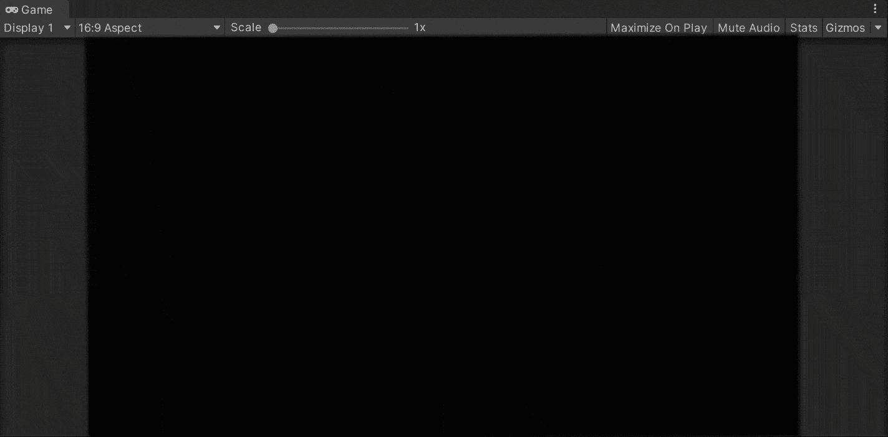

**目标**:使用 tilemap 开始为一款新的手机游戏 Unity 开发 2D 环境。

在上一篇文章中，我介绍了[如何在 Unity 中处理动画状态。](/nerd-for-tech/working-with-animation-states-unity-ed82814c3fcd)现在，是时候使用带有 Unity 的 tilemap 启动一个新的移动项目，开始设计 2D 环境了。

# 创建 tilemap

首先，让我们使用 [Unity Hub](https://unity3d.com/get-unity/download) 使用 2D 模板创建一个新项目:

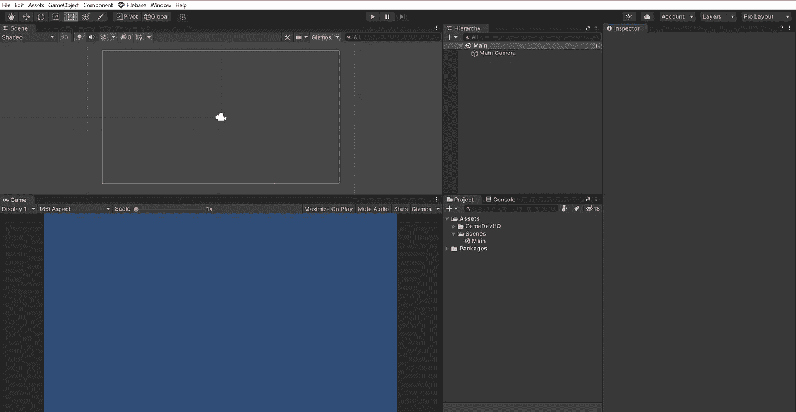

现在，创建我们的 tilemap，让我们点击 ***+ > 2D 对象> Tilemap >矩形*** 。创建完成后，我们将在场景视图中看到包含 tilemap 的网格:

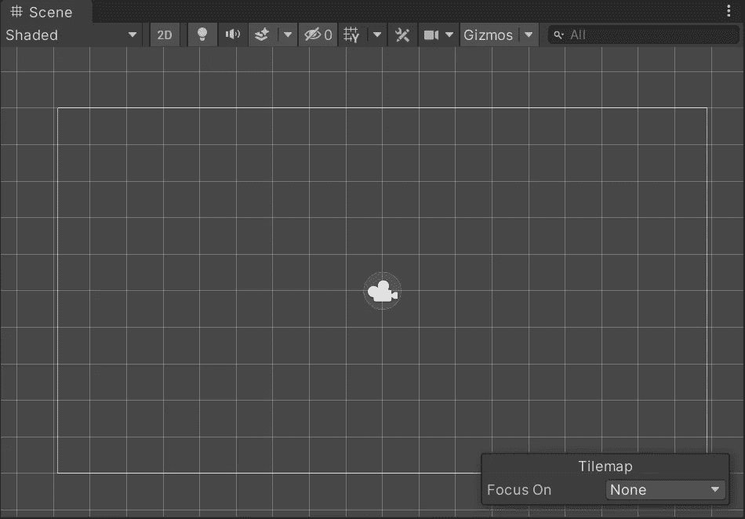

然后，为了编辑我们的 tilemap，让我们通过点击 ***窗口> 2D >瓷砖调色板*** 打开瓷砖调色板窗口:

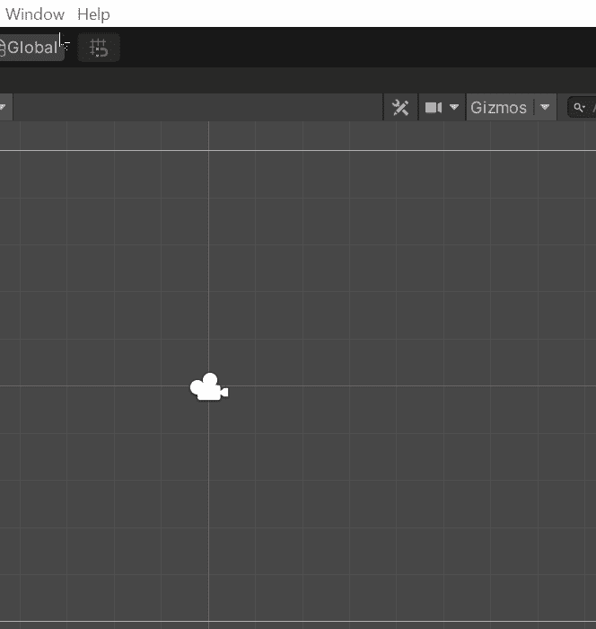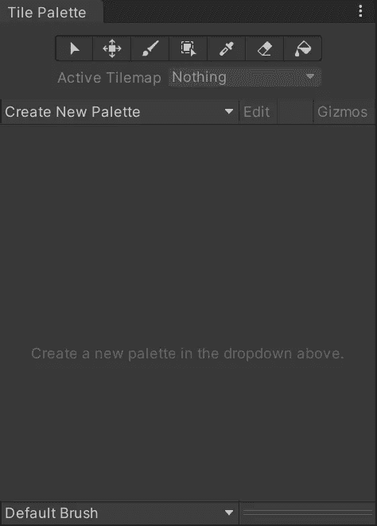

## 创建调色板

接下来，要开始编辑我们的 tilemap，让我们创建一个调色板，它将包含我们级别的地面瓷砖资产。为此，让我们:

*   转到**图块调色板**窗口
*   点击 ***创建新的调色板***
*   设置调色板属性
*   选择一个文件夹来保存调色板资源

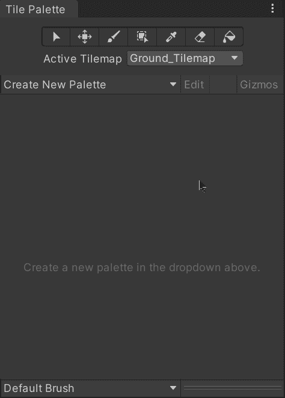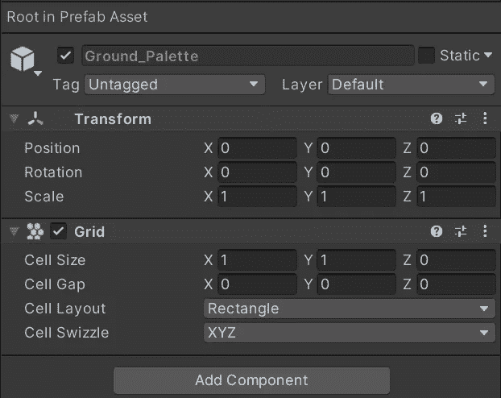

## 使用精灵工作表

然后，用新的瓷砖调色板在我们的 tilemap 中绘制,我们需要包含瓷砖的精灵来构建关卡。在我的例子中，我有一些 sprite 表，包含几个可用于此目的的图像，因此，为了使用它们，让我们选择图像并:

*   修改**纹理类型**以将图像用作**精灵**。
*   将**子画面模式**设置为**倍数**(以裁剪子画面中的图像)。
*   将**每单位像素**值设置为裁剪图像的相同尺寸。
*   点击**精灵编辑器**按钮打开精灵编辑器。

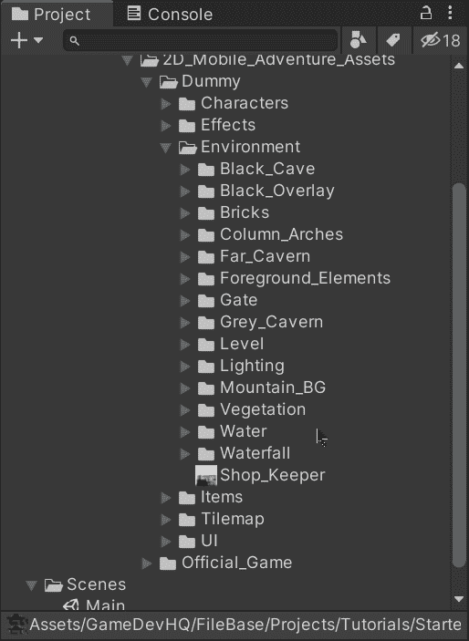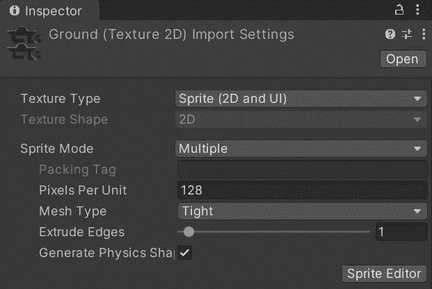

*   一旦打开，点击顶部的**切片**。
*   通过单元格大小 将切片类型更改为 ***网格。***
*   输入每张裁剪图像的**尺寸**(例如:128 x 128)
*   点击**切片**和**应用**将 sprite 工作表保存为裁剪后的图像。

保存后，我们会看到 sprite 工作表现在保存为 49 幅 128 x 128 像素的图像:

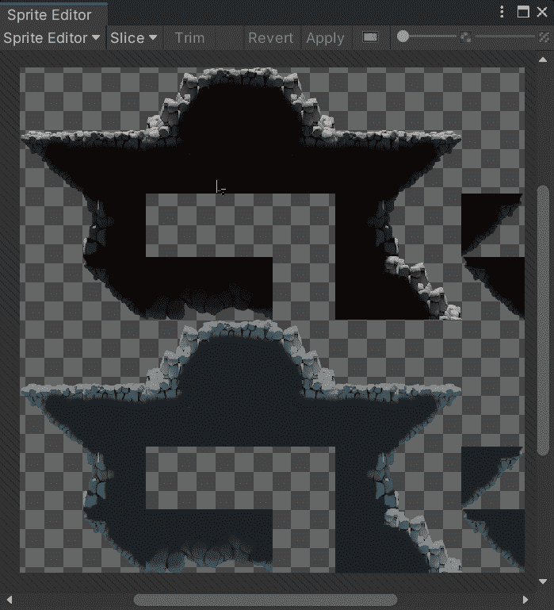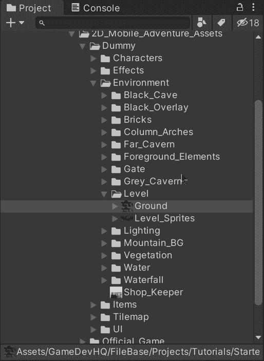

## 创建单幅图块资源

现在，为了为我们的调色板创建图块资产，让我们将 sprite 表(或其 49 个裁剪图像中的任何一个)拖动到图块调色板窗口中。拖动后，让我们选择一个文件夹来保存将用于创建关卡的图块资源:

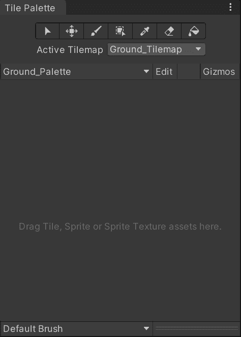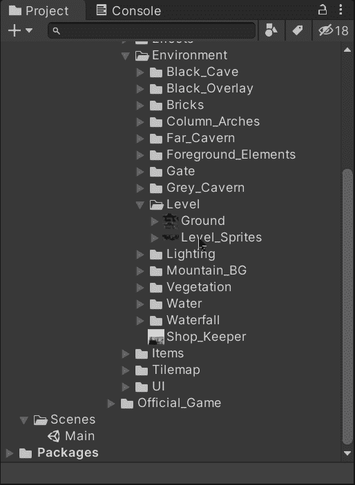

创建完成后，调色板将显示各个 sprite 表中的图块资源:

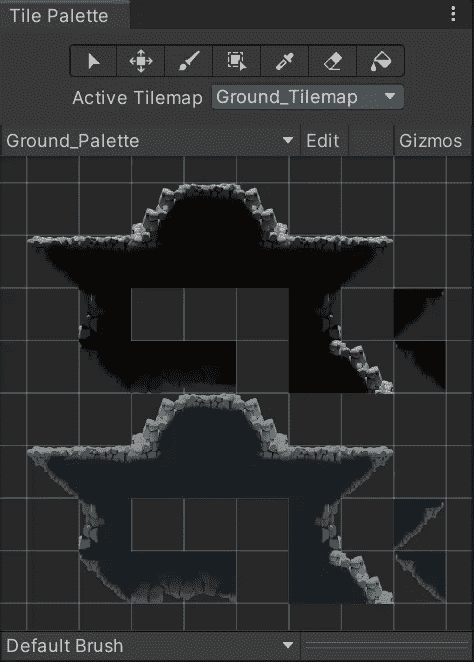

# 拼贴调色板工具

最后，为了*绘制*我们的 tilemap，我们可以在 Tile Palette 窗口中使用下面的工具:

*   活动画笔

此工具将允许我们在活动的图块地图上绘制所选的图块资产。我们可以选择一个或多个瓷砖，并通过在网格上单击来绘制它们。

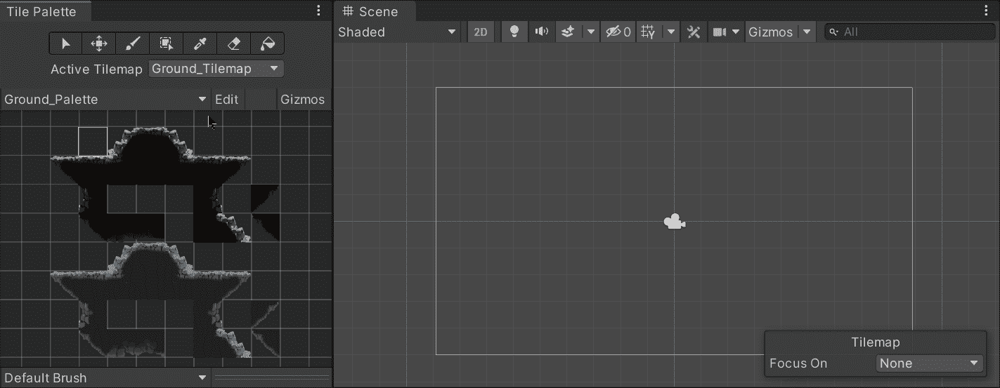

*   填充盒刷

这个工具将允许我们绘制方块形状的瓷砖。

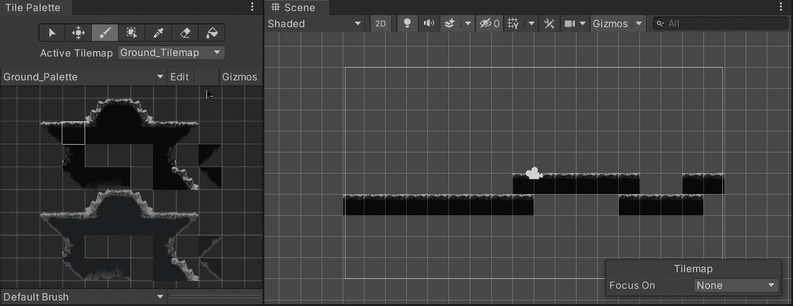

*   选取或选取画笔

此工具将允许我们选择相同类型的瓷砖，我们点击网格，以便能够使用它与活跃的画笔。

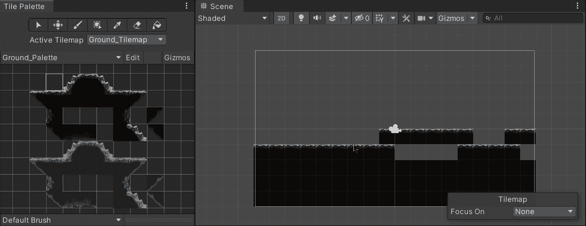

*   用刷子擦除

这个工具将允许我们通过点击激活的平铺地图来擦除绘制在网格上的平铺。我们可以选择多个图块来一次擦除更多图块。

*   用笔刷填充

这个工具将允许我们用我们选择的另一个瓷砖填充相同类型的连接瓷砖。

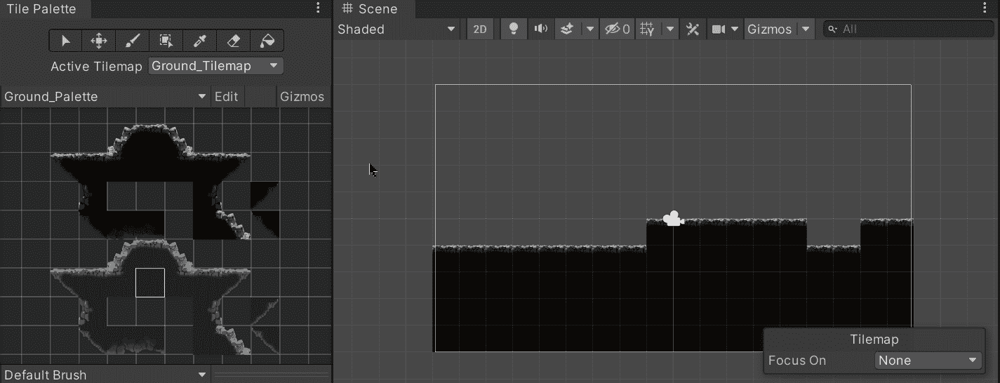

*   选择和移动选择

该工具将允许我们在网格或调色板上选择图块，并将它们移动到另一个位置。为了能够编辑调色板，我们需要点击图块调色板窗口中的 ***编辑*** 按钮:

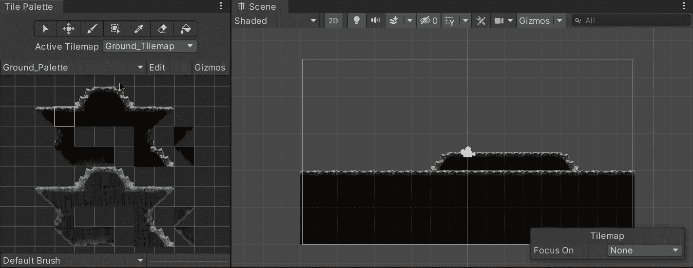

就这样，我们用 tilemap 开始用 Unity 设计我们的 2D 手机游戏！:d .下一篇文章再见，我将展示如何在 Unity 中使用动画瓷砖。

> *如果你想了解我更多，欢迎登陆*[***LinkedIn***](https://www.linkedin.com/in/fas444/)**或访问我的* [***网站***](http://fernandoalcasan.com/) *:D**