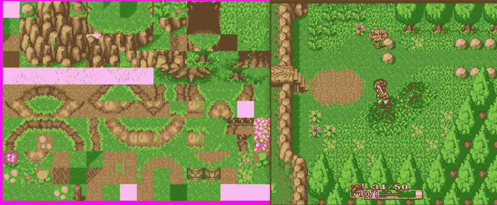
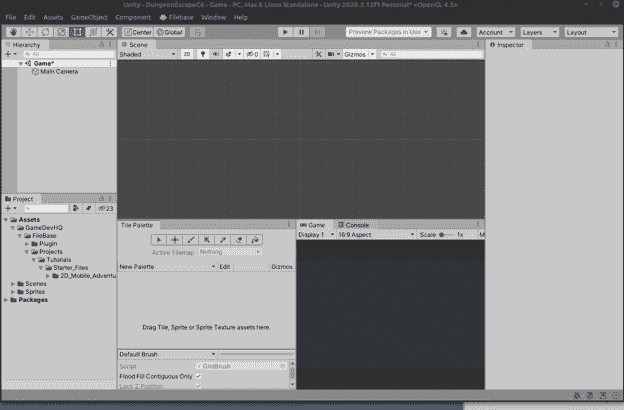
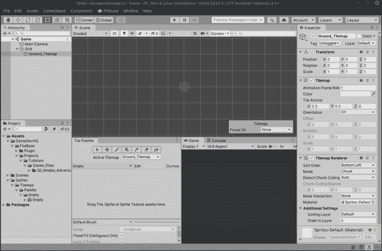
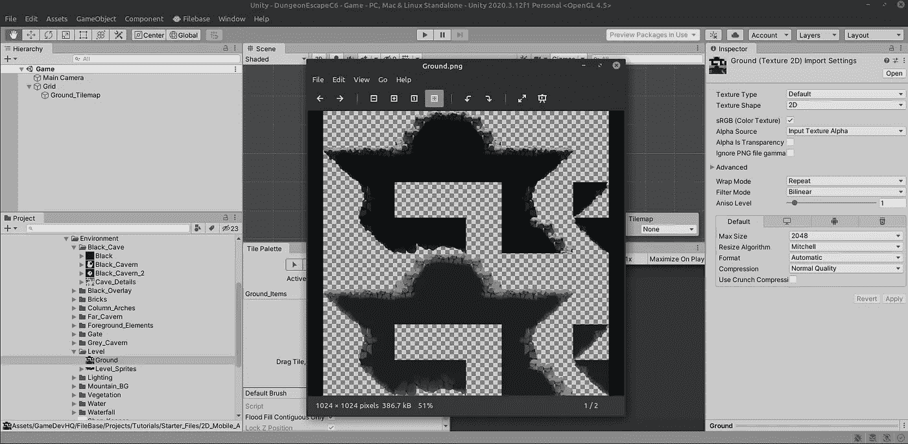
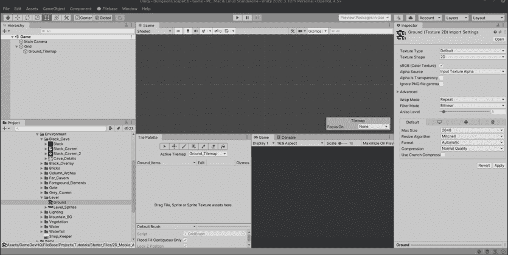
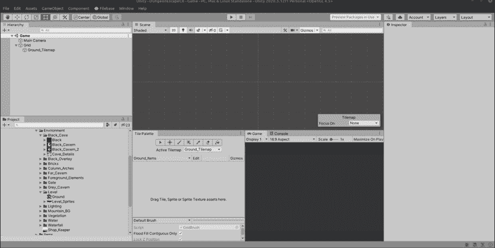
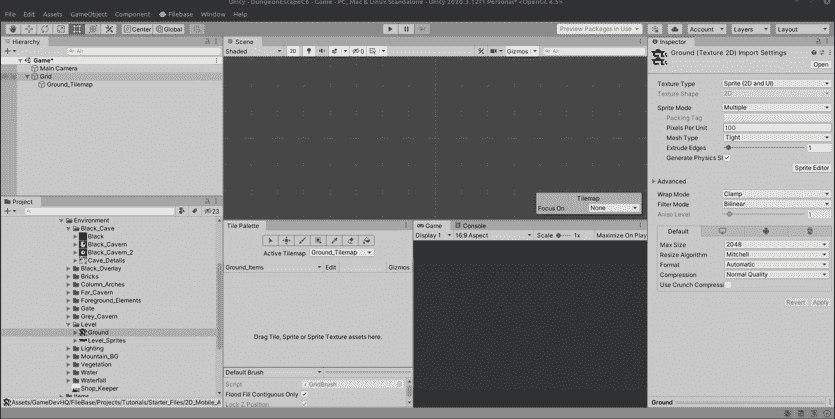
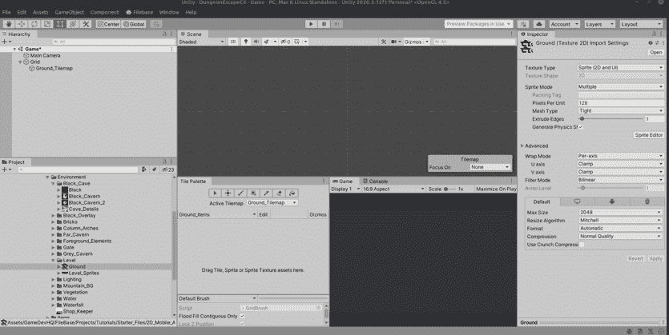
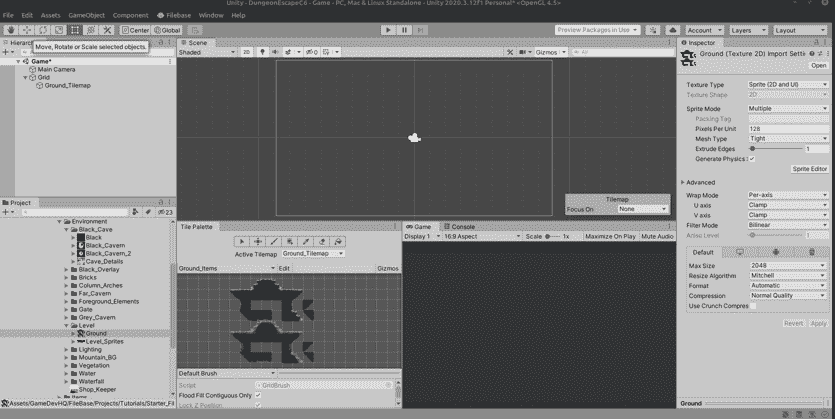

# Unity 中 Tilemaps 的介绍

> 原文：<https://medium.com/nerd-for-tech/introduction-to-tilemaps-in-unity-a83979972e67?source=collection_archive---------16----------------------->

我是第一天上手机游戏课，所以我们来谈谈 TileMaps 吧！Tilemaps 是许多视频游戏的基础，它们始于昔日的经典游戏机。Tilemaps 允许游戏设计师通过使用可重复使用的图形来呈现更大水平区域的外观，艺术家可以用类似拼图的瓷砖片来拼凑人物和背景。

经典的 RPG 游戏，比如《魔法的秘密》、《超时空触发器》和《梦幻之星》,等等，但是很少有人把被认为是游戏机的限制变成了经典的外观，这种外观一直沿用至今。不仅仅是因为怀旧，tilemaps 是非常资源友好的。你可以用很少的积木来建造整个关卡和世界！这对于移动游戏来说是完美的，因为移动设备不会提供与专用控制台相同的图形或内存能力，所以你应该保持内存友好。幸运的是，Unity 提供了完全相同的友好背景构建技术，这就是我们今天要学习的内容。

要在 Unity 中创建 tilemap，首先需要创建一个 **Tilemap Grid** 。因此，创建 2D 对象/平铺地图/矩形，并左击。创建一个画布来绘制 tilemaps。您可以拥有多个 tilemap 网格，并将它们层叠在彼此之上，以产生可以通过视差滚动增强的深度错觉。我们将这个 tilemap 称为 Ground_Tilemap。

接下来我们要创建的是一个**瓷砖面板**。这将包含我们将要用来绘制网格的所有瓷砖精灵。让我们创建一个 Ground_Items 调色板。在调色板窗口中，选择“新调色板”，键入 Ground_Items 作为名称，为了保持有序，我们将它保存在 Sprites/Tilemap/Palettes 下。

接下来，我们要用一些地面瓷砖填充我们的调色板，我们通过导入一个准备好的精灵来完成，在这种情况下，我们有一个名为 ground 的瓷砖地图，我们将对它进行切片:

首先，我们将选择地面图像，将其更改为精灵，并为精灵模式，选择多个。然后单击应用。

接下来，点击精灵编辑器，进入切片并选择网格计数。这个特殊的映射恰好在 128x128 的块中，所以我们将把它放进去，最后单击 slice。Unity 将会把整个地图分割成 128x128 的方块。单击“应用”,这些图块将被设置。

最后，我们希望 sprite 单元的大小与平铺切片的大小相同，因此将大小从默认的 100 更改为 128。

最后，拖动地面精灵到瓷砖调色板窗口。它会问你想保存在哪里，继续保存在 sprites/tilemap/下，创建一个名为 Tiles 的新文件夹，然后是 Ground_Tiles，保存在那里。

最后，我们现在有一个瓷砖调色板，我们可以用它来绘制网格！

可能看起来步骤很多，但是很有道理。在 Unity 中多创建几个 tilemaps 之后，就会变成第二天性了！