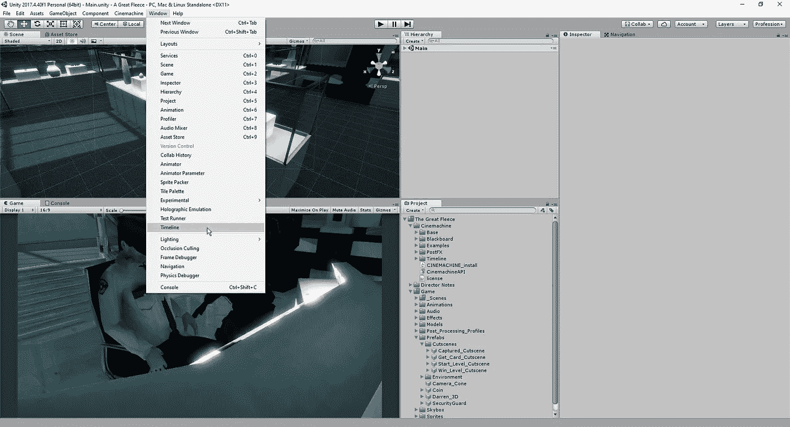
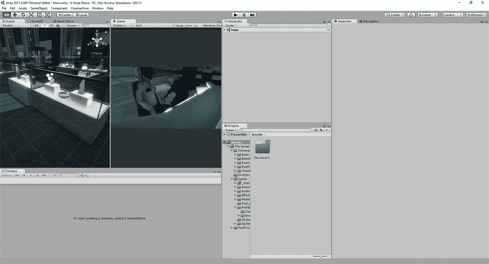
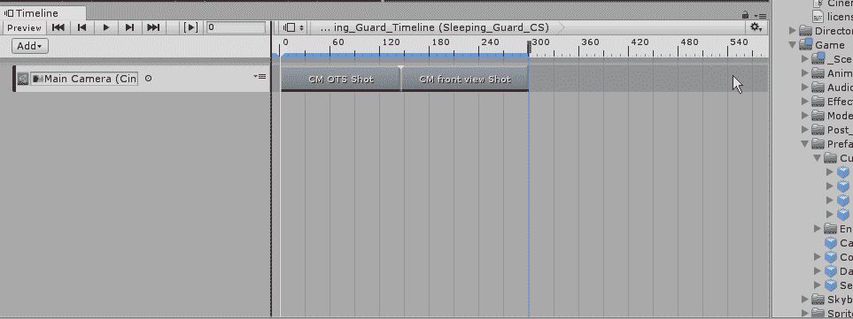
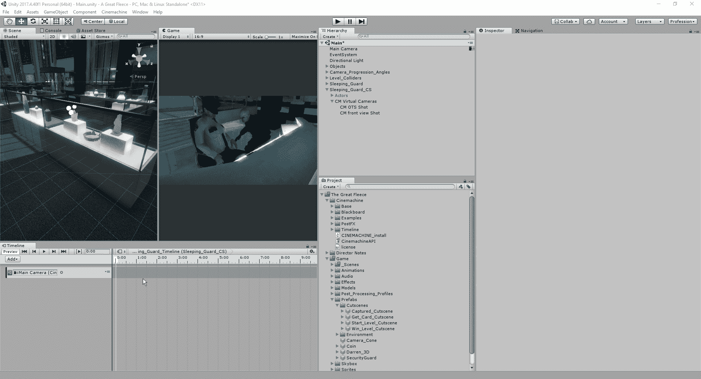
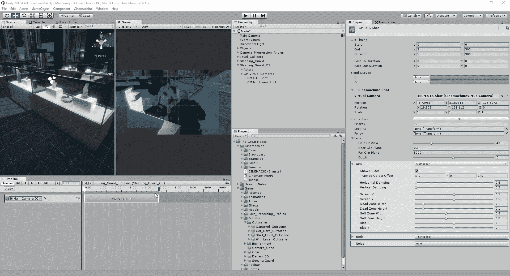
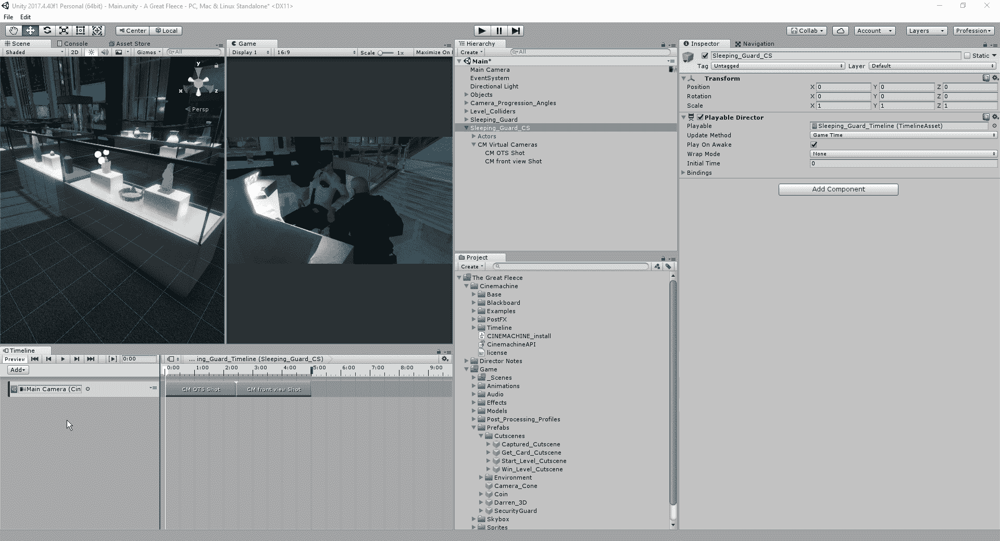
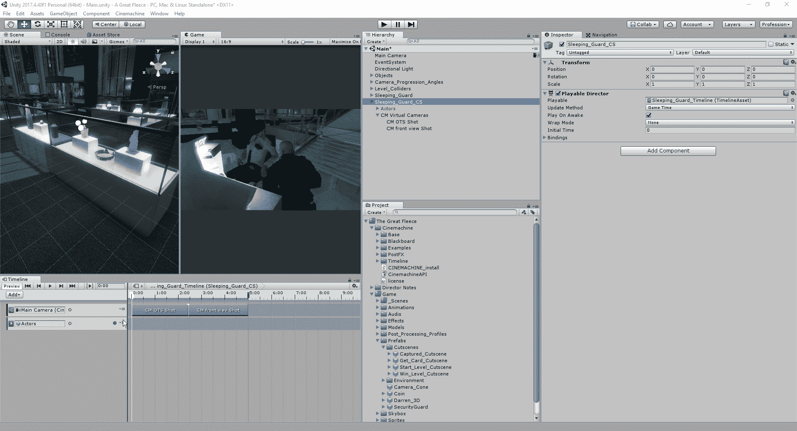

# Unity 时间轴简介

> 原文：<https://medium.com/nerd-for-tech/introduction-to-timeline-in-unity-4c39ecaa0dd1?source=collection_archive---------23----------------------->

现在我们已经设置好了两个场景，我们可以将虚拟摄像机实现到时间轴中了。时间轴是一个允许你编辑音乐、显示/隐藏对象、控制粒子、播放动画等的功能。这是一个很棒的功能，可以用于电影事件，因为它让你在一段时间内控制所有的事件。
首先，我们必须将时间轴添加到我们显示的编辑器中:

在这里，我们将重新排列我们的窗口，以便能够利用我们在时间轴中的编辑，这样我们就可以看到当我们播放事件时发生了什么:

你可以随意编辑它，但是有了这个布局，我们就有足够的空间在时间线上进行编辑。接下来，我们将为我们的时间线创建一个文件夹，并开始将我们的各种对象连接到它:

从这里，我们将希望从编辑器中删除当前动画，因为我们确实希望将它放在这里。同样，我们将删除 Sleeping_Guard_CS 空对象的动画。
完成所有工作后，我们可以将主摄像机添加到时间轴中，因为时间轴中需要一个电影大脑来让过场动画正常工作:

由于我们将以秒为单位进行工作，我们希望将呈现给我们的格式从帧调整为秒:

接下来，我们将开始添加我们创建的摄像机角度，并允许不同摄像机之间的过渡:

现在我们已经有了序列中的摄像机，我们可以看看它在游戏视图中的样子:

时间轴的一个很好的小功能是，如果我们想要将我们的摄像机混合在一起以获得不同风格的过渡，我们只需将一个摄像机的时间块的边缘拖到另一个时间块上，它就会平移到另一个摄像机上:

我们的场景旋转到另一个摄像机的速度取决于共享空间的长度。
接下来，让我们让我们的演员进入序列，这样我们就可以看到我们的摄像机如何改变实际动画的工作:

从这里，我们现在将选择我们希望使用的动画剪辑，并通过拖动白色条来测试它。这种测试方法使我们更容易看到我们的动画是否与我们的相机翻转一致:

现在我们已经对如何在时间轴上进行事情有了基本的了解，我们将在另一篇文章中研究如何完成这个过场动画。