# Unity 时间轴简介

> 原文：<https://medium.com/nerd-for-tech/introduction-to-timeline-in-unity-cf9aba6d777e?source=collection_archive---------8----------------------->

## 统一指南

## 开始使用 Unity 时间轴的快速指南

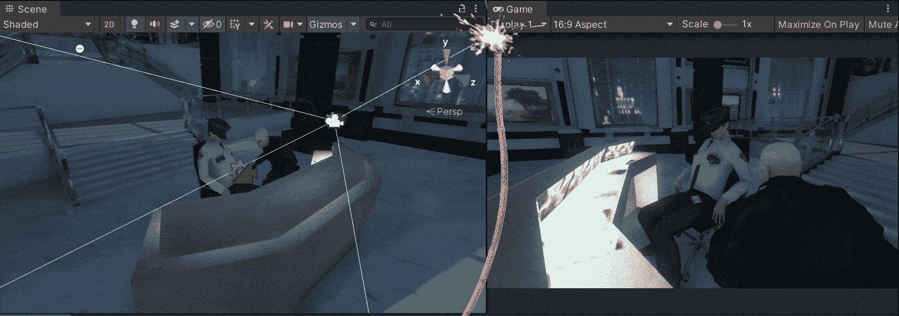

**目标**:开始使用时间轴处理虚拟摄像机与 Cinemachine in Unity 之间的简单过渡。

在上一篇文章中，我介绍了[如何在 Unity](/nerd-for-tech/composing-a-cutscene-in-unity-330bc8b99d4c) 中构建过场动画。现在，是时候通过使用时间轴窗口来处理 Unity 中摄像机之间的简单过渡，使过场动画栩栩如生了。

# 现场

按照[旧帖](/nerd-for-tech/working-with-previs-elements-unity-89aa8103007c)中 previs 元素的要求，我们有了下一个场景，两个虚拟摄像机指向不同的角度:

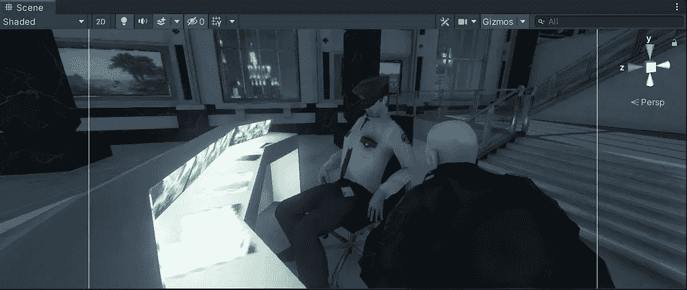

现在我们有了摄像机，我们需要使用 Unity 编辑器中的时间轴窗口来实现想要的过场动画。

# 使用时间线

要打开时间线窗口，让我们点击*窗口>序列>时间线*:

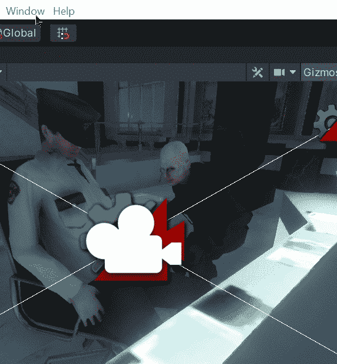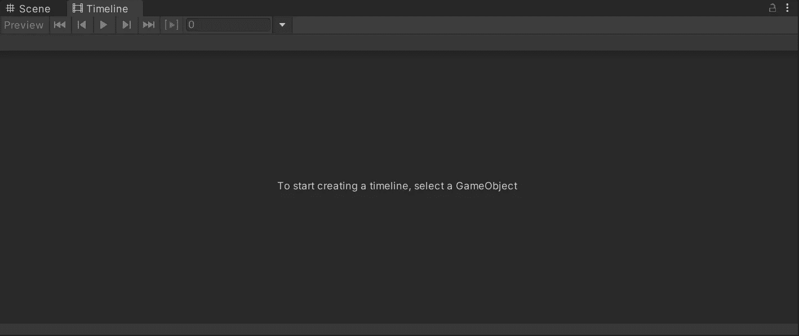

让我们在一个空的游戏对象中组织虚拟摄像机和过场动画中的演员，以避免层次窗口中的混乱:

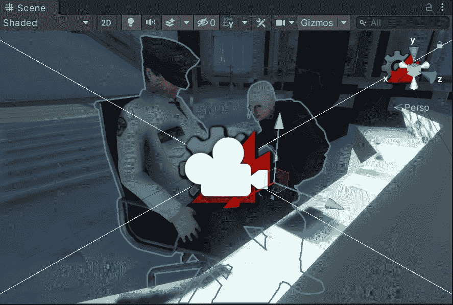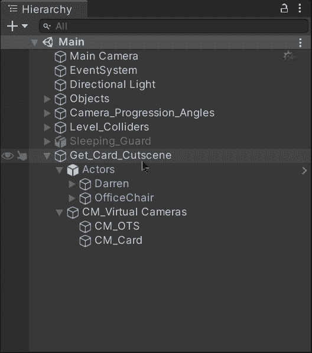

然后，让我们通过选择空的游戏对象并点击时间线窗口的 ***创建*** 按钮来创建一个新的可播放导演组件和时间线资产:

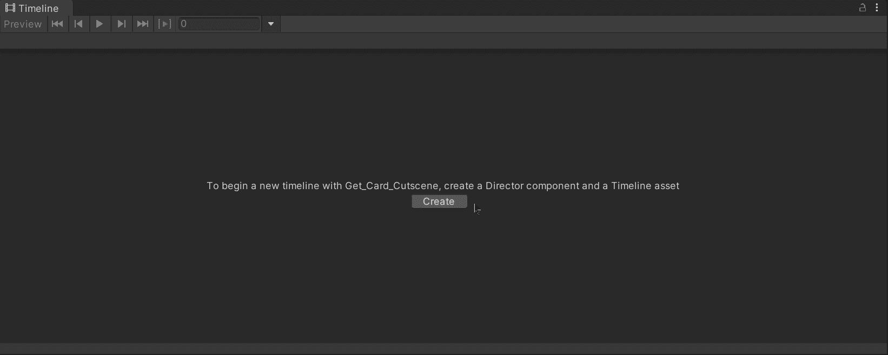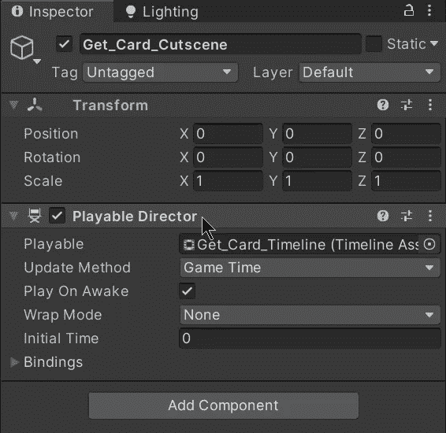

由于我们在上一篇文章中用 Cinemachine 包创建了一对虚拟摄像机，我们在场景的主摄像机中创建了一个 **CinemachineBrain** :

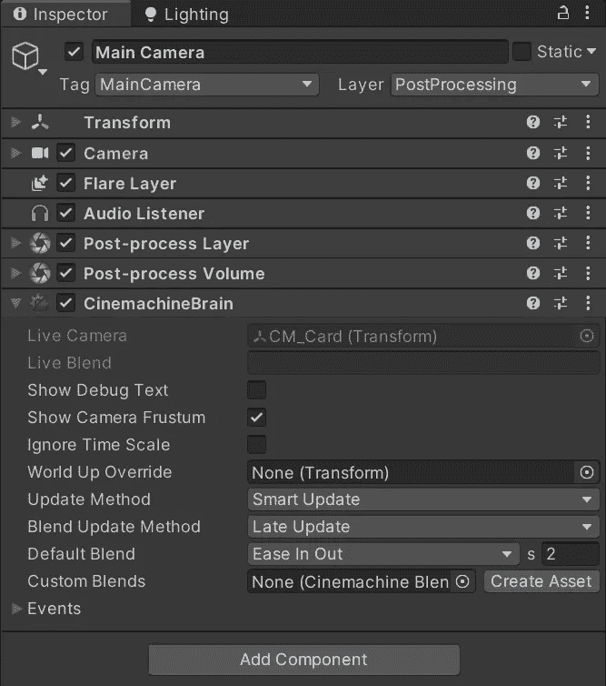

现在，为了控制虚拟摄像机，让我们将 **CinemachineBrain** 拖到时间线窗口，创建一个新的 Cinemachine 轨道:

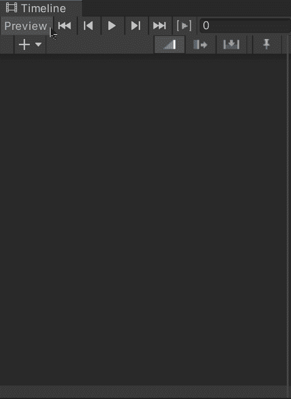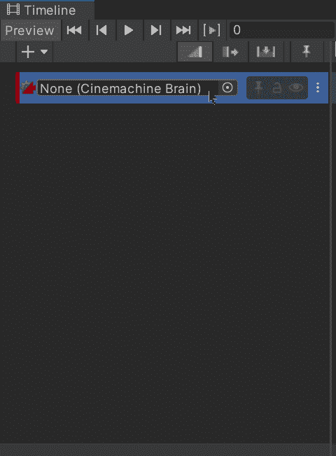

如果愿意，我们可以更改时间轴设置，以显示秒而不是帧作为参数值:

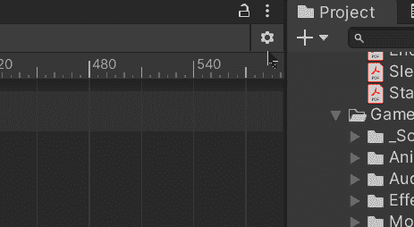

然后，让我们在 Cinemachine 轨道中创建一个新的 **Cinemachine 镜头**，以在拍摄过程中选择虚拟摄像机:

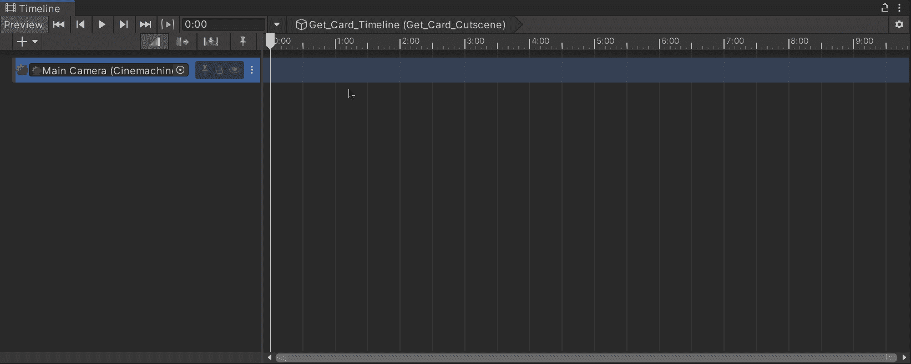

要开始过场动画，摄像机在肩膀上，让我们通过检查器将它拖到 Cinemachine 镜头中:

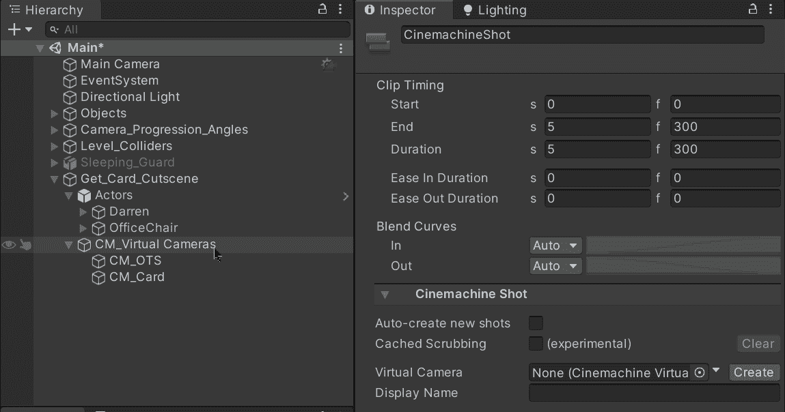

然后，让我们对指向另一侧卡片的虚拟摄像机做同样的操作:

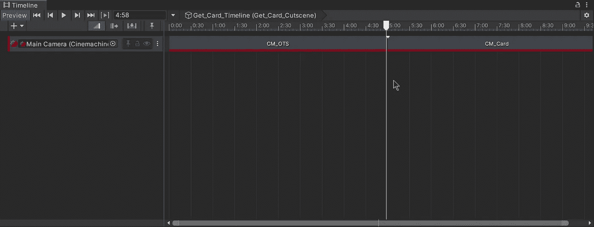

这样做可以让我们自定义在过场动画中使用每个虚拟摄像机的时间:

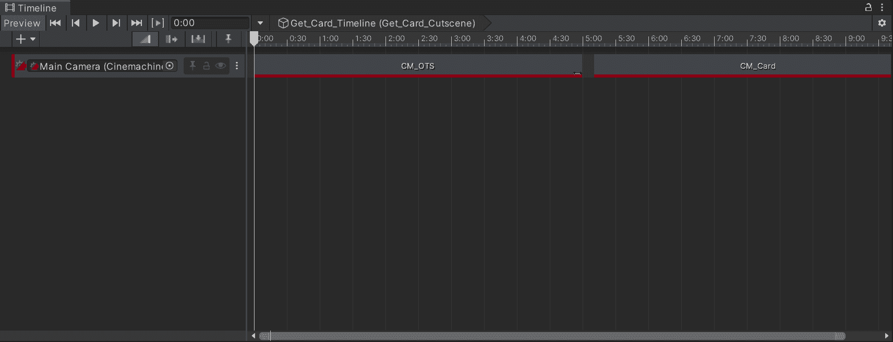

如果我们在时间线窗口中按下 play，我们将能够看到虚拟摄像机是如何处理的:

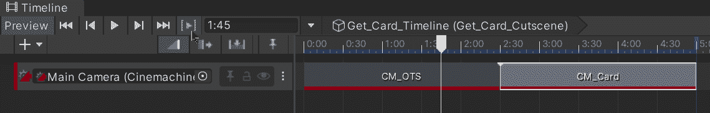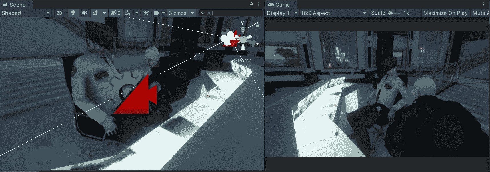

还可以选择混合 Cinemachine 镜头，以改变各自的摄像机，并在混合期间显示它们之间的路径:

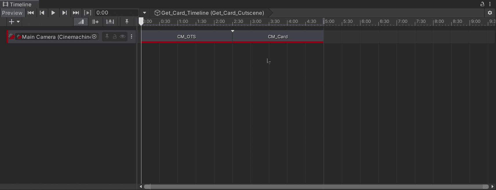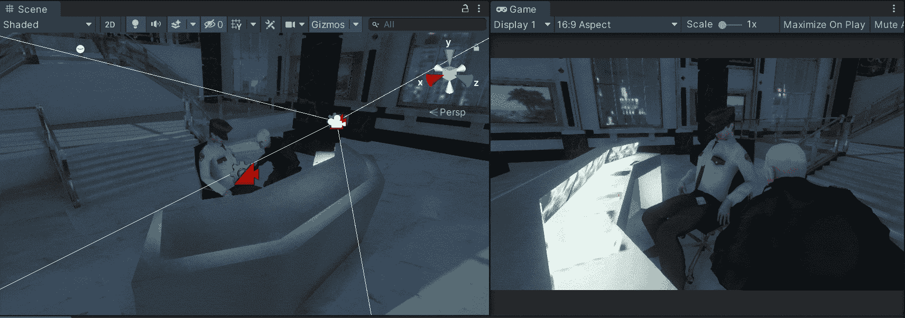

# 下一首曲目

因此，如果我们继续使用时间轴来组合 Cinemachine、动画和激活的不同轨道，我们将能够按照预期控制过场动画，并获得所需的结果:

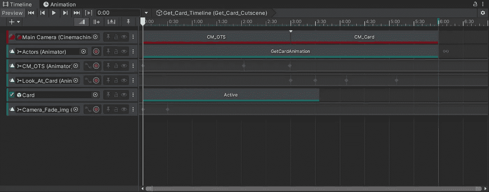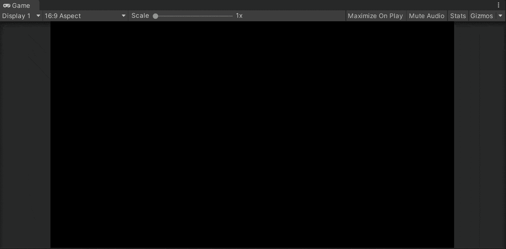

就这样，我们在 Unity 中引入了时间轴窗口！:d .我将在下一篇文章中看到你，在那里我将展示如何在 Unity 中使用移动轨道。

> *如果你想更多地了解我，欢迎登陆*[***LinkedIn***](https://www.linkedin.com/in/fas444/)**或访问我的* [***网站***](http://fernandoalcasan.com/) *:D**