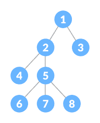
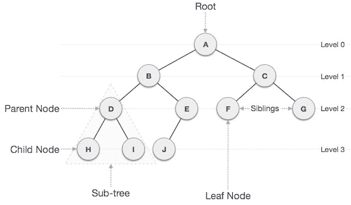

# 树木介绍

> 原文：<https://medium.com/nerd-for-tech/introduction-to-trees-4ced54a378a?source=collection_archive---------7----------------------->

我们已经学习了数组、数组列表、堆栈、队列等数据结构。？那么，所有这些数据结构之间有什么共同点呢？

它们都是线性数据结构，即这些数据结构的内存分配是线性的。但是，在现实生活中，我们通常不希望数据以线性方式存储。因此，这些数据结构对我们来说是不够的。在这种情况下，我们利用树形数据结构。

# 树

让我们以笔记本电脑中的文件夹为例。考虑一下，在笔记本电脑的“c 盘”中，我们有两个文件夹。其中一个名为个人，另一个名为工作。个人文件夹中有三个文件夹，即“家庭照片”、“银行详情”和“密码”，而工作文件夹中有两个文件夹，“任务”和“团队成员”

在本例中，个人和工作文件夹位于“c 盘”中所以，c 盘是第一位的，它可以被称为个人文件夹和工作文件夹的父文件夹。因此，这种涉及层次结构的数据安排可以使用一种称为树数据结构的数据结构来存储。

**树**是一种离散的数据结构，表示各个元素或节点之间的层次关系。

【https://www.programiz.com/dsa/trees】树(来源:[树](https://www.programiz.com/dsa/trees))

# 重要术语

**树**(来源:[https://www . tutorialspoint . com/data _ structures _ algorithms/Tree _ data _ structure . htm](https://www.tutorialspoint.com/data_structures_algorithms/tree_data_structure.htm))

**父节点:**连接到下一层级(即该节点的下一级)中的一个或多个节点的节点。

**子节点:**连接到上一层级(即其上一级)中的一个节点的节点。

**根节点:**在树的层次级别的顶部没有父节点并且所有其他节点都从其向下的节点被称为根节点。

**叶节点:**所有没有任何子节点的节点称为叶节点。它可能在也可能不一定在最低级别)。

**节点的祖先:**从其继承特定节点的所有节点。

**一个节点的后代:**从一个特定节点派生出来的所有节点。从一个节点派生的子树中的所有节点都是它的后代。

**兄弟节点:**具有相同父节点的节点称为兄弟节点。

既然你已经学习了树的基础知识，那么在 [Leetcode](https://leetcode.com/) 查看二叉树中的[最大数](https://leetcode.com/problems/find-largest-value-in-each-tree-row/)、[最深叶数总和](https://leetcode.com/problems/deepest-leaves-sum/)、[树与叶数总和](https://leetcode.com/problems/sum-root-to-leaf-numbers/)等问题。

# 常见问题

1.什么是二叉树？

二叉树是一种用于数据存储的独特数据结构。在这种情况下，每个节点最多可以有两个子节点。它兼有有序数组和链表的优点，因为搜索和排序数组一样快，插入或删除操作和链表一样快。

2.什么是通用树？

如果一棵树的子节点的最大数量是不固定的，并且它可以有尽可能多的子节点，那么它被称为类属树。

3.为什么树被称为非线性数据结构？

树数据结构被称为非线性数据结构，因为它不是顺序存储的。它是一种分层结构，因为树中的元素排列在多个级别上。

4.怎么才能算出节点 x 的高度呢？

节点 x 的高度可以定义为从节点 x 到叶节点的最长路径。

我这边就这样。我希望这篇文章对你有用😊。

作为参考，请查看 [GitHub Repo](https://github.com/Sapna2001/CryptoTracker) 。请随意启动这个库⭐.

让我们在[Github](https://github.com/Sapna2001)/[LinkedIn](https://www.linkedin.com/in/sapna2001/)/[网站](https://sapna2001.github.io/Portfolio/)/[Twitter](https://twitter.com/Sapna_2001)/[Quora](https://www.quora.com/profile/Sapna-191)上连线；)

**如果你有任何建议，请随时通过**[**LinkedIn**](https://www.linkedin.com/in/sapna2001/)**&与我联系，评论区也是你的。**

如果你喜欢这个故事，请点击拍手按钮，因为它激励我写更多更好的东西。