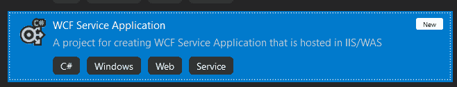
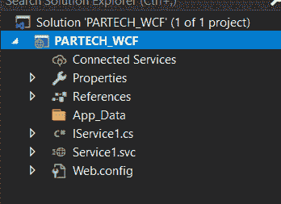
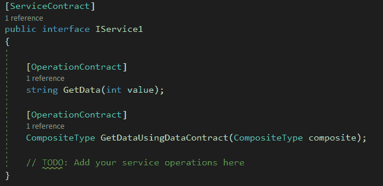
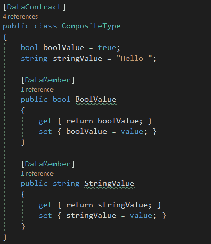
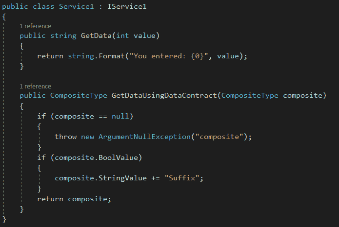
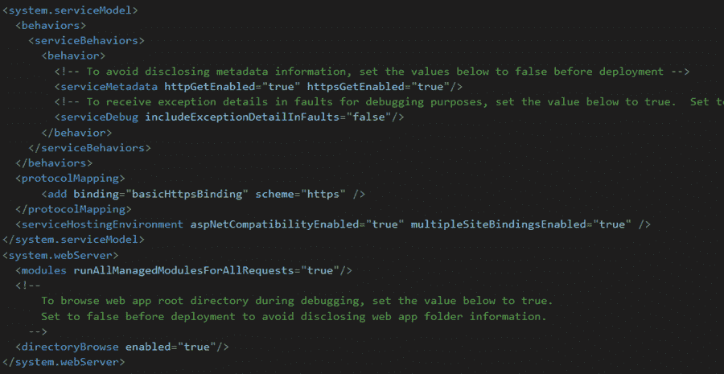
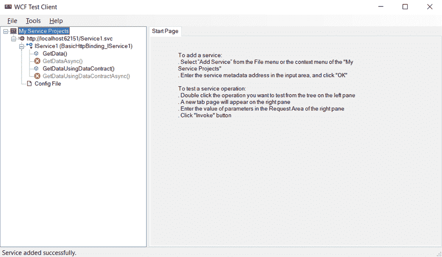
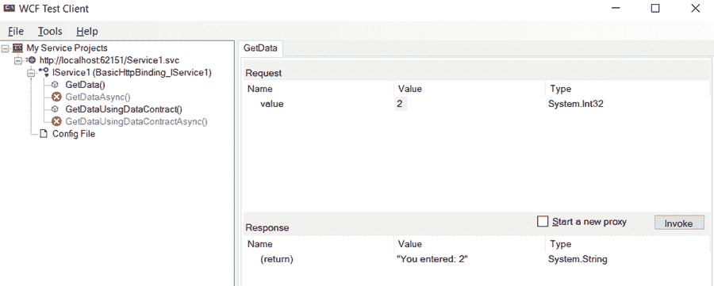
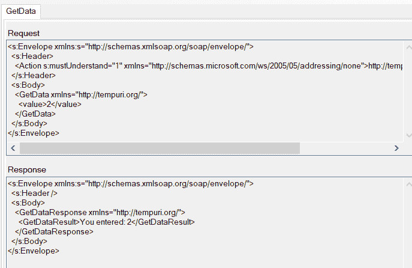

# Windows 通信基础简介

> 原文：<https://medium.com/nerd-for-tech/introduction-to-windows-communication-foundation-ddbb10ad092e?source=collection_archive---------13----------------------->

编程世界正在向分布式系统发展。我们的意思是——用户执行的任何活动都是由后端的两个或更多应用程序完成的。然而，这是通过更好的用户体验和更少的延迟实现的。

从用户的角度和系统架构的角度来看，这种方法有很多好处。由于系统是分布式的，所以维护和开发系统更容易。

此外，它还提供了用不同编程语言创建单独应用程序的优势。因此，基于需求和复杂性，开发人员和架构师可以选择他们喜欢的编程语言。

尽管我们看到了分布式系统的许多优点，但它也带来了一个复杂的挑战。让我们用一个例子来解释这一点

想象一个被多个客户端使用的后端系统。一个实时的例子是电子商务系统的后端，它向 UI 提供用户地址的详细信息。最终用户正在使用它。此外，相同的数据被发送到传送带，以根据邮政编码对包裹进行隔离/分组。

这里，UI 希望数据是 JSON 格式，而传送器希望数据是二进制格式。虽然使用了相同的数据，但需要两种不同形式的数据。

在这种情况下，重复业务逻辑或编写代码来转换所需的格式将是一个繁琐的过程。此外，应用程序可能希望数据通过不同的传输协议发送，比如一个使用 HTTP，另一个使用 TCP。为了克服这个困难并提供互操作性，微软提供了 WCF。

让我们看看什么是 WCF，以及它如何在这个博客中有用。

**目录**

1.  什么是 WCF？
2.  WCF 的部件，
3.  如何创建 WCF 服务，以及
4.  结论。

# 什么是 WCF？

WCF 代表视窗通讯基金会。它是微软从。Net framework 版。它结合了 ASP。Net web 服务、企业服务、消息队列和。Net 远程处理。

它为开发人员提供了一个重要的优势——它帮助他们专注于业务逻辑，而不是创建通信和传输协议的艰巨任务。与 WebAPIs 类似，WCF 也有端点，客户端通过端点传递输入数据并获取输出数据。

# WCF 的部件

为了访问 web 服务，通常使用端点。端点被配置为调用服务类中的特定方法，该方法反过来提供将通过端点进行通信的数据类型。

WCF 提供了涵盖其完整功能的三个基本组件(俗称 WCF 的 ABC)。那些是-

*   **一个**地址，
*   **B** 发现
*   合同

## 地址

该地址提供了您的端点的确切位置。下面是一些地址的例子

*   [http://partech.com/MyService](http://partech.com/MyService)
*   net . TCP://partech . com/my service

地址的语法是—传输模式:服务器位置:端口/路径/子路径

这里，传输模式可以是 WCF 附带的任何一种传输协议。服务器位置是网页的 IP 或屏蔽地址。端口是可选的。路径和子路径表示服务中需要调用的方法。

## 有约束力的

绑定保存了服务器端和客户端如何处理数据的信息，也就是说，它定义了传输和编码协议。

一些基本的绑定类型有

1.  基本装订
2.  TCP 绑定
3.  Web 服务(WS)绑定
4.  双工 WS 绑定
5.  MSMQ 装订

## 合同

顾名思义，它是客户机和服务器之间关于将要交换的消息的内容和结构的协议。数据契约定义了消息的结构，消息契约定义了消息的内容。

# 如何创建 WCF 服务？

要创建基于 WCF 的服务，用户需要安装 Visual Studio 2019 以及组件—Windows Communication Foundation(位于安装向导的单个组件页面下)。

打开 Visual Studio，找到项目模板— **WCF 服务应用。**为解决方案提供有效名称。这里我们在。Net Framework 4.7.2 版本。

将创建一个具有以下结构的项目-

让我们一个一个地看。首先，我们来看看 IService.cs 文件。这包含服务契约(包含端点的接口)和操作契约(将用于通信的端点)。

在同一个文件上，在服务协定下面，存在数据协定。这提供了将用于通信的数据成员。

在 Service1.svc.cs 文件中，类实现服务协定的接口。此外，操作契约的定义是在实现服务契约的类中创建的。这里，我们在服务契约中提供了两个操作契约，同样的操作契约在 Service1 类中实现。

现在是重要的部分——web . config 文件。这里，除了. Net 应用程序的标准设置，还包括 WCF 配置。这包括将用于通信的应用程序的绑定，并将在此进行配置。根据需要，用户可以修改配置。默认情况下，使用 basicHttpsBinding 设置绑定。

要运行该应用程序，请单击 Visual studio 中的调试图标。这将打开一个 WCF 测试客户端。测试客户端提供公开的地址和端点。

用户可以提供输入，并从端点获取输出。

此外，可以用 XML 格式查看输入和输出。同一个应用程序可以托管在 IIS 中，并可以通过 SOAP UI(测试服务的第三方工具)调用。

类似地，应用程序可以在客户端被引用和使用。

# 结论

WCF 为开发人员提供了实现互操作功能的灵活性和优势，而无需过多关注其实现方式。因此，请在您的下一个应用程序中尝试一下。

*原载于*[*https://www . partech . nl*](https://www.partech.nl/nl/publicaties/2021/07/introduction-to-windows-communication-foundation)*。*