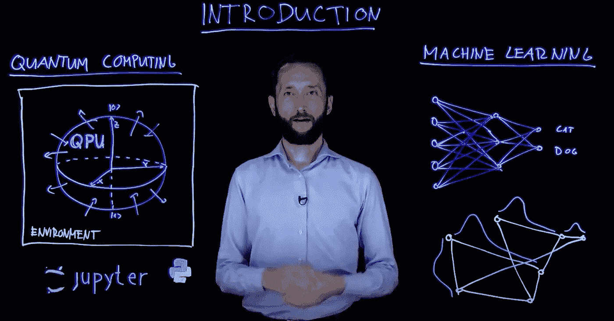

# 量子机器学习导论

> 原文：<https://medium.com/nerd-for-tech/intruquantum-machine-learning-9056ef0773aa?source=collection_archive---------7----------------------->

量子机器学习

这是量子机器学习的总博客。后续文章将是关于量子计算、力学和其他事物的特定术语和术语。

## 量子计算机的机器学习

**维基百科来源**

量子增强的机器学习指的是解决机器学习中的任务的量子算法，从而改进并经常加速经典的机器学习技术。这种算法通常需要将给定的经典数据集编码到量子计算机中，以使其可用于量子信息处理。

随后，量子**信息科学**程序被应用**，因此**量子计算的结果通过测量量子系统被读出。**作为一个例子**，**一个量子位的测量结果**揭示了一个二元分类任务的**结果。**

虽然量子机器学习算法的许多提议仍然是纯理论的**并需要**一台全尺寸通用量子计算机来测试，但其他**是在小尺寸或专用量子设备上实现的**。

## 量子数据

**TensorFlow 官网来源**

量子数据是在自然或人工量子系统中发生的任何数据源**。量子数据表现出叠加和纠缠，**导致概率**分布**，这将**需要指数数量的经典计算资源来表示或存储。量子优势实验表明**有可能从**一个特别**复杂**概率**分布的⁵ **希尔伯特空间**中取样。****

量子数据示例:

*   化学模拟
*   量子物质模拟
*   量子控制
*   量子通信网络
*   量子计量学

## 量子振幅下的线性代数模拟

维基百科来源

许多用于机器学习的量子算法都是基于振幅编码的思想。也就是将量子态的振幅与计算的输入和输出联系起来。由于 n 个量子位的状态由 2^n 复振幅描述，这种信息编码可以允许指数紧凑的表示。

直观上，这相当于将二进制随机变量上的离散概率分布与经典向量相关联。算法**支持**振幅编码的目标是制定量子算法，其资源在数量为 n 的个量子位内多项式增长**，这相当于数量为**个振幅内的对数增长**，从而输入的维度。**

量子矩阵求逆可以应用于机器学习方法，其中训练简化为求解线性方程组，例如最小二乘线性回归。最小二乘支持向量机和高斯过程。现在听起来很熟悉:)。

用量子态的振幅模拟**代数**计算的方法的一个关键瓶颈是状态准备，**经常**需要在状态期间初始化一个量子系统**，其振幅反映了**整个**数据集的特征。尽管用于状态准备的有效方法对于特定情况是已知的。这一步很容易隐藏任务的复杂性。**

## 量子神经网络

维基百科来源

经典神经网络的量子类似物或一般化通常被称为量子神经网络。使用光子、分层变分电路或量子伊辛型模块实现和扩展神经网络。

量子神经网络通常被定义为 Deutsch 的量子计算网络模型的扩展。在该模型中，与哈密顿运算不同的非线性和不可逆门被部署**以占据给定数据集的位置**。这些门**确保**相位不被观察到，并产生特定的振荡。

量子神经网络将量子信息和量子计算的原理应用到经典神经计算中。目前的研究表明，QNN 可以成倍地增加计算能力的数量，从而增加计算机的 T21 自由度，而这对于传统计算机来说是受限的。

量子神经网络具有减少步骤数量、使用的量子位和计算时间的计算能力。量子力学的波函数就是神经网络的**神经元**。为了测试量子在神经网络中的应用，量子点分子被放置在 GaAs 或类似的基底上，记录它们如何相互交流。每个量子点可以被称为一个电活动岛，当这些点足够近时，电子可以在岛的下面隧穿。以两个一组的方式在衬底上均匀分布产生了两个自旋状态，向上或向下。这些状态通常被称为量子位，对应的状态为|0 > na d|1 >狄拉克符号。

Linkedin:

[Vishvdeep dasa diya——软件助理工程师——埃森哲| LinkedIn](https://www.linkedin.com/in/vishvdeep-dasadiya-65770312b/)

GitHub:

【https://github.com/vdnew/ 