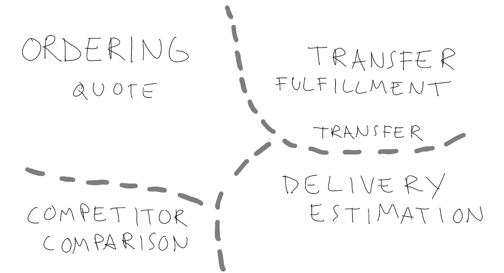

# 发明领域语言

> 原文：<https://medium.com/nerd-for-tech/inventing-domain-language-7ad4edc35076?source=collection_archive---------2----------------------->

一些子域从货币转移领域

领域驱动设计的主要思想之一是构建一种共享的领域语言，叫做[通用语言](https://martinfowler.com/bliki/UbiquitousLanguage.html#:~:text=Ubiquitous%20Language%20is%20the%20term,language%20between%20developers%20and%20users.)。通常，您可以通过倾听领域专家的意见并捕捉他们使用的语言来做到这一点。领域专家被认为是一些经验丰富的老手，他们在业务中有多年的工作经验。

如果你接触不到这样的专家怎么办？原因可能有很多。例如，你的产品没有明确地映射到任何单一的预先存在的商业模式。在这样的场景下如何构建领域语言？它有价值吗？

# 技术语言

团队/组织内部总会出现某种专门的语言。然而，当它自己发展时，它往往更具技术性，并与现有的 UI 或其他实现细节相结合。

当我们在(Transfer)Wise 上构建货币转账产品时，我们希望向客户展示我们的费用报价、交付估计以及与使用银行货币兑换相比他们节省了多少。最初我们把这个叫做`Calculation response`。这是基于我们的 UI，它有一个叫做`Currency calculator`的小部件。捕捉到用户转账意图的对象被称为`Request`。当我们在工程团队中谈论产品时，以及在与我们的支持和运营团队的讨论中，这些名称会在我们的代码库中使用。

# 为什么成长领域语言有价值？

为什么有意识地培养领域词汇比让它自然发展更有价值？

我们使用的日常语言影响了我们对周围世界的看法。类似地，软件系统中精心选择的语言可以激发和拓展你的思维，也可以限制你。拥有包含对当前 UI 实现的引用的领域语言会使探索新的表示选项或构建更通用的 API 变得更加困难。

这就是 DDD 和它听取领域专家意见的想法派上用场的地方。然而，即使你有这样的领域专家，仅仅倾听是不够的。开发团队的工作是在多余的地方使这种语言更简洁，并在需要的地方扩展它。

# 使用另一个领域作为隐喻

肯特·贝克在 XP 中引入的一个概念是系统[隐喻](http://wiki.c2.com/?SystemMetaphor)。它是关于使用其他一些众所周知的领域的类比，并应用它来简化对手头问题的思考。在我们的案例中，我们意识到我们可以从零售领域借用许多概念。

当零售是销售实物商品时，那么在我们的例子中，产品是从我们的客户那里以一种货币向接受者转移另一种货币。

这有助于我们构建更丰富的领域语言。我们开始讨论提供一个`Quote`，而不是一个计算请求/响应。当这个`Quote`被接受时，它被用来建立一个订单以生成一个`Transfer`。在这个过程中，我们从订购子域转移到履行，重点是把钱交给收件人。

# 摘要

精心培育的领域语言简化了组织内部以及与客户的交流(尤其是在 API 的情况下)。它还有助于扩展产品/系统的使用方式，以满足未来的用例。

即使你不是和传统意义上的领域专家一起工作，保持你的领域语言与技术细节的分离仍然是一个好主意。