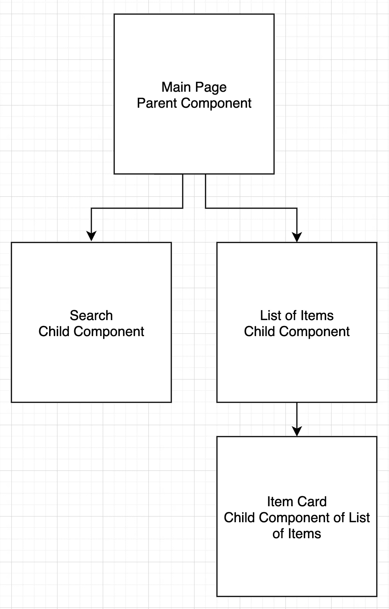

# React 中的逆向数据流(孩子，去和父母说吧……)

> 原文：<https://medium.com/nerd-for-tech/inverse-data-flow-in-react-children-go-talk-to-your-parents-58437e9e57a7?source=collection_archive---------10----------------------->

当开始使用 React 和 useState 时，我遇到的一个常见问题是，当不同的组件相互交互时，要确保 DOM 被正确地呈现。确保父组件接收来自其子组件的信息被称为反向数据流，没有它，您的 DOM 的状态将无法正确呈现。

假设页面上有一组项目。在该页面上，您可以看到作为单独卡片的所有项目列表，并且您可以在这些项目中进行搜索。因为你是有组织的，并且喜欢给你的应用程序的每个功能赋予它自己的组件，你的组件模型在父子关系方面看起来应该是这样的:



这就是我们假设的父组件与其子(和孙)组件的关系。React 在决定将数据放在哪里时的惯例是在最低的公共父模型中获取数据，以便依赖于该信息的每个子组件都可以访问它。

在 React 中，我们拥有将属性或道具从父组件传递给子组件的绝妙工具。这些可以是我们想要的任何 JS 对象，通常是一个数组。在这个例子中，我们将传递数组、对象和最重要的函数。如果你对这个概念不太熟悉，在继续阅读之前，请点击这里仔细阅读。

由于搜索和列表组件依赖于同一个数组，主页将是我们从后端调用信息的地方，如下所示:

```
import {useEffect, useState} from 'React'
import Search from './Search'
import ListOfItems from './ListOfItems'function MainPage(){
  const [array, setArray] = useState([]) useEffect(() => {
    fetch('https://www.backend.URL')
      .then(res => res.json())
      .then(data => setArray(data))
  }, []) return (  
    <div>
      <Search />
      <ListOfItems array={array} />
    </div>
  )
}
```

在我们的物品列表组件中，我们将映射来自父组件的作为道具给出的数组，并将该数组中的对象传递给物品卡片，如下所示:

```
import ItemCard from './ItemCard'function ListOfItems({array}){
  const itemArray = array.map(itemObject =>
    <ItemCard key={itemObject.id} item={itemObject} />
  )
  return (
    <div>
      {itemArray}
    </div>
  )
}export default ListOfItems
```

最后是我们的物品卡片，我们将显示每件物品的信息，如下所示:

```
function ItemCard({item}){
  return(
    <div>
      <h2>item.name</h2>
      <p>item.content</p>
      <button>Delete this item!</button>
    </div>
  )
}export default ItemCard
```

删除按钮会影响条目列表组件状态和搜索组件状态，但是我们如何让子组件(条目卡片)告诉它的父组件它做了什么来确保 DOM 正确呈现呢？我们不希望我们的用户看到已经删除的项目，或者搜索它们。进入我们的朋友，回拨。

当用户单击删除按钮时，需要发生两件事。首先，我们需要以 delete 方法的形式获取后端数据，以便从数据库中实际删除该项。这将发生在我们的项目卡组件中。其次，项目卡组件需要告诉其父组件(在本例中是祖父母)该项目已被删除，并相应地更新 DOM。为此，我们将在主页面组件中定义一个函数来处理删除操作，并将其作为一个 prop 向下传递，以便在删除时由项目卡调用。

```
import {useEffect, useState} from 'React'
import Search from './Search'
import ListOfItems from './ListOfItems'function MainPage(){
  const [array, setArray] = useState([]) useEffect(() => {
    fetch('https://www.backend.URL')
      .then(res => res.json())
      .then(data => setArray(data))
  }, []) function onDelete(id){
    const updatedArray = array.filter(item =>
      item.id !== id)
    setArray(updatedArray)
  } return (  
    <div>
      <Search />
      <ListOfItems array={array} onDelete={onDelete}/>
    </div>
  )
}
```

这里，onDelete 被赋予一个 ID，并在我们的原始数组中进行搜索。然后，它排除 ID 与给定 ID 匹配的所有项目，并返回一个新数组。注意，我们没有在主页中调用这个函数。我们只是在这里定义它。然后，它通过项目列表组件传递到按钮所在的项目卡。

```
import ItemCard from './ItemCard'function ListOfItems({array, onDelete}){
  const itemArray = array.map(itemObject =>
    <ItemCard key={itemObject.id} item={itemObject} 
      onDelete={onDelete}/>
  )
  return (
    <div>
      {itemArray}
    </div>
  )
}export default ListOfItems
```

最后，我们在 fetch 方法中调用这个 onDelete 函数，以确定如何处理 fetch 的响应。

```
function ItemCard({item, onDelete}){
  const {id, name, content} = item function handleClick(){
    fetch(`https://www.backend.URL/${id}`, {
      method: "DELETE",
    })
    .then(res => res.json())
    .then(() => onDelete(id))
  } return(
    <div>
      <h2>{name}</h2>
      <p>{content}</p>
      <button onClick={handleClick}>Delete this item!</button>
    </div>
  )
}export default ItemCard
```

注意这里我们也在[析构](/@lcriswell/destructuring-props-in-react-b1c295005ce0)我们的 Item object prop 以使 ID 可以被获取。如果不这样做，我们的 handleClick 函数将不会知道您试图删除哪个项目。现在你问搜索组件呢？让我们再做一遍。这会变得稍微复杂一点，但是请继续关注我。你能做到的！

从主页组件开始，我们将定义我们希望搜索组件如何影响 DOM。此外，我们需要映射一个过滤后的数组，而不是原来的后端数组，因此我们将为此创建一个变量，并将其作为一个属性传递给我们的项目列表组件。

```
import {useEffect, useState} from 'React'
import Search from './Search'
import ListOfItems from './ListOfItems'function MainPage(){
  const [array, setArray] = useState([])
  const [searchedItem, setSearchedItem] = useState("") useEffect(() => {
      fetch('https://www.backend.URL')
        .then(res => res.json())
        .then(data => setArray(data))
  }, []) function onDelete(id){
    const updatedArray = array.filter(item =>
      item.id !== id)
    setArray(updatedArray)
  } function onSearch(e){
    setSearchedItem(e)
  } const searchedArray = array.filter(item => {
   if(item.name.toLowerCase().includes(searchedItem.toLowerCase())){
    return true
    } 
  }) return (  
    <div>
      <Search searchedItem={searchedItem} onSearch={onSearch}/>
      <ListOfItems array={searchedArray} onDelete={onDelete}/>
    </div>
  )
}
```

这里我们必须包含第二个 useState，这样 React 就知道用户在搜索什么。就像我们的删除按钮一样，我们在父节点中定义 onSearch，并在子节点中调用它。

```
function Search({searchedItem, onSearch}){
  return(
    <div>
      <input type="text"
             value={searchedItem} 
             onChange={e => onSearch(e.target.value)}>
      </input>
    </div>
  )
}export default Search
```

onSearch 所做的是设置用户输入的值，并将其发送回主页，这样 React 就可以计算出根据什么来过滤我们的原始数组。这样做的结果是，当用户键入他们想要的内容时，您的项目列表会在您的页面上实时变化。相当甜蜜！

正如一位出色的教师告诉我的，记住这个工作流的另一种方式是，对于父组件和子组件，您应该定义 down 并调用 up。我们在主页面(父页面)组件中定义了 onDelete 和 onSearch，然后将其发送给子页面。当它们被调用时(物品卡片中的 onDelete 或搜索中的 onSearch)，该动作被发送回父项。

希望这有助于消除在 DOM 操作中使用 state 时的一些困惑。如果没有，这里有一些链接指向这篇文章所依赖的一些帮助主题。

> [什么是 DOM？](https://www.w3schools.com/js/js_htmldom.asp)
> 
> [反应使用状态挂钩](https://reactjs.org/docs/hooks-state.html)
> 
> [反应使用效果挂钩](https://reactjs.org/docs/hooks-effect.html)