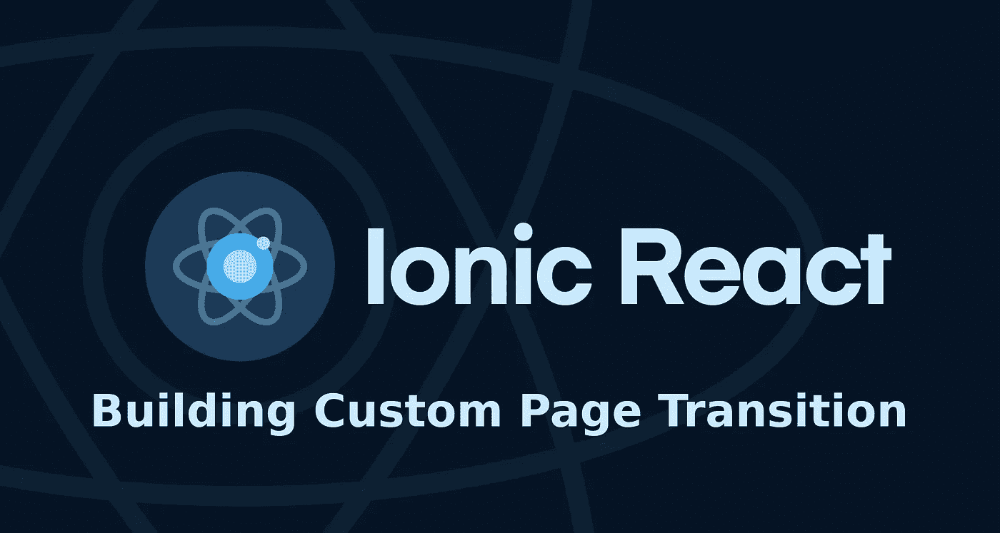

# Ionic React:实现自定义页面过渡动画

> 原文：<https://medium.com/nerd-for-tech/ionic-react-implementing-custom-page-transition-animation-48aa3086e9da?source=collection_archive---------6----------------------->

老实说，Ionic 中的默认页面转换工作得很好，但有时您的项目需要自定义页面转换——这在 Ionic 文档中没有很好地记录。



# 先决条件

首先确保您使用的是 Ionic React 和 Ionic React 路由器的版本 5.6.0 或更高版本，因为早期版本不支持自定义页面转换。

```
npm install [@ionic/react](http://twitter.com/ionic/react)@^5.6.0
npm install [@ionic/react-router](http://twitter.com/ionic/react-router)@^5.6.0
```

# 什么是 AnimationBuilder？

AnimationBuilder 本质上是一个函数，它接受一个基本元素和 options 对象，为给定的输入计算正确的动画，并返回一个 Ionic 动画元素。

在 Ionic 文档中，它被模糊地定义为:`(baseEl: any, opts?: any) => Animation`。所以我们来深究一下。

**巴塞尔**

第一个输入，`baseEl`，指的是 AnimationBuilder 附加到的元素。在我们的例子中，它将是`IonRouterOutlet`，因为我们覆盖了默认的页面转换动画，但是你也可以覆盖很多不同组件上的动画，比如 IonModal、IonAlert、IonPopover 等等。

**opts**

第二个输入，`opts`，options 的缩写，保存 Ionic 框架提供的选项，以便正确地计算动画。例如，如果用户向前导航，框架将包括`direction: "forward"`或者`direction: "back"`，如果用户向后导航到上一页。这允许您相应地调整动画。

这里列出了在`IonRouterOutlet`上覆盖动画时，选项对象中最重要的属性。

*   `animated: boolean` —指定是否应该制作过渡动画
*   `direction: "forward" | "back"` —指定导航方向
*   `enteringEl: Element` —指输入元素，通常为`IonPage`
*   `leavingEl: Element` —指离开元素，通常为`IonPage`
*   `mode: "ios" | "md"`

# 创建动画生成器

覆盖页面过渡动画的第一步是创建自己的 AnimationBuilder，它将取代当前动画。

下面是一个简单的 AnimationBuilder 的例子，它只返回一个空的动画。

现在，让我们修改这个动画来创建一个渐变页面过渡。

首先，我们需要通过调用动画对象上的`.addElement(opts.enteringEl)`来附加进入元素。

然后我们需要设置渐变效果:`.fromTo('opacity', 0, 1)`

最后我们设置持续时间:`.duration(250)`

重复上述步骤，只需将`opts.enteringEl`替换为`opts.leavingEl`，并切换`fromTo`值，使其从 1 渐变为 0。

最后，我们希望应用这两个动画，以便进入的元素淡入，离开的元素淡出。我们可以通过创建另一个空动画并调用`.addAnimation()`方法来实现。

您应该会得到这样的结果:

更多高级动画请参考[离子文档](https://ionicframework.com/docs/utilities/animations)。

# 在应用程序级别覆盖

现在我们已经准备好了 AnimationBuilder，是时候覆盖页面转换动画了。要在应用程序层面做到这一点，找到你的`IonRouterOutle`(通常在`App.tsx`)并将动画生成器传递给`IonRouterOutlet`的`animation`道具。

```
<IonRouterOutlet animation={animationBuilder}>
  <Route path="/" component={Home} />
  ...
</IonRouterOutlet>
```

# 在路线级别覆盖

您也可以仅在过渡到特定页面或从特定页面过渡时覆盖页面过渡动画。可以通过将 AnimationBuilder 传递给`IonRouterLink`元素的`routerAnimation`属性来实现。

```
<IonRouterLink
  routerLink="/contact-us"
  routerAnimation={animationBuilder}
>
  Contact Us
</IonRouterLink>
```

# 覆盖其他组件上的动画

现在您已经知道如何创建动画生成器，您也可以覆盖其他组件上的动画。比如:IonModal、IonAlert、IonPopover 等。请记住，在 AnimationBuilder 中传递给`opts`对象的属性可能不同。

# 想和我去喝杯咖啡吗？

这篇文章把你从一整天的谷歌搜索中解救出来了吗？厉害！你可以在这里给我买杯咖啡:[https://www.buymeacoffee.com/goranlisak](https://www.buymeacoffee.com/goranlisak)

还需要帮助吗？你可以在这里和我预约会面:[https://www.buymeacoffee.com/goranlisak/extras](https://www.buymeacoffee.com/goranlisak/extras)