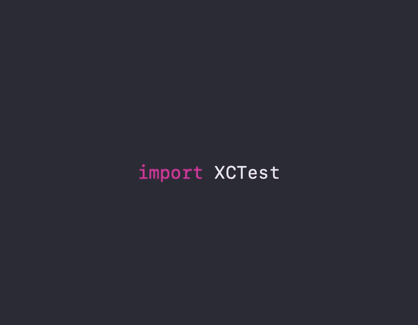

# iOS:行为测试——在 UI 和单元测试中给出——第 1 部分

> 原文：<https://medium.com/nerd-for-tech/ios-behavioural-testing-given-when-then-in-ui-unit-testing-part-1-41e3eff8811b?source=collection_archive---------7----------------------->

## iOS 测试指南



# 行为测试介绍

***什么时候给什么时候呢？***

这是一个讲故事的结构。解释我们应用程序中特定场景的故事。

> “你可以使用不同的故事格式，同时仍然进行行为测试——但我之所以在这里介绍它，是因为它已经被证明在各种形式和规模的许多项目中都有效。至少，你的故事应该包含模板中描述的所有元素。”——[丹北](https://dannorth.net/whats-in-a-story/)

***故事模板是这样的:***

```
**Title** (one line describing the story)

**Narrative:**
As a [role]
I want [feature]
So that [benefit]

**Acceptance Criteria:** (presented as Scenarios)

**Scenario 1:** Title
Given [context]
  And [some more context]...
When  [event]
Then  [outcome]
  And [another outcome]...

**Scenario 2:** ...
```

***我们来看一个账户持有人试图从 ATM 机提取现金的故事:***

```
**Story:** Account Holder withdraws cash

As an Account Holder
I want to withdraw cash from an ATM
So that I can get money when the bank is closed

**Scenario 1:** Account has sufficient fundsGiven the account balance is \$100
 And the card is valid
 And the machine contains enough money
When the Account Holder requests \$20
Then the ATM should dispense \$20
 And the account balance should be \$80
 And the card should be returned

**Scenario 2:** Account has insufficient fundsGiven the account balance is \$10
 And the card is valid
 And the machine contains enough money
When the Account Holder requests \$20
Then the ATM should not dispense any money
 And the ATM should say there are insufficient funds
 And the account balance should be \$20
 And the card should be returned

**Scenario 3:** Card has been disabledGiven the card is disabled
When the Account Holder requests \$20
Then the ATM should retain the card
And the ATM should say the card has been retained
```

它是由丹·诺斯首先提出的。他是一名技术和组织变革专家，从事指导、编码和咨询工作超过 25 年。他运用系统思维、精益和敏捷原则来解决复杂的业务和技术问题。

# UI 和单元测试中的行为测试

为此，我制作了一个简单的 calc 应用程序。我们有两个 textfieds 来获取输入，一个 segment 控件来获取数学运算符(+或-)，一个 equalsbutton(=) 来执行数学运算，还有一个 label 来显示答案。


# **单元测试:**

人们通常不会将这种结构应用到单元测试中，但是他们会在没有意识到的情况下间接地这样做，但是我们会直接应用它。正如我常说的，谁在乎呢🤷🏽‍♂️ 。

我的 viewcontroller 中有两个适合单元测试的方法。

```
**Methods we are going to unit test.**// Gets an object typed UITextField as input and returns an Int.**1) func getIntFrom(textField inputTextField: UITextField) -> Int**// Gets an Operator type and two Int inputs for performing math operations.**2) func calculateValues(withOperator sign:Operator, inputOne:Int, inputTwo:Int) -> String**
```

***注意:*运算符**是一个枚举

```
enum Operator: String {case addition = "+"case subtraction = "-"case multiplication = "*"case division = "/"}
```

让我们使用之前看到的模板为**计算值**方法编写故事。

```
**Title** calculateValues method performing math operation

**Narrative:**
As thecalculateValues method
I want to perform +/- math operations on the given values
So that I could pass it to the something

**Scenario 1:** Add two values
Given the input values are 1 & 2
  And the operator is Operator.addition
When  the calculateValues method is called with the given parameters
Then  the answer should be equal to 3
  And [Not required in this scenario]

**Scenario 2:** Subtract two values
Given the input values are 2 & 1
  And the operator is Operator.subtraction
When  the calculateValues method is called with the given parameters
Then  the answer should be equal to 1
  And [Not required in this scenario]
```

现在让我们进入单元测试类，编写测试代码。

```
**// Scenario 1: I want to add two values****//Given**let a = UITextField()a.text = "1"let b = UITextField()b.text = "2"**//And**var mathOperator : ViewController.Operator = .addition**//When**var answer = sut.calculateValues(withOperator: mathOperator, inputOne: sut.getIntFrom(textField: a), inputTwo: sut.getIntFrom(textField: b))**//Then**XCTAssertEqual(answer, "3", "Details: Input was  1 + 2 and the result should have been 3",file: "ViewController.swift",line: 61)// **Scenario 2: I want to subtract two values****//Given**a.text = "2"b.text = "1"**//And**mathOperator = .subtraction**//When**answer = sut.calculateValues(withOperator: mathOperator, inputOne: sut.getIntFrom(textField: a), inputTwo: sut.getIntFrom(textField: b))**//Then**XCTAssertEqual(answer, "1", "Details: Input was  2 - 1 and the result should have been 1",file: "ViewController.swift",line: 61)
```

下一个故事是关于 **getIntFrom(textField…** 方法的，让我们遵循相同的模板。

```
**Title** getIntFrom method getting the Int value from the UITextField object.

**Narrative:**
As the getIntFrom method
I want to get the Int value from the UITextField object
So that I could pass it to the something

**Scenario 1:** Pass a UItextField type as input and get an Int outGiven the input textfield has "1" as input
When  the getIntFrom method is called with the given input textfield
Then  the answer should be equal to Int type 1 
```

让我们为上面的故事写代码。

```
**Scenario 1:** **Pass a UItextField type as input and get an Int type out****//Given**let a = UITextField()a.text = "1"**//When**let result = sut.getIntFrom(textField: a)**//Then**XCTAssertEqual(result, 1, "Details: Input was  String type - 1  and the result should have been Int type - 1",file: "ViewController.swift",line: 38)
```

好了，伙计们，让我们在本文的 [**第二部分**](https://rajaikumar.medium.com/ios-behavioural-testing-given-when-then-in-ui-unit-testing-part-2-ffbf0228604a) 中讨论 UI 测试。

在此报告中找到完整的源代码:

[https://github.com/Rajaikumar-iOSDev/SimpleBDDExample](https://github.com/Rajaikumar-iOSDev/SimpleBDDExample)

[](https://github.com/Rajaikumar-iOSDev/SimpleBDDExample) [## rajaikumar-IOs dev/SimpleBDDExample

### 这是 swift 中 BDD(Given，When & Then)基本实施的一个例子。建立在单元测试之上的 UI 测试用例…

github.com](https://github.com/Rajaikumar-iOSDev/SimpleBDDExample) 

请记住，这个项目有测试计划和代码覆盖率，这在本教程中没有涉及。如果你需要了解更多，请告诉我。

BDD 参考:[https://dannorth.net/whats-in-a-story/](https://dannorth.net/whats-in-a-story/)

丹北参考:【https://dannorth.net/about/】T2