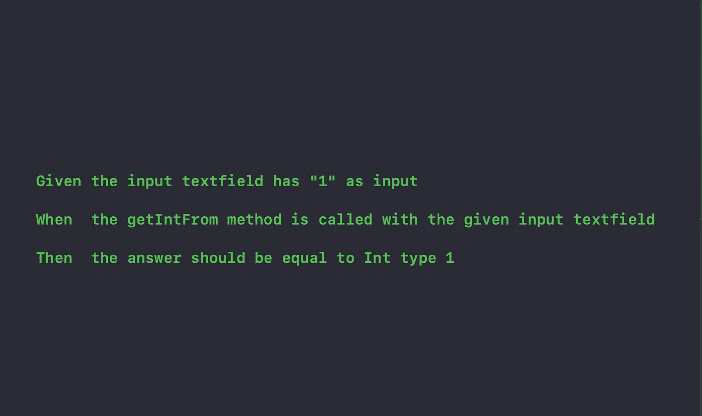
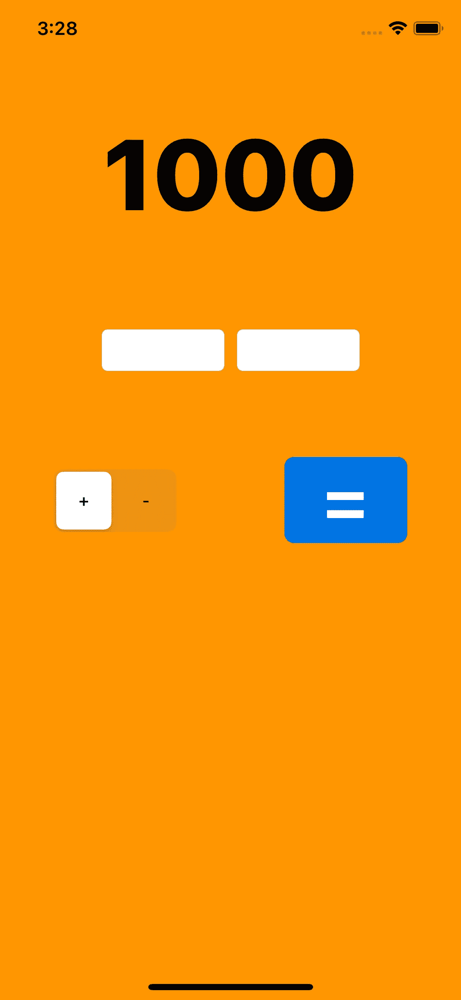

# iOS:行为测试——在 UI 和单元测试中给出——第 2 部分

> 原文：<https://medium.com/nerd-for-tech/ios-behavioural-testing-given-when-then-in-ui-unit-testing-part-2-ffbf0228604a?source=collection_archive---------8----------------------->

## iOS 测试指南



这是文章 [iOS:行为测试-在 UI 中给出的时候&单元测试-第 1 部分](https://rajaikumar.medium.com/ios-behavioural-testing-given-when-then-in-ui-unit-testing-part-1-41e3eff8811b)的延续。

我强烈建议在继续阅读本文之前先阅读第 1 部分。

让我们回顾一下，在第 1 部分中，我们看到了以下内容:

1.  ***是什么时候给的呢？***
2.  ***故事模板。***
3.  ***一个账户持有人试图从 ATM 机提取现金的故事。***
4.  ***单元测试中的行为测试。***

现在我们将在 UI 测试上实现我们用于单元测试的相同策略。

# **用户界面测试:**

让我们再来看看我们的应用程序屏幕。



这是一个简单的计算应用程序。我们有两个 textfieds 来获取输入，一个 segment 控件来获取数学运算符(+或-)，一个 equals 按钮(=) 来执行数学运算，还有一个 label 来显示答案。

***在写我们的故事之前，先看看故事模板。***

```
**Title** (one line describing the story)**Narrative:**
As a [role]
I want [feature]
So that [benefit]**Acceptance Criteria:** (presented as Scenarios)**Scenario 1:** Title
Given [context]
  And [some more context]...
When  [event]
Then  [outcome]
  And [another outcome]...**Scenario 2:** ...
```

现在我们要写一个有两个场景的故事。

1.  将文本字段中给出的两个值相加，并在标签上显示结果。
2.  减去文本框中给出的两个值，并在标签上显示结果。

让我们写下我们的故事。

```
**Title** User performs math operations

**Narrative:**
As a user of this simple calc app
I want to perform +/- math operations on the values in the textfield
So that I could know the answer.

**Scenario 1:** Add two values
Given the values are 1 & 2 in the 1st and 2nd textfields respectively
  And the + operator is selected in the segment control
When  the equals button(=) is pressed 
Then  the value shown in the label should be equal to 3

**Scenario 2:** Subtract two values
Given the values are 2 & 1 in the 1st and 2nd textfields respectively
  And the - operator is selected in the segment control
When  the equals button(=) is pressed 
Then  the value shown in the label should be equal to 1
```

现在让我们进入 UI 测试类，编写测试代码

**场景 1:** 将文本框中给出的两个值相加，并在标签上显示结果。

```
**Scenario 1:** Add two values**//Given**let inputOne = "1"let inputTwo = "2"let answer = "3"**//And**XCUIApplication().buttons["+"].tap()**//When**let textField1 =  app.textFields["TF1"]textField1.tap()textField1.typeText(inputOne)let textField2 =  app.textFields["TF2"]textField2.tap()textField2.typeText(inputTwo)app.buttons["="].tap()let answerLabel = app.staticTexts[answer]**//Then**XCTAssertTrue(answerLabel.exists,"Details: Input was 1+2 and expecterd answer is 3") 
```

**场景 2:** 将文本框中给出的两个值相减，并在标签上显示结果。

```
**Scenario 2:** Subtract two values**//Given**let inputOne = "2"let inputTwo = "1"let answer = "1"**//And**XCUIApplication().buttons["-"].tap()**//When**let textField1 =  app.textFields["TF1"]textField1.tap()textField1.typeText(inputOne)let textField2 =  app.textFields["TF2"]textField2.tap()textField2.typeText(inputTwo)app.buttons["="].tap()let answerLabel = app.staticTexts[answer]**//Then**XCTAssertTrue(answerLabel.exists,"Details: Input was 2-1 and expecterd answer is 1")
```

现在运行您的测试，看看奇迹。将这种结构作为基本形式，以便在此基础上学习更多内容。

***就这样了伙计们，我该离开了。***

在此报告中找到完整的源代码:

[https://github.com/Rajaikumar-iOSDev/SimpleBDDExample](https://github.com/Rajaikumar-iOSDev/SimpleBDDExample)

[](https://github.com/Rajaikumar-iOSDev/SimpleBDDExample) [## rajaikumar-IOs dev/SimpleBDDExample

### 这是 swift 中 BDD(Given，When & Then)基本实施的一个例子。建立在单元测试之上的 UI 测试用例…

github.com](https://github.com/Rajaikumar-iOSDev/SimpleBDDExample) 

请记住，这个项目有测试计划和代码覆盖率，这在本教程中没有涉及。如果你需要了解更多，请告诉我。