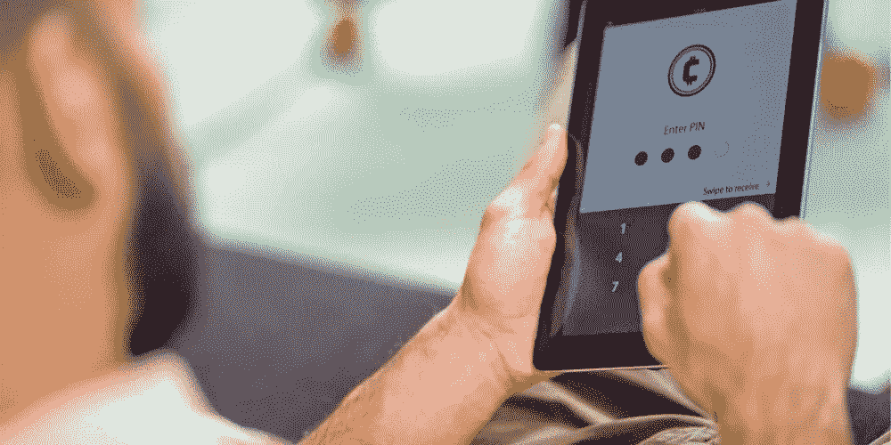
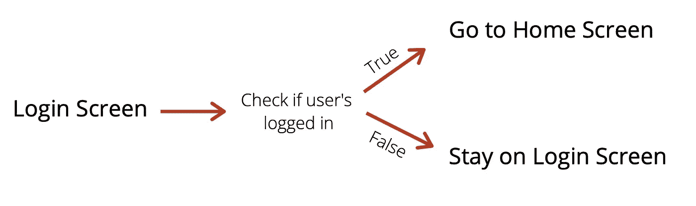
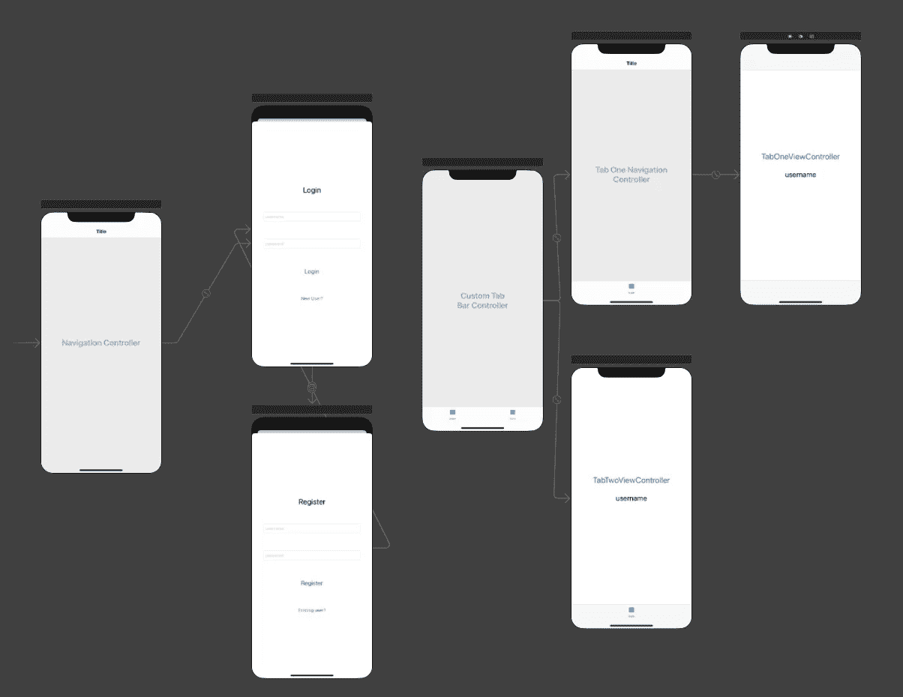
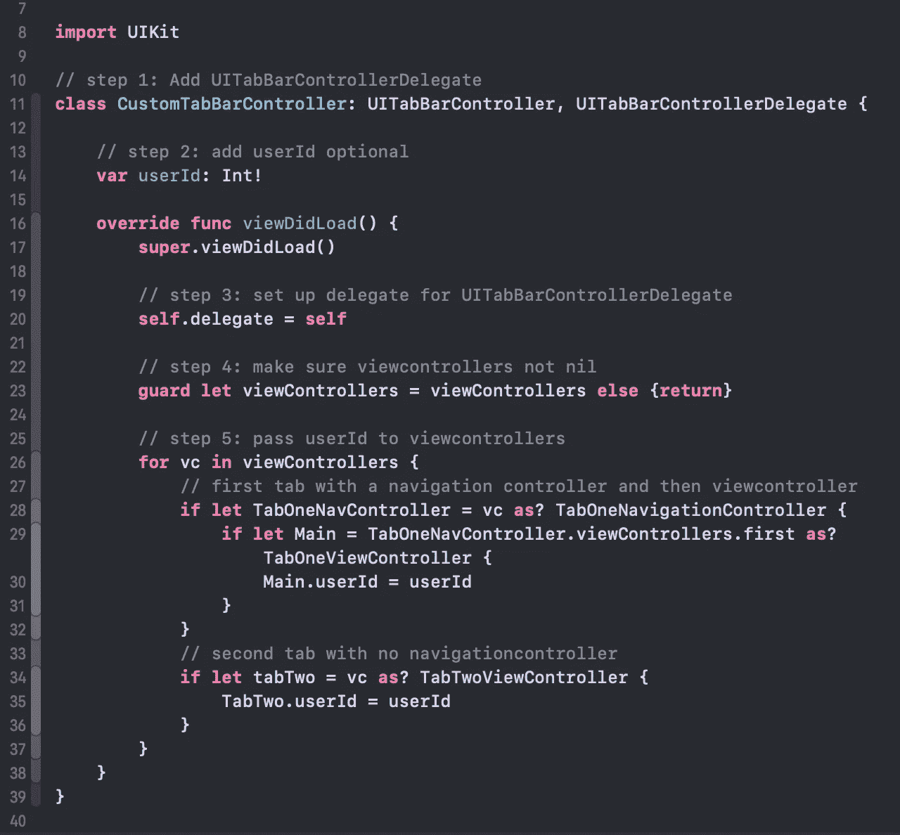
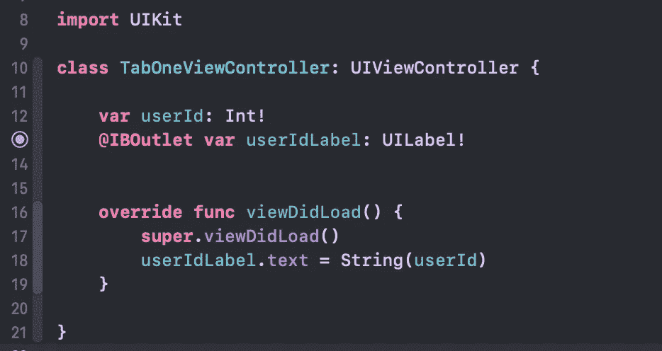
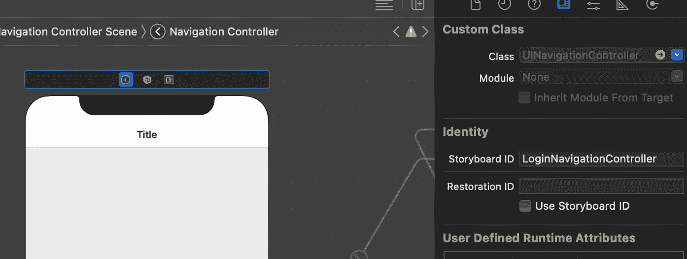
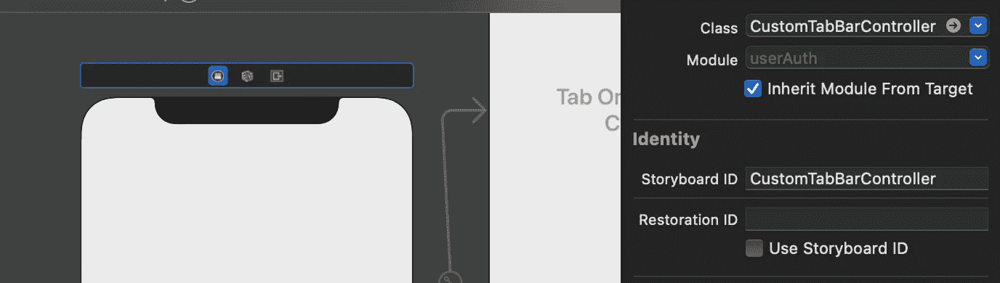
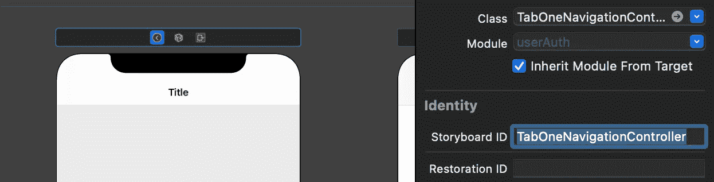
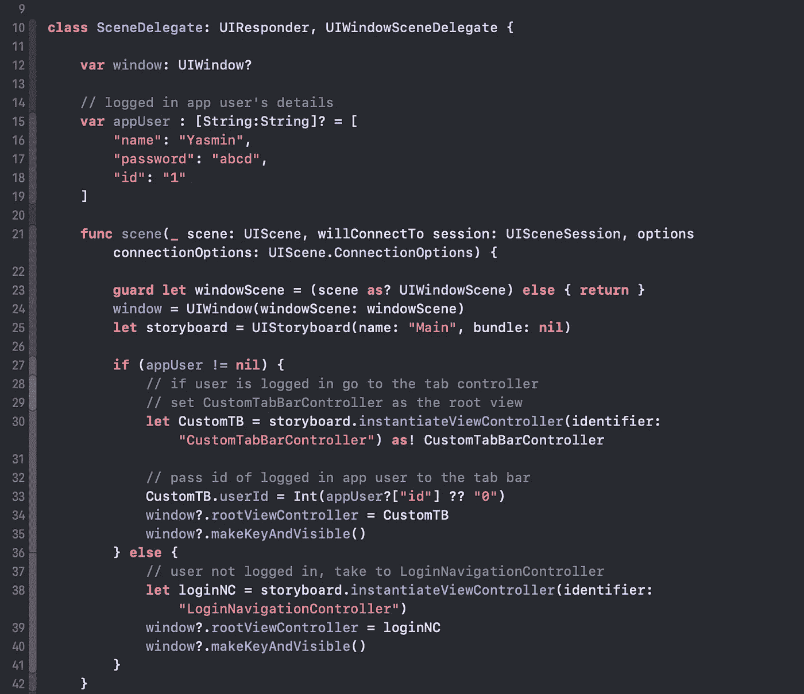

# iOS:如何从登录屏幕过渡到标签栏控制器？

> 原文：<https://medium.com/nerd-for-tech/ios-how-to-transition-from-login-screen-to-tab-bar-controller-b0fb5147c2f1?source=collection_archive---------2----------------------->



大多数应用程序用户希望一旦他们登录，他们应该保持登录状态，除非他们明确要求注销。

实现这一点的简单方法是遵循下面的导航流程:



认证导航流程不畅

使用这种方法的主要问题是，我们继续将屏幕推到堆栈上，增加了内存使用量，最终降低了应用程序的速度。

在本文中，我将向您展示如何通过根据用户的登录状态更改根视图控制器来避免这个问题。

我还将向您展示如何使用以下流程将数据从登录屏幕传递到选项卡栏:


良好的认证导航流程

# **示例 App**

本节讨论示例应用程序的设置，我将使用它来解释这种转变。我强烈建议你浏览一下这篇文章，这样你就可以熟悉设置了！

## 故事板



应用程序的故事板

我为 tabBarController 创建了一个名为`CustomTabBarController`的自定义类，它有两个标签项:

1.  `TabOneNavigationController`这导致了`TabOneViewController`
2.  `TabTwoViewController`没有导航控制器

在这两个例子中，我们将登录用户的`userId`传递给标签栏控制器，并在屏幕上显示结果。

如果用户正在登录，那么`userId`将从`LoginViewController.swift`通过。

如果用户已经登录，并刚刚启动了应用程序，我们将从`sceneDelegate.swift`传递它。

## 用户

在一个真实的 iOS 应用程序中，您可能会从您选择的数据库中使用一种特定的方法来发现该应用程序是否有任何登录的用户。

然而，为了使本教程适用于每个人，我将简单地使用一个字典，其中包含一个虚构用户的键对值。

我正在把这本字典添加到`LoginViewController.swift`和`sceneDelegate.swift`中。

```
**var** appUser : [String:String]? = [
    "name": "Yasmin",
    "password": "abcd",
    "id": 1
]
```

## CustomTabBarController

在这里我们创建了一个名为`userId`的变量。第 26–32 行显示了如果有导航控制器，如何通过`userId`:

`CustomTabBarController`->-`TabOneNavigationController`->-`TabOneViewController`

第 34–35 行是没有导航控制器的示例:

`CustomTabBarController`——>——



向视图控制器传递数据的 CustomTabBarController 类

## TabOneViewController

这里我们有将被分配给 UILabel 并显示在屏幕上的`userId`变量。



视图控制器在屏幕上显示从登录/场景 Delegate 传递的用户 ID

`TabTwoViewController`也会一样。

现在我们已经介绍了示例应用程序，让我们看看如何从登录控制器转换到选项卡控制器，并传递用户 ID。

# 步骤 1:添加故事板 id

如果您还没有这样做，将故事板 ID 添加到`LoginNavigationController`、`CustomTabBarController`、&、`TabOneNavigationController`。



正在将情节提要 ID 添加到 LoginNavigationController



正在将情节提要 ID 添加到 CustomTabBarController



正在将情节提要 ID 添加到 TabOneNavigationController

# 步骤 2:配置 SceneDelegate

在`sceneDelegate`的`willConnectTo session`中，我们可以指定我们的根场景(初始视图)。在这里，我们可以检查我们的应用程序是否有登录的用户，并相应地设置根视图。



SceneDelegate.swift 在应用程序启动时设置初始根视图

如果你启动你的应用程序，你会看到我们的`sceneDelegate`现在正在处理初始视图，我们可以将 ID 传递给我们的两个选项卡屏幕。

我们就要完成了，坚持住！

# 步骤 3:创建一个助手函数来设置根 ViewController

用户登录时会发生什么？

我们想要发生的是将根视图控制器改为`CustomTabBarController`。

为此，我们将在`sceneDelegate.swift`中创建一个函数，然后我们可以在应用程序的其余部分调用它。

我将调用函数`setRootViewController`，它的参数将是我们要更改的视图控制器以及登录用户的`userId`。

我们只在用户登录时传递`userId`(而不是当他们注销时),因此它可以为零。

```
**func** setRootViewController(**_** vc: UIViewController, **_** userId: Int? = nil) {
     **if** **let** window = **self**.window {
          // if we are logging in, pass the userId
          **if** **let** customTb = vc **as**? CustomTabBarController {
               customTb.userId = userId
          }
          window.rootViewController = vc
     }
}
```

# 步骤 4:处理登录和注册

现在在`LoginViewController.swift`中，在登录功能中，我们可以调用`setRootViewController`。

```
**let** storyboard = UIStoryboard(name: "Main", bundle: **nil**)**let** mainTabBarController = storyboard.instantiateViewController(identifier: "CustomTabBarController") **as**! CustomTabBarController(UIApplication.shared.connectedScenes.first?.delegate **as**? SceneDelegate)?.setRootViewController(CustomTabBarController, String(appUser["id"] ?? "0"))
```

就这么简单！

确保对`RegisterViewController`也重复此操作。

# 步骤 5:处理注销

无论您在哪里处理注销功能，请遵循以下代码:

```
**let** storyboard = UIStoryboard(name: "Main", bundle: **nil**)**let** loginNavController = storyboard.instantiateViewController(identifier: "LoginNavigationController")(UIApplication.shared.connectedScenes.first?.delegate **as**? SceneDelegate)?.setRootViewController(loginNavController)
```

如您所见，对于注销，我们不需要将 userId 作为参数传递。

如果你测试登录和退出你的应用程序，你会注意到它似乎有点故障，大多数开发良好的应用程序在屏幕之间切换时使用某种动画。

# 步骤 6:(可选)添加动画

回到`setRootViewController()`，我们可以给画面变化添加一个动画。

```
**func** setRootViewController(**_** vc: UIViewController, **_** userId: Int? = nil) {
     **if** **let** window = **self**.window {
          // if we are logging in, pass the userId
          **if** **let** customTb = vc **as**? CustomTabBarController {
               customTb.userId = userId
          }
          window.rootViewController = vc // adding animation UIView.transition(with: window, 
                            duration: 0.8,
                            options: .transitionCurlDown, 
                            animations: **nil**)
     }
}
```

我选择了`transitionCurlDown`,但是请随意尝试所有其他动画选项，选择最适合你的应用程序的！

在此查看其他选项:

 [## Apple 开发者文档

### 动画选项

developer.apple.com](https://developer.apple.com/documentation/uikit/uiview/animationoptions) 

搞定了。！！！

如果有什么不太清楚的地方，请评论或私信我。