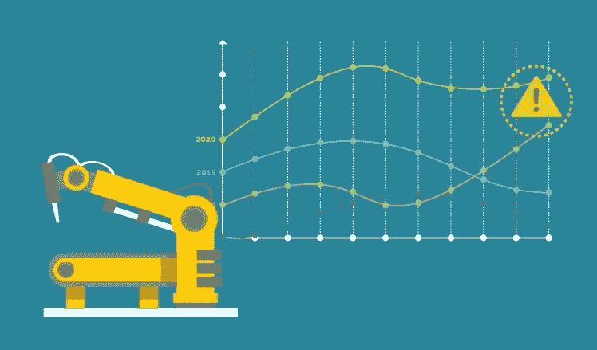
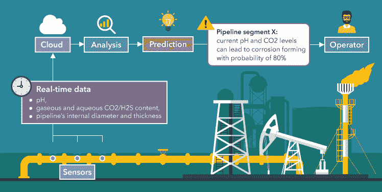

# 物联网传感器厂内维护

> 原文：<https://medium.com/nerd-for-tech/iot-sensors-in-plant-maintenance-48d4b69ff9ba?source=collection_archive---------5----------------------->

# 介绍

物联网是常规设备与互联网的互联。物联网概念这么大。它被称为继蒸汽、大规模生产和互联网之后的第四次工业革命或工业 4.0。在本文中，我们将了解物联网传感器如何通过使用 AI &机器学习来做预测分析，从而将实时数据交给高速计算机。这项技术将改善维护，减少故障，减少工时消耗。

制造商一直在研究一种基于时间的设备维护方法。他们硬把机器的年龄作为组织日常维护的问题。作为设备，需要执行的重复维护程序越多。制造商可能会影响工业物联网和数据科学，以避免无效的维护例程和随之而来的成本。

# 描述

未来几年，物联网将在提高产出和竞争力方面发挥重要作用。这将使工厂和工厂的电力管理更加高效。这将通过在不需要时自动改变环境控制系统以降低能耗来产生。

预测系统监控设备的潜在故障。当需要更换零件时，他们会通知我们。嵌入设备中的传感器监控异常情况，并在违反安全操作限制时激活工作指令。

# 物联网架构示例

*   [对控制电池健康的主要变量进行分类非常重要。](https://www.technologiesinindustry4.com/2021/08/iot-use-case-as-the-next-generation-smart-home.html)
*   温度、电压和放电是重要的变量。
*   电池配备了传感器来收集关于这些参数的数据，并在识别出这些数据后将其传输到云端进行处理。
*   传感器数据在通过现场网关时可能不会直接传到云端。
*   这些是筛选和预处理数据的物理设备。
*   云网关确保数据安全传输。
*   [它通过多种协议提供连接性，能够连接多个现场网关。](https://www.technologiesinindustry4.com/2021/07/how-does-iot-work-with-blockchain.html)
*   在进入云之后，传感器数据到达一个流数据处理器。它的目标是允许连续的数据流快速、良好地传输到数据湖。
*   数据湖保存传感器收集的数据。
*   它可能是不正确的，有缺陷的，或包含不相关的项目，因为还未加工。
*   它以平行时间测量的多组传感器读数的形式提供。
*   当需要数据来洞察电池的健康状况时，它被加载到大型数据仓库中。
*   大数据仓库保存净化的结构化数据。
*   它包括在特定时间测量的温度、电压和放电参数等参数。还包括关于电池的上下文信息，如类型、位置、充电日期等。
*   通过机器学习算法分析准备后的数据。
*   实现它们是为了揭示数据集中看不见的相关性
*   已知的数据模式在预测模型中重现。
*   预测模型正被用于对电池中的自放电事件进行分类。
*   他们识别容量低于正常值的电池，或者猜测电池的持续使用寿命。
*   在探索性分析阶段，许多技术规则都经过测量，以支持选择最适合的机器学习算法。
*   用户应用允许基于物联网的预测性维护解决方案关注潜在电池故障的用户。
*   预测性维护架构可以包括额外的组件，例如致动器和控制应用。
*   这些都建立在预测结果的基础上，因为控制应用程序可以设置为向设备的执行器发送指令。

# 远程资源

[物联网将使地理上分散的维修成为可能。通过预言性的保护，它将减少对遥远分散的手段的免费服务访问。](https://www.technologiesinindustry4.com/2021/06/iot-in-the-business-world.html)想象一下，在 CMMS，风力农场、变电站和水泵通过一系列有计划的行动事实来制定自己的工作指令。这将减少维修时间，进而降低与这些需求维修相关的成本。

每个业务类型都可以从物联网偏向和服务中发现线下价值。不过，这只有在物联网与类似于 CMMS 软件的其他操作完美互动时才能实现。物联网也可能改变原始设备制造商的游戏规则。原始设备制造商将通过持续的监控和分析产生附加值。类似地，组织可以以更实际的方式分配他们的资金。

[只有全面审视资产运营，物联网的实际价值才能得到充分认可。](https://www.technologiesinindustry4.com/2021/06/iot-in-the-business-world.html)基本虚拟云网络将重复收集、汇总和模拟数据，以直接预测故障。并且将可能性放在适当的位置以限制它们对系统空间的影响。

# 面向行业的预测性维护解决方案

以下是已经应用基于物联网的预测性维护解决方案的行业。

*   [离散制造业](https://www.technologiesinindustry4.com/2021/06/iot-in-the-business-world.html)
*   流程制造
*   石油和天然气
*   电力工业
*   铁路
*   建筑

# 结论

基于物联网的预测性维护覆盖设备的整个生命周期。它支持消除多达 30%的基于时间的日常维护。它减少了 50%的设备停机时间。然而，需要一个全面的架构，强调机器学习，以建立可靠的预测性维护解决方案。

更多详情请访问:[https://www . technologiesinindustry 4 . com/2021/11/IOT-sensors-in-plant-maintenance . html](https://www.technologiesinindustry4.com/2021/11/iot-sensors-in-plant-maintenance.html)