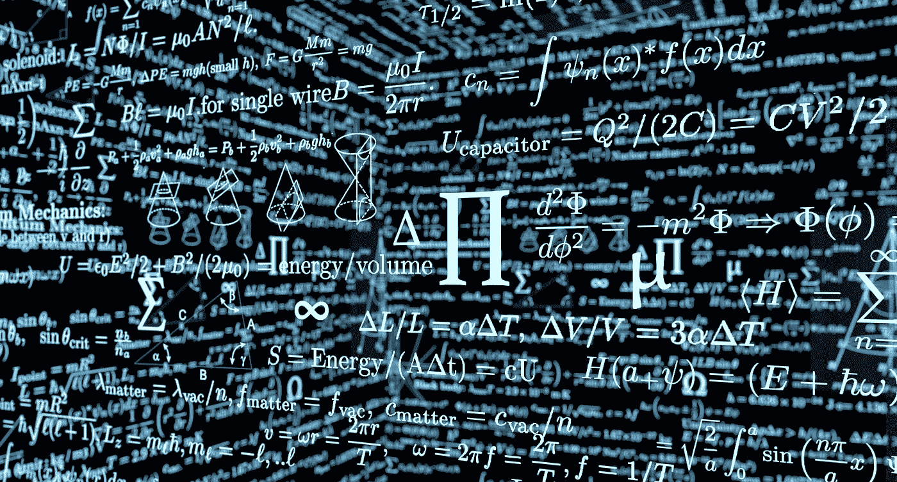
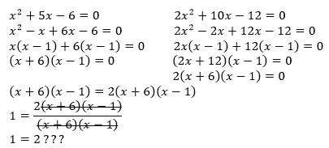
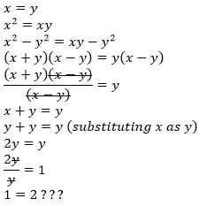

# 1 = 2 吗？

> 原文：<https://medium.com/nerd-for-tech/is-1-2-3e58047dbc96?source=collection_archive---------4----------------------->

页（page 的缩写）丙:犹太大学

数学是一门关于数字的学科。这个领域可以达到很高的高度，但它永远不会说两个不同的数字是相等的。在本文中，我将展示如何证明 1 = 2，然后如何销毁这个看似无可辩驳的证据。

首先取 2 个二次方程:x + 5x + 6 = 0 和 2x + 10x + 12 = 0。我们知道这两个方程可能是真的，因为第二个方程是第一个方程的两倍，所以我们基本上是在方程的两边乘以 2，等于 2 x 0 = 0。现在让我们看看接下来会发生什么:

这个结论是什么？1 = 2?这怎么可能呢？这些可能是你们现在正在思考的问题。然而，我将向你展示一个巧妙隐藏的“错误”会在哪里发生。

在问题的第二部分，我们将两个方程等同起来，我们将(x+3)和(x+2)推到方程的右边。问题就出在这里。如果我们希望二次方程为真，那么(x+3)和(x+2)的乘积必须等于零。如果这是真的，那么(x+3)或(x+2)必须等于零。如果它们中的任何一个是零，那么我们不能把它推到另一边，因为我们不能把任何数除以零！这是数学的基本规则之一，人们不能简单地忽视它！这就是为什么我们不能使用这种方法并声明 1 = 2！

我们可以用另一种方法证明 1=2 遵循同样的原理:

在这里，我们除以 0 的地方在第 4 行。因为 x=y，x-y=0。所以，我们不能在分子和分母中抵消 x-y，因为你不能用 0 除任何东西。

用第一种方法，我们基本上可以证明任何一个数都等于另一个数，因为我们只是用一个不同的数乘以 0。所以从下次开始，记住你不能用零除任何东西！