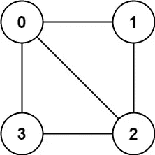
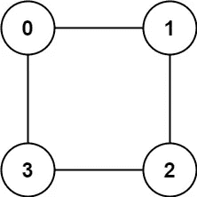
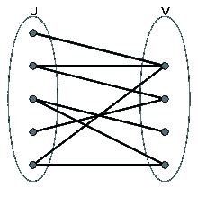
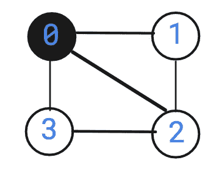
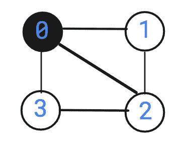
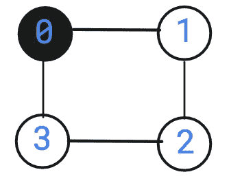
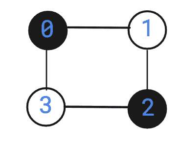

# 图是二分的吗？—第 76 天(Python)

> 原文：<https://medium.com/nerd-for-tech/is-graph-bipartite-day-76-python-c0c3cdc9585e?source=collection_archive---------5----------------------->


照片由[本杰明·史密斯](https://unsplash.com/@ifbdesign?utm_source=medium&utm_medium=referral)在 [Unsplash](https://unsplash.com?utm_source=medium&utm_medium=referral) 上拍摄

今天的问题来自 leetcode 的每日编码挑战。这个问题在脸书的采访中经常被问到。让我们看看问题陈述。

[](https://leetcode.com/problems/is-graph-bipartite/)****。图是二分的吗？****

**有一个**无向图**有`n`个节点，每个节点在`0`和`n - 1`之间编号。给你一个 2D 数组`graph`，其中`graph[u]`是与节点`u`相邻的节点数组。更正式地说，对于`graph[u]`中的每个`v`，在节点`u`和节点`v`之间有一条无向边。该图形具有以下属性:**

*   **没有自边缘(`graph[u]`不包含`u`)。**
*   **没有平行边(`graph[u]`不包含重复值)。**
*   **如果`v`在`graph[u]`中，那么`u`在`graph[v]`中(图是无向的)。**
*   **该图可能没有连接，这意味着可能有两个节点`u`和`v`，使得它们之间没有路径。**

**如果节点可以被分成两个独立的集合`A`和`B`，使得图中的每条边**连接集合`A`中的一个节点和集合`B`中的一个节点，则图是**二部图**。****

**返回`true` *当且仅当它是* ***二部*** 。**

****例 1:****

****

```
**Input:** graph = [[1,2,3],[0,2],[0,1,3],[0,2]]
**Output:** false
**Explanation:** There is no way to partition the nodes into two independent sets such that every edge connects a node in one and a node in the other.
```

****例 2:****

****

```
**Input:** graph = [[1,3],[0,2],[1,3],[0,2]]
**Output:** true
**Explanation:** We can partition the nodes into two sets: {0, 2} and {1, 3}.
```

****约束:****

*   **`graph.length == n`**
*   **`1 <= n <= 100`**
*   **`0 <= graph[u].length < n`**
*   **`0 <= graph[u][i] <= n - 1`**
*   **`graph[u]`不包含`u`。**
*   **`graph[u]`的所有值都是**唯一的**。**
*   **如果`graph[u]`包含`v`，那么`graph[v]`包含`u`。**

**在我们开始讨论算法之前，让我们了解一下什么是二分的。**

> **根据维基百科，**
> 
> **在[图论](https://en.wikipedia.org/wiki/Graph_theory)的[数学](https://en.wikipedia.org/wiki/Mathematics)领域中，一个**二部图**(或**二部图**)是一个[图](https://en.wikipedia.org/wiki/Graph_(discrete_mathematics))，它的[顶点](https://en.wikipedia.org/wiki/Vertex_(graph_theory))可以分成两个[不相交的](https://en.wikipedia.org/wiki/Disjoint_sets)和[独立集合](https://en.wikipedia.org/wiki/Independent_set_(graph_theory)) U 和 V，使得每个[边](https://en.wikipedia.org/wiki/Edge_(graph_theory))将 U 中的一个顶点连接到 V 中的一个顶点。顶点集合 U 和 V 是等价地，二部图是不包含任何奇数长度[圈](https://en.wikipedia.org/wiki/Cycle_(graph_theory))的图。**

****

**偶图**

**让我们举一个例子，看看我们是否能把它转换成一个二分图。**

**例 1。**

****

**因为上面的图是一个完整的图，所以不可能把它做成二部图。**

**例 2。**

********

**偶图**

**为了解决这个问题，我们需要给每个节点分配颜色。例如，假设我们使用两种颜色，黑色和白色。我们开始的节点将被涂成白色。这些节点的邻居将被涂成黑色，然后当前节点的邻居将被涂成白色。我们将在一个循环中继续这样做，直到我们给所有的节点着色。**

**怎么知道能不能有二部图？**

**当我们继续给图着色时，如果在任何一点到达一个先前着色的节点，我们需要检查该节点的当前颜色是否等于该节点的预期颜色。如果是，我们可以继续着色，否则图不是二分的。**

**让我们举一个例子，**

**示例 1:**

****

**让我们从节点 0 开始。我们将把它涂成黑色。**

****

**现在，0 的所有相邻节点都是白色的。在这种情况下，1、2 和 3 是白色的。**

****

**接下来，1 的邻居被涂成黑色。1 的邻居是 0 和 2。但是我们已经用白色给 2 着色了，这意味着有冲突。因此我们需要返回 False。**

**例 2。**

****

**让我们从节点 0 开始。我们将把它涂成黑色。**

****

**接下来，我们将把节点 0 的邻居涂成白色。节点 0 的邻居将包括 1 和 3。**

****

**接下来，我们将 1 的邻居涂成黑色。节点 1 的邻居将被涂成黑色。1 的邻居将包括节点 2 和 0。**

****

**接下来，我们将 2 的邻居涂成白色。2 的邻居将包括 3 和 1。既然我们已经给它上色了，就不需要再上色了。类似地，我们需要给节点 3 的邻居上色。因为它们已经被着色并且没有冲突，我们不需要再次着色它们。**

**我们可以使用 BFS 或 DFS 来解决这个问题。我们将使用 BFS 和 DFS 来解决这个问题。**

**使用 BFS 的解决方案。**

**因为我们以前解决过 BFS 问题，所以我不会深入解释 BFS 算法。**

**我们需要一个能够跟踪每个节点颜色的字典。需要记住的一点是，在问题陈述中提到了图形不一定是相连的。因此我们将不得不使用一个循环来遍历所有的节点。需要记住的另一点是，如果当前节点已经被访问过，那么我们需要确保这个节点的颜色是我们想要绘制的颜色，否则我们将返回 False。**

**让我们来看看代码片段。**

```
class BipartiteChecker:
    def isBipartite(self, graph: List[List[int]]) -> bool:
        #Dictionary
        color = {}
        for each_node in range(len(graph)):
           #if not visited already
            if each_node not in color:
                neighbors = [each_node]
                next_neighbors = []
                curr_color = True
                while neighbors:
                    out = neighbors.pop(0)
                    if out in color:
                        #Check if current color is intended color
                        if color[out] != curr_color:
                            return False
                    else:
                        color[out] = curr_color
                        for i in graph[out]:
                            next_neighbors.append(i)
                    if neighbors == []:
                        curr_color = not curr_color
                        neighbors, next_neighbors = next_neighbors,neighbors
        return True
```

****复杂性分析。****

****时间复杂度****

**因为每次我们访问通过边连接的节点，时间复杂度是 O(N+E ),其中 N 是节点的数量，E 是边的数量。**

****空间复杂性。****

**因为我们使用字典来存储彩色节点，所以空间复杂度是 O(N ),其中 N 是节点的数量。**

**让我们看看使用 DFS 的代码片段。**

```
class BipartiteChecker:
    def isBipartite(self, graph: List[List[int]]) -> bool:
        color = {}
        def dfs(curr_node, curr_color):

            if curr_node in color:
                if color[curr_node] != curr_color:
                    return False
                else:
                    return True
            else:
                color[curr_node] = curr_color
            for each_node in graph[curr_node]:
                if not dfs(each_node, not curr_color):
                    return False
            return True

        for all_node in range(len(graph)):
            if all_node not in color:
                if not dfs(all_node, True):
                    return False
        return True
```

****复杂性分析。****

****时间复杂度****

**因为每次我们访问通过边连接的节点，时间复杂度是 O(N+E ),其中 N 是节点的数量，E 是边的数量。**

****空间复杂度。****

**因为我们使用字典来存储彩色节点，所以空间复杂度是 O(N ),其中 N 是节点的数量。**