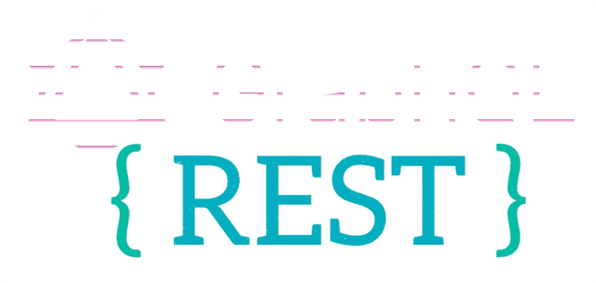

# 是不是到了 REST APIs 休息，GraphQL 崛起的时候了？

> 原文：<https://medium.com/nerd-for-tech/is-it-time-for-rest-apis-to-rest-and-graphql-to-rise-da4f9d28ee72?source=collection_archive---------2----------------------->

过去几年中另一个有趣的技术进步是向 GraphQL 的转移。在多年鼓吹 RESTful APIs 之后，现在公司正在转向 GraphQL。目前，我正在做一个项目，从激增的 RESTful APIs 迁移到 GraphQL。有趣的是，看到 REST 的采用率上升又突然下降，许多技术都是如此。就在几年前，我读到一篇文章，上面写着“安息吧，肥皂”([https://royal.pingdom.com/rest-in-peace-soap/](https://royal.pingdom.com/rest-in-peace-soap/))。这一次的移动，是从肥皂到休息。使用 REST 几年后，我们又开始了。安息吧，安息吧:)([https://nordicapis . com/is-graph QL-the-end-of-REST-style-APIs/](https://nordicapis.com/is-graphql-the-end-of-rest-style-apis/))。如今技术进步不就是这样吗？现在，问题是:为什么人们会选择 GraphQL 而不是 RESTful APIs？

1.一个端点对多个端点:

我今天遇到的主要问题是端点的爆炸，这些端点很难被发现并且没有被很好地记录。您可能需要为每个资源创建一个端点。例如，如果您有一个帖子数据库，您可能有帖子集合、评论集合和作者集合。要获取一篇文章，您可以调用 GET mydomain.com/posts.，在这种情况下，您可以获取所有带有作者 id 的文章。要获得用户信息，你必须在每篇文章中再调用一次来获得用户信息，获得 mydomain.com/Authors/:id.，然后获得每篇文章的评论，你需要运行多个其他请求。然后让用户写下每个评论…你明白了。

在 GraphQL 中，您只需运行一个包含您想要的嵌套查询的查询。这不是很酷吗:)

2.网络请求:

从上面的例子可以明显看出，REST 中的请求比 GraphQL 多得多。在这种情况下，GraphQL 减少了网络请求，从而提高了性能和速度。

3.提取过量/不足:

在 RESTful APIs 中，不管您需要什么，您都会得到完整的输出(过度获取)，或者您得到的可能比您需要的少，并且您将不得不像第一个例子那样进行多次循环(获取不足)。

4.版本控制:

RESTful APIs 的一个主要问题是版本控制和向后兼容性。GraphQL 版本较少。您可以轻松地引入/弃用字段。

5.文件:

这是 GraphQL 的一大好处。如你所知，开发人员讨厌文档和更新文档。这是 GraphQL 免费提供的。