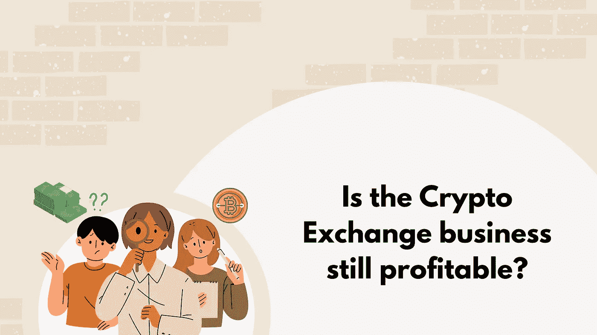

# 开始一项密码交易业务仍然有利可图吗？

> 原文：<https://medium.com/nerd-for-tech/is-starting-a-crypto-exchange-business-still-profitable-66d2c7a8cc59?source=collection_archive---------13----------------------->

## 在这场加密危机中，开创加密交易业务还是一个好主意吗？—了解更多！

嗯，这是最近密码界的人经常问的问题，因为无数的企业家和商人正在进入密码交易行业。因此，我们有理由认为，加密交易业务的需求和利润是否仍在上升。

但事实是，加密货币在金融科技领域产生的影响一点也不简单。它吸引了投资者的注意力，交易加密货币的人数正在以更快的速度增加。加密交易所是交易者购买、出售或交换加密货币的唯一媒介。因此，对加密交换平台的需求也在同步增长。这是密码市场上利润最高的行业之一。

**为什么加密交易所利润很高？**

有各种各样的原因使加密交换业务成为有利可图的商业模式。让我们来研究一下。

*   它是交易加密货币的唯一媒介来源。
*   由于提供了加密交换克隆脚本，开始使用所需的时间更少。
*   需要最小的投资来获得克隆脚本。
*   你不需要更多的资源和技术知识
*   它具有高投资回报率的特点，从而产生更多的利润。
*   一旦开始，它会在很长一段时间内带来被动收入。

这些都是决定加密交易业务利润的一些主要因素，这些因素驱使许多企业家涉足加密交易业务。在所有这些方面，有一点是显而易见的，那就是加密交换克隆脚本。因为这些仅适用于使用克隆脚本创建加密交换。让我们更详细地了解一下。

**加密交换克隆脚本的重要性**

加密交换克隆脚本是现成的软件，是成功运行的加密交换平台的副本。它包含原始加密交换的所有功能和安全选项。端到端可定制，可在一周内部署。一切都属于预算友好的范畴。

除此之外，一个加密交换平台也可以从零开始创建，但大多数人不这么做的原因是。因为它需要更多的投资、资源和时间，同时还存在一些安全问题。只需很少的投资，人们就可以通过获得克隆脚本快速启动一个加密交易，并开始从中获利。既然我们已经看到了克隆脚本的重要性，我们还将看看从哪里获得克隆脚本。

**哪里可以得到加密交换克隆脚本**

获得一个加密交换克隆脚本并不是一件困难的事情，现在有很多脚本提供者。您可以选择一个值得信赖的克隆脚本提供商，传达您的所有业务需求，并且在 7 到 10 天内您可以启动您的加密交换平台。但是在选择一个克隆脚本提供商时要小心，做一些研究，寻找他们的评级、评论、投资组合、他们提供的服务以及他们收取的费用。如果您基于这些因素选择克隆脚本提供者，您可以筛选出市场上最好的克隆脚本提供者。

**遗言**

我们已经看到了很多决定加密交易利润的因素，最可取的方法，以及克隆脚本的重要性。长话短说，加密交易业务仍然是一个有利可图的，这将随着加密货币的增长而上升，一个人计划开始加密交易业务的方式也使你的交易业务利润甚至更高。如果你是一名企业家，不知道现在开始一项加密交易业务是否是一个好主意，答案是永远都不晚。明智地选择，利用加密交换克隆脚本，以较少的投资，赚取更高的利润。