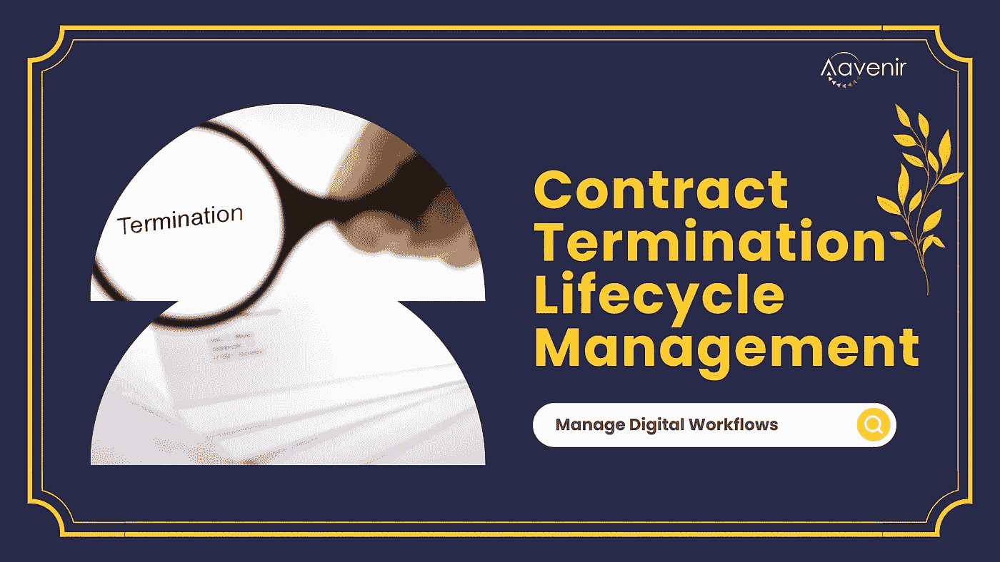
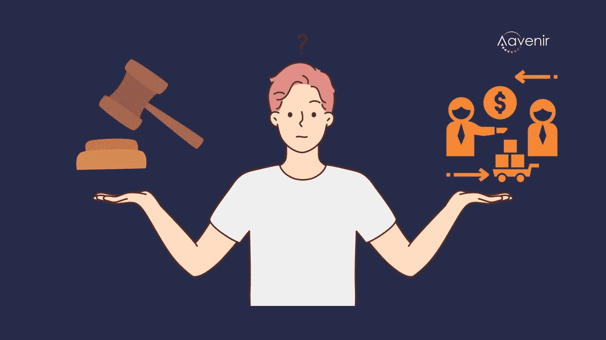

# CLM 解决方案可以逐步终止合同吗？

> 原文：<https://medium.com/nerd-for-tech/is-step-by-step-contract-termination-possible-with-clm-solutions-1909b41d2484?source=collection_archive---------2----------------------->

通常，听起来简单的过程在执行时会变得复杂。一个这样的过程是有效合同的终止。合同终止生命周期管理是管理合同终止的过程，从最初决定终止合同到最终执行终止和任何必要的后续行动。该流程可能包括各种活动，例如协商终止条款、记录终止情况，以及确保所有相关方了解并遵守合同条款。

# **有效的合同终止生命周期管理的重要性**

有效的合同终止生命周期管理可以确保合同顺利终止，并遵循商定的条款。它还有助于防止误解和争端，并保护有关各方的权益。

管理合同终止生命周期对于确保合同适当终止以及保护各方至关重要。这也有助于防止未来的纠纷和法律问题。

# **合同终止的 5 步流程**

这个过程通常包括几个步骤，包括

# **1。确定是否需要终止合同:**

这可能是由于一方违约、合同期限届满或其他原因。

# **2。通知对方:**

希望终止合同的一方必须书面通知另一方，通常附有终止意向书。

# **3。解决未决问题:**

双方必须共同努力解决任何悬而未决的问题，如未付发票或对合同条款的争议。

# **4。最终确定终止:**

一旦所有悬而未决的问题得到解决，双方可以通过签署终止协议最终终止合同。该协议应包括如何以及由谁来处理任何剩余义务的细节，例如归还任何财产或支付任何剩余费用。

# **5。合同存档:**

合同一旦终止，应妥善存档备查。这可能涉及存储合同的物理副本或将电子副本上传到安全数据库。

[下载合同终止流程清单，了解合同终止生命周期管理的理想流程。](https://aavenir.com/resource/contract-termination-process-checklist/)

# **从源头到支付周期中合同终止的责任——法律还是采购？**

法律与采购

从源头到付款的流程包括企业内部采购、法律和财务团队以及供应商之间的密切合作。在这里，由谁负责终止合同可以根据具体情况和合同条款而有所不同。然而，一般来说，通常是希望终止合同的一方负责启动终止程序。但是，如果合同因一方违约而被终止，则未违约的一方将负责启动终止程序。例如，如果一方未能履行合同规定的义务，另一方可能有权终止合同。

在其他情况下，启动合同终止程序可能是采购部门的责任。采购部门通常负责管理合同，并确保合同得到正确执行。因此，如果合同不再需要或没有按要求履行，他们可能有责任启动终止合同的程序。

总体而言，启动合同终止流程的责任可能因具体情况和合同条款而异。所有相关方必须仔细审查合同，并了解合同终止时他们的权利和义务。

使用 CLM 解决方案的组织应该认识到，合同终止不仅仅是一次点击过程。相反，它涉及谈判和法律考虑。根据合同的具体情况及其终止的原因，双方可能需要就终止条款达成一致，这可能需要仔细的谈判和讨论。此外，有时可能会涉及法律顾问，从而使流程更加复杂。

# 等待终于结束了！

现在有了一个了解合同终止的复杂性和繁琐性的解决方案。Aavenir Contractflow 允许用户通过 AI 和数字工作流逐步终止合同。[预定试玩。](https://aavenir.com/demo/)