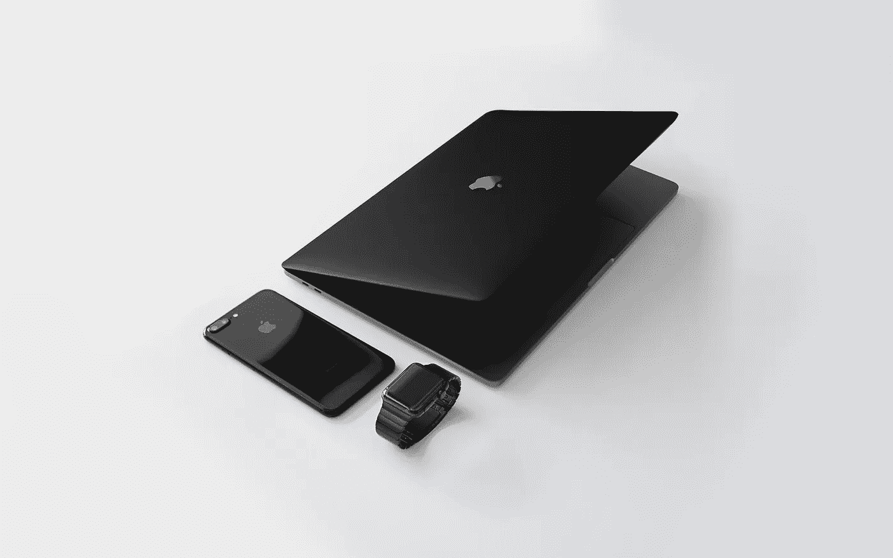
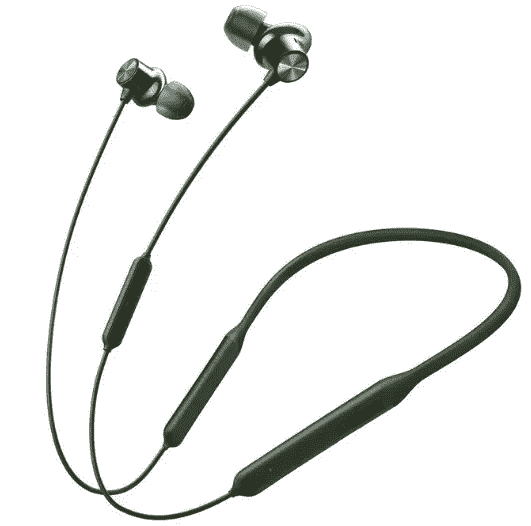

# 技术集成是未来吗？？

> 原文：<https://medium.com/nerd-for-tech/is-technology-integration-the-future-644b4aec319b?source=collection_archive---------0----------------------->

技术集成

# 为什么集成是未来产品的关键？

这么多不同的公司生产这么多不同的产品，感觉科技行业已经达到了一个饱和点。他们中的许多人没有无缝地发挥他们的全部潜力，这是我们将研究的问题。

## 那么，科技行业能做些什么来解决这个问题呢？？

首先要做的是受到“苹果哲学”的启发。苹果公司一直在生产消费级产品，这些产品可以毫无争议地将所有设备集成在一起。这提供了流畅的用户体验，这在当今不断发展、技术驱动的现代世界中至关重要。他们让配件和产品之间的连接变得轻而易举，从而提升了用户体验。

这都归功于 W1 芯片组、T1 以及他们在每个设备中安装的所有相同的芯片组，这些芯片组可以轻松地在 Macbook 到 iPhone 到 Apple Watch 到他们的新 Airpods Pro 之间切换。

提供无缝连接的苹果产品系列

## 那么为什么其他公司没有采用这种方法论呢？

简单的答案是，他们没有建立自己的生态系统。无论他们如何努力，他们永远都是苹果的副手。

好消息是，第三方制造商有一个抓住这个市场的黄金机会。他们可以创造出在不同公司的两种产品之间提供无缝连接的设备。这将提供以前只有苹果产品才能提供的体验。

## 我们将举一个类似产品的例子:这些是新的 Oneplus Bullets Wireless Z

oneplus Bullets Wireless Z——朝着正确的方向前进

你可能会认为这只是另一副蓝牙耳机。是的，但是有一个特殊的按钮。**这个按钮让它与众不同，让你使用现有设备的体验比以前更特别**。

颈带上有一个按钮，用于在两个设备之间快速切换。双击按钮就可以了。这是一个在苹果端实现得更好的功能，AirPods 会自动检测带有声音输出的设备并自动切换到它，但这款耳机的快速切换功能肯定会让我们更接近理想体验的水平。

这副耳机让我们意识到，让使用其他设备的体验围绕着你的快乐的产品的重要性。应该制造第三方供应商的类似产品，因为这是将所有这些产品混合在一起并将其置于同一保护伞下的最佳时机。

Oneplus Bullets Wireless Z 的这些妙招让我对科技行业的发展方向进行了头脑风暴。我可能得出了一个结论。

# 新的科技产品将会涌入，但只有那些对不同来源的产品提供卓越体验的公司才能生存下来，其他公司将会慢慢消失。

## 由埃沙安·库拉纳和❤️共同撰写

欢迎建设性的批评/赞赏！

与我联系@ [Linkedin](https://linkedin.com/in/eshaan-khurana)

跟我来@[Github](https://github.com/eshaan007)HashnodeMedium