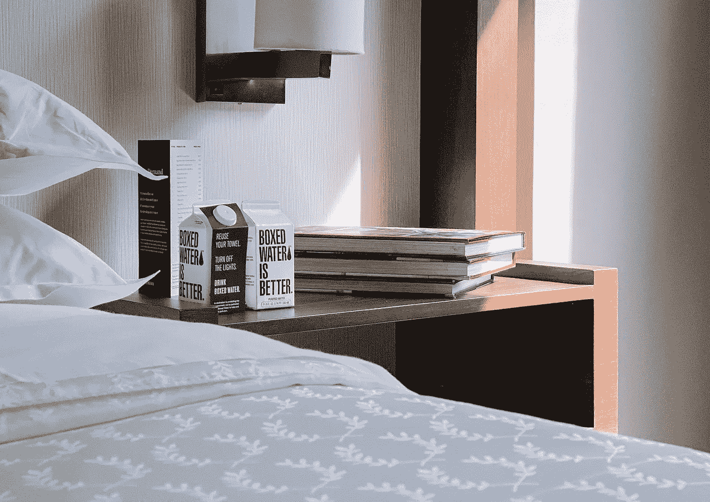

# 隔离酒店感染风险高吗？智能服务机器人在替代人员配备方面具有优势

> 原文：<https://medium.com/nerd-for-tech/is-there-a-high-risk-of-infection-in-quarantined-hotels-fb1deb9ac480?source=collection_archive---------2----------------------->

2021 年 12 月 3 日，广东广州新增 1 例本地确诊病例。该患者是一家入境检疫酒店的工作人员。在此之前，已经有几例被隔离的酒店工作人员感染了病毒。9 月，同样是在广州的隔离酒店，一名工作人员在收集客人的生活垃圾时，不慎暴露感染。这让人们怀疑在被隔离的酒店工作是否已经成为一种“高风险职业”

你不必过于恐慌。被隔离的酒店，只要我们做好防护和消毒，防疫规范比普通酒店更严格。工作人员遵守防疫的规范操作，所以感染病毒的概率不会很高。

但对于被隔离的酒店来说，人际接触和处理生活垃圾会伴随一定的感染风险。此外，隔离酒店的相关工作人员每次工作时必须穿脱隔离衣、口罩和一次性手套。同时，各种操作程序导致一定的培训成本和医疗材料成本。

因此，许多酒店开始引入智能服务机器人来替代各种任务，并降低人工处理带来的感染风险。隔离酒店为被隔离人员提供送餐、收集生活垃圾、打扫房间等服务。这些任务可以由智能服务机器人来完成。

深圳的一些检疫酒店还引进了智能配送机器人，负责为客人导航引导、送餐、消毒、测温、送物。有效降低了交叉感染的风险，提高了防疫效率，减少了人工操作造成的医疗垃圾。

例如，为了消毒，酒店员工需要每天清洁所有楼层两次。这是一项长周期、高强度、高风险的任务。但智能人工智能机器人可以轻松完成这项工作。

机器人在孤立的酒店中用作引导机器人、送货机器人和消毒机器人。在可能存在很多细菌和病毒的密闭空间，比如电梯，消毒机器人可以实现定点自动消毒。带有红外测温模块的智能 AI 机器人可以实现多种温度测量。配送机器人可以实现无人化、无接触的物料配送。与参观者接触的智能 AI 机器人可以自动返回指定的消毒仓库进行消毒，防止交叉感染。

智能服务机器人具有自主巡航、自动避障和大型仓库运输的能力。它还可以实现触摸屏交互、语音识别、人脸识别和其他人工智能功能。

根据国家移民局的统计，2021 年上半年，旅客人数达到创纪录的 6697.3 万人，隔离压力巨大。隔离酒店利用智能服务机器人等智能化手段，提高接待能力，降低员工感染风险。

## 人工智能对高质量数据的依赖

人工智能行业有一个重要共识:

训练数据的质量直接决定了最终 AI 模型的性能。数据的可伸缩性和准确性越高，算法就越稳健。

随着 AI 商业化进程的加快，以及辅助驾驶、客服聊天机器人等 AI 技术在各行各业的应用，人们对特殊场景下的数据质量的期望越来越高。高质量的标签数据将是人工智能公司的核心竞争力之一。

如果说之前的算法模型使用的一般数据集是粗粮，那么算法模型目前需要的是定制的营养餐。如果公司想要进一步提高某些模型的商业化，他们必须逐步从通用数据集向前发展，以创建独特的数据集。

# 结束

将你的数据标注任务外包给 [ByteBridge](https://tinyurl.com/bdcua7m8) ，你可以更便宜更快的获得高质量的 ML 训练数据集！

*   无需信用卡的免费试用:您可以快速获得样品结果，检查输出，并直接向我们的项目经理反馈。
*   100%人工验证
*   透明标准定价:[有明确的定价](https://www.bytebridge.io/#/?module=price)(含人工成本)

**为什么不试一试？**

来源:https://www . robot-China . com/news/202112/16/68996 . html